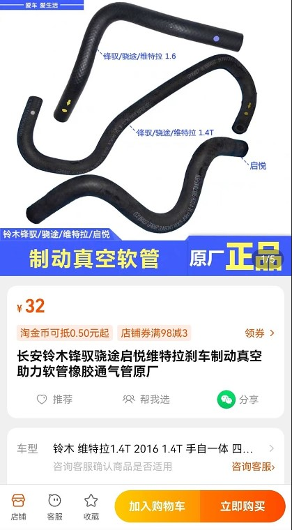
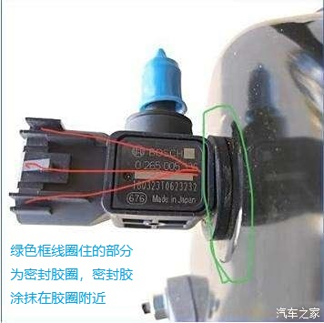

#### 维特拉的常规维护和保养

##### 机油、机滤、空滤、空调滤芯的更换

目前使用中国石化长城SN级别的5w-30的全合成机油，在中国石化加油站内购买，不在网上购买，线上何线下的产品也不会一样。机油的选择，首先要选对型号，然后是一定要正品，买到劣质机油会对发动机造成直接损坏。目前坚持5000-6000公里更换机油，机滤。空气滤和空调滤都是自己购买后更换。

**机滤**是在京东购买的[K&N品牌的PO-9013机油滤芯](https://item.jd.com/100017984128.html)

##### 轮胎的更换

目前车子已经跑了5万多公里，计划到第六年车检之后，更换倍耐力的215/55  R17的轮胎。这里的参数中，215指的轮胎的胎面宽度，55指的是扁平比，R是代表子午轮胎，17是指配置17寸的轮毂。关于扁平比，看下面的计算公式：

```
(x/215 )*100 = 55   
x = 215 * 0.55
x = 118.25
这个轮胎的宽度是215，轮胎侧面的厚度是118.25，计算出的扁平比就是55
```

由于1.4t的四驱Vitara是一个偏运动的小型Suv，整个车子调教风格偏硬朗，车身刚性好，动力强劲，提速快，操控好，车身灵活，还省油，质量稳定（目前0故障，后续看看能达到多少公里稳定行驶）。这5万多公里开下来，最直观的感受就是好开，省心、动力强劲，四驱加持后，下雪天开着很爽，唯一的遗憾是没有条件更换雪地轮胎，体验一下装上雪地胎的vitara是什么感觉。毕竟这里不是经常下雪，更换次数多了，会损伤固定轮胎的零件，轮胎无小事，再好的车子和动力，最终都体现在轮胎上。

如果要说这个车子的一个缺点，就是减振偏硬了点，尤其还是过减速带，不能快速通过，要减速才合适，这就是舒适和操控是两个不能完全兼顾的方面吧。有的车友把车子的减振器更换成了天御（tein）的减振器，但是折腾到最后，没有特别理想的效果，有的还漏油。如果有减振效果明显提升的话，价格不是第一要素。再者更换时的安装调试工作，毕竟没有原车厂的调教专业，看到有车友反映各种问题，综合考虑还是放弃更换减震器。那就只能选择合适的轮胎，要么是好点的轮胎，要么是更换60扁平比的轮胎(215/60 R17)，轮胎厚了必然会舒适点，但是改变了车子原车调教的风格，运动操控性能会略有下降。关于更换60的轮胎，在网上查了不少，这个回复相对全面专业：

> 可以换。但换大轮后，会造成仪表里程计数不准。维特拉原是215/55 R17轮胎，换215/60 R17轮胎后，由于车轮半径增大，使底盘约升高1cm；仪表表显里程和时速比原来小约3%，即原轮胎仪表显示100km/h的对应速度换后只显示为约97km/h；原仪表显示里程100km，换后只显示为约97km。换后的里程计数偏差可以叫4S电脑设定校正。也可以无视，因为只要心中有数知道显示里程比实际里程小3%便可；而时速显示由于原厂设定仪表显示速度比实际时速大约5%，换轮胎后的仪表显示时速反而更接近实际时速。换高宽比更大的215/60 R17轮胎后，由于轮胎侧壁宽度增大，会降低轮胎的抗侧扭性能，由于轮半径变大，轮缘的最大推力略有减小。体现为车的加速性能和操控性能略有下降，但舒适性有所提高。


> 有不少车友直接更换215/60 R17的轮胎，静音和舒适性提高不少。自己更喜欢目前的操控，好开灵活，提速快，为了保持原车的调教，目前决定还是更换原车的轮胎，我更喜欢灵活的操控，还是坚守原车的调教。等到年龄大了，可以考虑更换215/60 R17的轮胎，提升舒适性，计划把这台vitara一直开下去。

##### 防冻液更换

目前在2023年5万公里时在原4s店更换过一次防冻液，以后可以每2年更换一次。除了给发动机降温之外，防冻液里有多重防锈剂，用来防止发动机的金属部件上锈，所以要定期更换。按照4s店更换防冻液的包装盒子品牌购买就可以。

#### 关于车辆年检时的注意事项

​    在汽车之家的维特拉论坛上看到车辆年检的帖子，有的检测站在检测尾气时使用的前轮两个滚筒测试，而后轮没有滚筒。因为有些检测者并不专业，不知道四驱需要换个检测方法，或者不知道维特拉有四驱系统。这样检测车里有什么问题呢？

```
前轮转而后轮不转，后轮直接接地，会导致后差速器强行转动，在自动模式下，后轮5%的动力可能不足以让车辆弹出滚筒，但是后差速器是转动的，而车轮不转，可能会损坏后差速器。如果切换到雪地模式，前后车轮各50%动力，车子会驶出检测滚筒
```

那应该怎么做呢？

```
1、告知检测人员，更换为四轮滚筒
2、更换为原地怠速检测
3、换个正规点的检测站
```

如果损坏了后轮差速器，修理车子的费用是自己的，所以一定要使用正确的检测方法。

#### 真空泵和大力鼓的维护

> 看维特拉轮胎，看部分车友更换真空泵时，由于真空助力软管老化问题和密封胶圈密封不严，因为师傅大力拔管子，晃动了刹车大力鼓的单向阀和密封胶圈，导致移位，大力鼓缓慢漏真空，导致车子停放时间不长就出现刹车变硬的现象。

解决办法：

单纯更换真空助力软管，没效果，可以在密封圈周围涂点密封脂，解决问题。(当然，如果车子后期的公里数很大，要重新更换软管，密封圈、单向阀。全部更换后，最后在胶圈周围涂抹密封脂，防止大力鼓漏气）






购买型号和途径：

可以购买**大众的大力鼓密封圈**，或者在淘宝购买下面通用款的密封胶圈：

[密封圈购买链接](https://item.taobao.com/item.htm?id=609310996559&spm=a1z0d.6639537/tb.1997196601.50.174a7484R9pt17)

#### 燃油滤清器卡扣

在更换燃油滤清器时，师傅如果不小心或者时间长了，卡扣老化，容易断掉，可以在淘宝购买备用。图片中的`2号链接`


#### 天窗轨道润滑脂的清理和更换

在汽车之家维特拉的论坛上看到关于下雨时车内异味的解决办法。以前看到多个车友提到车内异味问题，我自己的经验是在下雨时有异味，在夏天暴晒时有点异味，其他时间正常。好多车友说是备胎、防锈油、车内底部沥青等五花八门的描述。这个车友在下雨或者洗车时有异味，我有同感，但是没有往天窗方面考虑。车友是因为天窗渗水修理天窗时发现了这个问题，把天窗轨道的润滑脂清理后更换，再也没有这个雨天异味的问题，可以试试。下次到修理店把天窗润滑脂更换试试，也许可以解决问题。可以在京东购买天窗轨道专用润滑脂。

#### 冬天发动机启动时驾驶室内有汽油味

汽车之家维特拉论坛车友反馈这个问题，检查发动机仓内两个地方，具体描述如下：

```
1、检查是否是油泵管卡漏油
2、发动机仓右前边有个燃油管，有两个卡箍，要么换个地方，要么外加一个卡箍，冬天冷了以管道收缩有可能出现这个问题
```

#### 汽车电瓶

车子长期停放不开会导致电瓶亏电，所以每周要跑起来，从这一点看，车子在满足日常通勤需要之后，它就是一个消耗品，不断贬值的过程，所以没必要频繁换车或者溢价购车。

那如何判断车子电瓶是否有电，除了经常跑之外，有以下几个注意事项

* 在启动发动机之后，要把自动启停开关关闭，避免频繁启停，应该对起动机是一种消耗，哦，这个似乎和电瓶无关吧。

* 汽车熄火后，要及时开门并关闭一次，关闭继电器。如果熄火后一直待在车上，没有开门的话，继电器并没有关闭，部分电器还在耗电。

* 目前车子已经6年多了，所以要注意点火情况，是否能够轻松点火启动发动机。

* 如果出现油耗无故增多，就要考虑是否是电瓶没电，也是在汽车之家上看论坛的帖子，了解到这一现象，记录下来

  ```
    以前油灯亮之前能跑650公里左右，平均表显油耗6个多左右，近几个月一直表显7个多油，一箱油每次比以前少跑一百多公里，动力也有所下降，没以前提速快。检查氧传感器，空气流量传感器、碳罐电磁阀、曲轴位置传感器、火花塞，传动轴、刹车，换了新机油、空滤、汽油滤、清洗节气门，（先前一直怀疑是换了汽油滤原因，换了两个汽油滤、以为是质量问题）只要给油耗相关的都过了一遍，未发明显异常，终于有天下班，电瓶突然亏电打不着火，才找到原因，油耗增高的原因居然是电瓶。
    开始不信，网上查资料也咨询过修车博主，换了新电瓶后，平均油耗从7.1降到6.1，动力也上来了。最后分析由于电瓶亏电发电机不停的给电瓶满负荷充电，电瓶电压升不起来，发电机里磁线圈磁场最强，磁场越大阻力越大，增加了发动机负荷，从而导致油耗增高，辛好没有到修理厂去大拆大换，现在车子又恢复到以前的轻快状态
  ```

  

专门到查了资料，电瓶亏电确实会导致油耗增加，原理如下：

```
#发电机负载加重，燃油消耗增加
当汽车电瓶电量不足时，发电机需要为电瓶充电以维持其正常工作。这一过程中，发电机的充电电流会增大，从而增加发动机的负载。发动机为了驱动发电机产生更大的电流，需要消耗更多的燃油来提供动力。因此，电瓶电量不足会直接导致发动机油耗的增加，尽管这种增加在一般情况下幅度不大，但在电瓶严重亏电或长时间处于低电量状态时，油耗增加会更为明显。

#点火系统效率下降，燃油燃烧不充分
电瓶电量不足还可能影响点火系统的正常工作。点火系统是发动机燃烧汽油的关键部件，它负责产生高压火花来点燃混合气。当电瓶电压降低时，点火系统产生的高压火花会变弱，导致汽油燃烧不充分。这不仅会降低发动机的动力输出，还会使燃油消耗增加，因为未完全燃烧的汽油会浪费掉，同时产生更多的有害排放物。

#电子系统运行异常，燃油效率降低
现代汽车配备了大量的电子系统，如燃油泵、节气门传感器、氧传感器等，它们对汽车的燃油效率有着重要影响。当电瓶电量不足时，这些电子系统可能无法正常稳定运行，导致车辆的喷油、进气等环节不能精准匹配。例如，燃油泵可能无法提供足够的燃油压力，节气门传感器可能无法准确感知节气门开度，氧传感器可能无法准确监测排气中的氧含量等。这些都会导致燃油效率降低，从而使油耗增加。
```

#### 空调滤芯的安装方向

购买的维特拉空调滤芯有两种不同类型的安装方向提示：

* 滤芯正面的侧边缘有一个向上的箭头，旁边标注的是`UP`,这种箭头表示的是安装方向，箭头朝上安装滤芯。
* 滤芯正面的侧边缘箭头朝下，旁边标注的是air flow,那这里箭头的方向表示空气流动方向，就是自上而下的流动方向，安装后文字朝上，箭头朝下。

两种安装方法有一个共同点就是文字正面朝上，没有颠倒，所以感觉大部分滤芯口可以按照这一种方法，不要颠倒文字就是正确的安装方法。

