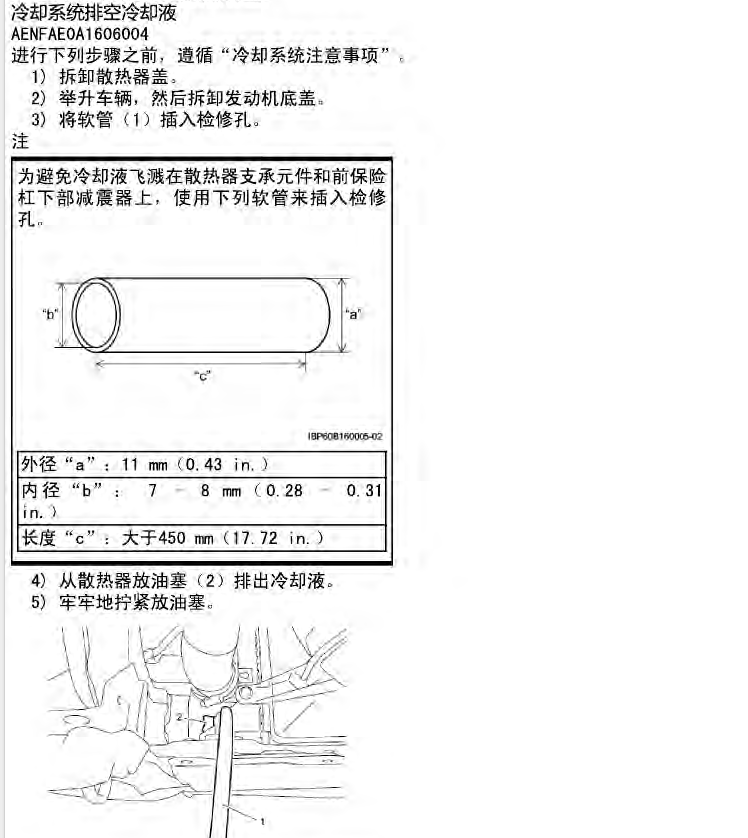
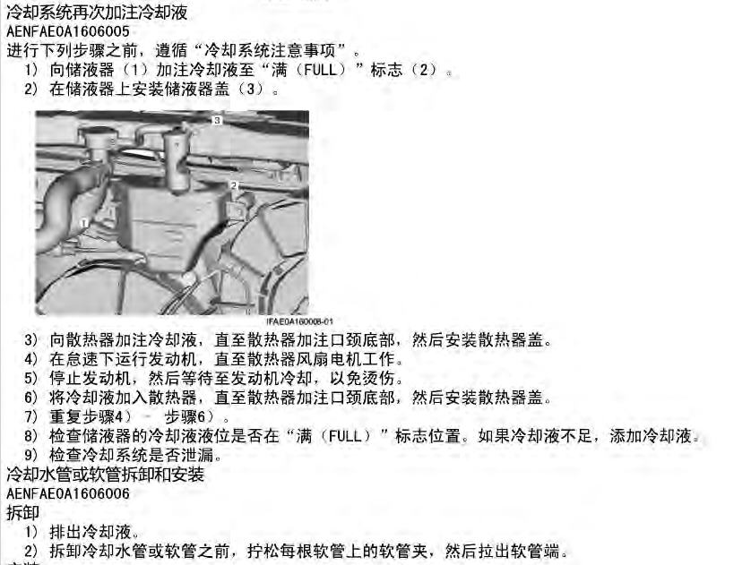
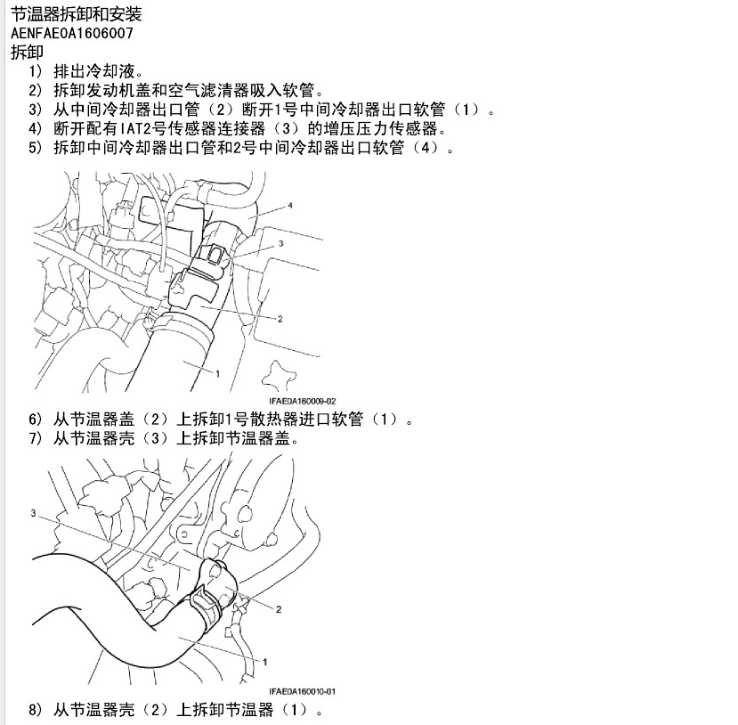

#### 更换防冻冷却液的几种方法

一、按照铃木维修手册的方法更换冷却液
1、冷车状态下打开储液器盖子（膨胀壶）和散热器（水箱）盖子
2、拧开水箱底部的泄水阀，重力排出冷却液，等不再有冷却液流出时重新装好泄水阀。
3、使用漏斗向散热器（水箱）加入冷却液至散热器加注口附近，储液罐加注到Full标线处，盖上散热器盖子，盖上储液器盖子。
4、启动发动机怠速运行，直到散热器电子风扇转动，等待电子风扇自动停止，关闭发动机，等待发动机降温（大约1-2小时）。在怠速升温期间，会有空气排出导致散热器注入口的液面下降，此时再补充冷却液至加注口。
5、重复第四部，直到发动机冷却后散热器加注口液面不再下降。

总结一下，维修手册首先考虑的是操作安全性，在冷机状态下排出冷却液，然后怠速运行，直到散热器电子风扇转动并自动停止。电子风扇启动到停止的这个过程，就是冷却液进行大循环的过程，随着循环的进行，冷却循环系统中会有空气排出，会导致液面下降，及时补充冷却液。如此多次循环，会把空气排放干净，直到冷机时不再有液面下降就算是排空成功。
附加的技巧：怠速时可以把风挡调整至热风，意思是让暖风水箱参与到大循环中，排空更彻底吧。

二、第二种更换冷却液的方法（怠速运行，开盖排空）

1、冷车状态下打开储液器盖子（膨胀壶）和散热器（水箱）盖子
2、拧开水箱底部的泄水阀，重力排出冷却液，等不再有冷却液流出时重新装好泄水阀。
3、使用漏斗向散热器（水箱）加入冷却液至散热器加注口附近，储液罐加注到Full标线处。
4、启动发动机怠速运行，不盖上散热器加注口。这时看着液面，见到下去了就及时补充，如果有朋友帮助，可以叫间中轻踩一下油门加快一下转速，一个人的话就怠速，不过为了加快点升温，我是把冷气也打开了。在升温的过程中，由于热涨冷缩的原因，冷却液会从加液口慢慢溢出来，所以最好在加液口附近放些布吸水。冷却液溢出时会伴着几个气泡后下去一点，见到冷却液下去了，就补充回来。当温度上升到达节温器全开时，液面会突然大幅度下降，还会伴随散热风扇转动，这时记得及时添加泠却液。到这个时候，我就去把冷气关了。观察散热风扇，当转动，停止两次后，表示排空基本完成了，这时可以盖上加注口盖子。

三、第三种更换冷却液的方法（热机打开泄水阀）
1、热机状态下放掉冷却液。正常行驶后关闭发动机，在热机状态下打开散热器底部的泄水阀，并打开加注口的盖子和储液器盖子。这种操作必须有实践经验才可操作，比较危险，因为热机状态下直接打开冷却液，会有冷却液喷出来，相当危险。个人车主禁止这种操作。在热机状态下打开泄水阀，节温器和加热器都是打开状态，整个冷却系统都是开放的，处于大循环状态，此时操作会泄水更充分。当然要彻底排出冷却液，还要拆卸节温器、上下水管，以便倒出更多的冷却液。专业维修店可能会采取这种操作，因为时间有限。使用冷机怠速运行，升温后再关机补充冷却液，这样的反复操作需要很长时间才能完成，
2、后面的步骤和前边的方法相同。

三种方法的总结：
1、打开泄水阀（冷机方法、热机方法）
2、加注冷却液
3、怠速运行直到散热器电子风扇启动并自动停止，补充冷却液，直到冷机时冷却液液面不再下降（装好盖子怠速运行、开盖怠速运行）

总体的思路就是冷机、开机、升温、降温，关机，补液。实际上就是在冷热冷循环中排出空气，然后补充冷却液，直到冷机时液面不再下降，也就证明排空完成。如果以前添加了不同品牌、不同颜色的冷却液，除了使用以上方法更换防冻液之外，可以缩短更换周期，以后最好使用一个品牌的冷却液，多次更换之后，以前的旧防冻液的比例就会很小了，对发动机没啥影响。

