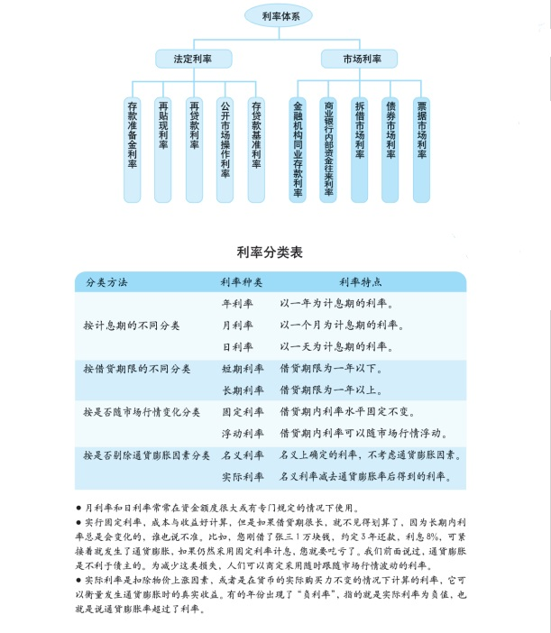

#### 金融基础知识

#### 货币的基本概念和发展形式

* 货币是一切商品的等价物，充当交换媒介，货币本身也是一种特殊商品。

* 货币经过了实物货币、金属货币（黄金、白银等）、纸币（信用货币）和电子货币几个阶段。

* 货币的发行机构和发行依据

  * 由国家中央银行统一发行，强制流通

  * 流通中需要的货币发行量 = 全社会商品价格总额 / 货币流通速度

    
    >全社会商品价格总额就是全社会买卖的所有的商品数量乘以它们各自的价格,货币流通速度就是纸币在买卖者手中的平均转手次数。比如，一年内买卖的商品价格总额是100亿元，一年内纸币平均换手次，那么就需要发行25亿元纸币（100亿元÷4次)。
    
    >如果货币发行过多,老百姓手中的钱大大超过社会上可供销售的商品的价值,商品价格就会大幅度上涨，产生通货膨胀。通货膨胀严重的时候，物价会飞涨。如果货币发行过少，老百姓手中的钱大大少于社会上可供销售的商品的价值,有可能带来通货紧缩。当出现通货紧缩的时候,物价下跌,企业亏损裁员，工人失业，消费不足,人们的生活陷入困境。所以，货币发行量必须要遵守货币流通规律。
    
  
    

* 通货膨胀货币供应量增加，资产价格大幅上涨，物价上涨，货币贬值。

* 通货紧缩

  >   企业会选择压缩生产,大量裁员。当很多企业都这么做的时候，则失业骤增，老百姓的收入下降，需求不足,经济陷入衰退甚至萧条的艰难境地。很多国家历史上都曾发生过不同程度的通货紧缩和经济衰退,甚至引发经济危机和政治危机。通货紧缩绝不是什么大好事，它的危害性比起通货膨胀来一点都不逊色。
      通货紧缩常常是由生产过剩、债务危机、经济“泡沫”破裂等实体经济因素引起的。当发生通货紧缩时，商业银行是不愿向企业发放贷款的，因为大部分企业经营困难还不上贷款,甚至会欠账赖账。商业银行宁可收缩贷款，少赚利息，熬一阵子再说。在这种情况下，即使央行采取增加货币供应的措施，也很难立竿见影。这就好像自来水管,末端的水龙头关得死死的，总闸拧得再大也放不出水来。
      可见，通货紧缩比通货膨胀更复杂，也更难治理，必须将货币政策、财政政策以及其他措施进行综合搭配，才能有比较好的效果。
  
  
  
* 货币的价格就是利率

  >  货币(钱)也是一种商品，与其他商品-样,有其自身的价格,这个价格就是利率。作为商品，其价格的根本决定因素，是市场供求关系，利率也不例外。利率水平还受风险程度、贷款期限、借款人的信用状况、市场供求、通货膨胀率以及政策因素等。
  
  

 >  利率是资金使用的价格，利率的涨跌关系着居民、企业、政府各方利益，它是调节宏观经济运行的重要杠杆。如果存款的利率水平较高，人们会把收入储蓄起来等到以后再消费；如果存款的利率很低，人们又会减少储蓄，增加目前的消费，有的甚至会借钱来消费。比如，人们会在银行存贷款利率低的时候买房买车，这就增加了社会需求，而在银行贷款利率上升的时候,为少付利息人们又会尽量把贷款还上，这又减少了社会需求。对企业来说，利率的变化同样事关重大。企业经营要借钱，而利率的高低直接关系到企业的利息负担，贷款利率变动一个百分点，企业有可能因此多付或者少付几百万元的利息。

>  当我们把未来的钱折算成今天的价值的时候，就需要用到贴现率的概念。比如目前利率是10%，那么今天的100元就相当于明年的110元。为什么呢?因为利率是10%，我们至少可以在今年把这100元货出去，明年拿到110元。反过来说，明年的110元也只能相当于现在的100元。在这里, 10%的利率就是贴现率。贴现率对于企业来说很重要,因为企业在决定是否投资某个项目时，必须算清楚这个项目未来能带来的收入贴现到今天是多少，然后计算能否赚钱。
  可见，利率越高，折现后的收人越低，企业预计的投资项目就越有可能亏本;利率越低，则越有可能赚钱。所以，利率降低能够刺激企业增加投资，利率上升就会刺激企业减少投资。对证券市场上的投资者来说，利率的变化直接影响着证券价格。在一般情况下，利率和股票.债券的价格呈反向变化。利率下降,证券价格上涨，利率上升，证券价格下跌。因此，利率的变化与股市的涨跌息息相关。

* 汇率：货币兑换的价格

> 汇率的表示方法有直接标价法和间接标价法。比如, 2006年4月20日直接标价法下人民币兑美元的汇率是8.0126元/美元，意思是说这一天1美元可以换8.0126元人民币。2006年4月20间接标价法下人民币对美元的汇率是0.124803美元/元，意思是说这一天1元人民币值0.124803美元。
>
> 我国的外汇报价采用的都是直接标价法，也就是1元外币值多少元人民币的标价方法。在直接标价法下，如果汇率数值增加，意味着1单位的外币值更多的本国货币(本币)了，称为本币贬值，或外币升值。相反则是本币升值或外币贬值。比如，2005 年7月20日人民币兑美元的汇率是1 :8.2765, 7月21日调整为1:8.1100， 说明人民币升值了，美元贬值了。在间接标价法下，情况与此类似。

> 汇率的升降到底受哪些因素的影响呢?
>     进出口的差额是主要因素。出口是把本国的商品或服务卖给外国，是收入外汇(创汇)的过程，进口则是用外汇购买国外的商品或服务，是付出外汇的过程。如果一个国家的商品和服务的出口额比进口额多，出现贸易顺差，相应这个国家挣的外汇就多，花的外汇就少，也就是外汇供给多，需求少，这时，外汇的价格`汇率`自 然要下跌，该国货币也就相应升值。这几年,我国面临持续的巨额贸易顺差，人民币因此也面临着升值的压力。相反，如果一个国家商品和服务的出口比进口少，出现了贸易逆差，相应挣的外汇少，花的外汇多，外汇供给少，需求多，这时，外币汇率自然会.上升，该国货币可能就不怎么值钱了，面临着贬值的压力。资本的流出流人差额也是-个重要因素。道理跟进出口差额类似。当一个国家的资本流入多于资本流出时,这个国家就会出现资本项目顺差，也就是外汇供给多，需求少,外币汇率自然会下跌。相反，如果一个国家的资本流出多于资本流人,这个国家就会出现资本项目逆差，外币汇率就有上升的趋势。
>     利率差异也是重要因素。随着世界经济的- -体化,各国之间的资本流动越来越自由。如果- -个国家的利率比其他国家的利率高,就会有大量的资本涌进来，兑换成这个国家的货币以获取更高的利息,这样，就会推动这个国家的货币升值。反之，如果这个国家的利率比其他国家的利率低，其货币就有贬值的压力。通货膨胀率的高低也会影响汇率。如果- -个国家的通货膨胀率较高，就意味着这个国家的货币购买力下降，相对于通货膨胀率较低的国家，其货币自然有贬值的压力。反之，如果-一个国家的通货膨胀率比其他国家低，其货币就有升值的趋势。人们的心理预期也是影响短期汇率波动的重要因素。如果人们认为某个国家的经济发展令人担忧，或者政治局势不稳定，预测其货币不久会贬值，就会纷纷抛售该国货币，结果，该国货币雪上加霜，大幅贬值甚至爆发货币危机。政府对汇率的干预行为也在很大程度上影响着汇率。比如1985年，美国正承受着高额的财政和贸易赤字，而美元升值又加剧了其贸易赤字，于是美国联合西方强国达成了著名的“广场协定”，各国政府联手拿出200亿美元投入外汇市场购买8元，结果美元大幅贬值，日元大幅升值。汇率的走势最终是-一个国家经济发展状况的综合反映,所以从长期来看，如果- -国经济发展良好，保持持续的繁荣和稳定增长，该国货币的汇率就会趋于稳定。
