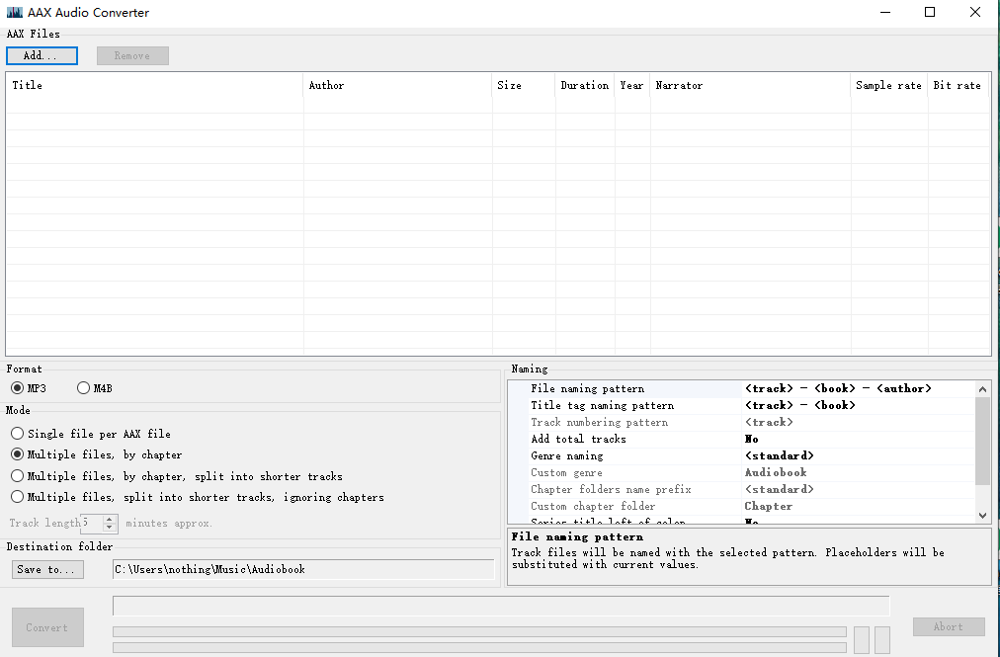

# 获取与转换 Audible 有声书完整记录

**首次以获取艾伦·格林斯潘的《The Age of Turbulence》有声书为例子**，从 Audible 专有格式 (`.aax`) 转换为通用音频格式 (如 MP3)。

---

## 第一部分：开通 Audible 会员与获取书籍

1. **发现优惠**：在 Audible 官网看到《The Age of Turbulence》有声书标价为“0.00 with membership trial”，即通过30天免费试用会员可免费获取。

2. **开通试用**：点击“Try for $0.0”或“Confirm your Standard 30-day free trial”开通免费试用，期间可获得1个积分。

3. **兑换书籍**：使用赠送的1个积分兑换《The Age of Turbulence》，该书将永久保留在账户中。

4. **支付方式**：绑定国内银联信用卡（如农行万事达卡）以完成订阅，需确保开通“境外无卡交易”功能。若绑卡失败（提示“Please ensure your card details are correct”），可联系银行客服或尝试在亚马逊账户后台添加卡片并填写正确的账单地址（拼音填写，国家选“China”）。

5. **会员续费**：免费试用结束后，Audible Standard 会员自动按月续费（约$8.99/月），Premium Plus 会员约$14.95/月，可在到期前取消。

---


## 会员计划与积分规则

### 会员类型对比

| 对比维度         | Standard 计划                          | Premium Plus 计划                  |
| :--------------- | :------------------------------------- | :--------------------------------- |
| **月费参考**     | 约 $8.99/月                            | 约 $14.95/月                       |
| **每月积分**     | 1个                                    | 1个                                |
| **积分兑换书籍** | 会员有效期内可听（取消会员后无法收听） | **永久拥有**（取消会员后仍可收听） |
| **Plus Catalog** | 仅部分精选内容                         | **完整Plus目录无限畅听**           |
| **会员折扣**     | 部分折扣和特价                         | 更多专属折扣和促销                 |

> **关键区别**：Standard 计划的积分兑换书是“租借”性质，不续费就无法收听。Premium Plus 的积分兑换书是“永久资产”，即使取消会员也属于你。

### 积分规则

- **每月赠送**：Premium Plus 会员每月获得 **1个积分**，可兑换 Audible 全库中**任意一本**有声书，无论原价多少。
- **积分有效期**：积分通常在发放后 **12个月** 过期，需留意账户内的有效期提示。
- **额外购买积分**：
  - 当账户剩余积分 **少于2个** 时，Premium Plus 会员可以优惠价格批量购买额外积分（如3个积分的套装）。
  - 试用期会员一般无此资格。

### 购买有声书的三种方式

| 方式                  | 说明                               | 书籍所有权                                                   |
| :-------------------- | :--------------------------------- | :----------------------------------------------------------- |
| **使用积分兑换**      | 每月1个积分，兑换任意一本书        | Premium Plus 会员**永久拥有**；Standard 会员在会员有效期内可听 |
| **直接现金购买**      | 以标价（通常较贵）单本购买         | **永久拥有**                                                 |
| **Plus Catalog 畅听** | 会员有效期内免费无限收听目录内书籍 | **仅会员有效期内可听**，取消后无法访问                       |

### 总结

- **Premium Plus 会员核心价值** = 每月1个积分（永久买断1本书）+ 完整Plus书库畅听 + 购买额外积分的资格。
- 如果每月的积分用不完，可以攒着（留意12个月有效期），以后兑换更贵或有声书。
- 如果积分不够用，购买额外积分通常比直接现金购买更划算。


## 第二部分：获取转换软件AAX Audio Converter与激活码

### 2.1 下载转换工具

- 安装开源软件 **AAX Audio Converter**（从 GitHub 官方页面下载）
- 下载 **audible-cli** 命令行工具（独立可执行文件，存放在 `audible_win_dir\audible` 文件夹内）

### 2.2 配置 audible-cli

在 `audible.exe` 所在文件夹鼠标右键弹出菜单，选择【从终端中打开】，打开PowerShell终端，运行：

```bash
./audible quickstart
```

按提示完成设置：

| 提示                                                    | 输入                            |
| ------------------------------------------------------- | ------------------------------- |
| profile name                                            | 直接回车（默认 `audible`）      |
| country code                                            | `us`                            |
| auth file name                                          | 直接回车（默认 `audible.json`） |
| Do you want to encrypt the auth file?                   | `n`（不加密）                   |
| Do you want to login with a pre-amazon Audible account? | `n`（使用标准亚马逊账号）       |

### 2.3 浏览器授权

1. 程序会提供一个 `https://www.amazon.com/ap/signin?...` 开头的链接，复制到浏览器中登录亚马逊账号。

2. 登录后若出现“找不到页面”错误，按照提示这就是对的，然后**复制浏览器地址栏中的完整网址**，粘贴回命令行中并按回车。

3. audible-cli命令行里会提示写入到指定的config.toml文件中，激活码是保存在audible.json文件的"activation_bytes"项目下

4. 查看audible文件的"activation_bytes"值，如果显示为null,就是未成功写入激活码，可运行专门命令：

   ```
   ./audible activation-bytes
   ```

   该命令会直接获取激活码并写入配置文件，在后边安装好AAX Audio Converter并启动时，复制这个激活码就可以了。

### 2.4 获取激活码

成功配置后，`audible-cli` 会生成 `config.toml` 和 `audible.json` 两个配置文件。激活码（`activation_bytes`）会写入 `config.toml` 文件中，例如：

text

```
activation_bytes = "2c1eeb0a"
```


> **注意**：激活码与 Audible 账户绑定，固定不变，可永久用于转换该账户购买的所有有声书

### 2.5 AAX格式音频转换为mp3文件

打开软件后点击add添加要转换的.aax文件，mode选项里选择Multiple  files, by  chapter,指定好输出目录后就点击convert就可以开始转换了。操作界面很简单，如下图：




## 第三部分：利用 Audible 练习英语听力路线图

### 核心理念
- **循序渐进**：从简单、有辅助的材料开始，逐步提升难度。
- **听读结合**：善用 Audible 有声书搭配 Kindle 电子书或文稿，提升理解效率。
- **兴趣驱动**：选择感兴趣的内容，更容易坚持下去。

---

### 阶段一：入门与建立基础 (Beginner)

**目标**：培养语感，熟悉基础词汇和句型，建立听力信心。

**推荐材料类型**：
- 专为学习者设计的慢速英语播客（通常配有文稿）
- 分级读物短篇故事集

**推荐书目/资源**：
| 类型   | 名称                                                 | 说明                       |
| :----- | :--------------------------------------------------- | :------------------------- |
| 播客   | American English Listening and Comprehension Podcast | 语速慢，用词简单，适合入门 |
| 播客   | Everyday English Academy                             | 专为学习者设计，配有文稿   |
| 有声书 | 80 Short Stories in English: 4 Books in 1            | 从初级到高级的分级短篇集   |
| 有声书 | Short Stories in English for Beginners               | 专为初学者编写的简单故事   |

---

### 阶段二：稳步提升与扩大接触面 (Intermediate)

**目标**：较轻松地听懂日常对话和叙事内容，词汇量明显提升。

**推荐材料类型**：
- 有童心的叙事作品（儿童文学）
- 叙述性非虚构作品
- 经典的英语学习教材

**推荐书目/资源**：
| 类型   | 名称                                                  | 说明                                                     |
| :----- | :---------------------------------------------------- | :------------------------------------------------------- |
| 教材   | Family Album U.S.A.（走遍美国）                       | 经典美语学习教材，生活化情景对话，适合练习日常口语和美音 |
| 有声书 | Charlotte's Web（夏洛的网）                           | 儿童文学经典，语言生动，难度适中                         |
| 有声书 | Charlie and the Chocolate Factory（查理和巧克力工厂） | 故事性强，朗读生动                                       |
| 有声书 | Atomic Habits（原子习惯）                             | 非虚构类，用词精准，结构清晰                             |
| 有声书 | 101 Conversations in Intermediate English             | 专为中级学习者设计的对话练习                             |
| 播客   | Coastal Conversations (Intermediate Level)            | 话题丰富，适合中级学习者                                 |

**学习方法建议**：
- **“听读结合”法**：
  1. 第一遍盲听，抓大意和关键词。
  2. 第二遍配合电子书文本（如Kindle版）边听边看，建立“音”与“形”的联系。
  3. 第三遍脱离文本再盲听，检验理解是否提升。
- 如果遇到听不懂的段落，可以反复回听，或停下来查看文本。

---

### 阶段三：挑战高阶与养成英语思维 (Advanced)

**目标**：能听懂复杂话题（如历史、哲学、社会）和快速、自然的对话。

**推荐材料类型**：
- 高阶学习播客（讨论有深度的话题）
- 作者亲自朗读的回忆录（语感自然、情感丰富）
- 思想性强的经典非虚构作品

**推荐书目/资源**：
| 类型   | 名称                                     | 说明                               |
| :----- | :--------------------------------------- | :--------------------------------- |
| 播客   | Coastal Conversations (Advanced Level)   | 话题有深度，词汇高级，接近真实对话 |
| 有声书 | Born a Crime（ Trevor Noah 著/读）       | 作者亲自朗读，语感自然，充满情感   |
| 有声书 | Becoming（米歇尔·奥巴马 著/读）          | 作者朗读，发音清晰，内容有深度     |
| 有声书 | Sapiens（人类简史）                      | 思想性强，词汇丰富，适合高阶挑战   |
| 有声书 | Harry Potter 系列（ Stephen Fry 朗读版） | 长篇叙事，朗读清晰，适合沉浸式听读 |

---

### 通用技巧

1. **利用 Audible 的推荐算法**：听完一本书后，关注平台的“为你推荐”板块，发现更多同级别资源。
2. **善用“听读结合”**：对于较难的书，可以配合 Kindle 的 Whispersync 功能，实现“听+读”同步进行，大幅提升理解效率。
3. **设置合理目标**：每天听 10-15 分钟，坚持比一次听很久更重要。
4. **利用 Plus Catalog 免费资源**：在 Plus Catalog 中搜索“English learning”、“for beginners”、“intermediate”等关键词，可以找到许多免费的入门学习材料。

---

### 《走遍美国》的使用建议

- **定位**：《走遍美国》是一套**生活化情景对话**教材，核心是练**日常美语口语**。
- **适用阶段**：适合处于 **“阶段二：稳步提升”** 的学习者，与儿童文学搭配使用效果更佳。
- **获取方式**：
  - 在 Audible 搜索 “Family Album U.S.A.”，确认是否需要积分或现金购买。
  - 也可在喜马拉雅等平台找到免费音频版本。
  - 部分 App 提供含字幕和点读功能的版本。
- **使用建议**：建议结合视频或文档一起学习，重点关注日常会话中的地道表达和语音语调。

---

