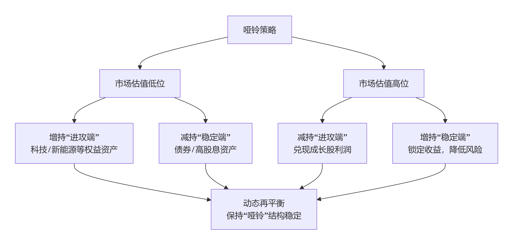

#### **“哑铃策略”的细化与动态调整**

您描述的“债券-成长-现金黄金”结构是经典模型。在实际操作中，它可以根据市场环境和个人偏好进行动态调整：

- **哑铃的左端（稳定端）：** 除了常规债券，还可以考虑**高信用等级的政金债、高股息率的蓝筹股**等。这部分的核心目标是**提供稳定的现金流，降低整体组合波动**。
- **哑铃的右端（进攻端）：** 这正是您看好的**科技、新能源**等成长行业。它们提供了组合的向上弹性。
- **哑铃的握柄（流动性与防御）：** **现金+黄金**的配置非常关键。现金不仅提供安全感和灵活申购机会，其份额也可随市场估值水平动态调整；黄金则是对冲地缘政治风险和通胀的有效工具。

一个动态的哑铃策略示意图如下，展示了如何根据市场变化调整两端配置：

偷懒了，这些内容复制了和deepseek的对话内容。
