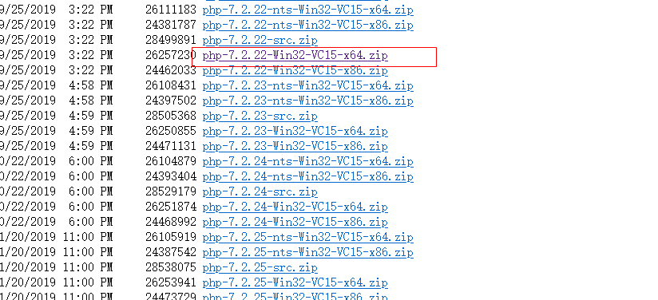
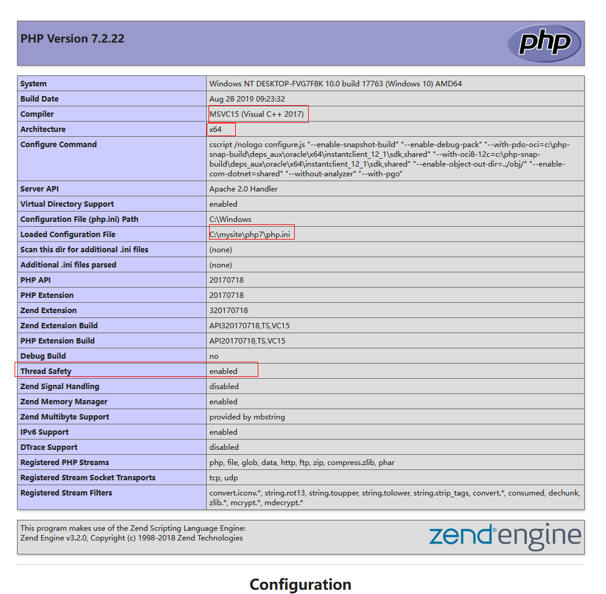

####  Install Apache、PHP、MySQL、phpMyAdmin、WordPress manually

##### 下载、安装、配置Apache

​    1、**确定Apache所在服务器的Visual C++版本号**。如果没有Visual C++ Redistrubable，下载[安装](https://aka.ms/vs/17/release/vc_redist.x64.exe)即可。（在没有安装Visual c++的计算机上运行用Visual c++开发的应用程序，Microsoft Visual Studio可重分发包(X86 & x64)安装所需的Visual c++库的运行时组件）

​     

​    2、下载对应版本的[Apache HTTP SEVER ](https://httpd.apache.org/download.cgi)         
   
   ---
   
   ---
   
   ---
   
   ---
   
    3、安装配置Apache

```nginx
  一、配置Apache的静态服务功能
  1.把下载的Apache压缩包解压到磁盘分区的根目录。这里是虚拟机，就解压在C盘根目录：c:\mysite\apache24
  2.把c:\mysite\apache24\bin添加在Windows的系统环境变量
  3.修改apache24\conf\httpd.conf.文本编辑器打开Apache配置文件httpd.conf
    a.找到Define SRVROOT部分，把其后面的"c:/Apache24"修改为"c:/mysite/Apache24"，注意这里`/`和Windows目录反斜杠`\`不同,最终修改为：`Define SRVROOT "c:/mysite/Apache24"`
    b.如果80端口被某个服务占用，就找到Listen部分，这里把80端口修改为8081：`Listen 8081`
  4. httpd.exe      Windows CMD终端运行Apache服务，可以和使用Ctrl+C 终止
     httpd.exe -k intall  以管理员权限运行CMD,把apache 安装为Windows服务，
     httpd.exe -k start   启动服务
     httpd.exe -k stop    停止服务
     httpd.exe -k unintall 卸载服务
     httpd.exe -h   查看各种命令行参数
  5.在浏览器使用http://localhost:8081,会显示Apache24\htdocs\index.html 文件的内容，如下图所示：    
  6.可以参考Apach的redme文件和intall.txt；另外上面下载的httpd-2.4.41-win64-vc14.zip压缩包自带的readme文件，对初学者也很有帮助
  7.启动Apache的两种方法
    a. 在Windows CMD 窗口下运行httpd.exe (记得把apache24\bin加入Windows系统环境变量，加入后环境变量后如果不起作用，重启CMD终端或者Windows)，使
    b. 作为Windows系统服务运行（httpd.exe -k intall）
  二、配置Apache支持PHP  
     打开httpd.conf文件，在LoadMoudle部分的最后添加php模块支持
     #增加php7模块调用
     LoadModule php7_module "C:/mysite/php7/php7apache2_4.dll"
     #设置php.ini文件的的搜索路径
     PHPIniDir c:/mysite/php7
     #添加对php文件类型的支持
     <IfModule mod_mime.c>
     AddType application/x-httpd-php .php
     </IfModule>
     
     ...
     
     #
     # DirectoryIndex: sets the file that Apache will serve if a directory
     # is requested.
     # 设置当Apache服务得到一个目录请求的时候访问的文件[即默认首页]
       <IfModule dir_module>
           DirectoryIndex index.php index.html
       </IfModule>  
  三、使用httpd.exe -t  检测配置文件httpd.conf中的语法是否正确     
```


更多内容见[Using Apache HTTP Server on Microsoft Windows](https://httpd.apache.org/docs/2.4/platform/windows.html)

##### 安装配置PHP

###### 下载PHP

Apache作为web服务器，能直接响应http请求，把静态的资源（html、图片等）直接回传给浏览器，但是对于php文件，并不能直接解释，需要调用php.exe这个解释器完成文件的解析，最终返回html文件给Apache,再由Apache传递给浏览器，大概是这个思路，至于真正的实现的细节，需要你研究更多一点Apahce的内部实现。所以这里需要安装php。[PHP下载地址](https://www.php.net/),根据自己的机器配置选择对应的版本



###### 在命令行下运行PHP

这里把下载的php压缩包解压后保存在c:\mysite\php7。在Apache24\htdocs目录下新建一个index.php文件，文件内容如下：

~~~
<?php
	echo "hello php"
?>
~~~

启动CMD，运行`php.exe -f c:\mysite\apache24\htdocs\index.php`。这里使用`-f `参数让php.exe引擎解释和执行index.php文件，结果输出为`hello php`,如下图：


###### 设置php.ini

~~~nginx
1、把php所在的目录添加到Windows系统环境变量，让系统可以正常使用php7ts.dll
2、把php目录下的php.ini-production文件复制一份，把这个复制的文件名修改为php.ini
3、在php.ini中查找`extension_dir`,修改为`extension_dir c:/mysite/php7/ext`。与apache使用时要用绝对路径，否则不能加载扩展。不过httpd.conf里的路径使用/,php.ini里的路径使用斜杠还是反斜杠呢？实在找不到最终的解释，就试验一下，或者查看xampp下的设置比对一下。
4、extension=php_mysqli 去掉行首的注释用来支持MySQL
5、extension=mbstring  
6、extension=mcrypt  （download php_mcrypt.dll and  copy to php7/ext/）
~~~



##### 安装、配置[MySQL](https://www.mysql.com/downloads/)


​    目前MySQL属于Oracle公司，普通用户可以选择社区版，大型商业应用可以选择商业版。这里选择的是安装版的MySQL5.1.x,在安装过程中设置好参数设置。自己初次入门这几个软件的搭配，遇到的问题真不少，还是选择更稳当的方式，先把系统搭建起来再进一步学习，这样更容易有成就感。

##### phpMyAdmin

这里下载的是phpMyAdmin-4.0.10.13-all-languages.zip，搭配MySQL5.1.x。成功登录phpMyAdmin之后，选择新建名称为wordperss的数据库，排序字符集选择utf8-genearl-ci（为什么选择这个，现在我也不知道，以后用到再学习）。初次安装phpMyAdmin可以看`phpMyAdmin\doc\html`下的index.html文件，里面是phpMyAdmin的文档资料。也可以选择在浏览器地址栏打开`phpMyAdmin/setup`提供的图形化安装phpMyAdmin界面。

下面是配置中遇到的部分问题，记录下来


**选择合适的Apache、php、MySQL、phpMyAdmin版本很重要**

~~~php
Apache: Apache/2.4.41 (Win64) PHP/7.2.22 
PHP: 7.2.22   Thread Safety 	enabled   --在phpinfo()显示的参数里显示
MySQL: 5.1.34-community - MySQL Community Server (GPL)
phpMyAdmin: 版本信息: 4.0.10.13

通过在php文件中调用phpinfo()函数获取这些信息，或者通过phpMyAdmin数据库面板显示的信息。
~~~


**[打开phpMyAdmin]提示session_start()错误信息**

[这是来自csdn博主的文章](https://blog.csdn.net/Q1368089323/article/details/116073706)

```nginx
1、output_buffering = 4096    修改为为  output_buffering = On
2、session.save_path = "/tmp"   保存sessio数据的保存路径不存在或者为空会导致这个问题，修改为本地磁盘的正确路径即可，这里修改为： session.save_path = "c:/mysite/tmp"
```


**[登录phpmyadmin后] 报错#1193 - Unknown system variable ‘lc_messages**

[这是来自csdn博主的文章](https://blog.csdn.net/weixin_43182313/article/details/110128879)

```nginx
For MySQL 5.5,use phpMyAdmin 4.4.x  and  above
For MySQL 5.1 Use phpMyAdmin 4.0.x
hope  this helps  someone
```


**[配置文件现在需要一个短语密码]**

```php
打开目录phpmyadmin/libraries中的config.default.php文件
     查找$cfg['blowfish_secret'] = '';（在引号内随意填写字符作为短语密码），比如:`$cfg['blowfish_secret'] = 'abcd';`
]
```


**[登录phpMyAdmin后提示： 缺少 mcrypt 扩展。请检查 PHP 配置]**(https://devel0p.net/php-how-to-install-mcrypt-extension-in-xampp)

```php
First, you should download the suitable version for your system from here: https://pecl.php.net/package/mcrypt/1.0.3/windows

Then, you should copy php_mcrypt.dll to../xampp/php/ext/ and enable the extension by adding  extension=mcrypt to yourxampp/php/php.ini file.
--把下载到的php_mcrypt.dll复制到php7\ext目录下，在php.ini中开启extension = mcrypt
```


**[登录phpmyadmin后]出现令牌不符**

打开phpmyadmin 目录下 libraries文件下的第484行后加入语句：`$token_mismatch = false;`保存后重启服务 即可

```php
$token_mismatch = true;
if (PMA_isValid($_REQUEST['token'])) {
    $token_mismatch = ! hash_equals($_SESSION[' PMA_token '], $_REQUEST['token']);
}
$token_mismatch = false;
```

这里说的重启服务，是指重启Apache和MySQL。如果依然会出现多种莫名其妙的错误，可以选择降级选择合适的Apache、php、mysql、phpMyAdmin版本。

##### 安装WordPress

在设置好Apache、PHP、MySQL、phpAdmin之后

* 首先登录phpMyAdmin,新建名称为wordpress的数据库（数据库名称自己定），设置字符集

* 在phpMyAdmin中选择root用户，选择右边的【编辑权限】给用户root设置密码

  

* https://localhost:8081/wordpress，自动匹配到WordPress安装界面，输入要连接的数据库名称(wordpress)、用户名(root)、密码、主机(localhost)

不容易，折腾了两天，终于手动设置成功，最后安装好WordPress，上个图：


以后主要通过http://localhost:8081/wordpress/wp-admin/来管理wordpress的内容，也就是所谓的CMS.等有空到真实的云服务服务商买个域名和主机空间，体验一下在云服务器发布wordpress。不过主机提供商应该是把各种软件环境搭建好的，简单设置应该就可以发布WordPress内容了。到时再来补充一篇笔记。

