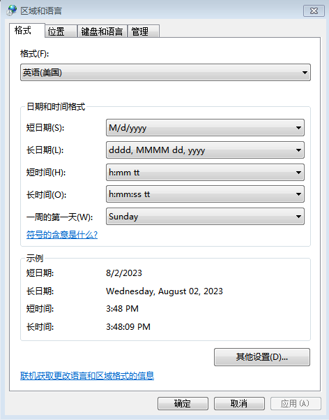
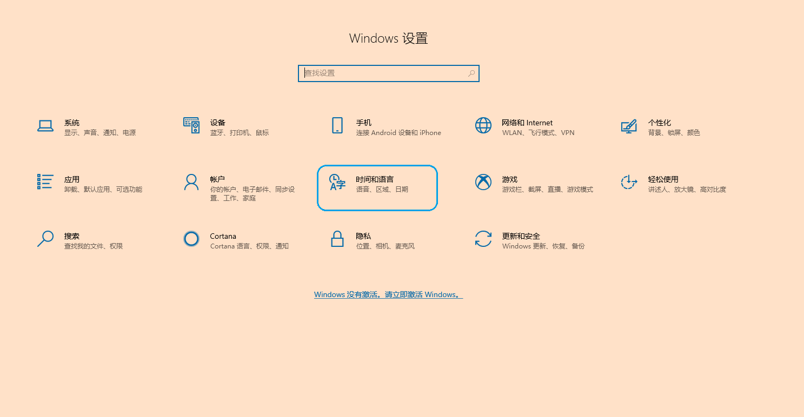
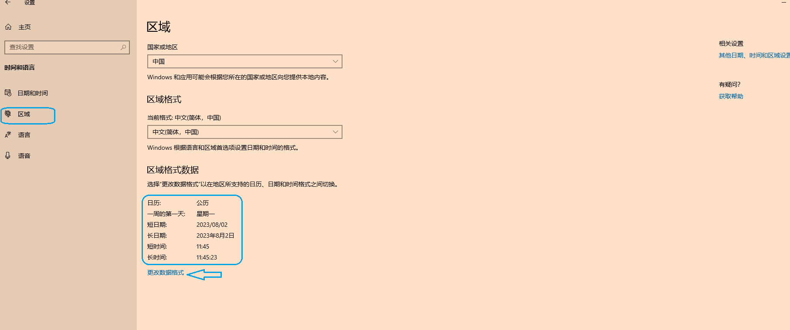
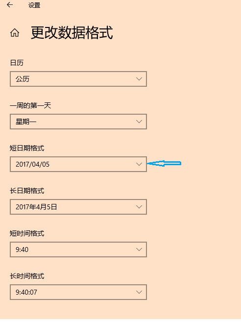

#### Excel表格中关于数据选择的快捷键

##### 快速移动

* ctlr+上、下、左、右箭头
* ctrl+ home 、end

##### 快速区域选择
* 快速选择左上角、右下角区域
      快捷键：ctrl+shift+home
      快捷键：ctrl+shift+end

* shift +  箭头  或者  pagedown、pageup
* 区域选择：
     在区域中输入格式H:H选择，可以直击选择列，或者a3:c4的区域选择

* alt + ; ，   或者筛选后使用ctrl+G打开定位，选择可见单元格即可选中筛选后的大量数据，ctrl+c、ctrl+v就可以完成复制。

#### 关于日期的格式设置和转换

* Windows系统日期格式的设定

  可以通过Windows控制面板提供的日期、时间、区域格式设置功能来指定需要的日期格式。
  
  * windows7
   
  
  * Windows10
  
    
  
    
  
    
  
* 日期格式的转换

  * 使用date（）函数：date(left(a2,4),mid(a2,5,2),right(2))
  * 使用Excel中的数据分列来完成日期格式的转换，可以把字符串格式的单元格转换为指定的日期格式。

* 指定自定义的日期格式

  * 根据表格的要求，可以选择两种日期格式，比如：yyyy/mm/dd或者yyyy-mm-dd
  * 如果默认的单元格格式定义里没有指定的日期格式，可以选择自定义项目，在自定义列表里指定日期格式，应用到选定的数据。

#### Vlookup的理解和使用

* 理解vlookup函数

  * 参数：vlookup(搜索关键字，查找区域，结果列名称，搜索方式)

  * 查找原理

    一般是在两个不同表格（或区域）之间完成搜索并获得搜索结果，首先这两个表格(或区域)之间有一个可以关联的关键字，比如，两个表格都包含有身份证号这个可以唯一区分一行数据的关键字段。使用这个关键字段作为第一个参数，在第二个参数指定的表格区域里搜索第一个参数指定的关键字，如果找到这个关键字段，会返回所在的行号，结合第三个参数指定的列，就可以完整返回一个单元格的数据，完成搜索。第四个参数是指定搜索数据的方式，是完全匹配还是部分匹配。
    
  * **关联字段的排列顺序**

    **vlookup的第一个参数要排列在查询区域的第一列**。表格中查询数据区域中，如果关联关键字段不在第一列，要复制或者移动到第一列。如果要查询的数据区域设定的只有一列就无所谓了，如果是多列的数据区域，要把关联字段调整到第一列。

* vlookup的多列查询    

  一般给vlookup函数的第一个参数提供的是单列单元格数据，如果需要搜索两个及以上的单元格，可以使用变通的办法，新建一个辅助列，在这个辅助列中把需要搜索的两个列数据合并在辅助列中。比如，要搜索A、B列，可以在C列使用`=a1&b1`，在第二个参数指定的目标表格中，也要使用同样的方法进行对应数据的合并。合并后，就可以正常使用vlookup查询了。
  
    

#### 快速创建Worksheet副本

按着CTRL键，用鼠标左键拖拽工作表底部的名称标签，可以快速创建一个Excel工作表的副本。

#### 打印Excel工作表时缩放

在Excel中制作多列表格，有时候因为横向内容多导致无法显示在一页纸上，当然可以逐步的调整来符合打印的要求，但是这里有一个懒人的方法，快速简单把所有的列打印在一页上：

在打印预览视图下，有一个打印缩放选项，可以选择缩放->将所有列打印在一页，显示正确后直接打印。


#### 根据身份证号自动计算性别和年龄

* **显示性别数据** 。从`MID`函数从身份证号码提取性别位,然后使用`MOD`函数对提取的性别位取模判断，把两个函数的组合放在`IF`函数中显示性别，如下公式所示（复制公式，修改对应的身份证号码所在的单元格地址）：

  ```
  =IF(MOD(MID(H2,17,1),2)=1,"男","女")
  ```

  

* **根据出生年月计算年龄**

  * **提取出生年月**。从身份证号码单元格数据提取出生年月（复制公式，修改对应的身份证号码所在的单元格地址）

    ```
    =MID(H2,7,8)
    ```
    
  * **把提取到的文本格式的出生年月转换为日期格式的数据**。
    
    ```
    =TEXT(DATE(LEFT(A1,4), MID(A1,5,2), RIGHT(A1,2)), "yyyy/mm/dd")
    ```
    
  * **计算年龄**
  
    * 年龄只精确到年
    
    ```
    =DATEDIF(N2,TODAY(),"y")
    ```
    
    * 年龄精确到月，然后再转换为年月值。
    
    如果要计算到月，就使用下列公式
    
    ```
    =IF(m2<=m3, (YEAR(m3) - YEAR(m2)) * 12 + MONTH(m3) - MONTH(m2), "错误：开始日期必须早于或等于结束日期")
    ```
    
    或者另外一种算法：
    
    ```
    #两个日期的年份之差+开始日期的年份中的剩余月数+终止日期中的当前月数
    =IF(m2<=m3, (YEAR(m3) - YEAR(m2) - 1) * 12 + (12 - MONTH(m2)) + MONTH(m3), "错误：开始日期必须早于或等于结束日期")
    ```
    
    

#### 字符串数据转换为日期格式

假设字符串数据在`A1`单元格，要`D1`单元格生成日期格式数据。

```
=text(date(left(A1,4),mid(A1,5,2),right(A1,2)),"yyyy/mm/dd")
```

由于公式比较长，在书写是容易少括号，可以先书写date()函数，最后再使用text()函数把date()函数包裹进来，这样不容易出错。`date()`函数用来把字符串数据合称为日期，`text()`函数用来设置日期的显示格式，比如`"yyyy/mm/dd"`、`yyyy/m/d`等。

####  身份证复制为文本格式

在其他业务系统复制的身份证号码，粘贴到电子表格时经常会呈现为科学计数法的样式，即使提前把目标单元格的格式设置为文本样式也是如此。时间长居然忘记了经常操作的方法了，**超级简单，就是双击单元格，使单元格处于编辑状态后再复制粘贴**。对于批量的复制粘贴，则可以用选择性粘贴。当然还有其他方法，比如先在单元格输入一个英文的单引号，然后再复制粘贴。

为什么会如此呢，如果不是双击单元格，让单元格处于编辑状态，excel会自动转换为科学计数法的样式。如果双击后处于编辑状态，会停止使用单元格的转换，使用的手动模式的编辑，复制粘贴会保留原来的样式。
