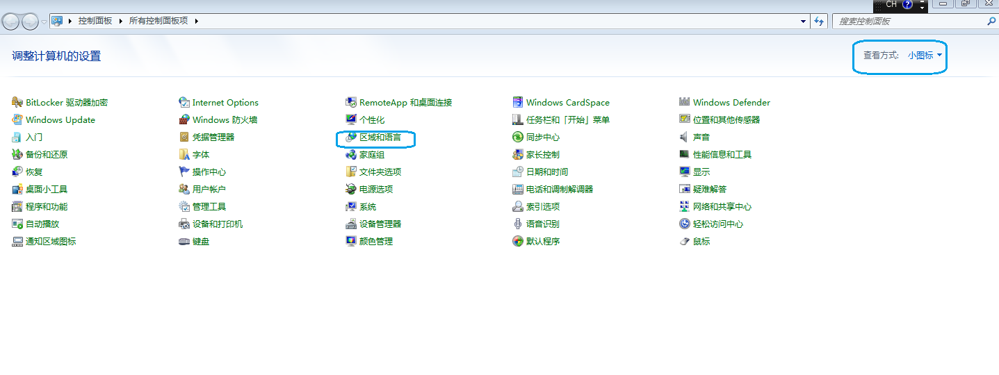
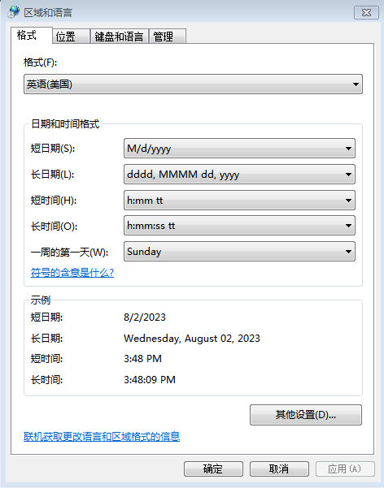
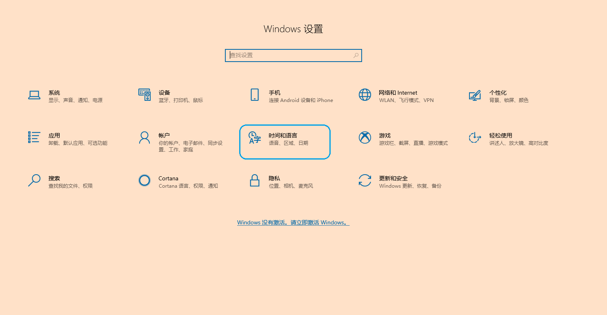
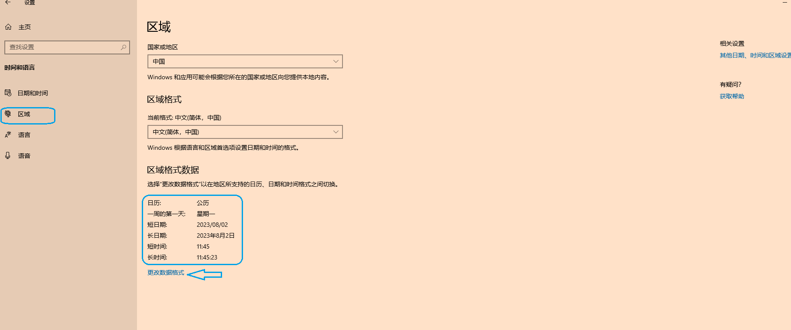
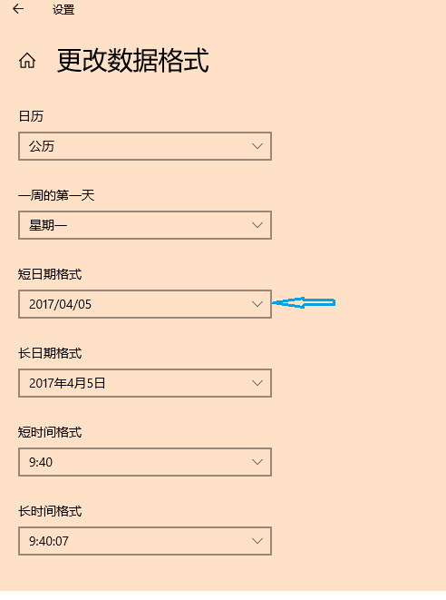

#### Excel表格中关于数据选择的快捷键

##### 快速移动
* ctlr+上、下、左、右箭头
* ctrl+ home 、end

##### 快速区域选择
* 快速选择左上角、右下角区域
      快捷键：ctrl+shift+home
      快捷键：ctrl+shift+end

* shift +  箭头  或者  pagedown、pageup
* 区域选择：
     在区域中输入格式H:H选择，可以直击选择列，或者a3:c4的区域选择

* alt + ; ，   或者筛选后使用ctrl+G打开定位，选择可见单元格即可选中筛选后的大量数据，ctrl+c、ctrl+v就可以完成复制。

#### 关于日期的格式设置和转换

* Windows系统日期格式的设定

  可以通过Windows控制面板提供的日期、时间、区域格式设置功能来指定需要的日期格式。
  
  * windows7
   
  
   
  
  * Windows10
  
    
  
    
  
    
  
* 日期格式的转换

  * 使用date（）函数：date(left(a2,4),mid(a2,5,2),right(2))
  * 使用Excel中的数据分列来完成日期格式的转换，可以把字符串格式的单元格转换为指定的日期格式。

* 指定自定义的日期格式

  * 根据表格的要求，可以选择两种日期格式，比如：yyyy/mm/dd或者yyyy-mm-dd
  * 如果默认的单元格格式定义里没有指定的日期格式，可以选择自定义项目，在自定义列表里指定日期格式，应用到选定的数据。

#### Vlookup的理解和使用

* 理解vlookup函数

  * 参数：vlookup(搜索关键字，查找区域，结果列名称，搜索方式)

  * 查找原理

    一般是在两个不同表格（或区域）之间完成搜索并获得搜索结果，首先这两个表格(或区域)之间有一个可以关联的关键字，比如，两个表格都包含有身份证号这个可以唯一区分一行数据的关键字段。使用这个关键字段作为第一个参数，在第二个参数指定的表格区域里搜索第一个参数指定的关键字，如果找到这个关键字段，会返回所在的行号，结合第三个参数指定的列，就可以完整返回一个单元格的数据，完成搜索。第四个参数是指定搜索数据的方式，是完全匹配还是部分匹配。

    

    