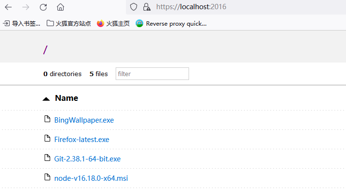

#### 使用FileBrowser在局域网建立一个网盘

#### caddy

最早使用过caddy的file_server 功能，没有深究，只是在配置文件Caddyfile里编辑了几个参数，在单位内部可以基于浏览器实现文件下载功能。由于自己的应用场景没有那么复杂，再没有深入学习和使用caddy。

> Caddyfile

~~~
localhost:2016 {
	root d:\tools
	file-server browser
}
--在真实的场景下用主机的ip地址替代localhost,端口根据实际调整。
~~~

这是以前的用法，早期的caddy是直接支持filebrower。现在需要使用反向代理的方法使用FileBrowser。在这里看到了[关于canddy和filebrowser](https://caddy.community/t/file-browser-says-goodbye-to-caddy-for-now/5676)的信息，写个链接有空再来看看。又看到了社区里关于[caddy反向代理](https://caddy.community/t/using-caddy-as-a-reverse-proxy-in-a-home-network/9427)的信息，有空看一下。

> 初学者注意：最好在caddy.exe当前所在的目录使用`caddy start` ，如果在别的目录需要使用`--config`参数指定Caddyfile的路径。比如：
>
> `caddy  start --config c:\myrepos\caddy\Caddyfile`

#### FileBrowser

* 下载对应版本的[FileBrowser](https://github.com/filebrowser/filebrowser),我下载的是windows-amd64-filebrowser.zip，解压后只有一个可执行文件，其他为说明性文档。

* 在Windows CMD窗口下切换到FileBrowser目录，运行`filebrowser -r d:\tools`  或者`filebrowser --root "d:\tools"`
  * -r 参数指定FileBrowser要管理的本地磁盘目录。
  * 第一次启动FileBrowser后，会在目录下生成单文件数据库`filebrowser.db`。
  * 根据运行后在CMD窗口显示的ip及端口信息，如127.0.0.1:8080,在浏览器输入地址就可以进入web文件管理界面

​				

初始账号为admin/admin，登录后可以根据需要修改密码。
* 自己的应用场景简单，主要是单位内部的局域网，主机IP都是静态的，这里是虚拟机的环境显示为127.0.0.1。

