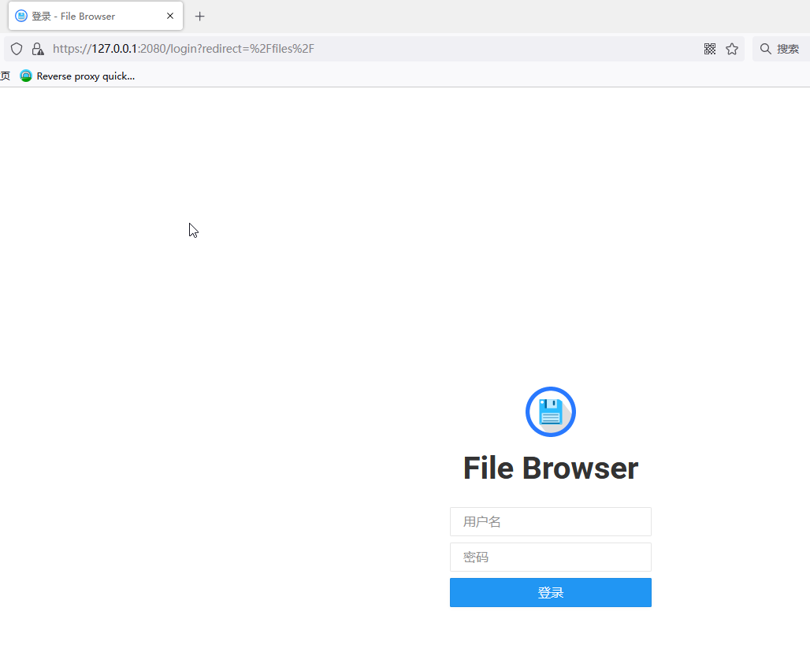

#### 正向代理服和反向代理的基本概念

##### 网络模型的发展

* 两层网络模型：网络客户端，服务器。实际是就是最初的client/server模型。随着客户端请求规模的增加，受限于服务器端计算能力和网路带宽，服务器端的响应不再及时，于是就出现了三层模型或者分布式网路模型。
* 简单构建一个三层网络模型：网络客户端、代理服务器、应用服务器（如数据库服务器、邮件服务器等，分布在多台主机或者表现为一台主机的多个不同系统服务）。
* 分布式多层模型。这个比较复杂，暂不深究。这里只是记录自己对反向代理概念的初步认识。

##### 正向代理

* 应用场景 公司内部局域网的计算机通过代理服务器(与防火墙搭配)访问互联网资源。正向代理服务器和其他客户端同属于内部网络，通过防火墙的设置，只有代理服务器可以访问外部互联网，其他计算机通过代理服务器访问外部互联网。代理服务器是同网段其他客户端的代理，这样的模型应用称作为正向代理。

##### 反向代理

* 应用场景 外部计算机通过互联网访问公司内部网络服务。公司内部有多个后端服务器，但是不能直接开放给外部通过互联网访问的计算机，而是通过一个代理服务器设置服务转发调度表，把公司内部的服务展示给外部计算机。也就是说，外部的计算机通过互联网只能访问到公司内部服务器的代理，由这台代理服务调度外部的服务请求，这样的应用模式叫做反向代理。反向代理是公司内部一组服务器的代理，通过这个代理服务器，把内部的服务开放给互联网用户。

##### 应用实践

以caddy的反向代理设置为例，在实践中理解。
  ~~~
  File server and proxy
   Caddy is both a flexible, efficient static file server and a powerful, scalable reverse proxy.Use it to serve your static site with compression. Or use it as a dynamic reverse proxy to any number of backends。
    这段文字来自caddy主页介绍，作为反向代理的解释，最后一句话总结了reverse proxy的基本概念。
  ~~~
> 反向代理实践。

在虚拟机上安装了caddy，使用下面的命令把caddy安装为Windows系统服务。这里假设代理服务器上安装的是caddy。

~~~
sc.exe create caddy start= auto binPath= "C:\myrepos\caddy\caddy.exe run"
sc.exe start caddy
--sc.exe stop  caddy
--也可以在Windows的服务界面里设置；或者用Win+R打开运行界面，输入services.ms 打开Windows服务窗口启动或者停止caddy服务
~~~

caddy的配置文件Caddyfile设置如下：

~~~
127.0.0.1:2080
reverse_proxy   127.0.0.1:8080
~~~

Caddyfile文件的第一行是要访问的服务所在主机的IP地址或者域名，或者叫主机地址。

Caddyfile文件的第二行用reverse_proxy表明了反向代理的路径，把127.0.0.1:2080的https请求转发到主机127.0.0.1上端口为8080的进程,而FileBrowser运行启动后，默认是127.0.0.1:8080，所以在浏览器输入：https://127.0.0.1:2080，就会被caddy转发给占用127.0.0.1:8080端口的FileBrowser,打开FileBrowser应用，如下图：

这里只是以FIleBrowser为例学习caddy的反向代理功能，如果只需要File Browser，单独使用File Brower就可以，而caddy是一个web服务器。

把caddy 安装为Windows系统服务后，每次启动计算机caddy就会自动运行，提供反向代理服务，把外部的https请求转发给指定的指定的内部服务器。上面Caddyfile中的reverse_proxy是设置反向代理设置的。用命令行实现更容易理解反向代理的原理：

~~~
caddy  revese-proxy --from   www.examabc.com   --to 127.0.0.1:8080
~~~

意思是浏览器中www.examabc.com的访问，转发给本机的127.0.0.1:8080端口进程，这样就把外部的访问变成公司内部服务器之家的调度。

##### 总结

* 正向代理：在内部局域网的客户端中派个代理让大家获取互联网资源。为客户端代理的叫正向代理。

* 反向代理：在公司内部服务器中派个代理把服务开放给互联网。为服务器代理的叫反向代理

  
