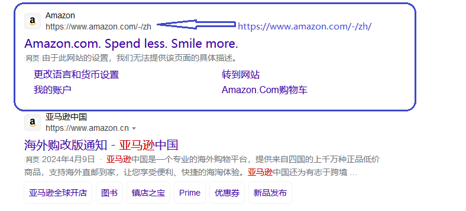
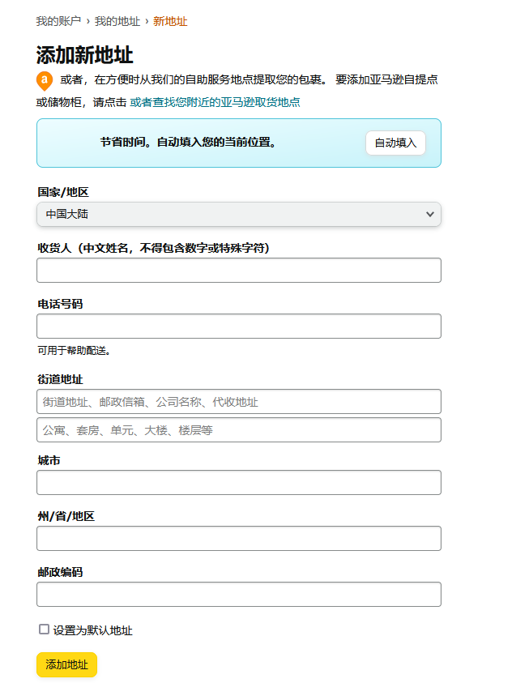
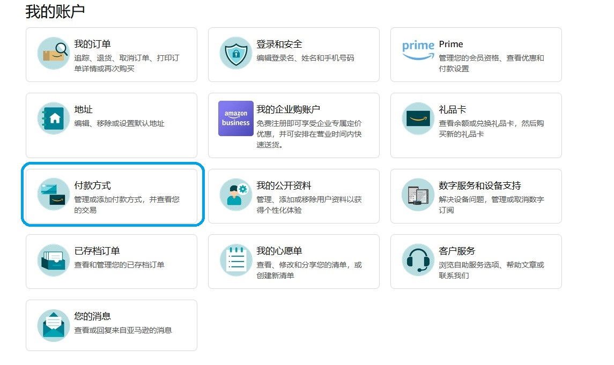
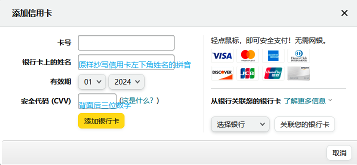

#### Amazon海外购

在搜索引擎中搜索`亚马逊`，选择Amazon的全球官方站点，如下图：

注意上边图片中显示的网址最后边`/-/zh`就是链接到了中国站点（显示可配送到中国国内的产品）。打开网址后会显示亚马逊全球站点，应该会显示中文界面。

如果显示全英文界面，可以在窗口右上角找到语言设置选项，把语言更改为中文，支付货币保持美元不变。

当熟悉了在亚马逊全球站点购物后，这个地址就简单点了，只需在浏览器的地址栏输入`www.amazon.com`即可打开全球站点，打开网页后会显示全英文界面，如果不习惯就只是把语言设置为中文，其他不需要修改。

#### 注册账户

​    注册amazon全球站点，提供一个邮箱，设置好登录密码，按照提示信息输入就可以了（当时注册的时候没有保存照片，没有复杂的地方，如果有什么输入项目不确定，就用使用拼音输入）。

#### 设置收货地址

在上面的选项中，国家和地区选项需要在列表中选择，收货人、街道地址、城市、省/地区这些项目都要使用汉语拼音输入，在适当的地方使用空格分开。电话和邮编正常输入。填写完毕后点击`添加地址`完成地址设置。

#### 选择支付方式

现在的支付方式设置简单了，不需要`VISA`等国外的支付方式，只需要选择中国银联的借记卡或者信用卡，输入卡号和持卡人姓名。我的信用卡正面左下角显示大写的姓名拼音，原样输入就可以。如果是借记卡，要核实持卡人的准确姓名，需要的话可以拨打银行客服确认。

在下单支付时还是以美元结算的，可以仔细查看订单明细，有的运费很贵(几十美元),甚至笔书本本身的价格还要贵，需要权衡一下是否值得购买，没有性价比的话就放弃。

有的原版书在国内卖的贵，或者根本买不到，可以试试亚马逊海外购。目前下单了两笔，显示信用卡支付成功，发货速度比不上国内，还可以接受吧。

