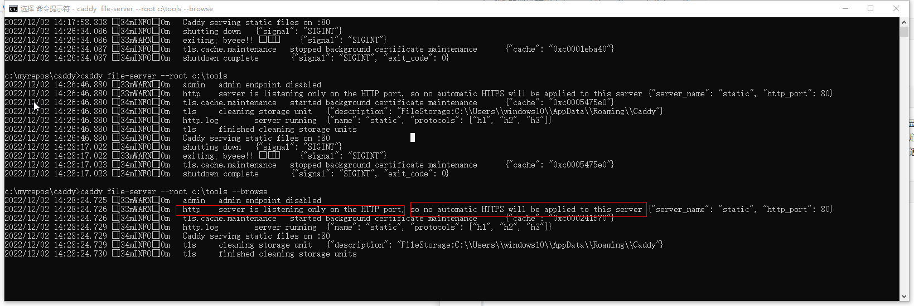
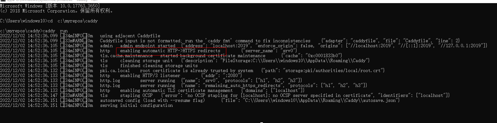

#### 安装caddy

* 获取Caddy

   - [ releases on GitHub](https://github.com/caddyserver/caddy/releases) )

      (expand "Assets")

     - Refer to [Verifying Asset Signatures](https://caddyserver.com/docs/signature-verification) for how to verify the asset signature

   - [caddy download page](https://caddyserver.com/download)

*  安装
   * [把 Caddy作为系统服务安装.](https://caddyserver.com/docs/running#manual-installation) 推荐这种安装方式。
   * caddy是一个独立的可执行文件，不需要再安装，把下载到的caddy.exe放在工作目录下，然后把caddy.exe所在的目录加入系统环境变量。如果需要升级caddy,直接用新的caddy.exe覆盖。
#### 运行caddy的两种方式
#####  命令行运行caddy

首先把目录切换到站点目录下。这里所谓的站点，是至少包含有index.html文件的目录，用来测试caddy的静态文件服务。

     caddy file-server 
     # 把当前目录做为要托管的站点，启用caddy的静态文件支持服务，可以显示站点目录下的index.html文件
     # 如果站点目录下没有index.html文件，打开浏览器什么也不显示，误以为是哪里出错了。

在浏览器地址栏输入`http://localhost`或者`localhost`

~~~
caddy file-server --listen  :2015
# 用--listen指定端口
~~~

第二个命令行加了`--listen`参数和端口号。此时在浏览器地址栏输入：`http://localhost:2015`或者`localhost:2015`。

> 这前边两个命令行显示index.html的内容，如果没有index.html文件，浏览器自然什么也没有，我以为是哪里出错了。

~~~
caddy file-server --browse
# 把当前目录做为要托管的站点 开启caddy的静态文件支持服务，并用--browse参数开启文件列表显示功能
~~~

第三个命令行多了一个`--browse`参数，可以在浏览器显示站点目录列表。如果有index.html则显示index.html的内容，如果没有index.html文件，就会显示当前站点的所有目录及文件。也就是说file-server会优先显示站点目录的主页，如果没有主页则会显示站点目录列表，列表中的文本文件可以直接打开，其他文件可通过浏览器下载。在根目录下有index.html的情况下想用`--browse`开启文件列表显示服务，需要把index.html修改为别的文件名，比如a_index.html,或者把index.html删除，在浏览器就可以显示站点目录列表。

~~~
caddy file-server --browse --root  c:\tools  
# --root参数指定c:\tools作为托管站点根目录；file-server开启静态文件支持，--browse开启显示文件列表
~~~

第四个命令指定了`--root`参数，指定站点根目录为c:\tools

> 注意：在命令行下带参数运行caddy，根据cmd信息提示，并不会自动添加https协议，在浏览器地址栏输入时为：`http:localhsot`,或则直接输入localhost。如下图：
>

##### 使用Caddyfile运行caddy

在站点根目录建立名称为Caddyfile的文本文件，不带扩展名(也可以在编辑好内容之后把扩展名删除）。

~~~
localhost

file_server

#这两行命令是显示站点根目录下的index.html，如果没有自然是空白，以为是哪里出错了。
#以Caddyfile配置文件的方式使用caddy run 启动，会自动转换为https协议
~~~
`caddy  run `

如果站点根目录下没有index.html文件，但是想显示文件列表的话，就在file_server后添加browse参数。关于file_server的详细用法，看最后的官方文档链接。

~~~
localhost
file_server browse
~~~

~~~
# https请求地址为localhost时开启c:\tools的目录列表服务
# https请求地址为localhost:2080时，启用反向代理功能，调用filebrowser服务。
#不同的两个服务分成两个语句块，用{}分开，互相独立
#站点的https请求地址，自己调试期间可以是ip地址加端口号，实际应用一般为域名。根据实际应用环境修改，这里只是单机测试。

localhost {
    # 开启站点的静态文件服务和显示文件列表服务
    file_server browse
    # 指定站点根目录
    root   c:\tools
}

localhost:2080  {
    #服务器反向代理设置，把127.0.0.1:8080的filebrowser服务托管在该代理服务器
    #有localhost:2080端口的https请求时，转发给本机的127.0.0.1:8080服务
    # 如果有不同的服务在公司内部其他主机上，指定具体域名：比如：reverse_prox:  exam.com
    reverse_proxy    127.0.0.1:8080
}
~~~

[file_server](https://caddyserver.com/docs/caddyfile/directives/file_server)参数详细用法

##### 两种运行caddy托管web站点方式的特点

* 命令行方式运行caddy
  * 适合初学caddy各种参数用法
  * 不会实现自动https
  
* Caddyfile配置文件方式启动caddy
  
  * 使用caddy start启动caddy时，如果不指定配置文件路径，会默认为当前目录，所以最好切换到站点根目录。
  
    ~~~
    caddy start  --config   c:\myrepos\caddy\Caddyfile
    ~~~
  
    
  
  * 一次设置长期运行，不用每次都去设置caddy运行环境的各种参数。
  * 自动实现https协议

这些只是自己最近初学caddy的体会，记录下来备忘，可能会有理解不全的地方，有空或有应用需求的话继续深入学习。
#### 初学caddy需要注意的三个要点

* 无论是命令行方式运行caddy ，还是以`caddy run ` 或者`caddy start`使用配置文件运行caddy,一个容易忽略的要点是工作目录，最好切换到站点根目录。
* ~~~
  Client sent an HTTP request to an HTTPS server.
  ~~~

  意思是caddy托管的是HTTPS web  server,可是客户端发出的是http请求，把协议更换为     HTTPS就可以了。有时浏览器会提示风险，继续信任即可打开托管的服务。

* 由于不断变更启动caddy的参数，如果测试新的参数时没有出现预期效果，除了命令行、参数、配置文件错误外，多数情况是由于浏览器缓存的原因，清理缓存就好。
