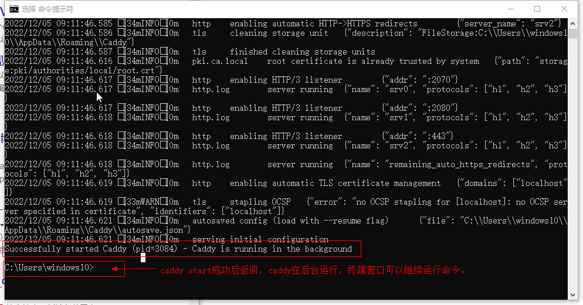

#### caddy常用命令

##### caddy

单独一个caddy，不会真正启动caddy，而是会打开caddy 的help，所以任何时候需要查看帮助，输入caddy。也可以输入`caddy help <command>`查看子命令的详细用法。

##### caddy run 

会运行一个前台caddy进程，会阻塞终端窗口，无法继续运行其他命令，直到你使用 `ctrl+c` 或者退出命令窗口

#####  caddy start 

`start` 命令的使用 `run` 一样启动caddy，但是 `start` 启动一个后台运行进程,启动成功后返回，不会阻塞当前终端窗口使用。在Windows下任务管理器下可以看到caddy进程。但是关闭启动时的终端窗口后，caddy进程结束，在Windows测试如此，不知道在Linux下如何。如果想临时测试caddy服务，可以使用`caddy run`,也可以使用`caddy start`，两个命令的区别是`caddy run`会阻塞当前终端窗口，需要运行别的命令的话要再开新终端窗口，而`caddy start`不会阻塞终端窗口，运行成功后启动caddy进程，并返回到终端命令提示符。在正式使用caddy时，推荐把caddy安装为Windows系统服务。



> [caddy start](https://caddyserver.com/docs/command-line#caddy-start),Same as [`caddy run`](https://caddyserver.com/docs/command-line#caddy-run), but in the background. This command only blocks until the background  process is running successfully (or fails to run), then returns.

##### caddy stop

如果 `caddy start` 是使用默认 `localhost:2019` 启动的，直接使用 `caddy stop` 命令就可以优雅的停止caddy，如果不是默认的，那么需要使用 `-address` 来指定管理地址。

```text
caddy stop -address localhost:2080
--如果caddy的地址是localhost:2080，停止caddy时要指定地址
```

##### caddy  reload

通过 `caddy satrt` 启动的caddy一般是长期运行，不能轻易停止，否则会导致网络服务不可用。如果想使用修改后的配置文件而又不用终止正在运行的caddy，可以使用 `reload` 命令。在修改了正在使用的Caddyfile文件内容后，打开新的终端窗口，运行`caddy relod`,终端窗口会显示`admin   stopped previous server {"address": "localhost:2019"}`的信息，代表caddy服务成功应用了新的配置文件，可以测试一下修改后的Caddyfile文件。

##### caddy  file-server

启动一个文件服务，比如托管一个静态网站、把你的文件夹共享在网络上。可以搭配`browse`使用：`caddy file-server browse`

~~~
localhost:2080
root c:\tools
file_server  browse

~~~

上面这三行文本是Caddyfile的所有内容，直接在caddy所在的目录下运行caddy start，在浏览器输入：`https://localhost:2080`就会在浏览器显示磁盘上c:\tools目录下文件列表。

##### caddy reverse-proxy

这是caddy 提供共代理服务的反向代理功能。使用格式如下：

~~~
caddy reverse-proxy  --from :2080  --to  :8080
caddy reverse-proxy --from example.com --to :9000
--这是在命令终端的格式
reverse_proxy   :8080
~~~

一个反向代理启动FileBrowser的配置文件Caddyfile：

~~~
localhost:2080 {
	#root c:\tools
	#file_server browse
	reverse_proxy    :8080
}
--静态文件浏览服务和反向代理服务同时写在一起并不能达成你的预期，这里注释掉静态文件浏览功能，具体细节需要
--查阅caddy官方文档
~~~

##### caddy fmt

caddy提供的一个辅助工具，可以格式Caddyfile配置文件。

~~~
caddy fmt --overwrite c:\myrepos\caddy\Caddyfile
  --这里的overwrites参数是指用格式化的文件直接覆盖原文件
  --如果注释里有中文，在使用本命令之前备份一份，我发现fmt之后全部乱码。
~~~

##### caddy adapt 

可以把Caddyfile文件内容转换成caddy 默认的json格式。

##### 把caddy安装为Windows系统服务

* 创建服务

  ~~~
  sc.exe create caddy start= auto binPath= "YOURPATH\caddy.exe run"
  --把双引号中的YOURPATH替换为caddy.exe真实路径
  ~~~
  
* 启动caddy服务
  
  ~~~
  sc.exe start  caddy
  ~~~
* 停止caddy服务
  ~~~
  sc.exe stop  caddy


> [caddy command ](https://caddyserver.com/docs/getting-started#start-stop-run)

