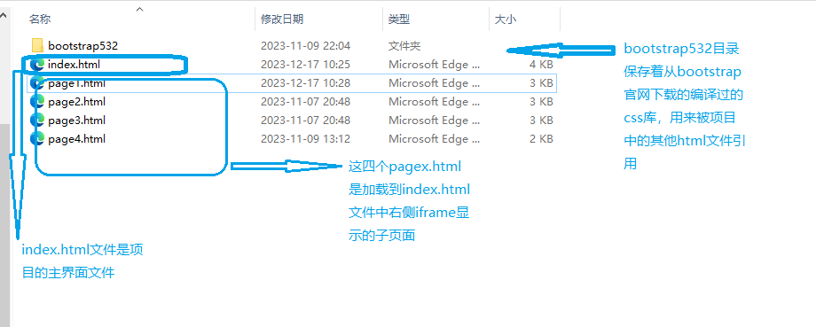

####  bootstrap的基本思想

初步学习用了一下bootstrap，感受了html  element元素的变化，外观的确是丰富了很多，而且不需要多少复杂的代码。个人感觉bootstrap就是个css的库，我们下载后可以直接在自己的html文件中引用，用来快速生成美观的html界面。

#### bootstrap的使用方法(有三种基本的使用bootstrap的方法)

##### 在bootstrap官网上下载编译版本的bootstrap

```
把下载的编译版本的bootstrap目录放在自己的web项目下，在html文件中通过<link>来引用这些库文件，例如：
<link rel="stylesheet" href="bootstrap532/css/bootstrap.min.css" />
href后面路径中的bootstrap532就是下载的bootstrap，自定义名称为bootstrap532
```


[Compiled CSS and JS ](https://github.com/twbs/bootstrap/releases/download/v5.3.2/bootstrap-5.3.2-dist.zip)

##### 在线引用bootstrap

```
<!doctype html>
<html lang="en">
  <head>
    <meta charset="utf-8">
    <meta name="viewport" content="width=device-width, initial-scale=1">
    <title>Bootstrap demo</title>
    <link href="https://cdn.jsdelivr.net/npm/bootstrap@5.3.2/dist/css/bootstrap.min.css" rel="stylesheet" integrity="sha384-T3c6CoIi6uLrA9TneNEoa7RxnatzjcDSCmG1MXxSR1GAsXEV/Dwwykc2MPK8M2HN" crossorigin="anonymous">
  </head>
  <body>
    <h1>Hello, world!</h1>
    <script src="https://cdn.jsdelivr.net/npm/bootstrap@5.3.2/dist/js/bootstrap.bundle.min.js" integrity="sha384-C6RzsynM9kWDrMNeT87bh95OGNyZPhcTNXj1NW7RuBCsyN/o0jlpcV8Qyq46cDfL" crossorigin="anonymous"></script>
  </body>
</html>
```

##### 使用包管理器node.js安装和使用bootstrap

#### 使用bootstrpa快速创建html  UI

在bootstrap官网的文档页面左侧，列举了包括layout、content、forms、components等多种组件，可以根据页面提供的样例选择指定的组件，复制代码到自己的html文件中，就可以快速创建bootstrap组件。简单说，直接给html  elemetn添加各种class就可以引用bootstrap，一个element的class中可以添加多个bootstrap  class 标签。

#### 使用bootstrap的例子代码



```html
<!-- index.html，显示程序的主界面 -->
<!DOCTYPE html>
<html>

<head>


  <style>
    .container {
      display: flex;
      height: 100vh;
    }

    .sidebar {
      flex-basis: 20%;
      background-color: #91e20f5e;
    }

    .iframe-container {
      flex-basis: 80%;
      background-color: white;
    }

    .iframe-container iframe {
      width: 100%;
      height: 100%;
    }

    .tree {
      list-style-type: none;
      padding-left: 20px;
    }

    .tree li {
      position: relative;
      padding-left: 1em;
    }

    .tree li:before {
      content: "";
      position: absolute;
      top: 0;
      left: -10px;
      border-left: 1px solid #ccc;
      height: 100%;
    }

    .tree li:last-child:before {
      height: 50%;
    }

    .tree li:after {
      content: "";
      position: absolute;
      top: 0;
      left: -10px;
      border-top: 1px solid #ccc;
      width: 10px;
    }

    .tree li.collapsed > ul {
      display: none;
    }

    .tree li.collapsed:before {
      height: 50%;
    }

    .tree li.collapsed:after {
      display: none;
    }

    .tree li a {
      text-decoration: none;
      color: #333;
    }
  </style>
  <script>
    window.addEventListener('DOMContentLoaded', (event) => {
      const treeItems = document.querySelectorAll('.tree li');
      treeItems.forEach((item) => {
        item.addEventListener('click', (event) => {
          event.stopPropagation();
          item.classList.toggle('collapsed');
        });
      });
    });
    function loadContent(url) {
      document.getElementById("myIframe").src = url;
    }
    /* 这个函数的第二种写法
    function loadContent(url) {
      var iframe = document.getElementById("myIframe");
      iframe.src = url;
    }
    */
  </script>

</head>

<body>
  <div class="container">
    <!-- 位于窗口左侧的边条 -->
    <div class="sidebar">
      <ul class="tree">
        <li>
          <a href="#">Web</a>
          <ul>
            <li>
              <a href="#">Languages</a>
              <ul>
                <li><a href="#" onclick="loadContent('page1.html')">HTML</a></li>
                <li><a href="#" onclick="loadContent('page2.html')">CSS</a></li>
                <li><a href="#" onclick="loadContent('page3.html')">JavaScript</a></li>
              </ul>
            </li>
            <li>
              <a href="#">Database</a>
              <ul>
                <li><a href="#" onclick="loadContent('page4.html')">MySQL</a></li>
                <li><a href="#">SQLite</a></li>
                <li><a href="#">PostgreSQL</a></li>
              </ul>
            </li>
            <li>
              <a href="#">Web Performance</a>
              <ul>
                <li><a href="#">Load time</a></li>
              </ul>
            </li>
            <li><a href="#">APIs</a></li>
          </ul>
        </li>
      </ul>
    </div>
    
    <!-- 使用<iframe> </iframe>在窗口右侧显示具体的子网页内容。当点击窗口右侧树形目录的内容时，在右侧的<iframe></iframe>里显示子网页的内容 -->
    <div class="iframe-container">
      <iframe id="myIframe"> src=""</iframe>
    </div>

  </div>

</body>

</html>
```

```html
<!-- 第一个显示在index.html右侧iframe区域的子页面 。-->
<!DOCTYPE html>
<html>
<head>
    <meta charset="UTF-8" />
    <title>title</title>
    <link rel="stylesheet" href="bootstrap532/css/bootstrap.min.css" />
    <script src="bootstrap532/js/bootstrap.min.js"></script>
</head>
<body>
    <div class="container-md">
        <form class="row g-3 needs-validation" novalidate>
            <div class="col-md-4 position-relative">
              <label for="validationTooltip01" class="form-label">First name</label>
              <input type="text" class="form-control" id="validationTooltip01" value="Mark" required>
              <div class="valid-tooltip">
                Looks good!
              </div>
            </div>
            <div class="col-md-4 position-relative">
              <label for="validationTooltip02" class="form-label">Last name</label>
              <input type="text" class="form-control" id="validationTooltip02" value="Otto" required>
              <div class="valid-tooltip">
                Looks good!
              </div>
            </div>
            <div class="col-md-4 position-relative">
              <label for="validationTooltipUsername" class="form-label">Username</label>
              <div class="input-group has-validation">
                <span class="input-group-text" id="validationTooltipUsernamePrepend">@</span>
                <input type="text" class="form-control" id="validationTooltipUsername" aria-describedby="validationTooltipUsernamePrepend" required>
                <div class="invalid-tooltip">
                  Please choose a unique and valid username.
                </div>
              </div>
            </div>
            <div class="col-md-6 position-relative">
              <label for="validationTooltip03" class="form-label">City</label>
              <input type="text" class="form-control" id="validationTooltip03" required>
              <div class="invalid-tooltip">
                Please provide a valid city.
              </div>
            </div>
            <div class="col-md-3 position-relative">
              <label for="validationTooltip04" class="form-label">State</label>
              <select class="form-select" id="validationTooltip04" required>
                <option selected disabled value="">Choose...</option>
                <option>...</option>
              </select>
              <div class="invalid-tooltip">
                Please select a valid state.
              </div>
            </div>
            <div class="col-md-3 position-relative">
              <label for="validationTooltip05" class="form-label">Zip</label>
              <input type="text" class="form-control" id="validationTooltip05" required>
              <div class="invalid-tooltip">
                Please provide a valid zip.
              </div>
            </div>
            <div class="col-12">
              <button class="btn btn-primary" type="submit">Submit form</button>
            </div>
          </form>


    </div>

        

</body>
</html>
```

> 项目中后面的几个子页面代码（page2.html、page3.html、page4.html）就不再下面继续列出了，同样的原理，只不过演示了不同的bootstrap元素
>
> 后端可以使用go语言自带的web服务器，再使用mysql数据库就可以构建一个通用的具有增删查改功能的简单应用。

