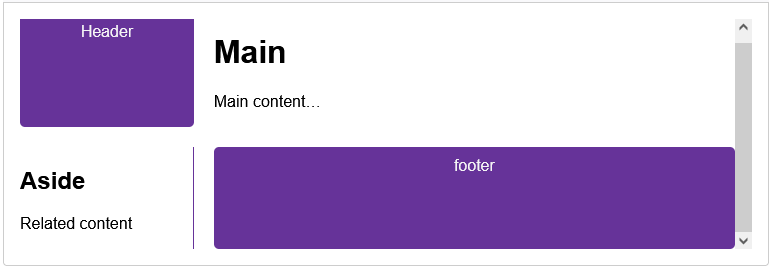

#### What  is css
css是用来对HTML文档进行渲染装饰和布局的、基于规则的语言。

#### Css语法的基本形式

selector-name  {

​    property1: value1;

​    property2:  value2;

​    propertyN: valueN;

}

#### HTML文档应用css的三种方式

* External   在html文档的`<head>.. </head>`区域使用`<link  rel="stylesheet"  href="path\styles-name.css"/>`引入css文档
* internal   在html文档的`<head>.. </head>`区域使用`<style></style>`书写css声明。
* inline    对html文档中指定元素设置style属性来书写css声明。这种方式并不推荐。

#### Css选择器的常规写法

* html-tag-name  | Type  selecor  。实际上就是直接书写html标签名称。

  ```
  A type selector is sometimes referred to as a tag name selector or element selector because it selects an HTML tag/element in your document. Type selectors are not case-sensitive.
  ```

  

* class    一般用一个点号紧跟html element的classname 。比如  ：.sidebar{  }  

  ```
  The case-sensitive class selector starts with a dot (.) character. It will select everything in the document with that class applied to it
  ```

  

* id(#)

* Attributes Selector 

  input [type="text"]

  a[title]

* 组合选择器

  * 基于html  元素结构的层次关系。比如 ： ul  li {  }表示选择ul列表中的li项目，中间用一个空格隔开，表示包含式的选择器。

  * 两个直接相连的元素。比如 p1+p2  表示选择和p1段落直接相连的p2段落。

  * 直接后代。  

   ```
    article > p {
    }
   ```
  
* Pseudo-classes and pseudo-elements
  
  a:hover {
  }
  
  p::first-line {
  }
  
  关于css选择器的参考链接：https://developer.mozilla.org/en-US/docs/Web/CSS/CSS_selectors
  
* 通用选择器 `*`

  ```
  * {
     font-weight: bold;
  }
  单独一个* 选择器，表示选择body中的所有元素
  
  --* 和其他元素组合使用
  article * {
   /*代表article包含的所有元素*/
  }
  
  article *:first-child {
   /* 表示选择article下的任意元素的第一个子元素*/
   /*这种写法自己还没有实践过，待测试学习*/
  
  }
  ```

  

####  css选择器的优先级

* ID、CLASS、Html-Tag   这三个基本类型的优先级从高到低。可以理解为越具体、特定的元素优先级越高。比如一个html元素名称可以包含html文档中的同类多个tag，而class则是对指定的html  tag 指定一个类名，多个标签也可以使用相同的一个类名。而ID则是给一个html元素指定唯一编号  。

* 在同类型的标签元素中，声明顺序越晚则优先级越高，如果对同一个元素有多个声明，则后来的会覆盖先来的。

* CSS声明位置的影响和CSS声明覆盖的顺序

  冲突的CSS声明会按照下面所示顺序应用(with later ones overriding earlier ones):

  1. Declarations in user agent style sheets (e.g., the browser's default styles, used when no other styling is set).  **`Browser Layer `**
  2. Normal declarations in user style sheets (custom styles set by a user).**`User Layer`**
  3. Normal declarations in author style sheets (these are the styles set by us, the web developers).**`Web developer Layer`**
  4. Important declarations in author style sheets. **`Web developer Layer`**
  5. Important declarations in user style sheets. **`User Layer`**
  6. Important declarations in user agent style sheets **`Browser Layer`**
  
* `!important`https://developer.mozilla.org/en-US/docs/Learn/CSS/Building_blocks/Cascade_and_inheritance#!important

* cascade  layer
  感觉这部分内容琐碎而抽象，对css  style的 source  from  ,也就是origin，再组合个important flag，搞出六个组合：

  *  user agent  (browser)  style sheet 
  * user   style sheet
  * author     style sheet
  * important  author  style  sheet
  * important user   style sheet
  * important  browser  style sheet 
    * 注意后三个的顺序和前三个顺序刚好相反
  
* specificity   主要是在同级的多个stylesheet应用在同一个elment时（解决冲突问题），需要根据id-class-element的权重计算最终的获胜权重。

* 创建各种layer，命名的、匿名的、嵌套的。可能是应付大型项目或者第三方公司的css，专门搞的一套名称空间吧（我这样理解的），暂时没有应用需求，所以一下没办法彻底搞明白，看个半懂，先放下吧。不过，我个人理解，这个cascade layer是不是有点名称空间的意思，把一段style sheet包裹起来，和其他的style sheet区别开来，先说layer ,不存在比对specificity。我就用半桶水的英语去问Mozilla developer  network。结果还真是可以看做名称空间，下面是我的提问和mdn的回复：

  ```
  how can i think cascade layer is a namespace for resovle conflicted style sheets?
  
  ====下面是回复====
  
  The cascade layer can be thought of as a namespace for resolving conflicting style sheets. By creating named cascade layers using the @layer at-rule, you can group related styles together and establish an order of precedence.
  
  For example, you can create a named cascade layer called "utilities" and define CSS rules specific to that layer:
  
  css
  
  @layer utilities {
    .padding-sm {
      padding: 0.5rem;
    }
  
    .padding-lg {
      padding: 0.8rem;
    }
  }
  
  By doing this, you can ensure that the styles within the "utilities" layer will take precedence over conflicting styles declared outside of the layer, regardless of specificity. This allows you to organize your styles and avoid conflicts between different parts of your codebase.
  
  It's important to note that the order in which layers are declared determines their precedence. If there are conflicting rules in multiple layers, the rule in the last layer listed will be applied. For example, if there is a competing rule in both the "theme" and "utilities" layers, the rule in the "utilities" layer will take precedence.
  
  Additionally, the cascade layer allows you to create anonymous layers, which function in the same way as named layers but cannot have rules assigned to them later. The order of precedence for anonymous layers is determined by the order in which layers are declared, named or not, and is lower than styles declared outside of a layer.
  
  By using cascade layers, you can effectively manage and resolve conflicts between style sheets, making it easier to organize and maintain your CSS code.
  
  MDN content that I've consulted that you might want to check:
  
      @layer
  ```

  有点理解了，平时都是直接书写各种 element 、class、id的组合表达styles，这个layer是给一组styles起个名称包裹起来使用，根据多个layers的声明顺序决定优先级(precedence)。先到这里吧，以后再看也许再理解多一点。早说嘛，搞得神神秘秘的，一点也不理解。
####  CSS的布局方式

* normal  flow  

  ```
  Normal flow, also known as flow layout, is the default way that webpage elements are displayed before any changes are made to their layout using CSS. In normal flow, inline elements are displayed in the inline direction, similar to how words are displayed in a sentence according to the writing mode of the document. Block elements, on the other hand, are displayed one after the other, similar to paragraphs in the writing mode of the document.
  
  Normal flow is designed to create a readable document and ensures that content is displayed in a readable way, even in limited browsers or with assistive technologies like screen readers. It serves as a starting point for making changes to the layout of elements on a webpage.
  
  By understanding how normal flow works, you can have a better understanding of the initial layout of elements and make changes accordingly. It is important to note that normal flow is different from other layout methods like flexbox or grid layout. If you are not using these layout methods, then your content is laid out using normal flow.
  在继续学习之前先了解一下normal  flow的基本概念，然后在此基础上增加各种布局方式，比如：flexbox、grid等。
  ```

  


* 盒子模型
  
  * 盒子的基本构成元素
  
    * content 
  
    * pading
  
    * border 
  
    * margin （上下相邻的两个box会有顶底margin合并的现象）
  
      
  
  * box的显示类型
  
    * inner display type  指得是盒子内部元素的显示方式，使用display属性来设置，默认是block和inline。可以设置为flex(display: flex),则盒子内部的元素按照flex的项目布局显示。也可以设置盒子内部的显示类型为grid。感觉这个概念是对容器元素的设置，设置容器内部的元素的排列方式。
  
    * outer  display  type  是指盒子本身在网页的显示方式，使用display属性来设置。是设置同级别的
  
      * block
  
        * 在水平方向上充满容器的空间
        * 每个盒子在块级的方向上占据单独一行，多个盒子通过顶底的pading-border-margin 保持一定的距离，多个盒子会显示多行。
  
      * inline
  
        * 在行内布局，不会占据新的一行。
  
        * 只有左右的pading-border-margin 会让多个inline的盒子保持距离，而顶底的padding-border-margin只是增加元素的顶底空间，不会和其他inline元素产生距离变化，因为他们是在行的方向布局的。
  
          ```
          The outer display type of a box refers to how the box behaves in terms of page flow and in relation to other boxes on the page. It determines how the box is displayed alongside other elements in the same formatting context. The outer display type can be either "block" or "inline".
          
          If a box has an outer display type of "block", it will break onto a new line, and properties like padding, margin, and border will cause other elements to be pushed away from the box. The box will extend in the inline direction to fill the space available in its container.
          
          If a box has an outer display type of "inline", it will not break onto a new line. Top and bottom padding, margins, and borders will apply, but will not cause other inline boxes to move away from the box. However, left and right padding, margins, and borders will apply and will cause other inline boxes to move away from the box.
          ```
          
          * 两个常用的inline元素`<span>..</span>`和`<a>..</a>`
  
```
总结一下：设置display为block或者inline，是设置盒子本身在容器中的布局。而设置为flex，则是对容器中的元素的设置显示方式。前者是元素自身的显示方式，后者是容器中元素的显示方式。一个是外部的，一个是内部的。
还有一种叫做inline-block，实际上取两个样式的中间，可以称作是`行内的block`,或者叫做不换行的block。
```
* 背景和边框

  * background

    在css里设置一个box  element的background-image属性，可以给容器添加一个背景图片：`  background-image: url(balloons.jpg);`当同时设置background-color和background-image时，background-color会被隐藏。可以熟悉一下background的其他属性。

  * border  （在css的盒模型下，每个元素都有一个border属性）

    * border: width-values,style-value,color-value; 

      ```
      .box {
        border: 1px solid black;
      }
      ```
  ```
  
  ```
  
* 另外一种写法
  
    ```
       border-width:  2px;
       border-style:  solid;
       border-color:  blue;
      
    ```
    * rounded  corners
      
      ```
      .box {
      	border-radius: 10px;
      }
      ```
  
* 尺寸和单位

  * 绝对单位

    px(也就是pixel)

  * 相对单位

    em(M)、rem（root em）、% 

    ```
    在过去的铅印排版历史中，给定大小和类型的字母表中的每一个字母有不同的宽度，而大写字母“M”在宽度和高度上接近相等，所以约定俗成的将"M"的宽度作为相对单位建立。在CSS中引入em长度时,主要是引入一种相对给定上下文的字体大小的单位，em单位名的起源也许是因为这个是字母"M"的语音表达(em)
    ```

       每个元素的字体大小单位设置em,就是相对于父元素的字体大小倍数。百分比(%)也有类似的用法。比如

    ```
    <style>
    html {
      font-size: 16px;
    }
    
    .ems li {
      /*相对于父元素1.3倍em字体大小*/
      font-size: 1.3em;
    }
    
    </style>
    
    .....
    
    
    <html>
    <ul class="ems">
      <li>One</li>
      <li>Two</li>
      <li>Three
    </ul> 
    </html>
    ```
  
  * 其他众多绝对或者相对单位名称，可以到MDN上翻阅。
  
  * 颜色（you can mix and match color models, but it's usually best if your entire  project uses the same method of declaring colors for consistency）
  
    * color  keywrod
  
    * hexdecimal
  
    * rgb()
  
      ```
      /*rgb()中的第四个参数，用来指定元素背景色的不透明程度百分比*/
      .one {
        background-color: rgb(2 121 139 / .3);
      }
      
      .two {
        background-color: rgb(197 93 161 / .7);
      }
      
      .three {
        background-color: rgb(18 138 125 / .8);
      }
      
      ====opacity====
      也可以使用opacity来实现透明的效果：
      .box {
        opacity: 0.6;
      }
      
      When you use opacity you make the element and everything inside it opaque, whereas using RGB with an alpha parameter colors only makes the color you are specifying opaque.
      ```
  
      

#### 布局方式

* normal  flow （默认的布局方式，在没有设置任何布局方式之前，浏览器使用该模式布局网页中的元素）

  * 这是浏览器渲染一个网页的默认布局方式，如果没有指定一个容器的布局模式，就使用normal  layout。

  * 在一个容器中默认的写模式（write mode，也就是horizontal-tp 。后边的tp的意思是top、bottom）下，block级的element是从上到下逐个元素排列(top->bottom)，并且单个元素会充满整个父容器的水平空间(horizontal)。比如常见的英语书写模式和现在的简体中文的书写方式，就属于这种horizontal-tp的书写模式。

  * 下面这段文字是来自MDN的原文:(Normal  Flow)[https://developer.mozilla.org/en-US/docs/Learn/CSS/CSS_layout/Normal_Flow#how_are_elements_laid_out_by_default]

    ```
    By default, block-level elements are laid out in the *block flow direction*, which is based on the parent's [writing mode](https://developer.mozilla.org/en-US/docs/Web/CSS/writing-mode) (*initial*: horizontal-tb). Each element will appear on a new line below the last  one, with each one separated by whatever margin that's been specified.  In English, for example, (or any other horizontal, top to bottom writing mode) block-level elements are laid out vertically.
    Inline elements behave differently. They don't appear on new lines;  instead, they all sit on the same line along with any adjacent (or  wrapped) text content as long as there is space for them to do so inside the width of the parent block level element. If there isn't space, then the overflowing content will move down to a new line.  
    ```

    

* flexbox 

  * 把父元素的display属性设置为`flex`就可以把其中包含的子元素布局设置为flex  item。这样就是`flex container`  和`flex item`

    ```
    section {
      display: flex;
    }
    ```
    
  * flex item元素布局的两个坐标轴。当一个flex container里的元素设置为flex布局时，主轴是沿着元素布局的方向，而纵轴是垂直与主轴。以默认的水平防线布局flex  item为例，main  axis就是从左到右的方向，而cross  axis就是从上到下的方向。
  
  * flex-direction  属性。可以通过这个属性来控制flex  item是在行或者列的方向上布局。
  
    ```
    flex-direction: column;
    ```
    
  * 垂直或者水平方向的对齐（You can  use flexbox features to align flex items along the main or cross axis）
    
    ```
    div {
      display: flex;
      align-items: center;   /* 设置flex  item在垂直方向上的对齐方式，可以为四个不同的值：stretch、center 、flex-start|flex-end
      justify-content: space-around;/*设置flex item 在主轴方向上的对齐方式，可是设置为5个不同的值：flex-start、flex-end、center、                                      space-around、space-between */
    }
    
    ```
   * order属性。  默认情况下，每个flex item的order为0，可以指定某个flex item为特定的值，不必修改html文件中的元素的排列顺序而达到指定flex item特定的顺序。
  
* grid 

  * 首先定义一个网格
  
    ```
    .container {
      display: grid;
      grid-template-columns: 200px 200px 200px;   通过这种写法显式的指定3列的网格，但并没有显式的指定行，最好行列都用显式指定的方式
    }
    
    定义一个网格时使用的单位
    
    We  can  use  lengths and percentages  and fr  to creating   grids.(length、percentags、fr)。再使用fr单位来定义一个网格：
    ```
    
  * 然后使用Line-Based方法在网格中放置Htm文档中的元素（这是mdn官网的例子）
  
    
  
    ```html
    <div class="container">
      <header>Header</header>
      <main>
        <h1>Main</h1>
        <p>Main content…</p>
      </main>
      <aside>
        <h2>Aside</h2>
        <p>Related content</p>
      </aside>
      <footer>footer</footer>
    </div>
    
    ```
  
    ```css
    .container {
      font-family: sans-serif;
      display: grid;
      grid-template-columns: 1fr 3fr;    /* div的容器设定为2列，第一列占四分之一，第二列占四分之三*，这一行代码显式的指定了列数，下边应该再有一行代码显式的指定行数*/  
      gap: 20px;
    }
    header,
    footer {
      border-radius: 5px;
      padding: 10px;
      background-color: rebeccapurple;
      color: whitesmoke;
      text-align: center;
    }
    
    aside {
      border-right: 1px solid rebeccapurple;
    }
    /*放置html中的元素*/
    header {
      grid-column: 1 / 3;  /*  header部分是从第一根线开始到第三根线结束，也就是占满2列*/
      grid-row: 1;         /*这种写法直接指定行号，第一行*/
    }
    
    main {
      grid-column: 2;    /*第二列*/
      grid-row: 2;      /*第二行*  ，也即是main部分占据第二行、第二列*/
    }
    
    aside {
      grid-column: 1;
      grid-row: 2;
    }
    footer {
      grid-column: 1 / 3;    /*从第一根线开始、到第三根线结束，也即是占满2列*/
      grid-row: 3;
    }
    
    ```
  
    
  
    ```
    
    +-----------------------+-----------------------+
    |                       |                       |
    |   grid-column: 1 / 3  |  （跨两列，从线1到线3）   |
    |                       |                       |
    +-----------+-----------+-----------------------+
    |           |           |                       |
    | 1 / 2     | 2 / 3     |                       |
    | (第1列)    | (第2列)    |                       |
    +-----------+-----------+-----------------------+
    ```
  
    
  
  * [grid framework](https://developer.mozilla.org/en-US/docs/Learn/CSS/CSS_layout/Grids#grid_frameworks)
  
    ```
    Numerous grid frameworks are available, offering a 12 or 16-column grid, to help with laying out your content.The good news is that you probably won't need any third-party frameworks to help you create grid-based layouts — grid functionality is already included in the specification and is supported by most modern browsers. 
    /*这是来自MDN上的关于网格系统的一段原文*/
    ```
  
* float

  * float是把具有此属性的元素从Normal  flow布局移动出来，附着在float元素的父容器边缘，而在Normal flow布局中紧邻着该float元素的其他元素（比如`<p>`元素）则会围绕着该float元素。该例子常见于报纸或者杂志的布局，一个图片被一段文字环绕。(a float is removed from normal flow and that other elements will display beside it.)

    ```
    .box {
      float: left;   /*  指定.box表示的元素浮动在父容器的左侧 */
      margin-right: 15px;
      width: 150px;
      height: 100px;
      border-radius: 5px;
      background-color: rgb(207 232 220);
      padding: 1em;
    }
    
    /*a float element  is removed from normal flow and that other elements will display beside it.*/
    ```
    * clear  ( If we want to stop the following element from moving up, we  need to *clear* it; this is achieved with the  [`clear`](https://developer.mozilla.org/en-US/docs/Web/CSS/clear) property)。
    
      ```
      .cleared {
        clear: left;
      }
      
      使用clear属性后，float元素后边的元素就不会再围绕在其周围，而是正常显示
      ```
      
    * float-root 
      
      如果想把一个`<div>`或者一个图片浮动在一个指定的元素中，不会导致其他元素环绕在浮动元素的周围。可以使用这个属性
      
      ```
      .wrapper {
        background-color: rgb(148 255 172);
        padding: 10px;
        color: purple;
        display: flow-root;
      }
      ```
  
* Position

  *   static  positioning  ( the `static` positioning and the  normal flow have the same effect in terms of positioning elements in  their default positions in the document flow.)。从效果上看，静态位置和normal  flow的默认值效果相同。

  * relative  positioning 

    * relative positoning 是第一个真正意义上的位置设置方法。设置元素的display属性值为relative，同时要设置top  、bottom 、left  、right属性来指定具体的偏移大小，如果单独设置display为relative并不会有实际的显示效果变化。

      ```
      display: relative;
      top: 30px;
      left: 30px;
      
      /*在relative position模式下，top:30px是指把该元素顶部向下推动30px,left:30px是把该元素的左边向右退30px*。在x轴（left）和y轴(top)上移动30px，这是相对于html文件源代码中的normal  flow布局中相邻元素做的移动/
      /*好理解起见，列举一个直观的例子，relative  position就是相对于normal  flow中相邻元素的移动。*/
      /* 可以使用pixels, mm, rems, %等单位*/
      ```
      
    
  * absolute  positioning    
  
    * An absolutely positioned element no longer exists in the normal document flow. 首先，一个具有绝对位置属性的元素会从默认的normal flow布局中跳出来。
  
      * 配合`display: absolute`,通过指定`top 、left、bottom、right`的值来指定绝对位置元素的具体位置。而top\left\bottom\right指定的值，这些值是相对于该绝对定位元素的父元素。如果没有哪一个父元素明确指定了`display:xxx`这个属性值，那么这个**initial containing block** 就是initial viewprot，最终这个absolutly  positioned  element就是相对于initial  viewport进行定位的（In other words, the absolutely positioned element will be displayed outside of the `<HTML>` element and  be  positioned relative to the initial viewport.）。（Rather than positioning the element based on its relative position  within the normal document flow, they specify the distance the element  should be from each of the containing element's sides. So in this case,  we are saying that the absolutely positioned element should sit 30px  from the top of the "containing element" and 30px from the left. (In  this case, the "containing element" is the **initial containing block**. See the section below for more information)
  
    
      下面是自己问MDN关于containing block基本概念的回复：
    
      ```
      --MyQuestion:
      in absolute positioning ,do you think the containing element is the ancestor element of the absolutly positioned?
      
      --Answer From MDN:
      Yes, in absolute positioning, the containing block of an element is typically its ancestor element. The size and position of an absolutely positioned element are often impacted by its containing block. This means that percentage values applied to the element (when it is set to absolute or fixed) are computed from the element's containing block.
      
      The containing block is determined by the nearest ancestor element that has a position value of relative, absolute, fixed, or sticky. If no such ancestor is found, the containing block is the initial containing block, which is usually the viewport or the root element.
      
      It's important to understand the concept of the containing block because it affects how an absolutely positioned element is positioned and sized within its parent element or the viewport. By knowing the containing block, you can accurately position and size elements using percentage values relative to their containers.
      ```
    
      总结一下relative  positioning和absolute  positioning的概念。
    
      * relative  positioning是相对于normal flow中同级别的相邻元素的位置，具体移动位置通过top、left、right、bottom值指定。
    
      * absolute  positioning是相对于containing  element的具体位置，具体位置通过top、left、right、bottom值指定。
    
      * 这里说的containing elment也可以认为是html文件中一个元素的父元素。（Most often, the containing block is the [content area](https://developer.mozilla.org/en-US/docs/Web/CSS/CSS_box_model/Introduction_to_the_CSS_box_model#content_area) of an element's nearest [block-level](https://developer.mozilla.org/en-US/docs/Glossary/Block-level_content) ancestor）
    
      * positioning  context（修改absolute  positioning的参照物）
    
        绝对定位元素的位置是相对于最近的父元素，根据元素的包含关系，可以指定一个具体的元素来作为参照物，当然，这个作为containing block的元素必须和被绝对定位的元素有直接或者简介的包含关系，如果不可能存在包含关系的元素是不能被指定为参照物的。
    
        ```
        <!DOCTYPE html>
        <html lang="en-us">
          <head>
            <meta charset="utf-8">
            <meta name="viewport" content="width=device-width">
            <title>Absolute positioning</title>
        
            <style>
              body {
                width: 500px;
                margin: 0 auto;
              }
        
              p {
                background: aqua;
                border: 3px solid blue;
                padding: 10px;
                margin: 10px;
              }
        
              span {
                background: red;
                border: 1px solid black;
              }
        
              .positioned {
                position: absolute;
                background: yellow;
                top: 30px;
                left: 30px;
              }
            </style>
          </head>
          <body>
            <h1>Absolute positioning</h1>
        
            <p>I am a basic block level element. My adjacent block level elements sit on new lines below me.</p>
        
            <p class="positioned">Now I'm absolutely positioned, I'm not playing by the rules any more!</p>
        
            <p>We are separated by our margins. Because of margin collapsing, we are separated by the width of one of our margins, not both.</p>
        
            <p>inline elements <span>like this one</span> and <span>this one</span> sit on the same line as one another, and adjacent text nodes, if there is space on the same line. Overflowing inline elements <span>wrap onto a new line if possible — like this one containing text</span>, or just go on to a new line if not, much like this image will do: </p>
        
          </body>
        </html>
        ```
    
        在上面这个例子中，`<body>`中的第二段落`p  class="positioned"`使用的是`position: absolute`，但是作为其containing  block的`<body>`元素中并没有明确指定`position`属性值，那么最终这个拥有绝对定位属性元素的位置是相对于viewport，也就是相对于整个网页的，而不是相对于网页的`<body>`。
    
        现在可以给拥有绝对定位元素的父元素指定一个`position`属性值，那么这个绝对定位元素的参照物就改变了，这里给`<body>`添加`position: relative`属性值，那么绝对定位的这个`<p>`元素的位置就会是相对于`<body>`进行绝对定位的，而不在是相对于viewport进行绝对定位了。
    
        ```
        <style>
         body {
                width: 500px;
                margin: 0 auto;
                position: relative;
        
         }
        
        /*....*/      
        
        .positioned {
             position: absolute;
             background: yellow;
             top: 30px;
             left: 30px;
        }
              
        </style>      
        
        ```
    
        * 关于containing  block的详细说明，请参照[layout and  containing block](https://developer.mozilla.org/en-US/docs/Web/CSS/Containing_block#identifying_the_containing_block)
    
        * z-index
    
          在一个containing  block元素中有两个以上的positioned element时，彼此会以一定的顺序层叠，而这个属性就是z-index。以垂直的角度，从电脑屏幕前面到屏幕后面的方向排列这些层叠的元素，正的、最大的序号在最外面，依次向内减少序号值，屏幕的背面就是负数。
    
    * fixed  positioning        
    
      ```
       whereas absolute positioning fixes an element in place relative to its nearest positioned ancestor (the initial containing block if there isn't one), fixed positioning usually fixes an element in place relative to the visible portion of the viewport
       /*上面这段话是mdn中关于fixed positioning的描述，大概意思就是fixed  postioning 通常是相对于viewport固定一个元素，而absolute positioning 通常是相对于一个最近的positioned  ancestor固定一个元素*/
      ```
    
        ```
        h1 {
          position: fixed;
          top: 0;
          width: 500px;
          margin-top: 0;
          background: white;
          padding: 10px;
        }
        /*fix一个h1在屏幕顶部的例子*/
        
        ```
      
    * Sticky positioning
    
      ```
       another position value available called position: sticky, which is somewhat newer than the others. This is basically a hybrid between relative and fixed position. It allows a positioned element to act like it's relatively positioned until it's scrolled to a certain threshold (e.g., 10px from the top of the viewport), after which it becomes fixed.
      ```
    
      

 总结一下关于position的类型和特点：

```
1.static  positioning   是没有任何设置的状态，也即是normal  flow中的default布局，原本的样子。
2.relative  positioning 相对于同级的其他block  level  element的位移。
3.absolute  positioning 相对于最近的一个positioned  acestor的位置
4.fixed   positioning  固定在viewport的指定位置
5.sticky  positioning  兼具relative和fixed的特点。
```


#### 响应式设计

##### 媒体查询

媒体查询可以让我们使用一系列关于屏幕尺寸的测试，然后根据测试的结果有选择的使用与屏幕相适应的CSS样式表。（[Media queries](https://developer.mozilla.org/en-US/docs/Web/CSS/CSS_media_queries/Using_media_queries) allow us to run a series of tests (e.g. whether the user's screen is  greater than a certain width, or a certain resolution) and apply CSS  selectively to style the page appropriately for the user's needs.）

```
@media screen and (min-width: 80rem) {
  .container {
    margin: 1em 2em;
  }
}
```

```
A common approach when using Media Queries is to create a simple single-column layout for narrow-screen devices (e.g. mobile phones), then check for wider screens and implement a multiple-column layout when you know that you have enough screen width to handle it. Designing for mobile first is known as mobile first design.
```

##### 响应式设计技术

默认情况下，flexbox、grid、multiple-column布局是支持响应式设计的。

#### 总结一下CSS的主要知识点

* 元素选择器的各种写法
  * element  name |  type 
  * class-name 
  * id
  * list
  * `+`   近邻
  * ` `  空格表示类似目录树的层级

* 各种属性和值的应用

  选择了要装饰的元素之后，就是各种属性和值的应用

* Box  Model
  
  * 标准盒子模型
    * 这个模型下，给定的宽度和高度是content的尺寸。content+ `2*padding` + `2*border`   ,而margin 不属于盒子本身的尺寸，是用来和保持其他元素的间距
  
  * 替代的盒子模型
    * 这个模型下，给定的宽度和高度是盒子的整体尺寸，减去border，减去padding ，最后就是content的尺寸。
  
* 盒子的显示方式（display）

  * block
    * 独占一行
    * 高度和宽度可设置
    * Padding, margin and border 让盒子之间保持距离
    * 如果没有指定width数值, 盒子在行内方向上会填满所属容器的空间
  * inline
    * xxxx
    * xxxx
    * xxxxxx
  * inline-block

* 布局方式
  * flow
  * float
  * position
  * flex
  * grid 

在每个元素都具有盒子模型的几个元素，然后根据应用场景使用合适的布局方式，这是整体的概念，要熟悉每种布局方式，当然要多做项目。
