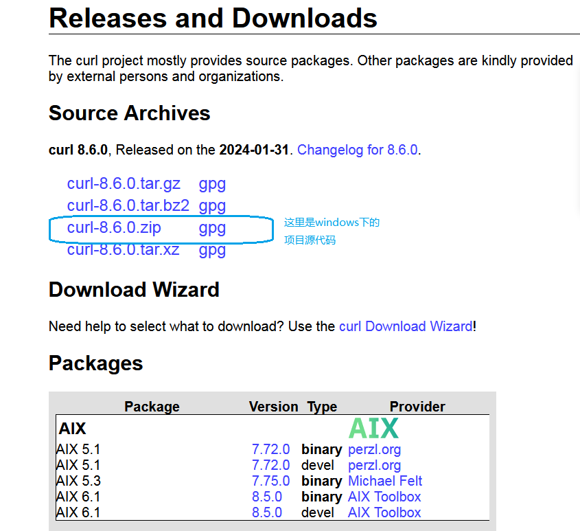
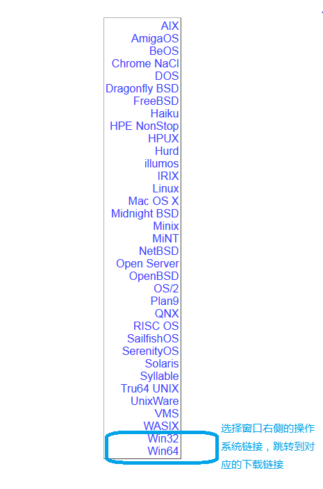
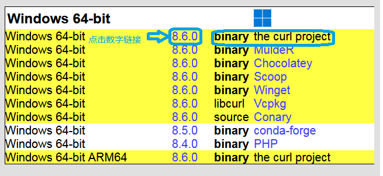

#### CURL是什么

```
Curl is a command line tool for transferring files with URL syntax, 
supporting FTP, FTPS, HTTP, HTTPS, GOPHER, TELNET, DICT, FILE and LDAP.
Curl supports HTTPS certificates, HTTP POST, HTTP PUT, FTP uploading, 
HTTP form based upload,proxies, cookies, user+password authentication ,
file transfer resume, proxy tunneling and a busload of otheruseful tricks.
```


#### 下载CURL

[CURL](https://curl.se/download.html)（client  URL）是一个开源项目，到主页可以下载到源代码项目或者二进制版本。







#### CURL学习

* 可以到官网下载[CURL](https://curl.se/docs/)

* 可以看看这个[CURL学习指南](https://www.ruanyifeng.com/blog/2019/09/curl-reference.html)

* 官网推荐的开源书籍：

  * [The book: Everything curl -html](https://everything.curl.dev/)

  * [The book: Everything curl -PDF](https://daniel.haxx.se/everything-curl/everything-curl.pdf)

