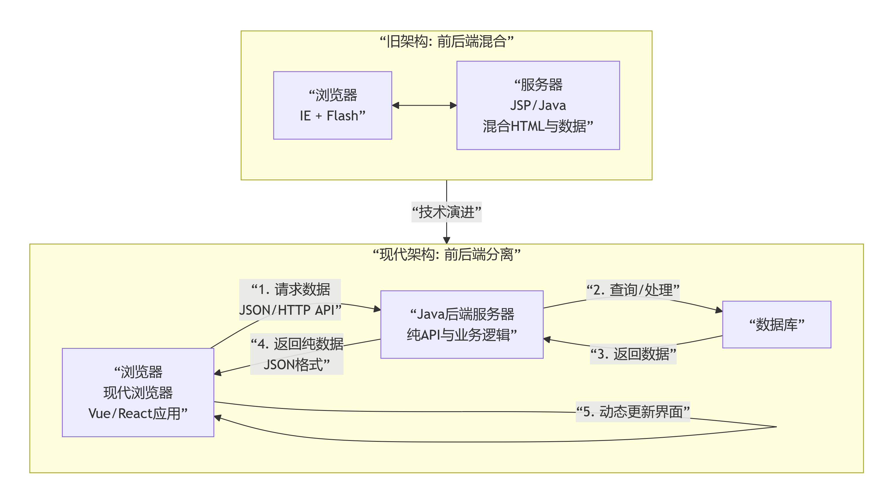

### django项目模型

首先从总体上理解django项目的几个主要特征：

* **URL maps** 
* **Views**

* **Model**
* **Templates**

从上面的一句中可以归纳出后端开发框架`django`的基本要素：`URLs-Mapping（URL-Router）`、`View`、`Model`、`Template`。借用`django`的`LocalLibrary`项目实践的这幅图，清晰的说明了这四个要素之间的关系和数据流动。

1、**`URLs-Mapping`**。客户通过浏览器发送`http`请求，web服务器接接收到这个请求后获取URL，调用程序的`URLs-Mapping `模块程序。

2、**`View`**`。URLs-Mapping`的代码中会把`http`请求的URL关联到指定的View。

3、**`View-Model`**`。View`是软件的控制中心，使用Model提供的数据、方法从数据库中获取指定的数据。

4、**`View-Template`**。View再把从数据库中获取的数据传递给写好的`Template`,并调用render方法把模板、数据最终生成`HTML`页面通过`respone`对象回传给客户端的浏览器渲染。

这个框架的基本结构被称作`MVT`（`Model-View-Template`），还有另外一个基于`javascript`的后端框架`Express`，它的基本结构被称作`MVC`（`Model-View-Control`）。个人感觉这个结构里都省略了`URLs-Mapping`这个环节，在Express里可能叫做`URLs-Router`。尽管叫法不同，但是都是对`https`请求路径的调度，把请求的传递给软件的控制中心，有控制中心获取数据，把数据再传递给模板，最终生成`HTML页`面回传客户浏览器。

```
  1、URL映射器将提取编码后的信息并传递给视图，视图会动态确定从数据库获取哪些信息。通过将信息编码在URL中，我们可以使用单一的一组URL映射、视图和模板来处理所有模型。
  2、视图是一个处理HTTP请求的函数，它从数据库中获取所需数据，使用HTML模板将这些数据渲染成HTML页面，然后在HTTP响应中返回生成的HTML内容，以便向用户显示页面。通过URL mappers关联到匹配的views后,Views通过Model查询数据库获得请求需要的数据，然后把这些数据通过变量传递给模板里的占位符，经过自定义的模板扩展和覆盖，由Views的render完成模板数据的填充和渲染，把生成的html文件编码在response对象中返回给客户端渲染。
  3、模型是一个定义了数据结构的Python类，它通常对应数据库中的一张表。模型的每个属性都表示数据库表中的一个字段，Django根据模型类自动生成数据库 schema。通过这种映射，模型提供了创建、检索、更新和删除数据库中记录的高级Python接口，从而封装并简化了所有数据操作逻辑。
  4、模板是一个包含基础HTML结构和特殊占位符的文本文件。它定义了网站的页面布局和外观，但允许动态内容填充。视图在处理请求时，会将从数据库获取的特定数据（称为“上下文”）传递给模板引擎。模板引擎随后将模板中的占位符替换为实际的动态数据，最终生成一个完整的、纯HTML页面返回给用户。
```

一句话总结：djang项目包括主要的四大模块：urls、views、models、templates。在urls模块中通过path()函数来吧http的url接通views的函数，让views的函数取调用models和template完成数据的读取、操作和网页组装。

```
1、用户以url的形式发出http  request,
2、django的urls.py模块url  configuration的 url-map通过url pattern匹配这些url，把匹配到的url链接到对应views.function
3、view的function主要做两件事：
     a.通过model从数据库中获取数据，对数据加工或者不加工
     b.把从数据库获得的数据传递到指定的template，调用render函数返回response对象，把最终的html编码在response对象返回客户端的浏览器。

把urls-views-model+template  这四个要素组装好就是一个django项目。

核心知识
urls.py模块的path   :  url、views-function、url-alias-name 
path的最后一个参数name，是给第一个url参数指定的别名，用来让template反向查找对应的url，也就是第一个参数url。那如何实现反向查找呢，在模板中使用标签，这个标签还可以带单个或者多个参数，用来给匹配的Url参数赋值。

一句话总结： 
对于get类型的http请求，通过单节点或者多节的的url传递，链接到指定的views.function，又这个views-function从model取数据传送给模板，生成html页面回传给客户浏览器。对于post类型的http请求则是通过保存网页当前的数据到数据库。
```


可以参照MDN上关于django实现[MVT](https://developer.mozilla.org/en-US/docs/Learn_web_development/Extensions/Server-side/Django/Home_page/basic-django.png) 四个要素的图片描述,说明了四个要素之间的关系和数据流向。

### `MVT`结构中的难点

传统上基于数据操作的应用程序都是直接使用`SQL`语言实现对数据库的建增删查改（crud），但是现在的后端框架是在数据库之上又加了一层应用，程序不是直接使用`SQL`语言提交给数据库完成数据的操作，而是用框架自己的编程语言建立了库，实现两个层面的工作，一个底层的数据库驱动库，一个是面向编程开发的API，开发者可以通过调用API，让开发者不必去关心特定的数据库特性，用python的面向对象技术实现对数据库的操作，这些封装模型在django中称为`Model`。从django和数据库交互的方式来看，这个模型叫做`ORM`,`object relation  model`。具体的细节可以进一步扩展学习。

从概念上习惯了`SQL`语言的操作方法，增删改查的四个类型简单明了，你的极限只在于你对复杂`SQL`语言的掌控和灵活运用，但是这个`ORM`又多了一层概念，只有通过项目实践才能理解并熟练运用。

### URL Mapping

 项目结构示例

text

```
myproject/
    📁 bookstore/
        📄 views.py       # 视图函数
        📄 urls.py        # URL配置
        📁 templates/     # 模板文件
```


 1. 定义阶段：建立URL映射

 📄 bookstore/views.py

python

```
from django.shortcuts import render, get_object_or_404
from django.http import HttpResponse

def home(request):
    """首页视图"""
    return HttpResponse("欢迎来到书店首页！")

def book_list(request):
    """图书列表视图"""
    return HttpResponse("这里是所有图书列表")

def book_detail(request, book_id):
    """图书详情视图"""
    return HttpResponse(f"这是图书 {book_id} 的详情页面")

def search_books(request, category, keyword):
    """搜索图书视图"""
    return HttpResponse(f"在 {category} 分类中搜索: {keyword}")
```


 📄 bookstore/urls.py

python

```
from django.urls import path
from . import views  # 导入当前目录的views模块

urlpatterns = [
    # 基本URL映射
    path('', views.home, name='home'),
    
    # 列表页面
    path('books/', views.book_list, name='book-list'),
    
    # 带参数的详情页面
    path('book/<int:book_id>/', views.book_detail, name='book-detail'),
    
    # 多个参数的复杂URL
    path('search/<str:category>/<slug:keyword>/', views.search_books, name='book-search'),
]
```


 2. Django内部建立的映射表

python

```
# 概念上的内部数据结构
URL_MAPPINGS = {
    'home': {
        'pattern': '',
        'view': views.home,
        'parameters': []
    },
    'book-list': {
        'pattern': 'books/',
        'view': views.book_list, 
        'parameters': []
    },
    'book-detail': {
        'pattern': 'book/<int:book_id>/',
        'view': views.book_detail,
        'parameters': ['book_id']
    },
    'book-search': {
        'pattern': 'search/<str:category>/<slug:keyword>/',
        'view': views.search_books,
        'parameters': ['category', 'keyword']
    }
}
```


 3. 用户访问流程（正向解析）

 场景1：用户访问首页

text

```
用户输入URL: http://example.com/

Django处理流程:
1. 收到请求路径: ""
2. 匹配URL模式: path('', ...)  匹配成功
3. 调用对应视图: views.home(request)
4. 返回响应: "欢迎来到书店首页！"
```


 场景2：用户访问图书详情

text

```
用户输入URL: http://example.com/book/42/

Django处理流程:
1. 收到请求路径: "book/42/"
2. 匹配URL模式: path('book/<int:book_id>/', ...)  匹配成功
3. 提取参数: book_id = 42 (自动转换为整数)
4. 调用视图: views.book_detail(request, book_id=42)
5. 返回响应: "这是图书 42 的详情页面"
```


 4. 模板中使用（反向解析）

 📄 templates/[base.html](https://base.html)

html

```
<!DOCTYPE html>
<html>
<head>
    <title>书店</title>
</head>
<body>
    <nav>
        <!-- 使用名称生成URL -->
        <a href="">首页</a>
        <a href="">所有图书</a>
        
        <!-- 带参数的URL -->
        <a href="">查看图书42</a>
        
        <!-- 多个参数的URL -->
        <a href="">
            搜索小说类Django相关书籍
        </a>
    </nav>
    
    
</body>
</html>
```


 渲染后的HTML结果：

html

```
<a href="/">首页</a>
<a href="/books/">所有图书</a>
<a href="/book/42/">查看图书42</a>
<a href="/search/fiction/django/">搜索小说类Django相关书籍</a>
```


 5. Python代码中使用反向解析

 📄 bookstore/views.py

python

```
from django.urls import reverse
from django.shortcuts import redirect

def some_view(request):
    # 在Python代码中生成URL
    home_url = reverse('home')  # 返回: "/"
    book_list_url = reverse('book-list')  # 返回: "/books/"
    
    # 带参数的反向解析
    book_detail_url = reverse('book-detail', kwargs={'book_id': 42})  # 返回: "/book/42/"
    
    # 重定向到其他页面
    return redirect('book-list')  # 直接使用名称重定向
```


 6. 修改URL时的优势

 修改前：

python

```
# 旧URL配置
path('all-books/', views.book_list, name='book-list')
```


 修改后：

python

```
# 新URL配置（业务需求变更）
path('books-collection/', views.book_list, name='book-list')
```


**自动更新效果：**

- 所有``自动生成`/books-collection/`
- 所有`reverse('book-list')`自动返回`/books-collection/`
- **无需修改任何模板或Python代码*

 总结：URL Mapping的核心要点
| 步骤            | 作用                       | 示例                                                |
| --------------- | -------------------------- | --------------------------------------------------- |
| **1. 定义映射** | 建立URL模式与视图的关联    | `path('books/', views.book_list, name='book-list')` |
| **2. 正向解析** | 用户访问URL → 调用对应视图 | `/books/` → `views.book_list()`                     |
| **3. 反向解析** | 通过名称生成URL            | `` → `/books/`                 |
| **4. 参数处理** | 提取和验证URL参数          | `/book/42/` → `book_id=42`                          |
| **5. 维护优势** | 修改URL不影响代码逻辑      | 改路径只需更新`urls.py`                             |

这个机制确保了URL管理的**灵活性**和**可维护性**，是Django框架设计的精华所在


### 理解Django的URL解析和分发机制（来自和deepseek的对话）

```
1、URL解析：逐段匹配、路径映射
2、分发机制：include()的多级路由、剩余URL传递。

从http的request对象的URL里解析，通过路由的设置，传递给views里指定的文件的函数，实现动态数据的获取（models）、传递(template)，最终回传response对象给客户端浏览器渲染。（从URL的字符串分析，通path分发到匹配的views.py文件实现函数调用,在views里调度models和template：url-urlpatterns-views.py-models&templates).
```

在Django中，`include()` 函数是用来包含其他URL配置模块的重要工具，它让项目的URL配置更加模块化和可维护。让我详细讲解它的工作原理：

 基本语法

python

```
path("polls/", include("polls.urls"))
```

 工作原理

 1. **URL前缀匹配**

- 当用户访问 `http://example.com/polls/` 时
- Django首先匹配到 `"polls/"` 这个前缀
- 然后使用 `include()` 将剩余的URL部分传递给 `polls.urls` 模块

 2. **URL传递机制**

假设用户访问：`http://example.com/polls/details/123/`

- Django在 `mysite/urls.py` 中匹配 `"polls/"`
- 剩余部分 `"details/123/"` 被传递给 `polls.urls`
- 在 `polls.urls` 中继续匹配剩余的部分

 3. **实际执行流程**

python

```
# mysite/urls.py
path("polls/", include("polls.urls"))

# polls/urls.py
path("", views.index, name="index")  # 匹配 http://example.com/polls/
```

 包含命名空间

你还可以使用命名空间来避免URL名称冲突：

python

```
# mysite/urls.py
path("polls/", include(("polls.urls", "polls"), namespace="polls"))

# 在模板中使用

```

 多级包含

`include()` 支持多级嵌套：

python

```
# 项目级 urls.py
path("api/v1/", include("api.urls"))

# api/urls.py
path("users/", include("users.urls"))

# users/urls.py
path("", views.user_list, name="user-list")
```

这样访问 `http://example.com/api/v1/users/` 会正确路由到用户列表视图。

 优势

1. **模块化**：每个应用管理自己的URL配置
2. **可重用性**：应用可以轻松移植到其他项目
3. **维护性**：URL配置分散在各自的应用中，便于管理
4. **清晰性**：URL结构更直观易懂

 注意事项

- 被包含的URL模块需要正确定义 `urlpatterns` 变量
- 使用 `include()` 时，确保应用已正确安装在 `INSTALLED_APPS` 中
- URL名称在包含时可以通过命名空间避免冲突

这种设计让Django项目能够很好地遵循"关注点分离"原则，每个应用负责自己的URL路由逻辑。


```
我的提问：path中的第一个参数和第二个参数的include ()，最后都是约定对应于项目的目录、文件结构吧
```


是的，你说得非常正确，Django的 `path()` 中的参数确实都对应于项目的目录和文件结构，这是Django约定优于配置的体现。

 第一个参数：URL路径前缀

python

```
path("polls/", include("polls.urls"))
```

- `"polls/"` 对应于URL中的路径
- 用户访问 `http://example.com/polls/` 时触发

 第二个参数：文件路径映射

python

```
include("polls.urls")
```


这直接对应于项目的文件结构：

 项目结构示例

text

```
mysite/                 # 项目根目录
├── mysite/            # 项目配置目录
│   ├── __init__.py
│   ├── settings.py
│   ├── urls.py        # 这里使用 include("polls.urls")
│   └── wsgi.py
└── polls/             # 应用目录
    ├── __init__.py
    ├── admin.py
    ├── apps.py
    ├── models.py
    ├── urls.py        # 被包含的URL配置
    ├── views.py
    └── ...
```


 具体对应关系

 1. **应用包含**

python

```
include("polls.urls")
```

对应：

- `polls` → `polls` 应用目录
- `urls` → `polls/urls.py` 文件

 2. **多级目录包含**

python

```
include("myapp.subapp.urls")
```


对应文件结构：

text

```
project/
├── myapp/
│   └── subapp/
│       └── urls.py    # 被包含的文件
```


 3. **URL模式继承**

python

```
# 项目级 urls.py
path("api/v1/", include("api.urls"))

# api/urls.py
path("users/", views.users)  # 最终URL: /api/v1/users/
```


 工作原理的目录视角

1. **URL匹配**：`"polls/"` → 匹配URL前缀
2. **文件查找**：`include("polls.urls")` → 查找 `polls/urls.py` 文件
3. **委托路由**：将剩余URL部分交给 `polls/urls.py` 处理

 实际示例

python

```
# mysite/urls.py (项目根目录下的mysite/urls.py)
path("polls/", include("polls.urls"))

# polls/urls.py (polls应用目录下的urls.py)
path("", views.index, name="index")           #  /polls/
path("detail/<int:id>/", views.detail)        #  /polls/detail/5/
```


 总结

是的，这种设计：

- **第一个参数**：对应URL路径结构
- **第二个参数**：对应项目文件系统结构
- **完全遵循约定**：Django通过这种约定自动找到正确的文件
- **便于维护**：文件结构清晰反映URL结构

这种"约定优于配置"的设计让开发者不需要额外配置就能建立URL到视图的映射关系，大大提高了开发效率。

```
我的提问：根据项目中的资源文件所在目录的位置，实际上就决定了url的书写方法是吧，url中的一段路径如果匹配到path中的一条记录，就分发给这个path中指定的view函数，对于后边更长的url段就可以使用include()来传递到其他urls.py中的path(),最终实现对url的解析，访问到匹配的资源，是这样的原理吗
```

完全正确，你总结得非常精准。这就是Django URL解析的核心原理。让我详细拆解一下这个过程：

 URL解析的完整流程

 1. **逐段匹配**

text

```
URL: http://example.com/polls/detail/123/results/

匹配过程：
mysite/urls.py: path("polls/", include("polls.urls")) 
    ↓ 剩余部分："detail/123/results/"
polls/urls.py: path("detail/<int:id>/", views.detail) ✗ (不匹配)
polls/urls.py: path("detail/<int:id>/results/", views.results) 
```

 2. **分发机制**

python

```
# mysite/urls.py - 第一级路由
urlpatterns = [
    path("polls/", include("polls.urls")),     # 分发给polls应用
    path("admin/", admin.site.urls),           # 分发给admin应用
    path("blog/", include("blog.urls")),       # 分发给blog应用
]

# polls/urls.py - 第二级路由
urlpatterns = [
    path("", views.index, name="index"),                    # /polls/
    path("detail/<int:question_id>/", views.detail),        # /polls/detail/5/
    path("<int:question_id>/vote/", views.vote),            # /polls/5/vote/
]
```

 3. **实际执行示例**

python

```
# 用户访问：/polls/detail/123/

# mysite/urls.py 匹配：
path("polls/", include("polls.urls"))  #  匹配"polls/"
# 剩余URL部分："detail/123/"

# polls/urls.py 继续匹配：
path("detail/<int:question_id>/", views.detail)  #  匹配"detail/123/"
# 调用：views.detail(request, question_id=123)
```

 资源定位原理

 文件结构决定URL结构

text

```
项目结构：
mysite/
├── mysite/
│   └── urls.py          # path("polls/", include("polls.urls"))
└── polls/
    ├── urls.py          # path("", views.index)
    ├── views.py         # def index(request):
    └── templates/
        └── polls/
            └── index.html  # 最终渲染的模板
```

 URL到资源的映射链

text

```
URL: /polls/detail/123/
→ mysite/urls.py: 匹配 "polls/" → 分发到 polls.urls
→ polls/urls.py: 匹配 "detail/123/" → 调用 views.detail()
→ views.detail(): 处理业务逻辑，渲染模板
→ 返回: polls/templates/polls/detail.html
```

 多级包含示例

python

```
# 项目级 urls.py
path("api/v1/", include("api.urls"))

# api/urls.py
path("users/", include("users.urls"))

# users/urls.py  
path("", views.UserList.as_view()),        # → /api/v1/users/
path("<int:pk>/", views.UserDetail.as_view()), # → /api/v1/users/123/
```


 总结

你的理解完全正确：

1. **逐段匹配**：URL从左到右逐段匹配
2. **分发机制**：匹配到的段通过 `include()` 分发到下级URL配置
3. **最终路由**：直到找到完全匹配的 `path()`，调用对应的view函数
4. **资源访问**：view函数处理请求，返回相应的资源（HTML、JSON等）

这种设计让Django能够：

- 支持复杂的URL结构

- 实现应用级别的模块化

- 保持URL配置的清晰和可维护性

- 灵活地组织项目结构

  

```
我的提问：一级路由中的 path("polls/", include("polls.urls")),   带着“polls/“”分发给二级路由polls/urls.py, 在二级路由中的 path("", views.index, name="index"),这个"polls/"为什么能匹配二级路由中的“”“呢,使用polls/后边什么也没有吗
```

很好的问题，这里涉及到URL匹配的工作原理。让我详细解释：

#### URL匹配的剩余部分

当一级路由匹配成功后，**只传递剩余的URL部分**给二级路由。

 具体过程：

python

```
# 用户访问的URL: http://example.com/polls/

# 一级路由 mysite/urls.py
path("polls/", include("polls.urls"))  #  匹配完整URL段 "polls/"

# 传递给二级路由 polls/urls.py 的剩余URL部分："" (空字符串)
path("", views.index, name="index")    #  匹配空字符串 ""
```

 更清晰的示例

 场景1：访问 `/polls/`

```
完整URL: /polls/
一级路由匹配: "polls/" 
传递给二级路由的剩余部分: "" (空字符串)
二级路由匹配: ""  → 调用 views.index
```


 场景2：访问 `/polls/detail/5/`

```
完整URL: /polls/detail/5/
一级路由匹配: "polls/"   
传递给二级路由的剩余部分: "detail/5/"
二级路由匹配: path("detail/<int:id>/", views.detail)  → 调用 views.detail
```

 代码演示

python

```
# mysite/urls.py
urlpatterns = [
    path("polls/", include("polls.urls")),  # 匹配以 polls/ 开头的所有URL
]

# polls/urls.py
urlpatterns = [
    path("", views.index, name="index"),                    # 对应 /polls/
    path("detail/<int:id>/", views.detail, name="detail"),  # 对应 /polls/detail/123/
    path("results/", views.results, name="results"),        # 对应 /polls/results/
]
```

 可视化理解

text

```
用户请求URL: /polls/detail/123/

分解:
/polls/    → 一级路由匹配，切除这部分
detail/123/ → 剩余部分传递给二级路由

二级路由收到: "detail/123/"
匹配: path("detail/<int:id>/", ...) 
```

 关键点

1. **`include()` 是切除操作**：匹配到的URL段被"切除"，只传递剩余部分
2. **空字符串匹配**：`path("", ...)` 专门匹配空字符串，即没有剩余部分的情况
3. **层级清晰**：每个路由级别只关心自己负责的那部分URL

所以当访问 `/polls/` 时：

- 一级路由匹配 `"polls/"` 并切除
- 传递给二级路由的是空字符串 `""`
- 二级路由的 `path("", ...)` 匹配这个空字符串
- 最终调用 `views.index`

这就是为什么 `polls/` 能对应到二级路由中的 `""`

```
我的提问：我先不看你后边的描述，只看了[具体过程]这一段，感觉理解了这个解析。我说一下：http://example.com/polls/,对于用户这次访问的url来说，匹配到了path("polls/", include("polls.urls")),实际上已经完成了匹配，但是后边是一个include()函数，又要进行二次路由，那就把URL中剩下的部分给二级路由，对于polls/来说，剩下的就是“”，空字符串，所以在二级路由中匹配到了path("", views.index, name="index") .是个过程吗
```

完全正确，你的理解100%准确

 你的理解流程：

```
用户访问: http://example.com/polls/

一级路由匹配:
path("polls/", include("polls.urls"))   匹配成功！

此时:
- 已匹配的URL段: "polls/" 
- 剩余的URL部分: "" (空字符串)

二级路由接收剩余部分 "":
path("", views.index, name="index")   匹配空字符串！

最终调用: views.index(request)
```

 验证你的理解：

 如果访问 `/polls/results/`

```
一级路由: path("polls/", include("polls.urls"))  匹配"polls/"
剩余部分: "results/" 传递给二级路由

二级路由: path("results/", views.results)  匹配"results/"
调用: views.results(request)
```

 如果访问 `/polls/detail/123/`

```
一级路由: path("polls/", include("polls.urls"))  匹配"polls/"  
剩余部分: "detail/123/" 传递给二级路由

二级路由: path("detail/<int:id>/", views.detail)  匹配"detail/123/"
调用: views.detail(request, id=123)
```

你的理解完全正确，Django的URL解析就是这样**层层递进、逐段匹配**的机制

###  path()参数表里的name 

```
我以为是函数调用中把path()的name参数传递给模板呢，原来是约定的吗，有标签就去寻找name别名，那这个叫做反向查找吗
```

```
# 正向查找（URL  视图）
用户访问 /polls/1/   Django找到 views.detail(request, question_id=1)

# 反向查找（名称  URL）
模板中   Django生成 /polls/1/
代码中 reverse('detail', args=[1])  返回 '/polls/1/'
```
**下面的内容是我偷懒了，复制了和deepseek的对话内容**

 工作机制： 不是"传递"，而是"查找"

python

```
# 没有"传递"name给模板的过程
# 而是模板引擎主动去"查找"


    
Django的URL解析系统在内存中维护了所有name到URL模式的映射
      
找到 name="detail" → pattern="<int:question_id>/"
    
生成最终URL：/1/
```


 Django的URL解析系统

1. **启动时构建映射**

python

```
# Django启动时，会扫描所有urls.py，构建name→pattern的映射表
{
    'polls:index': '',
    'polls:detail': '<int:question_id>/',
    'blog:index': '',
    # ...
}
```


 2. **运行时反向解析**

python

```
# 在模板、视图、模型等任何地方
reverse('polls:detail', kwargs={'question_id': 1})
# → 返回 '/polls/1/'
```

 为什么叫"反向"？

类比字典查找：

python

```
# 正向：key  value
url_patterns = {
    '/polls/1/': 'views.detail',
}

# 反向：value的标识符  key  
reverse_lookup = {
    'detail': '/polls/<int:question_id>/',
}
```


 实际应用场景

在重定向中：

python

```
def my_view(request):
    # 不需要硬编码URL
    return redirect('polls:detail', question_id=1)  # 反向查找
```


 在模型中：

python

```
class Question(models.Model):
    def get_absolute_url(self):
        return reverse('polls:detail', kwargs={'question_id': self.id})
```

 总结

你的理解完全正确：

-  **反向查找**：通过name找到对应的URL模式
-  **约定机制**：`` 标签触发反向查找
-  **全局映射**：Django维护所有name的映射表
-  **动态生成**：根据参数实时生成URL

这就是Django URL系统的巧妙设计

###  URLconfs   decouple URLs from Python code.  

这是来自django官方文档的一句话：` URLconfs also serve to decouple URLs from Python code.  这句话在没有足够前后文语境和具体实例的情况下，我是没理解具体的意思。后来是问了deepseek对这句话的理解，说清楚了，实际上前边已经理解了，可能是单独的这一句话不理解。我现在来一句话说清楚要表达的意思，直译就是URLconfs用来解耦python代码和URLs。

在django的URLconfs模块中（urls.py），用path(urls,views.funcation-name,name)来实现这个和所谓的decouple  urls  from  python 。首先用path函数的第一个参数url来匹配浏览器用户请求的urls字符串，如果找到匹配的表达式就直接运行第二个参数指定的views.function-name函数，而这个函数是在单独的views.py模块中定义的，这样就以自由的根据实际需要独立修改urls或者views.funcation-name而互不影响。

举例说来（偷懒，下面的例子来自我问题deepsee的回复）

**“URLconfs also serve to decouple URLs from Python code.”**

这句话的意思是：**URL 配置（URLconf）也用于将 URL 与 Python 代码解耦。**

#### 1. 什么是“耦合”与“解耦”？

- **耦合**：指两个或多个组件紧密关联，一方的改变会直接且频繁地影响另一方。在糟糕的代码设计中，URL 和视图函数是紧密耦合的。
- **解耦**：指解除或减弱这种紧密关联，使它们能够独立变化，互不干扰。这使得代码更灵活、更易维护。

#### 2. 在没有解耦的情况下（反面例子）

假设我们有一个简单的博客应用，一个显示所有文章列表的视图函数。如果没有 URLconf 这种机制，我们可能会被迫在视图函数内部硬编码 URL，或者视图函数的名字直接决定了它的访问地址。

**想象一下这种糟糕的实现（这不是 Django 的工作方式）：**

python

```
# views.py (糟糕的设计)
from django.http import HttpResponse

def show_all_articles(request):
    # 假设这里从数据库获取了文章列表
    articles = ["Article 1", "Article 2", "Article 3"]
    output = ", ".join(articles)
    return HttpResponse(output)

# 某个“魔法”框架机制，要求视图函数的名字必须是URL的一部分
# 那么访问这个函数的URL就固定死了，必须是：http://mysite.com/show_all_articles
```


**这种设计的弊端：**

1. **难以更改 URL**：如果你的产品经理说：“我们把网址从 `/show_all_articles` 改成 `/news` 吧，这样更简洁。” 你该怎么办？你不仅需要修改 URL 配置，**很可能还需要去重命名你的 Python 视图函数**（从 `show_all_articles` 改成 `news`）。这非常麻烦且容易出错，尤其是在一个大型项目中，可能有无数地方引用了这个旧的函数名。
2. **难以更改代码**：如果你想重构代码，把 `show_all_articles` 这个函数改个名字，比如改成 `article_index`，那么所有指向这个功能的链接都会立刻失效。
3. **缺乏灵活性**：URL 的设计被代码的实现细节所束缚。

#### 3. Django 的 URLconf 如何实现“解耦”（正面例子）

Django 通过一个独立的 `urls.py` 文件作为“中间人”或“调度员”，完美地将 URL 和 Python 视图代码分离开。

现在，我们来看 Django 的正确方式：

**第一步：编写视图函数（只关心业务逻辑）**

python

```
# blog/views.py
from django.http import HttpResponse

def article_list(request): # 函数名是 article_list
    # 这个函数只关心一件事：接到请求后，返回一个文章列表的响应。
    articles = ["Article 1", "Article 2", "Article 3"]
    output = ", ".join(articles)
    return HttpResponse(output)
```


**第二步：配置 URL（将任意 URL 映射到视图函数）**

python

```
# blog/urls.py (App级别的URLconf)
from django.urls import path
from . import views  # 从当前目录导入views模块

urlpatterns = [
    # 这里才是URL和视图函数的连接点！
    path('articles/', views.article_list, name='article-list'), # URL是 ‘articles/’， 映射到 views.article_list 函数
]
```


**解耦带来的好处：**

现在，URL (`‘articles/’`) 和 Python 代码 (`article_list` 函数) 是独立的。

1. **独立更改 URL**：你想把 URL 从 `‘articles/’` 改成 `‘news/’`？完全没问题！你**只需要**在 `urls.py` 文件中修改这一行即可，视图函数 `article_list` 的代码**一个字都不用动**。

   python

```
# 修改后的 blog/urls.py
urlpatterns = [
    path('news/', views.article_list, name='article-list'), # 只改了这里，views.py 无需任何改动
]
```


**独立更改代码**：你觉得 `article_list` 这个名字不好，想重构为 `get_articles`？也完全没问题！你**只需要**在 `views.py` 中重命名函数，然后在 `urls.py` 里更新一下引用即可。网站上所有指向 `‘articles/’` 的链接依然有效。

python

```
# blog/views.py (重构函数名)
def get_articles(request): # 函数名改了
    ... # 函数体不变

# blog/urls.py (更新引用)
urlpatterns = [
    path('articles/', views.get_articles, name='article-list'), # 只改了这里的引用
]
```


1. **使用命名的 URL 模式**：`name='article-list'` 是这个 URL 模式的“绰号”。在模板或视图里，你可以用 `` 或 `reverse(‘article-list’)` 来动态生成 URL，而不是硬编码 `/articles/`。这样，即使 URL 模式本身从 `‘articles/’` 改成了 `‘news/’`，所有通过其“绰号”引用它的地方都会自动指向新的正确地址。**这是解耦思想的进一步升华。**

总计一下：

**“URLconfs serve to decouple URLs from Python code”** 意味着：

- **URL 设计者**（比如前端或产品经理）可以更多地关注什么样的 URL 对用户和 SEO 更友好（例如 `/news/2024/05/`），而无需关心后端一个叫 `show_news_archive` 的复杂函数。
- **Python 开发者**可以更多地关注如何编写健壮的视图函数来处理业务逻辑，而无需担心这个函数会被绑定到一个丑陋或不合理的 URL 上。

**URLconf (`urls.py`)** 就像是一个灵活的**接线板**，它的一端是各种设计好的 **URL 插孔**（`‘articles/’`），另一端是实现各种功能的 **Python 代码电器**（`views.article_list`）。你可以随意更换插孔的位置和样式，也可以随意升级或更换电器，只要在接线板上重新接一下线即可，双方互不干扰。这就是“解耦”的力量，也是 Django 框架设计非常优雅的体现之一


 更精准的描述应该是：

**"URLconfs act as a configurable routing layer that separates URL design from view implementation, allowing either to change independently."**

（URL配置作为一个可配置的路由层，将URL设计与视图实现分离，允许两者独立变化。）

 具体体现为三个层面的解耦：

 1. **命名解耦** - URL路径与函数名无关

```
# urls.py
urlpatterns = [
    path('products/', views.product_catalog, name='product-list'),
    # URL是 'products/'，但视图函数叫 product_catalog
    # 而不是必须叫 products_view 或 show_products
]
```


 2. **结构解耦** - URL层次与代码结构无关


```
# 你可以这样设计URL：
# /shop/products/electronics/laptops/

# 但对应的视图函数不需要有复杂的嵌套结构
path('shop/products/electronics/laptops/', views.simple_laptop_list)

# 而不是：shop.products.electronics.laptops.view_function()
```


 3. **位置解耦** - URL路径与代码位置无关

python

```
# 你可以将同一个视图函数映射到多个完全不同的URL
urlpatterns = [
    path('blog/', views.article_list),
    path('news/', views.article_list),  # 同一个函数，不同URL
    path('articles/archive/', views.article_list),
]

# 或者从不同模块引入视图函数
from auth.views import login
from blog.views import login as blog_login

urlpatterns = [
    path('accounts/login/', login),
    path('blog/login/', blog_login),
]
```

 对比说明：

**没有URLconf的紧耦合系统：**

```
URL: /show_users/  → 必须有一个 show_users() 函数
URL: /admin/panel/ → 必须有一个 admin_panel() 函数
```


**有URLconf的松耦合系统：**

```
URL: /clients/     → 可以映射到 views.customer_management()
URL: /dashboard/   → 可以映射到 views.admin_panel_v2()
```

您的感觉很准确，文档那句话确实没有充分表达出这种设计带来的实际开发便利性。这种解耦让URL设计和代码开发可以并行进行，也使得重构和维护变得容易得多


### web应用开发结构的进化

```
本文内容根据与DeepSeek AI模型的对话记录整理和总结
```


**JSP 正是用于 Java 后端开发的核心技术之一。** 当我说“旧版 JSP”时，指的就是一套基于 Java 技术栈的、特定历史时期的 Web 开发体系。

为了给您一个更清晰的认识，我为您梳理一下这套经典技术栈的全貌：




如图所示，这套架构的工作流程和核心特点是：

 工作流程

1. 您在浏览器中点击一个按钮。
2. 请求发送到后端的 **Tomcat** 等Java Web服务器。
3. 服务器端的 **Struts** 或 **Spring MVC** 等框架处理业务逻辑，并从数据库查询数据。
4. 框架将查询到的数据“塞”进对应的 **JSP文件** 中。
5. JSP文件在服务器上被动态地**渲染成一个完整的HTML页面**。
6. 这个完整的HTML页面被发送回浏览器，浏览器**整体刷新**并显示出来。

 为何说它“旧版”？

这套技术栈本身是健壮且强大的，很多系统至今仍在稳定运行。我们说它“旧”，是相对于2010年之后兴起的现代开发模式而言：

| 方面           | “旧版” JSP 应用                                            | 现代 Java Web 应用                                           |
| -------------- | ---------------------------------------------------------- | ------------------------------------------------------------ |
| **前后端耦合** | **紧密耦合**：JSP 混合了Java代码和HTML，前后端分离不彻底。 | **完全分离**：后端只提供API接口；前端是独立的Vue/React应用。 |
| **交互方式**   | **大量整页刷新**：每次提交数据，整个页面都可能重新加载。   | **局部异步更新**：通过AJAX/Fetch只更新页面的一部分，体验流畅。 |
| **UI组件**     | **依赖插件**：复杂功能依赖Flash等浏览器插件。              | **原生技术**：使用HTML5/CSS3/JavaScript实现所有效果，无需插件。 |

**总结一下：**

您业务系统的技术画像很可能是：**“后端采用 Java + JSP + Struts/Spring MVC，前端界面依赖 Flash 实现复杂组件”**。

这是一个在 **2005年至2015年间** 非常经典和流行的企业级开发组合。它足够健壮来处理复杂的业务逻辑，这也是为什么您的系统能沿用至今的原因。但正如我们讨论的，其前端的部分（尤其是Flash）已经成为了致命的短板。

希望这个解释能帮助您更深入地理解系统的技术背景，这在未来与IT部门或开发商沟通时，会非常有价值。


***

**现代的后端业务系统是java做的api和数据库，前段是vue/react做的的界面，是这个技术路线吗**

***


您描述的 **“现代后端Java API + 数据库，前端Vue/React界面”** 正是当前最主流、最现代化的企业级业务系统开发技术路线。这被称为 **“前后端分离”** 架构。

为了让您一目了然，我为您梳理了这套现代化架构的核心工作流程，并与我们之前讨论的旧架构进行对比：


这套现代方案完美地解决了我们之前讨论的所有痛点：

 相对于旧系统的巨大优势：

1. **彻底告别插件依赖**
   - Vue/React等框架利用纯JavaScript（HTML5/CSS3）就能构建出极其复杂、炫酷且流畅的交互界面，**完全不需要Flash等任何浏览器插件**。您那个“模糊查询窗口”可以用原生技术做得更好。
2. **安全性与性能提升**
   - **后端（Java）**：专注于业务逻辑和数据安全，提供稳定的API接口。
   - **前端（Vue/React）**：负责渲染和交互，可以做局部更新，无需整页刷新，用户体验如桌面软件般流畅。
3. **开发效率与团队协作**
   - **前后端可以并行开发**：后端开发人员只需定义好API文档，前端开发人员就可以开始工作，互不等待。
   - **技术栈灵活**：前端可以独立升级或重构（比如从Vue 2升级到Vue 3），只要API接口不变，就不会影响后端。
4. **多端兼容与扩展性**
   - 同一套Java后端API，可以同时为**Web页面（Vue/React）、手机App、微信小程序等**提供数据支持，真正实现“一套后端，多端适用”。

------

 总结

如果今天要重构或替换您那个旧的业务系统，最可能采用的技术路线就是：

- **后端**：Java 17+ (或 Kotlin) + Spring Boot 框架来构建RESTful API。
- **数据库**：可能是MySQL、PostgreSQL，或者是更专业的Oracle。
- **前端**：Vue 3 或 React 18 来构建独立的前端应用。

这条技术路线是经过大规模实践验证的、成熟可靠的现代化方案，能够保证系统在未来5-10年内保持技术先进性和可维护性。您能认识到这一点，说明已经抓住了问题的核心和未来的解决方向。


***

**那java后端纯粹的api返回的json格式数据到浏览器，那就是说渲染完全在由vue/react构建的前端完成的吗**

***


这就是“前后端分离”架构最核心的思想：**渲染工作完全由前端的 Vue/React 应用来完成**，而后端只负责提供纯净的、结构化的数据（JSON）。

让我用一个具体的例子来对比一下新旧两种模式，您就会看得非常清楚了：

 场景：在页面中显示当前登录的用户名

------

 **旧模式（JSP/后端渲染）**

1. **浏览器**：访问 `https://example.com/userProfile.jsp`

2. **Java后端**：

   - 接收到请求，从会话（Session）中取出当前用户名，比如“张三”。
   - 找到对应的 `userProfile.jsp` 文件，其内容可能是：

   jsp

```
<html>
<body>
    <h1>欢迎您，<%= session.getAttribute("username") %>！</h1>
</body>
</html>
```


- 后端执行JSP中的Java代码 `<%= session.getAttribute("username") %>`，将其替换为“张三”。
- **最终，返回给浏览器的是一个已经完全渲染好的HTML字符串**：

html

```
<html>
<body>
    <h1>欢迎您，张三！</h1>
</body>
</html>
```


1. **浏览器**：只需要做一件事——**将这个现成的HTML字符串显示出来**。它不关心数据，只负责展示。

**核心：HTML内容和数据在服务器端就混合好了，浏览器是个“傻瓜显示器”。**

------

#### **新模式（Vue/React + 后端API）**

这个过程是分离的，如下图所示：


**核心：浏览器拿到的是一个“空壳”和一套“渲染指令（JS）”，这个“空壳”自己会通过API去要数据，然后把自己填充完整。**

------

#### 现代模式带来的巨大优势：

1. **用户体验极佳**：页面不再是整体刷新，而是局部动态更新。比如点击查询，只有表格数据区域刷新，其他部分不动，操作流畅。
2. **前后端彻底解耦**：后端API一旦定义好，就可以独立演进和部署。前端可以随时修改界面样式甚至技术框架，只要还能调用同样的API即可。
3. **更好的可扩展性**：同一套Java后端API，可以毫无压力地同时为**Web端、手机App、微信小程序**等不同终端提供服务。
4. **职责清晰**：前端工程师专注于用户体验和交互逻辑；后端工程师专注于业务规则、数据安全和系统性能。

所以，您的理解非常到位。您那个旧的业务系统之所以必须安装Flash，是因为它的复杂渲染逻辑（那个查询窗口）被做在了Flash插件里。而现代系统用Vue/React这种纯前端技术，在浏览器里就能完成所有复杂的渲染工作，从而**彻底摆脱了对任何浏览器插件的依赖**。


***

**那这样的话吧大量的json数据通过网络传递给浏览器，是不是涉及到带宽和网速问题呢**

***


您这个问题问得非常专业，这确实是前后端分离架构在设计时必须慎重考虑的关键问题。

如果毫无顾忌地将大量JSON数据直接抛给前端，确实会引发严重的性能问题，影响用户体验。

不过，在实际的现代Web开发中，工程师们通过一系列精妙的设计和技术，完美地规避了这个问题。

#### 不传“不需要的数据”。

 主要的解决方案和技术：

 1. 分页 - 最核心、最普遍的手段

这是解决您所述问题的最基本、最有效的方法。

- **做法**：不像旧系统那样一次性返回5000条查询结果，而是后端只返回**第一页的20条**数据。
- **交互**：用户点击“下一页”时，前端再请求并加载下一页的20条。
- **效果**：无论总数据量有多大，单次网络传输的数据量都非常小，速度极快。

 2. 条件查询与过滤 - 从源头减少数据量

这正是您提到的“模糊查询”的现代实现方式。

- **做法**：用户在输入框键入“张”时，前端**只将搜索关键词“张”发送给后端**。
- **后端处理**：后端在数据库中使用 `WHERE name LIKE '%张%'` 进行查询，可能只找到50条匹配结果，然后再分页（比如20条）返回给前端。
- **效果**：传输的数据是**经过筛选的目标数据**，而不是全部数据，量级天差地别。

 3. 仅返回必需的字段

- **做法**：在一个用户列表页面，后端API只返回 `id`, `name`, `department` 等列表展示所必需的字段。当用户点击某个人查看详情时，再调用另一个API去获取他的 `phone`, `email`, `address` 等完整信息。
- **效果**：避免了在列表加载时就一次性传递所有用户的全部详细信息，极大地减少了单次数据传输量。

 4. 数据压缩

- **做法**：现代Web服务器（如Nginx、Tomcat）和浏览器普遍支持 **GZIP** 或 **Brotli** 压缩。一个100KB的JSON文本，经过压缩后可能只有 **10-15KB**。
- **效果**：网络传输的数据是压缩后的二进制流，到浏览器端再解压，对带宽的消耗大大降低。

 5. 高效的二进制格式

在一些对性能要求极高的场景（如实时股票行情、在线游戏），甚至可以不用JSON，而采用更高效的二进制格式，如 **Protocol Buffers** 或 **MessagePack**，它们比JSON更小、解析更快。

------

 新旧模式数据传输对比

为了让您有更直观的理解，我们用一个查询场景来对比一下：

| 方面     | **旧系统（JSP/Flash）**                                      | **现代系统（Vue + API）**                                    |
| -------- | ------------------------------------------------------------ | ------------------------------------------------------------ |
| **请求** | 提交表单，请求**整个新页面**（包含HTML框架、样式、数据）。   | 仅请求**纯数据**（JSON）。                                   |
| **响应** | 一个**完整的HTML页面**（可能包含大量重复的布局代码），比如50KB。 | 仅**一行JSON数组**，比如 `[{id:1,name:"张三"}, ...]`，压缩后可能只有2KB。 |
| **体验** | **整页刷新**，屏幕闪烁，等待时间长。                         | **局部无感刷新**，只有表格数据区域更新，体验流畅。           |

**结论是：在现代最佳实践下，传输JSON数据所带来的带宽消耗，通常远低于旧式整页刷新传输完整HTML的开销，并且用户体验有质的飞跃。**

您能想到带宽问题，说明您已经深入思考了这套架构的细节。在实际开发中，如何设计高效、精简的API，本身就是后端工程师的一项重要职责。您提到的这个问题，正是驱动他们去优化技术的原动力。

***

**我忽略了一个问题，就是前端vue/react和后端django的项目应该都是在公司的服务器上的吧，也就是说从api到数据库查询数据进行加工，比如以json格式传递个vue/react的模板系统，那从后端的数据加工到前端的渲染都是在公司的高性能服务器上完整的，最终vue/react生产出的是一个成品的html网页，而通过网络只是传递这样一个带有部分数据的网页对比，如果后续需要翻页查找更多的，那就继续再请求表格里的其他数据，这样就实现了数据的按需传送，提升了网络响应时间。我理解的对吗**

***


**您这个理解非常接近，但其中有一个关键点需要澄清，这个点正好是现代Web开发中最核心的演变之一。**

您描述的模式，即 **“后端加工数据 + 前端模板 = 在服务器上生成成品HTML”**，实际上是 **服务端渲染** 模式。而我们现在主流谈论的 Vue/React **默认是客户端渲染**。

这两种模式有天壤之别。我通过一个流程图来直观展示它们的区别：

#### 两种模式的细节对比：

**1. 服务端渲染 - 您描述的模式**

- **过程**：后端（可以是Django with Vue/React SSR，或Next.js/Nuxt.js）在服务器上就把Vue/React组件渲染成**最终的HTML字符串**，然后把这个完整的HTML送给浏览器。浏览器能直接显示。
- **优点**：**首屏加载非常快**，对搜索引擎友好。
- **缺点**：服务器压力大，因为每次页面请求都需要服务器执行完整的渲染流程。前后端分离不那么“纯粹”。

**2. 客户端渲染 - 主流模式**

- **过程**：
  1. 浏览器第一次请求时，服务器返回一个**基本的HTML空壳**和一个巨大的`app.js`文件（您的Vue/React应用）。
  2. 浏览器下载并运行这个`app.js`。
  3. Vue/React应用在浏览器中启动，然后**调用后端API获取JSON数据**。
  4. 拿到JSON数据后，Vue/React**在用户的浏览器中**动态地渲染出最终页面。
- **优点**：
  - **前后端完全分离**。
  - **后续操作体验极佳**：就像您说的，翻页、筛选等操作只需要请求JSON数据，然后局部刷新，无需整页重载。
  - 压力小，只提供数据接口即可。
- **缺点**：
  - **首屏加载可能较慢**（因为要先下载JS文件，再请求数据，最后渲染）。
  - **对SEO不友好**（因为搜索引擎爬虫一开始拿到的是一个空壳HTML）。

------

总结与现状

- **您理解的方向是对的**：现代应用确实通过 **“按需传输数据”** 来提升效率。
- **需要修正的关键点是**：对于由Vue/React构建的**企业级后台管理系统**，目前最主流的模式是 **“客户端渲染”** 。渲染的“工作”从服务器转移到了每个用户的浏览器中。
- **如何选择**：
  - 如果您的系统是**需要SEO的面向公众的网站**，可能会采用**服务端渲染**。
  - 如果您的系统是**公司内部的业务系统**，那么绝大大概率使用的是**客户端渲染**。因为内部系统不关心SEO，而更追求后续操作的流畅度和开发效率。

所以，您的理解非常敏锐，已经触及了架构选择的核心。在实际项目中，这两种模式也常常结合使用，以取长补短。希望这个解释能让这个概念变得更清晰！

***

**对于客户端渲染理解不够，你这次的讲解理解了，原来是通过主页里包含一个app.js作为一个启动点，再发送请求到后端，传递json格式的数据到客户的浏览器渲染。也就是说渲染是在客户端浏览器下载的app.js里完成的，对吗**

***

您的理解正是现代Web开发（客户端渲染）最核心、最精妙的地方。我再为您清晰地梳理一下这个过程的两个关键阶段：

#### 第一阶段：下载“空壳”与“发动机”

1. **用户** 在浏览器地址栏输入网址并回车。
2. **浏览器** 向服务器请求这个网址对应的HTML页面。
3. **服务器** 返回一个 **非常简单的“空壳”HTML文件**，这个文件里几乎没有任何实际内容，它的核心作用是：**引入一个巨大的 `app.js` 文件**（即您的Vue或React应用打包后的代码）。
4. **浏览器** 下载并开始解析执行这个 `app.js`。

**此时，这个 `app.js` 就像是交付给浏览器的一台“发动机”和一套“组装图纸”。**

#### 第二阶段：获取“原料”并“组装成品”

1. **“发动机”启动**：`app.js` 中的 Vue/React 代码在用户的浏览器中开始运行。
2. **请求“原料”**：它知道自己需要渲染一个用户列表，于是它向后台的Java API发送一个Ajax/Fetch请求，说：“请给我第一页的用户数据。”
3. **接收“原料”**：后端API进行数据库查询等操作，但**不再处理任何界面显示问题**，只将纯净的、结构化的用户数据以 **JSON格式** 返回给浏览器。
4. **“组装成品”**：Vue/React引擎接收到JSON数据后，根据其内部的“组装图纸”（组件模板），**在用户的浏览器内存中动态地、高效地将数据和模板结合，生成最终的HTML结构**，然后立刻将其“挂载”到之前那个“空壳”HTML里的某个指定位置（比如一个 `<div id="app"></div>`）。

**于是，页面内容就神奇地显示出来了。**

------

 为什么这样做？优势回顾

- **前后端彻底解耦**：后端只关心数据，前端只关心展示。
- **用户体验极佳**：首次加载后，后续任何操作（如翻页、查询）都只是小规模的JSON数据交互，页面不再整体刷新，无比流畅。
- **负载转移**：将渲染的计算压力从服务器分散到了每一个客户的浏览器上，服务器可以更专注于业务逻辑和数据处理，从而支持更多的并发用户。

**所以，您的理解完全正确：最终的HTML网页，确实是在客户的浏览器里，由下载下来的 `app.js` 利用JSON数据渲染完成的。** 这也解释了为什么我们不再需要Flash之类的插件，因为所有复杂的渲染逻辑，JavaScript（Vue/React）自己就能搞定。


嗯，用户终于明白了客户端渲染的机制，这很好。之前讨论的Flash问题、Kylin系统截图、以及新旧技术架构对比，其实都是在帮用户理解现代Web开发的核心思想。用户从最初困惑为什么业务系统需要Flash，到后来能准确理解前后端分离和JSON数据交互，这个认知跨越其实挺大的。

用户可能是个需要维护老旧系统的IT人员，或者是个 curious  的技术管理者。从ta坚持用命令行下载Flash、深入探讨技术细节来看，应该有一定技术背景，但可能对前端生态不太熟悉。现在ta理解了Vue/React的运作原理，这对后续推动系统现代化应该很有帮助。

最后这次对话中，我特意用“发动机”和“组装图纸”的比喻来解释客户端渲染，看来这个通俗类比奏效了。用户能迅速抓住“app.js作为启动点”这个关键，说明ta已经建立了正确的心智模型。

不过要注意，用户可能仍然面临实际困境——那个依赖Flash的业务系统还在那里。虽然理论上懂了现代化架构，但实操中如何迁移仍是难题。或许接下来如果用户继续咨询，可以探讨如何逐步迁移的策略，比如先用HTML5重写那个Flash查询组件作为过渡。

您太客气了！能够帮您把这个问题彻底理清，我也感到非常高兴。

从最初的 Flash 卸载安装，一路探讨到现代前后端分离的架构，这个过程非常棒。您对技术细节的钻研精神让我印象深刻。

总结一下，您现在已经清晰地掌握了：

- 老旧业务系统依赖 Flash 的历史原因。
- 如何安全地处置 Flash 环境。
- 现代 Web 应用（如 Vue/React + Java API）是如何工作的，以及它与旧技术的根本区别。


------

 **Web应用开发架构进化笔记：从传统插件到现代全栈**

 **主题起源：一个具体的业务问题**

- **场景**：一个依赖IE11和Adobe Flash Player才能正常显示“模糊查询窗口”的内部业务系统。
- **问题**：由于Flash全球停用，导致功能无法使用，引发了对整个系统技术栈的探究。

 **第一阶段：传统架构（2000-2010年代）**

这套架构是您业务系统所采用的，代表了Web开发的“旧时代”。

1. **技术栈**
   - **前端**：HTML 4.01 / XHTML 1.0，大量使用Table布局，JavaScript功能有限。
   - **交互**：依赖浏览器插件，如 **Flash Player**，用于实现复杂的UI组件（如您提到的模糊查询窗口）。
   - **后端**：**JSP / ASP** 等技术，使用 **Java / .NET** 语言。
   - **通信模式**：**整体刷新**。每次提交数据，服务器都返回一个完整的、渲染好的新HTML页面。
2. **核心特征与缺陷**
   - **前后端耦合**：前端显示和后端逻辑紧密混合在一起。
   - **浏览器依赖**：需要特定浏览器和插件，**可移植性和安全性极差**。
   - **用户体验**：页面频繁整体刷新，操作不流畅。

#### **第二阶段：现代架构（2010年代至今）**

这是当前主流的开发模式，旨在解决传统架构的所有痛点。

1. **核心思想：前后端分离**
   - 后端只负责数据和业务逻辑，前端只负责显示和用户交互。
   - 两者通过 **API接口** 进行通信，实现了技术上的解耦。
2. **技术栈**
   - **前端**：**Vue.js / React** 等框架。它们打包成一个主要的 `app.js` 文件。
   - **后端**：**Spring Boot / Django / Node.js** 等，专门提供 **RESTful API**。
   - **数据格式**：使用轻量级的 **JSON** 格式在网络中传输数据。
3. **工作原理：客户端渲染**
   - **步骤1**：浏览器访问网址，服务器返回一个**基本的HTML空壳**和包含整个前端应用的 **`app.js`** 文件。
   - **步骤2**：浏览器下载并执行 `app.js`，Vue/React应用在浏览器中启动。
   - **步骤3**：该应用**自动调用后端API**，请求当前页面所需的JSON数据。
   - **步骤4**：后端处理请求，从数据库获取数据，返回纯净的JSON。
   - **步骤5**：前端应用在**用户的浏览器中**，动态地将JSON数据渲染成最终的HTML界面。
4. **巨大优势**
   - **无插件依赖**：所有渲染由JavaScript完成，彻底告别Flash等插件。
   - **卓越体验**：**局部刷新**，操作如桌面软件般流畅。
   - **高效开发**：前后端可以并行开发，互不干扰。
   - **多端支持**：一套后端API可同时服务于Web、App、小程序等多种前端。

 **核心演进对比**

| 维度         | 传统架构         | 现代架构              |
| ------------ | ---------------- | --------------------- |
| **架构模式** | 前后端混合       | **前后端分离**        |
| **渲染地点** | **服务器端渲染** | **客户端渲染**        |
| **数据传递** | 完整的HTML页面   | **纯JSON数据**        |
| **交互方式** | 整页刷新         | **局部异步更新**      |
| **技术依赖** | 依赖浏览器插件   | 基于原生浏览器标准    |
| **性能重点** | 服务器CPU压力大  | 优化首屏加载和API响应 |

 **关于数据传输的深入理解**

- **按需传输**：现代架构通过**分页、条件查询、字段筛选**等手段，确保每次只传输必要的数据，解决了大量JSON传输的带宽担忧。
- **数据压缩**：使用GZIP等技术对JSON进行压缩，进一步减少传输体积。

 **总结与启示**

- 您遇到的Flash问题，是**技术发展史上的一个缩影**。它标志着一个依赖插件的旧时代的结束。
- 现代Web应用已经演变为 **“运行在浏览器中的桌面软件”** ，其核心是一个（由Vue/React构建的）前端应用，通过与后端API交互数据来驱动整个界面。
- 理解这种架构演变，对于**维护旧系统**和**规划新系统**都具有至关重要的指导意义

### Django入门

跟随Django官网教程制作一个简单的投票应用。

#### 目录结构规划

* djangotutorial   用来保存django的项目的目录

* mysite   用来保存投票应用的项目目录

* poll  具体的poll应用目录

  |-----------djangotutorial     django项目目录

  ​     |-------myenv   python虚拟环境    

  ​     |-------mysite   项目根目录

  ​            |----poll     应用目录

#### 项目创建

* 创建项目目录
  * mkdir   djangotutorial
  * cd djangotutorial

* 创建python虚拟环境

  * python3  -m   venv   myenv      （或者python  -m  venv   myenv）

  * source  myenv/bin/activate

    ```
    # Windows (命令提示符)
    ...\> venv\Scripts\activate.bat
    # Windows (PowerShell)
    ...\> venv\Scripts\Activate.ps1
    
    # Linux/macOS
    $ source venv/bin/activate
    ```

    

* 在当前的虚拟环境下安装django

  * pip3  install  Django      （这是在win10的wsl下，使用python3 、pip3）

* 创建项目

  django-admin  startproject  mysite     这时项目的目录结构如下图所示：

  ```
   djangotutorial
    ├── myenv      (python虚拟环境)
    └── mysite   （项目目录）
        ├── manage.py
        └── mysite  （同名的项目配置目录）
            ├── __init__.py
            ├── asgi.py
            ├── settings.py
            ├── urls.py
            └── wsgi.py 
  ```

  

* 创建具体的应用
  * cd  mysite 
  *  python3  manage.py  startapp  polls  

这时项目的目录结构如下图所示：

```
djangotutorial
├── myenv    (python虚拟环境)
└── mysite   (项目目录)
    ├── manage.py
    ├── mysite
    │   ├── __init__.py
    │   ├── __pycache__
    │   │   ├── __init__.cpython-310.pyc
    │   │   └── settings.cpython-310.pyc
    │   ├── asgi.py
    │   ├── settings.py
    │   ├── urls.py
    │   └── wsgi.py
    └── polls
        ├── __init__.py
        ├── admin.py
        ├── apps.py
        ├── migrations
        │   └── __init__.py
        ├── models.py
        ├── tests.py
        └── views.py

```

开始一个django项目的步骤总结

```
# 1. 创建项目总目录
mkdir myproject
cd myproject

# 2. 创建虚拟环境
python -m venv venv

# 3. 激活虚拟环境
# Windows:
venv\Scripts\activate
# Linux/Mac:
source venv/bin/activate

# 4. 安装Django
pip install Django

# 5. 创建Django项目（两种布局任选）

# 布局A：项目在总目录内
django-admin startproject mysite .

# 布局B：项目作为子目录
django-admin startproject mysite
cd mysite

# 6. 创建应用
python manage.py startapp myapp

# 7. 启动开发服务器
python manage.py runserver
```


#### Django项目四个主要模块之间的通讯路线图

项目创建之后，在mysite根目录下有一个settings.py文件，里边是各种参数配置，包括项目下的各种应用，使用的数据库、模板等。其中的

`ROOT_URLCONF = 'mysite.urls'`用来指定最初的URL分发起始点，这里的其实位置是`mysite`目录下的urls.py文件，在创建项目之初，它的内容如下：

```

"""
URL configuration for mysite project.

The `urlpatterns` list routes URLs to views. For more information please see:
    https://docs.djangoproject.com/en/5.2/topics/http/urls/
Examples:
Function views
    1. Add an import:  from my_app import views
    2. Add a URL to urlpatterns:  path('', views.home, name='home')
Class-based views
    1. Add an import:  from other_app.views import Home
    2. Add a URL to urlpatterns:  path('', Home.as_view(), name='home')
Including another URLconf
    1. Import the include() function: from django.urls import include, path
    2. Add a URL to urlpatterns:  path('blog/', include('blog.urls'))
"""
from django.contrib import admin
from django.urls import path

urlpatterns = [
    #http://127.0.0.1:8000/admin
    path('admin/', admin.site.urls),
]

```

这是主站点的URL路径。

在创建polls应用之后，在polls应用的目录之下也建立要urls.py文件，这个urls.py文件里写的是polls应用的网页匹径。那如何在项目的主站点链接上子应用的网页路径呢，就需要在主站点的urls.py中包含子应用的urls.py（使用inclue()）。如下图：

```
#mysite/urls.py
from django.contrib import admin
from django.urls import include, path

urlpatterns = [
    #通过polls.urls这种点状链接的路径写法对应于目录系统的文件夹和文件的写法：polls/urls.py
    #把二级url解析传递给polls目录下的urls.py文件，最终由polls下urls.py的path()表来匹配并运行指定views的function
    #这些function的返回结果是从model中获得数据并得以渲染的网页
    #http://127.0.0.1:8000/polls/
    path("polls/", include("polls.urls")),   
    path("admin/", admin.site.urls),
]
```

##### url到view的解析路径

在浏览器的地址栏输入`http://127.0.0.1:8000/admin`时，根据mysite/settings.py文件仲的`ROOT_URLCONF = 'mysite.urls'`,加载`mysite/urls.py`,通过path()指定的路由表，可以看到路由表匹配的是admin.site.urls，最终打开的是django自带的admin界面；在浏览器的地址栏输入`http://127.0.0.1:8000/polls`时,匹配的是include("polls.urls"),这个实际上就是二级路由，通过include()加载polls目录下的urls.py文件，最终的匹配结果再polls/urls.py的path()中指定最终的views.function,完成对浏览器请求的回应。

也就是说，在浏览器的地址栏能输入哪些url，是由mysite/目录下的urls.py和子应用polls下的urls.py的path()指定的路由表决定的，不在这个路由表里的url都不会正确回应。可以通过故意输入错误的文件名或者地址，浏览器的调试信息会显示很多有用的内容，比如把这个加载路线图里某个模板名称或者视图函数的名称写错，然后浏览器就会显示更详细的错误信息，让你对内部流程更清晰。

