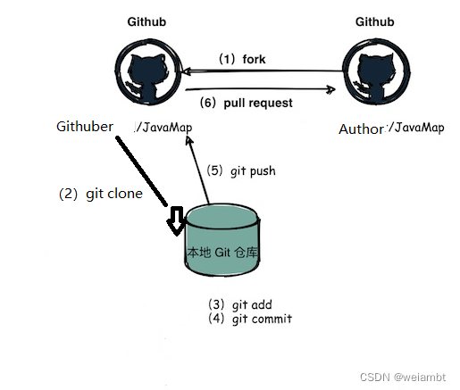

#### 【Git】Pull Request到底是干嘛的


Pull Request（PR）


PR,全称Pull Request（拉取请求），是一种非常重要的协作机制，它是 Git 和 GitHub 等代码托管平台中常见的功能。在开源项目中，Pull Request 被广泛用于参与社区贡献，从而促进项目的发展。

PR 的全称是 Pull Request, 经常用 Github 的同学对这个肯定很熟悉了。Github 聚集了 4000 万开发者, 过亿的开源项目, 如果想给别人的开源仓库贡献代码, 通常是先 fork 别人的项目, 然后本地修改完成提交到自己的个人 fork 仓库, 最后提交 PR 等待别人合入你的代码。
为什么需要用PR

    审核机制
    在一个项目中,人员的技术和风格参差不齐时,编码之后的项目增加阅读和修改成本,也很难让别人轻易去调整自己的代码。不审核的代码,有些成员会选择无脑式的写法,处处copy,而不会进行内容的抽离和封装,大大增加了代码的耦合性。所以通过这样一种机制，让开发人员写好代码后，给专门审查人员检查（在团队中承担了 Committer 的责任, 也就是帮同事们检视代码 Code Review和合入代码）
    漏洞修复或代码贡献
    对于开源项目，Pull Request是外部贡献者提交代码更改的主要方式。当发现项目的漏洞或想要添加新功能时，外部开发者可以在自己的分支上进行修改，并通过Pull Request将更改提交给项目维护者。维护者会对更改进行审查，并根据项目的需求和规范决定是否合并这些更改。

其实归根结底就是一个目的：Code Review
工作流程



在这里插入图片描述
PR为什么不叫push request

我们重点看一下第 6 步, 写完代码了想合入到原作者的仓库, 新建了一个"pull request", 拉请求? 这推啊,将自己的修改推到原作者的仓, 感觉叫"push request"比较合适吧。

既然 Github 坚持叫"pull request", 我们试着理解一下它的思路, 写完代码了心里肯定是在想: 原作者大神, 我改了点东西, 你快把我的修改拉回去吧。站在原作者的角度思考, 叫 pull request 好像也说得过去, 每天有大量的人从我这里 fork 代码走, 我只会拉取我感兴趣的代码回来。

这个解释勉强能够说服我。
具体步骤

1.fork原仓库A到我的仓库B（B是A的fork版本）

2.将仓库B clone到我本地电脑

```
git clone XXX
```

3.在本地创建一个分支，如`bugfix/issue-12`，该分支用于存放我的代码修改。同时在我的github上的仓库B也创建一个同名的该分支

4.切换到该分支bugfix/issue-12，修改代码

```
git checkout -b bugfix/issue-12
```

5.修改好了，add，commit，然后push到我远程的仓库B的bugfix/issue-12分支

```
git push -u origin bugfix/issue-12
```

6.在我的github的仓库B中创建pull request。选择仓库B的该分支，推送到原仓库A的某一个分支。具体是哪个分支，参考仓库A的contributing说明，一般是dev分支；如果没说，就只能选择master分支
进阶

如果当你fork了项目A，你还没有修改，原项目A的代码就修改了，就已经不是最新的了，该怎么办？

接下来还需要与上游建立连接，这里上游指的是一开始fork的那个项目源A，

执行`git remote add upstream A仓地址`

然后合并到本地（upstream的新代码更新到本地）
`git fetch upstream/master`

具体参见：https://blog.csdn.net/feverfew1/article/details/135441302
这么做的原因是当你在开发时，如果多人协作开发同一个项目，那么可能其他人也在修改代码并提交到仓库中。如果你 fork 了这个项目的代码，那么你 fork 的代码可能已经不是最新的了，因此需要及时更新代码，以保证你的代码与仓库中最新的代码保持同步。

此文的原文链接：

[Pull Request到底是干嘛的](https://blog.csdn.net/Supreme7/article/details/136813376)
