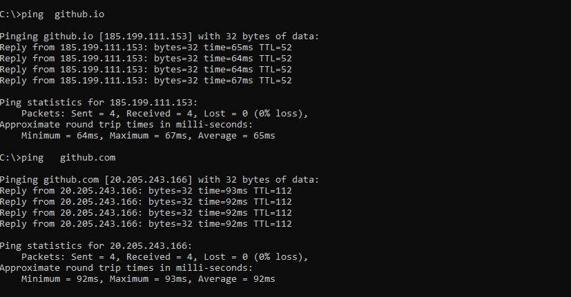

#### 无法连接github.io和github.com的解决方法

一直可以正常访问自己保存在https://username.github.io的笔记，但是最近几天在虚拟机无法访问了，虚拟机里重新安装Windows10也是无法访问，捣鼓了一天也没有解决，网上查询，最终使用一条命令解决，找到真实的ip，然后把ip地址和域名的映射记录添加在hosts文件里。

```
ping   github.io
ping  github.com
```




通过`ping github.io`和`ping github.com`命令，`185.199.111.153`就是github.io的ip地址，把这条记录添加到`windows\system32\drivers\etc\hosts`文件中(获取hosts文件的管理员权限)。同样的方法，添加`20.205.243.166`到hosts文件中。具体格式如下：

```bash
185.199.111.153   github.io
20.205.243.166    github.com
```

然后在cmd窗口下运行`ipconfig   /flushdns`

打开浏览器，访问https://username.github.io 或者 https://github.com 。如果还是不显示，那就清理浏览器缓存，如下图所示：


