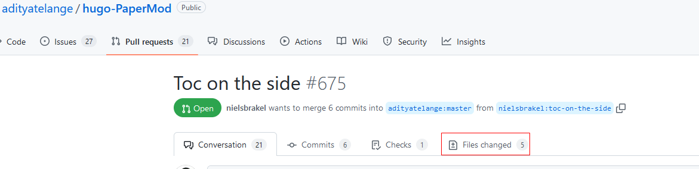
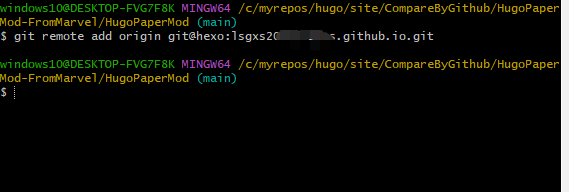
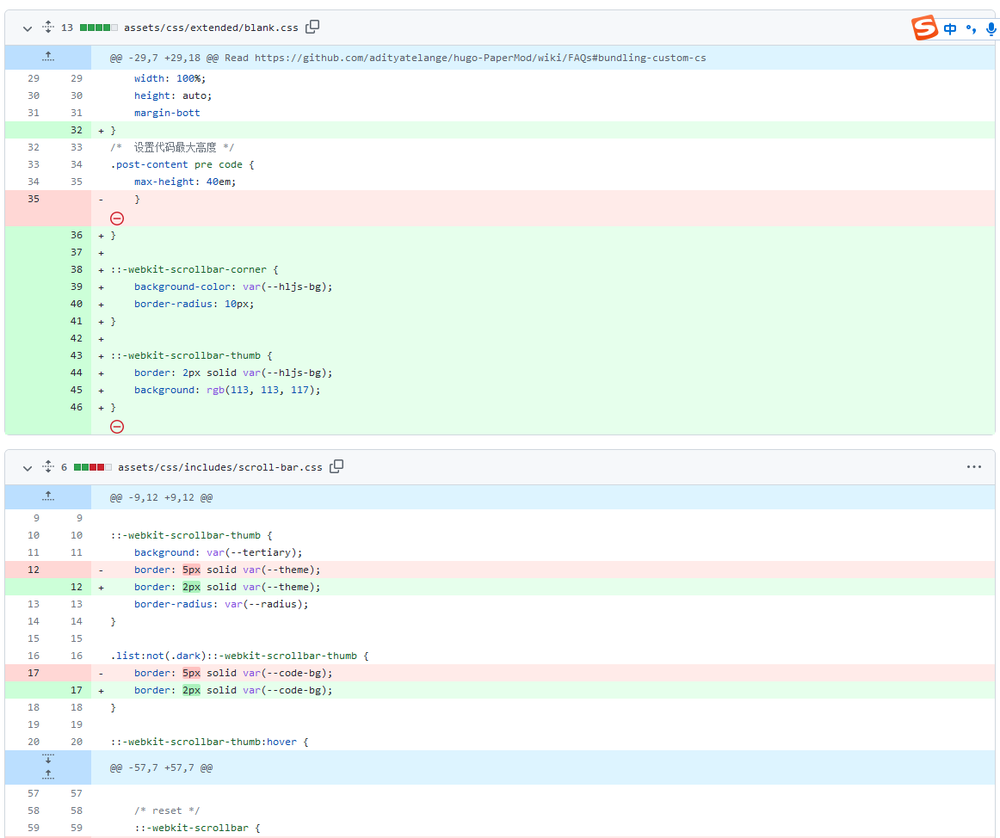
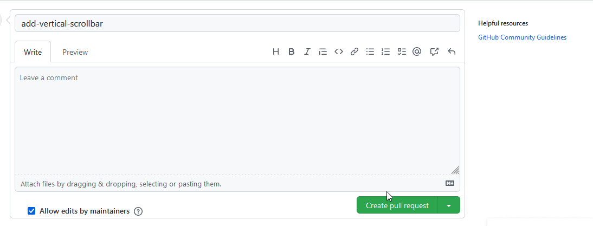
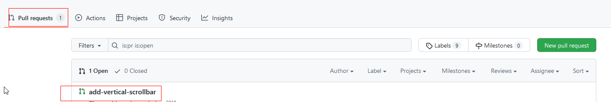

#### 善用GitHub之Pull Request

在github上托管自己的静态博客，从知道github的存在到现在博客的托管，摸索着进步。毕竟只是自己的爱好，没有真实的项目打底，没有复杂的应用，只是一些简单的github操作，实在不行就把仓库delete，重新git-add-commit-push。还从来没有过pull request操作，只是大概知道这个代码协作的功能。为了实现PaperMod的一个[cover image作为缩略图放置在文档条目右侧的炫酷效果](https://www.sulvblog.cn/posts/blog/),开启了PaperMode学习，感谢sulv大佬的博客文章。

##### 目录放在文档左侧

实现了cover image作为缩略图放置在博客文章条目右侧之后，默认的PaperMod目录是放置在文章顶部，对于篇幅长一点文档，目录和内容之间切换不方便。跟着sulv大佬的文档做，但是没有直接拉取他的仓库主题，主要是对PaperMode的结构不熟悉，对各种自定义的模板不熟悉，实现不了这个目录居左边的功能。搜索到一个博主的文章(感谢这位博主的文章，这里贴上文章的链接，提到了这个[目录侧边化](https://mclsk888.top/posts/%E5%8D%9A%E5%AE%A2%E6%90%AD%E5%BB%BA/hexo%E8%BF%81%E7%A7%BBhugo/#%E7%9B%AE%E5%BD%95%E4%BE%A7%E8%BE%B9%E5%8C%96))。找到[Toc on the side](https://github.com/adityatelange/hugo-PaperMod/pull/675)的Pull request，实现了目录放置在侧边栏的功能。摸索着发现了Files Changed的图标，点击后发现了最有价值的地方，红绿两色、加加减减，忽然意识到这里已经给你说明了那些删除的，哪些是增加的。如果你有足够的耐心，可以照着文件的变化修改你的文档。另一个更好的方法就是找到提交者的仓库，直接下载仓库，把Files Changed标注的文件复制到自己博客项目里对应的目录，覆盖原文件，就可以实现目录侧边放置的效果。

##### 用自己的项目实践Pull request

学会通过pull request在github上查看修改明细，修改了哪几个文件，每个文件修改了什么内容，在编辑框左边显示+或者-号表示增加或者删除（大概是这意思，我猜测，看官方文档再理解）。把sulv大佬帮我修改的博客项目（实现另外一个功能，在代码区显示纵向的滚动条）作为一个修改后的commit ，推送到我fork自己的博客项目仓库，看到自己想要的结果了，直接显示了修改了哪几个文件，修改了什么地方，对照整个清单把原来的文件修改好，localhost:1313测试成功。

下面记录一下自己第一次完成pull request的过程，通过New pull request生成明细信息，观察Files Changed逐个修改自己的文件，或者找到commit的源仓库，找到变化的文件，给项目增加对应版本的功能。当然，我这里只是纯粹处于学习目的，找出别人帮忙修改的源文件和修改的具体内容。

* 首先把自己的未经修改的博客项目推送到username.github.io仓库

* 用自己另外一个github账户的登录，fork第一个账户的博客项目仓库

* 把大佬帮助修改好的仓库项目修改origin 链接，指向第二个github账号fork的仓库。（其实修改的项目已经可以使用，只是我好奇到底是怎么修改的^-^）
  
  
  
  * git remote remove  origin     --通过git remote -v 查看仓库链接指向，如果链接的仓库URL不正确的话，就用这条语句删除，下面再新建正确的链接。
  
  * git remote add origin git@hexo:username/fork-repository-name.git 
  
  * git add-commit-push --这里是几个步骤的简写。
  
  * 登录github，选择源仓库(也就是Fork到的仓库的源仓库），选择pull request,选择New pull request。下面会显示本次commit所涉及的所有变更明细清单：
  
    
  
    
  
  ​           在这里填写pull request的注释信息后，点击右下角的绿色按钮Create pull request。重新选择仓库，如下图所示，Pull requests的右侧会显示数量，点击后显示pull reques列表，如果注释信息直观的话，可以清楚看到每个pull request的基本功能。
  
  ​        
  
  初学pull request，一点点成就感，所有的进步不就是这些成就感驱动的吗？继续前进，做自己喜欢的事情，坚持下去
##### 结合文件比对工具WinMerge查询源文件修改内容

通过github的pull request完成查找项目中的修改文件之后，可以结合WinMerge，通过两个源文件内容的比对，逐行分析，精确定位和复制修改代码。

##### 如何学习计算机知识  
* 自己对github、request的认识还很肤浅。有多大的需求，才有多么复杂的项目，才会有更多一点的知识。如果能从众多的知识中抽象出一点智慧，那就又进步了一点^-^。

* 学习html+css+javascrtpt的基础知识，然后搞懂一个实际的项目才能不断进步。

* 如果只是想得到某个结果，比如实现某个炫酷的功能，即使你实现了，也是东拼西凑，学习的知识不够系统。要学习扎实的基础知识，然后实践一个项目，把一个项目彻底搞懂才会有进步，不是每个项目都会一点。如果只是追求好玩，也无所谓，如果想学东西，学到专业的知识，系统的、扎实的基础知识必不可少。

* 坚持阅读官方文档
