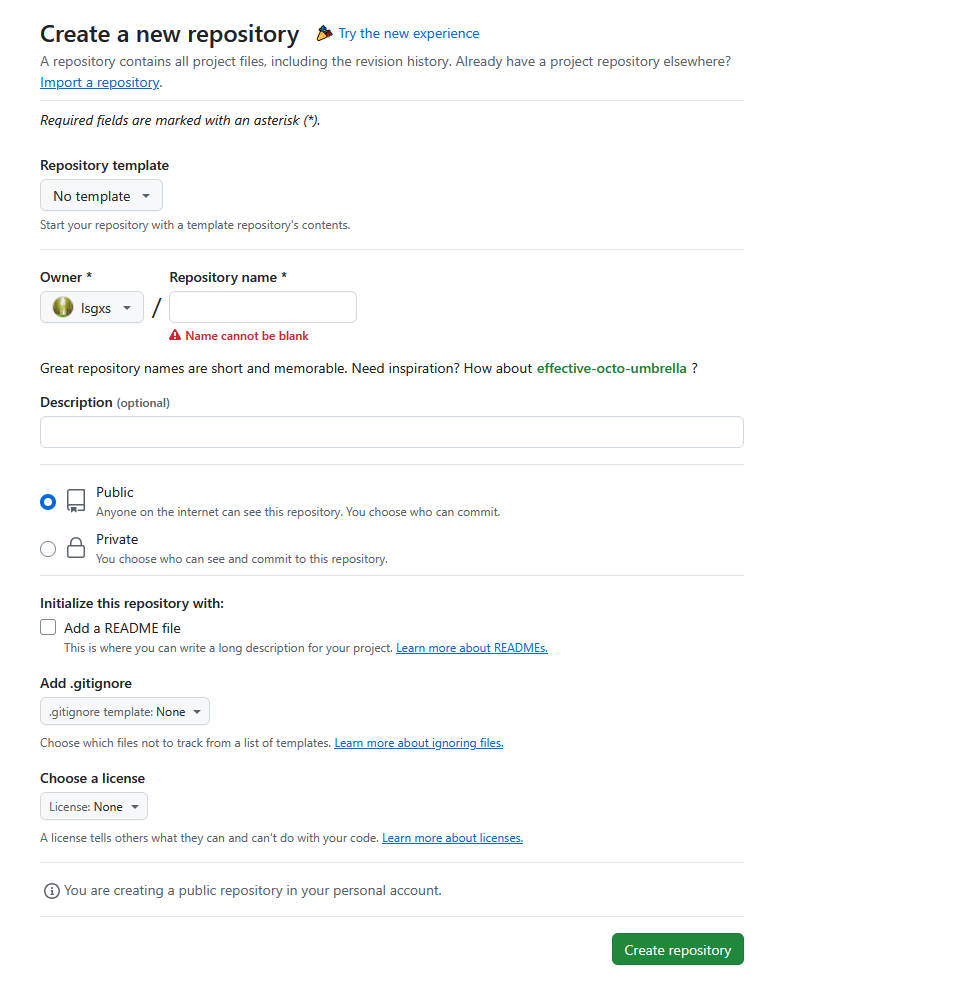

## 原有Hugo博客项目迁移后重新部署


```
1、git cone  git@github.com:username/username.github.io.git
2、删除username.github.io仓库
3、新建空仓username.github.io
4、设置GitHub Pages。
5、博客目录和内容更新完成后，从本地推送到username.github.io，利用workflow目录下的deploy.yml自动化部署脚本完整站点发布
```

### 使用git  clone  备份username.github.io仓库

使用git  cloe   把当前的username.github.io仓库内容下载到本地，然后删除username.github.io仓库

我现有的博客站点从旧内容迁移到新的主题，先做好备份，然后再删除。如果是全新的博客项目，就不需要第一、二步骤，直接进入第三步骤。

### 删除username.github.io仓库

* 选择username.github.io仓库的settings，在页面的最下面选择删除仓库

      **Delete this repository**.      `Once you delete a repository, there is no going back. Please be certain.    `

  

### 新建一个username.github.io空仓

点击github下的账号名称，点击Repositories,再点击右侧的`New `，弹出新建仓库界面。输入仓库名称为username.github.io,下面的仓库类型选择public,剩下的几个选项none,不要选择`Add a Readme  file`，总之，这些项目保持默认就好。




### 设置username.github.io仓库的GitHub Pages参数

* 选择仓库的settings，再选择pages进入GitHub Pages页面
* build and deployment的source选择为 deploy from branch ,branch 选项选择gh-pages，路径选择根目录'/'，点击保存。
* 如果设置有自定义域名，要设置下面的Custom domain。我这里暂时没设置，以后尝试设置，自己当时买了自定义的域名的，而且还用过一年

### 对现有的博客系统内容更新后重新部署到username.github.io

```
git  add .
git  commit -m  "udpate"

#push an existing repository from the command line
git remote add origin git@github.com:lsgxs/lsgxs.github.io.git
git branch -M main
git push -u origin main
```

如果是 Hugo 项目，需要注意GitHub Pages 默认部署的是 静态文件（public/ 目录），而不是 Hugo 源码。所以有两种选择：

#### 方案 1：手动构建并推送 public/（适合简单部署，推荐新手时期）

    #在本地生成静态文件：
    hugo
    
    #进入 public/ 目录：
    cd public
    
    #初始化 Git 并强制推送：
    git init
    git add .
    git commit -m "Deploy Hugo site"
    git remote add origin git@github.com:lsgxs/lsgxs.github.io.git
    git branch -M main
    git push -u origin main --force


作用：直接推送静态文件，绕过 GitHub Actions 和 Jekyll，--force 是必要的，因为 public/ 可能之前没有关联到远程仓库。

#### 方案2：直接推送 Hugo 源码（需 GitHub Actions 自动构建）

确保 .github/workflows/hugo.yaml 存在（GitHub Actions 配置），  推送源码到 main 分支，GitHub 会自动构建并部署。


```
name: Deploy Hugo Site to GitHub Pages

on:
  push:
    branches: ["main"]  # 仅在 main 分支推送时触发

permissions:
  contents: write       # 确保 Actions 有写入权限。如果部署失败，检查是否缺少 permissions 声明（尤其是私有仓库）
  pages: write          # 允许写入 GitHub Pages
  id-token: write       # 用于身份验证（可选，但推荐）

jobs:
  deploy:
    runs-on: ubuntu-latest
    steps:
      - name: Checkout 代码
        uses: actions/checkout@v4
        with:
          submodules: true  # 如果使用子模块（如 PaperMod 主题）
          fetch-depth: 0    # 获取完整历史记录

      - name: 设置 Hugo 环境
        uses: peaceiris/actions-hugo@v2
        with:
          hugo-version: 'latest'
          extended: true

      - name: 构建站点
        run: hugo --minify  # 生成静态文件到 ./public

      - name: 部署到 GitHub Pages
        uses: peaceiris/actions-gh-pages@v3
        with:
          github_token: ${{ secrets.GITHUB_TOKEN }}  # Actions 推送代码到仓库的权限钥匙。无需手动创建，GitHub 会自动处理其生成和失效。 
          publish_dir: ./public       # Hugo 默认输出目录
          publish_branch: gh-pages    # 部署到 gh-pages 分支
          force_orphan: true          # 清空 gh-pages 历史记录
          user_name: 'github-actions[bot]'
          user_email: 'github-actions[bot]@users.noreply.github.com'
```
