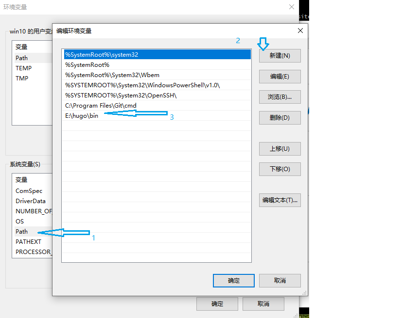
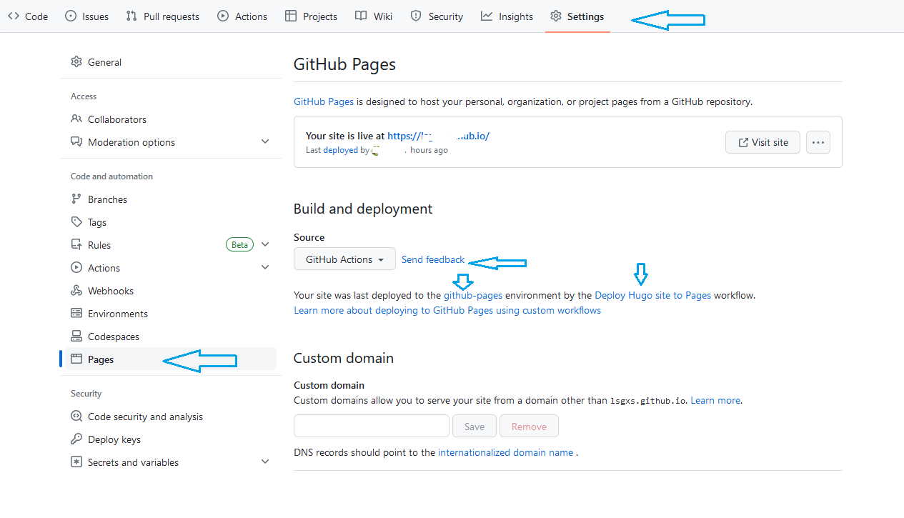
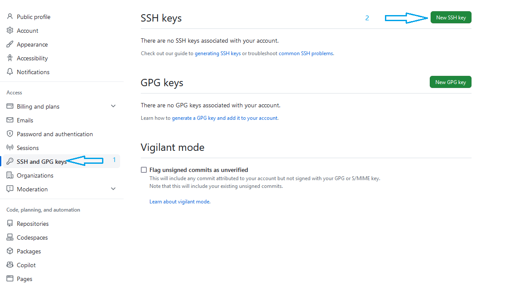
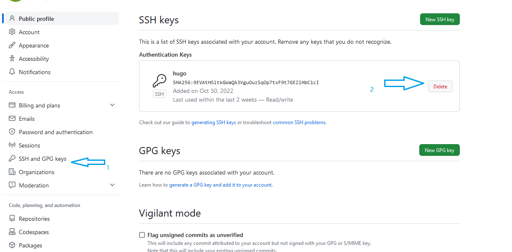
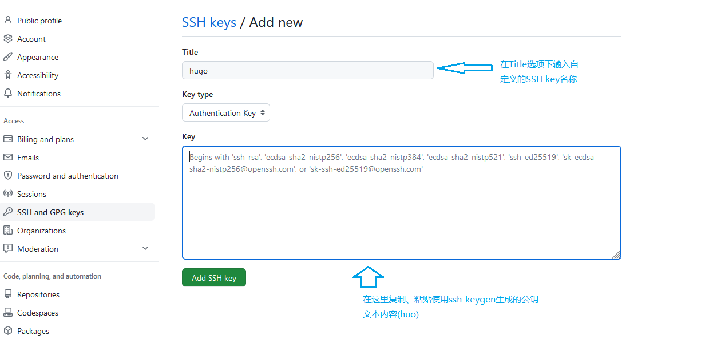
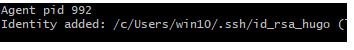

####  快速重建HuGo博客站点

一直用hyper-v的win10虚拟机管理博客站点，没有按照流程关机，第二天启动虚拟机时提示内存不足，用各种办法业务没有修复，只好重装win10虚拟机，里面的git管理github多账号的设置自然没有了，只好重新配置。可是习惯了git add-commit-push这简单的三条语句搞定博客文档上传，现在从头来还真是忘记了当时如何设置的。经过一天的摸索，终于还原了原来的状态，记录如下以备忘。在重建之前，先复习一下下面几个概念，理解了原理，实现起来就很容易。

* hugo静态博客的创建、编译和发布
  * 在本地按照Hugo提供的[QuickStart](https://gohugo.io/getting-started/quick-start/)示例做一遍就理解了。我的这个hugo博客使用的是PaperMod主题。
* 自己的hugo 静态博客在github上实现自动发布和部署的方式
  * 使用git-add-commit-push组合推送到github后，采用github本身提供的Deploy Hugo site to pages workflow,它会自己创建gh-pages对象，并把静态的网站文件发布者gh-pages上。
* 与github的通讯方式 
  * app与github一般采用 token（访问令牌）方式通讯，设置好访问权限。
  * git 与github通讯，使用https或者ssh协议等。以ssh协议为例，需要使用ssh-keygen生成一对密钥，公钥放在github的账户ssh设置参数里，私钥在本地通过ssh-agent添加。而git+https协议访问github则每次要输入账号和密码。

* github上的几个重要的基本概念
  * 账户级别的权限，如token 和ssh
  * 仓库级别的权限   deploy keys   和Secretes and variables

##### 快速理解hugo 站点的运行模式

* 安装 git 

* 下载  hugo （没有安装包，只有一个可执行文件和两个说明文件）

* 设置hugo运行的工作目录

  * 在自定义的工作目录新建hugo子目录，把下载的hugo可执行文件放在hugo\bin子目录。建立如下所示的目录结构：

    ~~~
    e:\hugo\bin\hugo.exe   --hugo可执行文件所在的目录
    e:\hugo\sites          --自己的站点项目目录
    ~~~

  * 在系统环境变量path中新增项目，指向e:\hugo\bin

    

  * hugo  version    `正常就会显示hugo的版本信息`(如果提示不识别hugo命令，就重启Windows让系统环境变量生效)

* 建立一个简单的hugo 站点QuickStart(下面的过程是在git  bash终端下输入命令)

  * hugo  new  site  QuickStart

  * cd QuickStart

  * git  init    `使用git  init初始化QuickStart目录，纳入git管理`

  * git  submodule  add ` https://github.com/theNewDynamic/gohugo-theme-ananke.git ` themes/ananke     `从github上加载theme。从github.com仅下载内容不需要密钥，如果要使用git登录github并发布内容，就要创建密钥对，后面的步骤需要专门配置`

  * echo   "theme = 'ananke'">> hugo.toml

    ~~~
    这个是使用echo命令向配置文件hugo.toml添加主题，也可以使用Windows自带的notepad打开hugo.toml，在文档末尾手动添加：theme = 'ananke'，两种方法结果相同。
    ~~~

 * hugo new  posts/first-post.md     `会在站点项目的contents目录下新建posts目录保存first-post.md。注意这里目录和文件路径的分隔符是/，不是windows下的\`

  * hugo  server  -D

    *  hugo  server  是打开hugo的站点服务

    *  `-D, --buildDrafts     include content marked as draft。这里的-D是大写的字母D,表示显示包括草稿在内的文档内容，在该markdown文档的front-end区域，也就是文件头部信息区域，如果draft：true的话，可以显示该草稿文档。如果不加这个-D参数，就不会显示该草稿文档，比如 hugo  server ,就不显示draft为true的文档，也就是不显示还没有完稿的文档。通过这个-D参数和draft:true或者draft:false，可以灵活掌握是否需要显示草稿`

  * http://localhost:1313/     `在本地使用浏览器以网页形式，以指定的theme预览站点的所有markdown文档`

* hugo       `不带任何参数的hugo ,表示正式发布这些markdown文档，在站点项目根目录下自动新建public目录，把markdown转换为html文件存放在public目录`，还有主题的static目录和本项目的static目录下的资源都生成在public目录下

  * hugo   --cleanDestinationDir   `也可以使用该命令重新生成所有文档`
  * hugo  /?     `在git bash终端下使用该命令查询所有详细用法`
  * 接下就可以把生成的html文档自动化发布到github上。

##### hugo 静态博客在github上的部署方式

在github上实现自动化部署静态博客有多种方法，我这个hugo静态博客采用的是github提供的最简单的一种方式，直接使用github的acttions提供的Deploy Hugo site to pages workflow，最终的静态网页是发布在由github的action自动建立的gh-page上，不需要手动建立gh-page分支再部署。具体的设置如下图(github中仓库的Settings，不是github账户本身的Settings)：

##### 用Git管理github博客站点

###### 理解与github的通讯方式

在本地直接使git来链接、管理github账号，一般使用ssh协议，具有安全、高效的特点，当然也可以使用https协议，只是经常需要输入账号及密码。而使用ssh-agent可以把私钥缓存在本地，直接撰写文档提交到远程，不必再做ssh相关的设置，非常方便。把公钥添加在github账户Settings的ssh里即可。如果使用第三方应用程序接口访问github，则是设置github账号本身的Settings-Develop Settings下的Personal Access Token(传统的tokens) ；如果是基于仓库基的部署，涉及到Deploy Keys和Secrets and variables，则要设置在仓库的Settings下设置。

* git使用ssh 协议访问github
* git使用https协议访问github
* 第三方应用程序API使用token方式访问github账号
* 基于github具体仓库的Deploy key  or Secretes and variables

###### 生成并添加密钥对

* ssh-keygen  -t rsa  -b 4096  -C  "MyMailbox"

  或者`ssh-keygen -t  ed25519 -f ~/.ssh/id_ed25519_hugo  -C  "MyMailBox"`

* 添加私钥到ssh代理（ssh-agent可以缓存ssh，不用每次链接都输入ssh）

  * $eval  "$(ssh-agent  -s)"      `启动ssh agent`
  * ssh-add  ~/.ssh/id_rsa_namexxxx    `添加私钥到ssh  agent`

* 将公钥添加到github.com的账号ssh,如下图：

  
  ***
  
  
  ***
  
  
  

设置好git和github账号通讯的各种参数之后，使用`git clone git@github.com:yourusername/yourusername.github.io.git`把保存在github的整个站点获取到本地，然后就可以正常的编辑和提交了。把文档笔记部署到github上有个好处，我这本地系统数据丢失了，重做系统再取回就好了。
###### 向远程提交文档

~~~nginx
git   add .
#这里可能会提示要注册邮件和用户信息 
#git   config  --global  user.email  "yourmailbox"
# git  config   --global  user.name  
git  commit -m   "your  commit "    
git   push origin  main 
~~~
到目前为止，已顺利恢复hugo博客站点的正常编辑和自动发布了。只是有一点，在`git  push origin main `时提示没有权限。发现再执行一边添加私钥到ssh-agent的两条语句就可以正常推送了。记得以前是配置过git管理多个github账号的config文件，现在有点懒，暂时就只用hugo这一个静态站点，如果以后需要配置，可以看一下自己的另外一篇文档（在一台计算机上用git管理多个github账号）。

~~~nginx
eval "$(ssh-agent  -s)"
ssh-add ~/.ssh/id_rsa_hugo
~~~

解决办法：

找到`program files\git\etc\barch.barchrc`,用记事本打开，在文档的末尾添加下面两条命令。如果提示不能保存，就把bash.bashrc文件复制到别处，添加好下面的命令之后再覆盖git安装路径下的bash.bashrc文件。

~~~nginx
#ssh-agent  
eval  "$(ssh-agent -s )"
ssh-add ~/.ssh/id_rsa_hugo
~~~

以后每次打开git bash 终端窗口就会自动添加私钥，如下图所示:

以后就和往常一样直接git-add-commit-push就可以了。

***

##### 简单总结

上面写了这么多，其实是备忘用的，时间久了还真是无法很快重建，几乎涉及到每个步骤的细节。总结一下大致就下面五个步骤：

~~~nginx
#1.生成密钥对，可以切换到~/.ssh目录再生成密钥
ssh-keygen -t rsa -b 4096 -C “mailbox”
#ssh-keygen -t ed25519 -f ~/.ssh/id_ed25519_hugo -C "mailbox"
#或者可以试试后面的ed25519类型创建密钥

#2.复制公钥到hugo的github账户
clip  <  ~/.ssh/id_rsa_hugo.pub
#paste  to  ssh of   my hugo  github  account

#3.在本地通过ssh代理添加私钥
#把下面这两句话添加到bash.bashrc文件的末尾
eval "$(ssh-agent  -s)"
ssh-add ~/.ssh/id_rsa_hugo

#4.下载保存在github的完整站点仓库
git clone  git@github.com:username/username.github.io.git 

#5 正常的编辑和推送到远程
git  add .
git  commit  -m "rebuilding "
# git config  --global user.email "yourmailbox"
# git config  --global user.name "your_github_username"
git push origin  main
~~~

