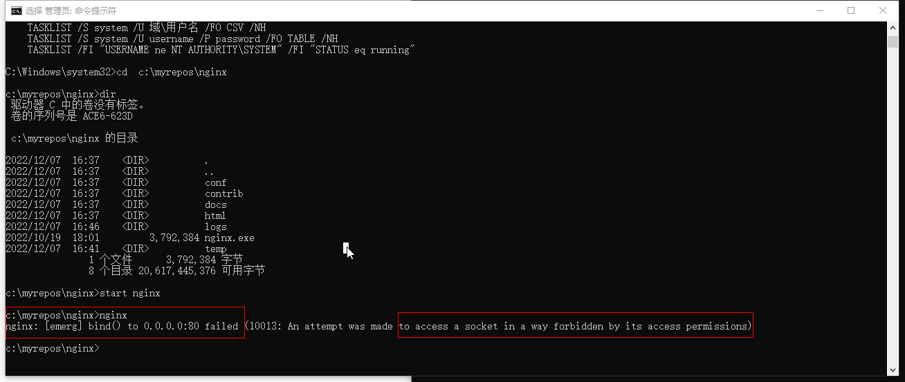
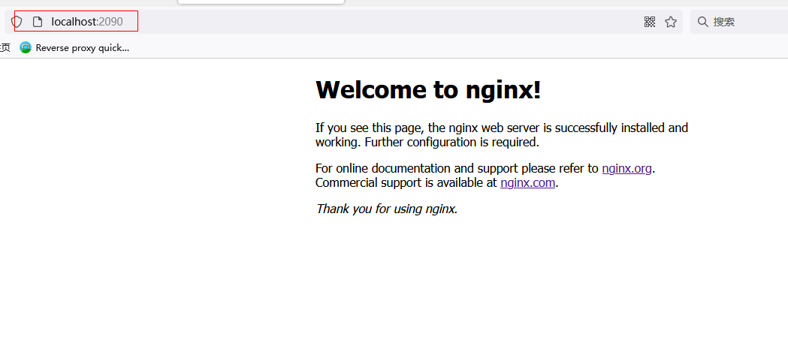

#####  安装Windows版本的Nginx

  从官网文档看，[Nginx](https://nginx.org/en/download.html)对Linux的支持更全面和广泛，毕竟后端的服务器阵营以Linux为主。这里仅仅是对Nginx入门级学习，没时间去折腾linux，就以Windows10虚拟机做为工作环境。这里下载[Nginx Stable version](https://nginx.org/en/download.html)。解压后的目录为`c:\myrepos\nginx`，目录结构如下图：

  ~~~markdown
  nginx+
       |---conf
       |      |----fastcgi.cong
       |      +
       |      +
       |      |----nginx.conf   nginx的配置文件
       |      
       |----contrib
       |----docs
       |----html    保存html网页的目录
       |----logs    日志目录
       |----temp    
       -nginx.exe    
  
  ~~~

#####   运行Nginx启用静态文件服务

  切换到nginx所在的目录c:\myrepos\nginx,在Windows的CMD窗口下运行nginx.exe。此时系统提示一个错误信息

  

 提示访问80端口没有权限。要么提升权限，要么使用别的端口，这里使用2090端口。在配置文件的server  block部分`listen: 80`处修改为`listen: 2090`运行nginx，如下图：

~~~~nginx
server {
        listen      2090 ;
        server_name  localhost;
       

        #access_log  logs/host.access.log  main;

        location / {
            root   html;
            index  index.html index.htm;
        }
        
           #error_page  404              /404.html;

        # redirect server error pages to the static page /50x.html
        #
        error_page   500 502 503 504  /50x.html;
        location = /50x.html {
            root   html;
        }
~~~~



这里显示的内容是nginx自带的html/目录下的index.html，是通过location block中的root   html 参数指定http请求资源的路径映射。

~~~nginx
location /  {
    root  html ;
    index  index.html  index.htm

}
~~~

这里的location是对http的request请求URI进行匹配，把`/`后面的所有内容映射为root  对应的html目录，也就是说把`/`后请求的内容添加到html目录形成资源路径，在站点目录下寻找请求的资源。

引用官网的一段话,[Serving Static Content](https://nginx.org/en/docs/beginners_guide.html#static)

>   Generally, the configuration file may include several `server` blocks [distinguished](https://nginx.org/en/docs/http/request_processing.html) by ports on which they [listen](https://nginx.org/en/docs/http/ngx_http_core_module.html#listen) to and by [server names](https://nginx.org/en/docs/http/server_names.html). Once nginx decides which `server` processes a request, it tests the URI specified in the request’s header against the parameters of the `location` directives defined inside the `server` block.
>
> Add the following `location` block to the `server` block:
>
> > ```nginx
> > location / {
> >     root /data/www;
> > }
> > ```
>
>   This `location` block specifies the “`/`” prefix compared with the URI from the request. For matching requests, the URI will be added to the path specified in the [root](https://nginx.org/en/docs/http/ngx_http_core_module.html#root) directive, that is, to `/data/www`, to form the path to the requested file on the local file system.

##### 启用反向代理服务

  ~~~nginx
  
  worker_processes  1;
  
  
  events {
      worker_connections  1024;
  }
  
  
  http {
      include       mime.types;
      default_type  application/octet-stream;
  
  
      sendfile        on;
      #tcp_nopush     on;
  
      #keepalive_timeout  0;
      keepalive_timeout  65;
  
      server {
          listen      2090 ;
          server_name  localhost;
  
          location / {
              root   html;
              index  index.html index.htm;
          }
     
      }
      # 在静态文件服务的基础上添加下面的server block，通过反向代理打开filebrowser
      server {
         location / {
            proxy_pass  http://127.0.0.1:8080;
         }
  
        location /images/ {
          root /data;
        }
     }
  }
  
  ~~~

  ##### nginx几个常用命令

 ~~~
  # 在工作目录下启动nginx
  nginx 
  
  # 快速停止nginx
  nginx -s stop
  
  #优雅的终止nginx：发出终止信号，但是等待nginx工作进程完成当前请求之后再终止nginx进程
  nginx -s quit
  
  #重新加载配置文件
  #changing configuration, starting new worker processes with a new configuration, #graceful shutdown of old worker processes  
  nginx -s reload 
  
  # 重新打开日志文件
  nginx  -s  reopen
  
 ~~~

##### 在Windows下使用tasklist 查看进程信息

如果不识别tasklist命令，切换到windows\system32目录，或者修改系统path变量。

~~~
tasklist  /if  "imagename eq  nginx.exe"
~~~

> 引用：[Beginner 's Guide](https://nginx.org/en/docs/beginners_guide.html)


##### Map requests to the directory  in local file system by  root  directives in location block

For matching requests, the URI will be added to the path specified in the [root](https://nginx.org/en/docs/http/ngx_http_core_module.html#root) directive，to form the path to the requested file on the local file system.

> ```nginx
> server {
>     location / {
>         root /data/www;
>     }
> 
>     location /images/ {
>         root /data;
>     }
> }
> ```

In response to requests with URIs starting with `/images/`, the server will send files from the `/data/images` directory.(add /images/xxx after to the root , /data  )

 For example, in response to the `http://localhost/images/example.png` request nginx will send the `/data/images/example.png` file.

##### Next ......
