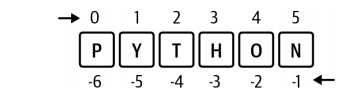

#### python的几个主要数据类型

* numeric

  * int
  * float 
  
* string

  * python没有单个的字符类型，指定一个字符串的索引位置就获得一个字符。
  
  * indexing  使用字符串名字后跟[index]来选定某个字符，使用格式为stringname[index]，从左往右是从0开始计数起步，从右往左是-1开始计数起步。
  
    
  
    ```python
    In : language = "PYTHON"
    In : language[0]
    Out: 'P'
    In : language[1]
    Out: 'Y'
    In : language[-1]
    Out: 'N'
    In : language[-2]
    Out: 'O
    ```
  
    
  
  * slicing  如果需要从指定的字符串选取一段字符，使用slice操作。使用格式为stringname[start:stop:step]
  
    * 默认省略书写最后一个参数step，步长1。正数的步长是从左向右选取，负数步长是从由向左选取。步长可以大于1。
    
    * 和index的基数一样，从左到右是从0开始计数，从右往左是-1开始计数。
    
    * [start:stop]的几种写法：[start:stop],[statr: ],[:stop],[ : ]
    
    * [statr:stop]的书写形式中，选取元素时只包含起始值，不包含结束值。
    
      ```python
      language = "PYTHON"
      
      In : language[:3] # Same as language[0:3]
      Out: 'PYT'
      In : language[1:3]
      Out: 'YT'
      In : language[-3:] # Same as language[-3:6]
      Out: 'HON'
      In : language[-3:-1]
      Out: 'HO'
      In : language[::2] # Every second element
      Out: 'PTO'
      In : language[-1:-4:-1] # Negative step goes from right to left
      Out: 'NOH'
      ```
    
      当然也可以把slicing和indexing组合在一起使用：
      
      ```
      In : language[-3:][1]
      Out: 'O'
      ```
      
      
  
* list

  * 字符串和list的共同的几个特点，它们统称为sequence数据类型，可以indexd和sliced,也可以concatenate。

  * 在对字符串进行sliced操作时，使用str[start:end]的书写形式，start是包含在内的，而end是不包含的。start和end就是index区域，默认的起始序号是0

  * 常用的方法append
  
* tuple

* dictionary

* set  是没有重复元素的一个容器，可以使用集合理论的操作来操作（并集、交集等）

  ##### 对于sequence类型的数据来说，包含两个共同的特征，就是包含index属性和slice操作方法

  ```python
  #string、list、tuple、dictionary都属于sequence类型，因此都可以使用index和slice操作
  #这个sequence中的值可以叫做element或者item
  
  #以string类型变量为例进行说明
  str1 = 'python'
  
  #index操作
  #str1[0]就是字符串变量的index操作，作在python中，index序号是从0开始的，最后一个index序号为len(str1) - 1
  # 打印出'python'中index为0的字母，也就是第一个字母p
  char1 = str1[0]  
  print(char1) 
  
  #slice操作：实际上是以index为基础，对原sequence类型的数据取段。
  slc1 = str1[0:3]
  #显示为pyt。在指定了起止索引号时，起始索引对应的字符是包含在内的，而不包含终止索引号对应的字符。
  #也就是只取值到在终止索引号前边的一个位置对应的值。在本例中就是str1[0:2]
  print(slc1)  
  slc2 = str1[2:6]  #显示为thon
  slc3 = str1[:3]   # 省略了起始索引号，默认从0开始，这里就显示为pyt,和前边的str1[0:3]的写法效果相同
  slc4 = str1[0:]   # 省略了终止索引号，默认是到最后一个元素，这里显示为python
  slc4 = str1[:]  #  省略了起止索引号，默认是全部元素
  具体更详细的用法可以参照python文档，理解了基本原理就可以。
  ```
  
  
#### operator

####  流程控制

* if

  if   exp1   :

  ​    elif  exp2: 

  ​    elif  expn:

  ​    else:

  

* while

  ```python
  # 用户输入一个数字，和9比大小，显示输入的数字比9大、小或者是猜中了。
  number = 9
  guess = input("please input  a number:")
  
  
  while test1:
  
      if guess == number:
          print('Congratulations, you guessed it.')
          # this causes the while loop to stop
          running = False
      elif guess < number:
          print('No, it is a little higher than that.')
      else:
          print('No, it is a little lower than that.')
  else:
      print('The while loop is over.')
      # while语句可以带else子语句，但是如果while语句块中遇到break时，else子语句不会被运行
      # 可以在此运行任何你想运行的任务   
  
  ```

* for

  ```python
  #这里只是用内置函数range()函数生成了一个包含数值的列表，
  #实际上for..in 循环语句可以遍历包换任何元素的序列(sequence)。 
  #
  
  #对于sequence中的每一个元素都运行一次for循环中的语句
  #这个sequence可以是range(num)、string、list、tuple、dictionary等。
  for i in range(1, 9):
      print(i)
  else:
      #在python中，for语句可以带else子语句，但是如果for语句块中遇到break，else子语句不会被运行
      print('The for loop is over')    
  ```

* break

  在循环语句中遇到break会结束当前的循环语句块。

* continue

  在循环语句块中遇到continue会跳过剩下的语句，直接进入一下个循环。

####  function

* 局部变量

  函数内部定义的变量称为局部变量，和函数之外定义的同名变量没有关系

  ```
  x = 40
  
  def func(x):
      print('x is', x)
      x = 3
      print('Change local x to', x)
  
  func(x)
  print('x is still', x)
  ```

  output:

  ```
  x is 40
  Changed local x to 3
  x is still 40
  ```

* 全局变量

  在python代码块中，如果要显式的使用全局变量，则可以使用global来表明：

  ```
  global   var_name
  ```

* 参数的类型

  * 默认参数
  * 位置参数
  * 关键字参数

####  module

函数是实现特定功能的代码段，达到重用一段代码的目的，那如果要重用多个函数，如何实现呢？这里就有了module这个概念，实际就是一个后缀名为.py的文件，里边包含各类变量、函数、类等对象。需要这些功能时，直接引用（import）这些module文件就可以了。

#### Package

有了大量的功能完备的module，如何分类组织组织这些modules呢？这里就有了packages的概念，包就相当于是Windows的目录和子目录，每个包下面都包含一个`__init__.py`文件，用来标识这个目录是一个包，包含若干个modules。而module文件里是各种变量、函数和类等所有名称的定义。有了这样的概念，在包和模块之间重用代码的方式有如下几种形式

* import   module_name
  * module_name.func_name(argn...)
* import   package_name/sub_package_name/module_name
* from   module_name  import     func_var_names
* from   pacakage_name/sub_package_name  import   module_name
* 就像在website里使用相对路径引用html文件方法一样，在python的当前module中引用其他package下的module也同样适用：

  * from  .  import  sibling_module_name

  * from  ..   import  other_module_name

  * from  ..  sub_package_name  import  other_module_name

总结一下：from 后面可以是package、package_subpackage_module    ，import后面可以是module、variable、function、class。但是能不能在import后直接跟一个package_name?下次确认一下再总结。

为了避免出现自己的module和第三方module的标识符冲突，建议直接使用import的引用形式，使用是使用module_name.object_name。这样就相当于有扩大了名称空间，不会出现变量、函数、对象等标识符重复的现象。就好像给学生的名字加了前缀：某校.某班级.学生姓名，这样就不会重复，如果重复，那就继续扩大引用的名称空间。

##### pip （package  install  for  python ）

这是python 的包安装工具，如果安装的是python官方的python软件包，默认是安装了pip的。

`python  -m  pip install  <package_name> `使用这个命令来安装package。也可以直接使用 `pip install <package_name>`

##### PyPi (python package  index)

一个在线仓库、一个网站，是 Python 编程语言的软件仓库,存储了数以万计的 Python 软件包,供全世界的开发者下载和使用。使用 `pip install` 命令时，`pip` 默认就是去 `PyPI` 上查找并下载指定的包。它的官网是 **https://pypi.org/，可以在上面搜索任何 Python 包，查看其文档、版本和下载统计等信息。

####  数据结构(data  structure)

除了基本的数值类型和字符串类型之外，在python中提供了四种数据复合的数据结构，分别是list、tuple、dictionary、set。其中前边三种数据类型都是有序的(sequence)，可以进行index(下标从0开始)和slice操作，也经常会使用for   x  in   sequences  语句进行遍历实现各种操作。

* list

  ```python
  # web  programming language list
  weblist = ['php', 'asp', 'jsp', 'javascript','java','ruby','python','go']
  ```

* tuple

  tuple有类似string的特征，就是定义之后不能被修改。

* dictionary

* set

* json

  * 书写格式：

    ```json
    { 
       name: some_name,
       address:{
           name: address_name,
           province: of_china   
       },
       age: age_number,
       social_id: si_code
    }
    ```

    json和xml一样是数据交换的一种格式，由于json的易用性,在多数应用场景下逐渐取代xml，当然xml还有自己特殊的应用。

    json的书写格式，在python中实际上就是一个原生的字典列表（实际上就是一个键值对列表）

####  class

在python中包括基本的数值和字符，以及复合的list、tupule、dictionary、set都是对象。

#### 输入和输出（input and output)

常见的输入输出方式有两种，一种是通过用户的输入来读取数据，然后显示在用户界面上。另外一种是通过对文件的操作实现输入(read from  file)和输出(write  to file )。

* input()和 print()。通过python内置的这两个函数实现输入和输出。

  ```python
  # 提示用户输入
  str1 = input("please  input you  login  account:")
  print("your  username is ",str1)
  ```
  
* 文件的操作

  * open
    * r 读取模式  （read）
    * w  写模式 （write）
    * a  追加模式 （append）
    * b  以二进制模式打开（binary）
    * t 以文本模式打开（text）文本文件实际上用\n分开的行序列（sequence  of  line)
    
  * write 
  
    ```python
    # Open for 'w'riting
    f = open('poem.txt', 'w')
    # Write text to file
    f.write(poem)
    # Close the file
    f.close()
    ```
  
  * close

#### 异常的处理

使用try  ..except语句块来实现异常的处理

```python
try:
    text = input('Enter something ')
except EOFError:
    print(' you enter  ctrl+z and  enter')
except KeyboardInterrupt:
    print('You cancel the operation.')
else:
    #You can also have an `else` clause associated with a `try..except` block. 
    #The `else` clause is executed if no exception occurs.
    print('You entered {}'.format(text))
```

如果一个错误或者异常没有被处理，则系统会调用python默认的处理程序，显示一个错误信息，然后终止程序的运行。

也可以使用try  ..except..finally 语句块,在finally语句块中运行必须做的任务，比如释放打开文件时占用的资源等，也可以使用with语句来实现资源的自动释放。

####   Basic  Elements  For Learning  Python(include  other   programming Languages) 

~~~python
1、数据类型(number|int-float、string、list、tuple、dictionary、set)
2、运算符  (+、-、*、/、//、%、**、not、and、or)
3、表达式  (算数运算及逻辑运算及函数共同组成各类表达式)
4、语句块
5、流程控制 （if、for 、while）
6、函数 （def   function_name(argn...): ）
7、类及对象
8、Module及Package
9、异常处理
10、Library

对于大多数的编程语言，学习路径就是从数据类型到语句块，再到函数和模块，
如果是面向对象的编程语言，再加上OOP特征，最后扩大到标准库。
学习一门新的编程语言，同样可以使用这种方法和路径去学习和理解。
在学习了各种编程语言之后，你会发现，除了这些在多方面类似的语言特征外，
最核心的还是算法和数据结构，无论学习多少编程语言，最底层的还是算法和数据结构。
~~~

#### NumPy

#### Pandas

初步看了一下pandas的应用，核心就是该package提供了一个DataFrame。为了好理解，暂时把它看做是和Excel类似的组件。通过构建了dataframe对象之后，就可以使用其拥有的各种方法操作数据。在操作数据之前，有一个重要的方法要掌握，那就是DataFrame中数据的选择。

##### 数据的选择

```python
#第一种选择方法通过指定行和列的标签进行数据选择
df.loc[row_selection, column_selection]

#这里假设构建的dataframe的名称为df
#实际还是利用sequence的slice的四种书写方法，来指定需要选择的行和列进行操作
df.loc[:, ["country", "age"]]  #Multiple columns DataFrame 
df.loc[:, "name":"country"]  Range of columns DataFrame 

```

```python
#第二种方法通过指定位置来进行数据选择 
#这里的iloc是integer location
df.iloc[row_selection, column_selection]

df.iloc[:3, [0, 2]] # Returns a DataFrame
```

```
#也可是用布尔表达式进行数据的选择，这里就不举例子了
```

##### 数据的操作

```python
df.loc[[1000, 1001], "score"] = [3, 4]
#在学会了选择数据集之后，就可以进行各种运算。
...

```

##### DataFrame的合并（concatenate、join、merge）
##### PLOTTING（使用dataframe的数据绘图）

##### **Importing and Exporting DataFrames**

```python
---------------------------------------------------------------------------------
|Data format/system |Import: pandas (pd) function | Export: DataFrame(df) method |
----------------------------------------------------------------------------------
|    CSV            |    pd.read_csv              |     df.to_csv                |
|    JSON           |    pd.read_json             |     df.to_json               |
|    HTML           |    pd.read_html             |     df.to_html               |
|    Clipboard      |  pd.read_clipboard          |     df.to_clipboard          |
|    Excel          |    pd.read_excel            |     df.to_excel              |  
|    SQL Databases  |   pd.read_sql               |     df.to_sql                |
---------------------------------------------------------------------------------    
```

