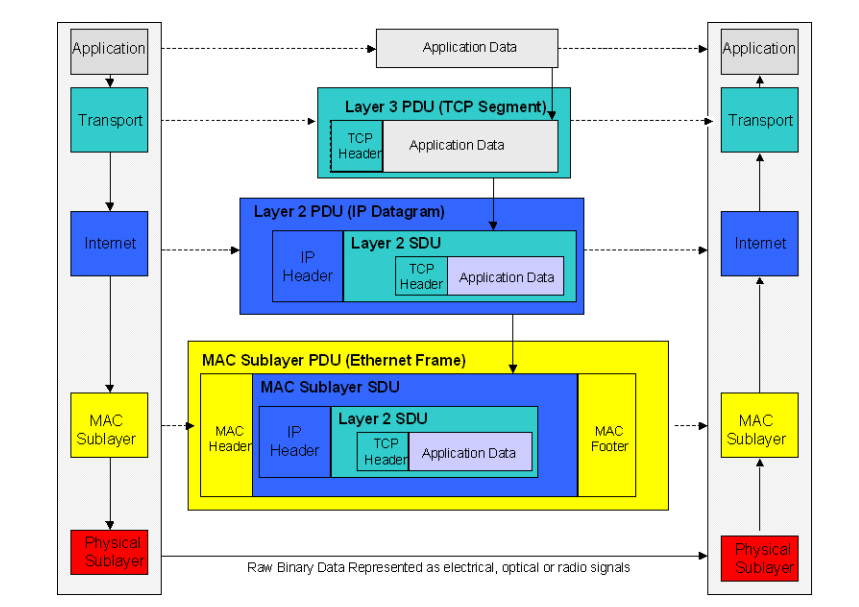

####  TCP/IP的四层模型

##### 分层类型

```
应用层(http、dns、dhcp、smtp等应用) 
  > The application layer is the topmost level of the TCP/IP protocol 
  > suite. It receives data from user applications and issues requests 
  > to the transport layer. The details of moving data between the 
  > application and other computers is shielded by the underlying 
layers.
传输层(tcp)
网络层(ip)
  > The Internet layer responds to service requests from the 
  > transport layer (typically TCP or UDP) and issues service 
  > requests to the network access layer.
  > The various Internet layer modules provide:
  > • Translation between logical addresses and physical addresses
  > • Routing from the source to the destination computer
  > • Managing traffic problems, such as switching, routing, and 
  >   controlling the congestion of data packets
  > • Maintaining the quality of service requested by the transport 
     layer    
链路层（mac)
```

> The transport layer is responsible for **application-to-application** data delivery. 
>
> The Internet layer is responsible for **source host to destination host** packet delivery, 
>
> whereas the next layer (network access) is responsible for **node to node** (hop to hop) frame delivery

#### OSI七层模型

```
Application: Network applications such as terminal emulation and file transfer
Presentation: Formatting of data and encryption
Session: Establishment and maintenance of sessions
Transport: Provision of reliable and unreliable end-to-end delivery
Network: Packet delivery, including routing
Data Link: Framing of units of information and error checking
Physical: Transmission of bits on the physical hardware
```


#### 路由

> **Routers**
>
> The public network, or Internet, is actually a collection of thousands of individual networks, interconnected together. These interconnections form a mesh network, creating millions of paths between the individual computers on the Internet. Routers are dedicated devices that are the interconnection point for the networks of the world.
>
> Routers are responsible for passing IP packets along from the source to the destination, across the various network interconnection points. Each router that an IP packet passes through is referred to as a hop. In general, as the packet traverses the network, **a router is only responsible for getting a packet to the next hop along its path.** 
>
> Routers use the Internet and network layer. Routers need access to the network layer so they can physically receive packets. The network layer then passes the IP datagram up to the router IP layer. The router processes the destination address contained in the IP header and determines which device the send the IP packet on to, typically another router. The transport and user  level data is not needed and is not unpacked from the IP datagram. This allows routers to function very quickly, as they are able to unpack the necessary information from the IP packet using specially designed hardware。
>
> **路由器工作在七层模型的网络层、数据链路层、物理层，对应在四层模型，就是网络层（IP）和网络访问层（network  access layer）**


##### 每个层次的数据包形式

```
应用层: http   应用层负责数据的结构化，
传输层：tcp  segment
网络层：ip  datagram  IP层负责数据包的路由
链路层： mac frame 连接层负责把字节流转换为电流信号 
```

##### TCP四个层次的通讯方式

* 在客户端，自顶向下的数据包传递方向，每个层级在当前数据包的基础上加上下一层级可以识别的头部信息。也就是header+data,这样逐级打包、传递。以浏览器发出的一个浏览网页请求为例子，说明数据打包和传递的过程：

  ```
  1、浏览器根据URL的内容生成http的请求数据（包括头部和主体），调用dns服务获取web服务端请求网页所在主机的ip地址。
  2、调用操作系统的tcp模块，在http的请求数据加上tcp的header，把数据包传递给tcp层。
  3、tcp层把数据包加上ip层需要的head，把数据包传递给ip层。
  4、ip层调用ARP服务，把数据包加上mac。这样数据最终包的最终结构为mac+ip+tcp+http。在最底部的mac层，
  调用网卡的驱动程序，把数据包转换为字节流通过电缆传输
  ```
* 在服务器的接收端
  
  ```
  1、接收端的mac收到字节流后，把他转换为mac可以识别frame，然后解开数据包，取下mac头部信息，把ip+tcp+http数据包发送到上一层的IP层。
  2、在IP层收到数据包后，同样的方式，从数据包中取下IP的头部信息，把tcp+http的数据包发动到tcp层。
  3、TCP层收到数据包后，从数据包取下tcp头部信息，把http数据发送到应用层
  4、应用层的http server收到完整的http请求数据，完成一个数据发送到接收、打包到解包的过程。
  ```
  
  这里的发送和接收、打包和解包的描述只是从概念上理解，有很多术语和细节不够准确，只是为了自己初学期间更好理解整个过程，用自己初步理解的概念来记录，后续学习中不断完善和更新，用更准确的术语和流程认识TCP/IP。
  
#### 数据的封装  

> 引用Fujitsu培训教材《TCP/IP Tutorial》里的图片来说明四层模型中各层的包格式和数据传递。图片版权归原公司Fujitsu所有



```
上图中，使用了PDU和SDU的术语。PDU是指protocol  data unit,是 一层中交付给下一层的数据，个人理解是整个这一层协议的数据。SDU是service  data unit。个人理解是上层中传递来数据，对本层来说就是SDU，本层的PDU就是下一层的SDU，这个概念有点绕，简单理解就是逐层的打包传递，打包就是在上一层数据上加上本层的Header,再传递到下一层。
**每一层的协议模块都要在上层传来的数据上加上本层的协议头，在这里可以叫做PDU吧，也就是本层的数据包**
```


####  Address Resolution Protocol

> The Address Resolution Protocol is a method for translating between Internet layer and network layer address. The ARP 
>
> module in a computer or router maintains a translation table of logical to physical mappings it is aware of, called the ARP cache. If there is not a translation for the address in the table, it will  make an ARP broadcast.
>
> Using the Internet and TCP/IP in an example, the basic steps of  ARP translation are:
>
> 1. ARP checks the local cache to see if it knows the mapping between the IP address and a physical address (the 
>
> Media Access Control [MAC] address).
>
> 2. If there is not a match, ARP broadcasts an ARP request to the local network. The broadcast is received by every 
>
> computer and router to which the host is connected.
>
> 3. If a computer with a matching IP address exists on the local network, it sends its MAC address back. The ARP 
>
> module adds this translation to the ARP cache for future use
>
> 4. If a router on the local network realizes the requested IP address is outside the local network, it sends back its 
>
> MAC address, in order for the IP datagram to be forwarded to it.
>
> 
>
> The same process is used to forward IP datagrams between routers as a packet transverses the network. When a router is 
>
> designated as the next hop, the MAC address of the router, rather than the receiving computer, is provided as the IP to MAC 
>
> translation.

ARP是介于IP层和网络访问层的模块，用表格的形式实现IP地址到MAC的翻译，通过ip地址找到目标mac（IP layer到Mac  Layer）。


#### TCP连接

* 调用客户端的tcp模块，和服务器端的tcp模块建立连接
  * 具体的三次握手过程待学习
* 完成数据传递
* 断开连接
  * 具体的四次挥手过程待学习

这里的笔记时省略了大量的细节,甚至有的地方并不一定准确，对TCP/IP的轮廓初步认识。如果有兴趣需要进一步学习。到最后，真正要理解的话，要在学习的基础上做项目。


> 下面这段引用来自《Beej’s Guide to Network Programming Using Internet Sockets》

***


​                                                                                                     --Data Encapsulation--

 it’s time to learn about *Data Encapsulation*:

a packet is born, the packet is wrapped (“encapsulated”) in a header (and rarely a footer) by the first protocol

(say, the TFTP protocol), then the whole thing (TFTP header included) is encapsulated again by the next

protocol (say, UDP), then again by the next (IP), then again by the final protocol on the hardware (physical)

layer (say, Ethernet).

When another computer receives the packet, the hardware strips the Ethernet header, the kernel strips the IP

and UDP headers, the TFTP program strips the TFTP header, and it finally has the data.

Now I can finally talk about the infamous *Layered Network Model* (aka “ISO/OSI”). This Network Model

describes a system of network functionality that has many advantages over other models. For instance, you

can write sockets programs that are exactly the same without caring how the data is physically transmitted

(serial, thin Ethernet, AUI, whatever) because programs on lower levels deal with it for you. The actual

network hardware and topology is transparent to the socket programmer.


#### **A TCP/IP Networking Example**

> 单纯在Application 层面，浏览器发送Http请求浏览网页，服务器端回应请求，回传网页给客户端浏览器。似乎并不需要了解底层的细节，但是在TCP/IP四层模型下，实际上有TCP、IP、MAC三层帮助应用层完成通讯。

#### 用TCP来传递HTTP  messages

为了发送一个http请求，客户端web浏览器必须要先申请建立一个TCP连接。而为了服务客户端http请求，建立TCP连接，web服务器必须要运行一个TCP服务器。从逻辑上将，http客户端直接和http server通讯，底层TCP Layer是用来交换信息的。也就是端对端的通讯，其他的协议层都是有自己独特的功能，但是单独就一个协议层来说，它只能和相同的协议层通讯，但是客户端的http和服务端的http不能直接通讯，必须要借助其他层的帮助完成通讯，或者叫做间接通讯。 但是TCP并不能理解主机名称（域名），比如www.firefox.com，域名必须要解析为TCP模块可以理解的IP地址，而且HTTP server必须要指定端口来标识。那么如何把域名解析为IP地址呢？这就需要DNS（Domain Name  System）的帮助，通过DNS的查询获取域名对应的IP地址，而web服务器上的应用一般都有分配的端口号。有了IP地址和服务器应用的端口号（用来标识服务器上的一个应用），客户端浏览器就可以申请建立TCP连接：

##### 建立TCP连接

```
1、客户端的TCP向服务器端发送建立连接的请求。具体细节是由客户端的IP模块发送IP datagram给指定ip地址的服务器，由于服务器不在本地网络，所有需要把IP datagram发送到默认网关，而ip datagram的发送需要借助IP层下边的Network Access Layer(Ethernet），把IP datagram放在Ethernet Frame传递，而Ethernet并不理解IP  datagram，它只理解MAC地址。
2、由IP module调用ARP（Address Resolution  Protocol）服务，通过指定的默认网关的IP，查询到默认网关的MAC地址。
3、有了默认网关的MAC地址，把它添加在上一层IP datagram的header，变成Ethernet可以识别的Frame传送。
4、IP Module准备好Ethernet  Frame后，就可以调用Ethernet的设备驱动程序，来把这个Ethernet Frame发送到Network Interface  Card（NIC），The NIC serializesthe frames as bits, and puts the bits onto the Ethernet cable as aseries of electrical sign
5、在默认的网关的NIC收到这些电讯号之后，转换为Ethernet  Frame。然后从Frame中释放IP datagram,用IP datagram中的地址信息来决定其中的datagram下一站传递到哪里。如果需要继续中转，中间使用的技术就是路由表和ARP,通过电讯号在Ethernet cable的流动，最终由Network  access layer的NIC完成接收。除了四层模型之外，引入了Ethernet NIC的驱动和NIC,还有Ethernet  cable 和Electrnical  ,整体的技术就好理解了。
6、在服务器端收到Ethernet  Frame之后，从Frame取出Ip datagram传递到IP Module，再取出egment之后传递给TCP server。由于这是一个TCP连接的请求，并不会送到应用层（HTTP Server），而是回传一个TCP连接response。

（数据包传递到了IP这一层时，如果目标计算机不在同一个网段，就需要使用路由表来搜索下一个路由器的IP地址，让后把IP层的协议包Header填上下一个路由器的IP地址。）
```

##### 通过TCP连接传递HTTP请求

```
1、通过端口号传送到指定的http server。在TCP连接建立完成之后，http page请求通过TCP连接传递到服务器端。当服务器的TCP server接收到请求之后，把请求数据包传递到TCP segment中指定的端口标识的HTTP server(默认是80端口)。
2、http server回传请求的网页到TCP module，通过TCP/IP的协议栈向下传递，最终回传网页到客户计算机，客户机的Ethernet收到传来的Frame后，利用TCP/ip的协议栈，向上逐级传递到应用层的浏览器，最终由浏览器完成网页的渲染。
```


```
---------------------------
|     http|dns|ftp|...    |   ------(message)
---------------------------
|     TCP|UDP             |   -------(segment)
---------------------------
|      IP                 |   -------(datagram)
---------------------------
         |
         |
     ----------
     [  ARP   ]
     ----------
|-------------------------|
|   ETHERNET              |   -------(Frame)
---------------------------


```

#### 一句话总结数据包的在网络中的传递

~~~
应用层负责数据的格式化，提交给TCP层，数据的封装是从TCP协议层开始的。在tcp层附加上端口信息等header，再提交给ip层，Ip层附加上ip地址等header信息。ip协议模块调用ARP服务，完成从ip地址到ethernet NIC的mac物理地址的查询，在完成ip的数据包之后，调用设备驱动，把Ip datagrame格式化为Frame提交给Ethernet层，最终由Ethernet接口卡驱动把frame转换为Electrical  signals，通过Eterhnet  Cable传送到下一个目标主机。在接收端依次卸下对应层的Header信息，通过Ethernet 、ip、tcp层，最后通过端口信息找到接收端应用，由服务器端的应用处理并返回响应数据包。
~~~


#### 拓展学习内容

   * 每一层协议模块添加的header的结构和header中每个字段的用途

     * 在传输端组装IP包的时候，经过的每层协议都要添加本层协议头部信息。了解这些头部信息的具体作用，为后期的网络编程提供支持。
       * 比如：IP层的协议头部包含有源主机IP地址和目标主机IP地址，通过IP地址可以实现主机层面的通讯
       * 比如：TCP协议层头部包含有源端口和目标端口，通过端口实现了应用程序级别的通讯。也就是说通过IP地址找到了主机，到了主机后，通过TCP头部数据中的端口号就可以找到服务器端的服务进程。也就是是在接收端，实现了从IP到TCP，再到应用协议的传递。

   * 路由的算法和路径传递细节

     

这里是初学TCP/IP的肤浅认识，以后有兴趣再深入看看。这次学习浏览了这三本书，有时间再看看（保存在download目录下）

```
1.TCP/IPTutorial.pdf
2.TCP/IP-Netwok-Administrator-Guide.pdf
3.TCP/IP-Tutorial-and-Technical-Overview.pdf
```

***

TCP/IP协议及网络知识的几套书：

* TCP/IP Illustrated  volume  1、2、3
* Internetworking with Tcp/IP  volume  1、2、3
* UNIX  NETWORK  PROGRAMMING  volume 1、2、3
* TCP/IP Network Administration 3e                


