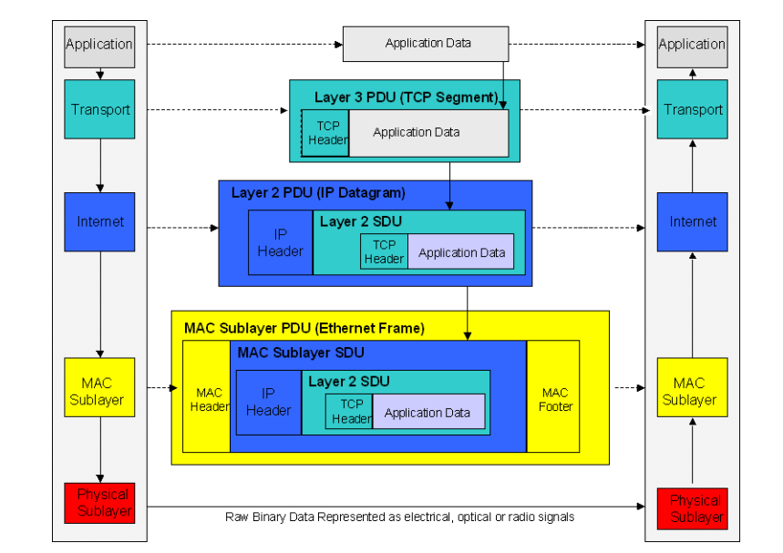

####  TCP/IP的四层模型

##### 分层类型

```
应用层(http、dns、dhcp、smtp等应用) 
  > The application layer is the topmost level of the TCP/IP protocol 
  > suite. It receives data from user applications and issues requests 
  > to the transport layer. The details of moving data between the 
  > application and other computers is shielded by the underlying 
layers.
传输层(tcp)
网络层(ip)
  > The Internet layer responds to service requests from the 
  > transport layer (typically TCP or UDP) and issues service 
  > requests to the network access layer.
  > The various Internet layer modules provide:
  > • Translation between logical addresses and physical addresses
  > • Routing from the source to the destination computer
  > • Managing traffic problems, such as switching, routing, and 
  >   controlling the congestion of data packets
  > • Maintaining the quality of service requested by the transport 
     layer    
链路层（mac)
```

> The transport layer is responsible for **application-to-application** data delivery. 
>
> The Internet layer is responsible for **source host to destination host** packet delivery, 
>
> whereas the next layer (network access) is responsible for **node to node** (hop to hop) frame delivery

#### 路由

> **Routers**
>
> The public network, or Internet, is actually a collection of thousands of individual networks, interconnected together. These interconnections form a mesh network, creating millions of paths between the individual computers on the Internet. Routers are dedicated devices that are the interconnection point for the networks of the world.
>
> Routers are responsible for passing IP packets along from the source to the destination, across the various network interconnection points. Each router that an IP packet passes through is referred to as a hop. In general, as the packet traverses the network, **a router is only responsible for getting a packet to the next hop along its path.** 
>
> Routers use the Internet and network layer. Routers need access to the network layer so they can physically receive packets. The network layer then passes the IP datagram up to the router IP layer. The router processes the destination address contained in the IP header and determines which device the send the IP packet on to, typically another router. The transport and user  level data is not needed and is not unpacked from the IP datagram. This allows routers to function very quickly, as they are able to unpack the necessary information from the IP packet using specially designed hardware。


##### 每个层次的数据包形式

```
应用层: http   应用层负责数据的结构化，
传输层：tcp  segment
网络层：ip  datagram  IP层负责数据包的路由
链路层： mac frame 连接层负责把字节流转换为电流信号 
```

##### TCP四个层次的通讯方式

* 在客户端，自顶向下的数据包传递方向，每个层级在当前数据包的基础上加上下一层级可以识别的头部信息。也就是header+data,这样逐级打包、传递。以浏览器发出的一个浏览网页请求为例子，说明数据打包和传递的过程：

  ```
  1、浏览器根据URL的内容生成http的请求数据（包括头部和主体），调用dns服务获取web服务端请求网页所在主机的ip地址。
  2、调用操作系统的tcp模块，在http的请求数据加上tcp的header，把数据包传递给tcp层。
  3、tcp层把数据包加上ip层需要的head，把数据包传递给ip层。
  4、ip层调用ARP服务，把数据包加上mac。这样数据最终包的最终结构为mac+ip+tcp+http。在最底部的mac层，
  调用网卡的驱动程序，把数据包转换为字节流通过电缆传输
  ```
* 在服务器的接收端
  
  ```
  1、接收端的mac收到字节流后，把他转换为mac可以识别frame，然后解开数据包，取下mac头部信息，把ip+tcp+http数据包发送到上一层的IP层。
  2、在IP层收到数据包后，同样的方式，从数据包中取下IP的头部信息，把tcp+http的数据包发动到tcp层。
  3、TCP层收到数据包后，从数据包取下tcp头部信息，把http数据发送到应用层
  4、应用层的http server收到完整的http请求数据，完成一个数据发送到接收、打包到解包的过程。
  ```
  
  这里的发送和接收、打包和解包的描述只是从概念上理解，有很多术语和细节不够准确，只是为了自己初学期间更好理解整个过程，用自己初步理解的概念来记录，后续学习中不断完善和更新，用更准确的术语和流程认识TCP/IP。
  
#### 数据的封装  

> 引用Fujitsu培训教材《TCP/IP Tutorial》里的图片来说明四层模型中各层的包格式和数据传递。图片版权归原公司Fujitsu所有



```
上图中，使用了PDU和SDU的术语。PDU是指protocol  data unit,是 一层中交付给下一层的数据，个人理解是整个这一层协议的数据。SDU是service  data unit。个人理解是上层中传递来数据，对本层来说就是SDU，本层的PDU就是下一层的SDU，这个概念有点绕，简单理解就是逐层的打包传递，打包就是在上一层数据上加上本层的Header,再传递到下一层。
```

####  Address Resolution Protocol

> The Address Resolution Protocol is a method for translating between Internet layer and network layer address. The ARP 
>
> module in a computer or router maintains a translation table of logical to physical mappings it is aware of, called the ARP cache. If there is not a translation for the address in the table, it will  make an ARP broadcast.
>
> Using the Internet and TCP/IP in an example, the basic steps of  ARP translation are:
>
> 1. ARP checks the local cache to see if it knows the mapping between the IP address and a physical address (the 
>
> Media Access Control [MAC] address).
>
> 2. If there is not a match, ARP broadcasts an ARP request to the local network. The broadcast is received by every 
>
> computer and router to which the host is connected.
>
> 3. If a computer with a matching IP address exists on the local network, it sends its MAC address back. The ARP 
>
> module adds this translation to the ARP cache for future use
>
> 4. If a router on the local network realizes the requested IP address is outside the local network, it sends back its 
>
> MAC address, in order for the IP datagram to be forwarded to it.
>
> 
>
> The same process is used to forward IP datagrams between routers as a packet transverses the network. When a router is 
>
> designated as the next hop, the MAC address of the router, rather than the receiving computer, is provided as the IP to MAC 
>
> translation.

ARP是介于IP层和网络访问层的模块，用表格的形式实现IP地址到MAC的翻译，通过ip地址找到目标mac（IP layer到Mac  Layer）。


#### TCP连接

* 调用客户端的tcp模块，和服务器端的tcp模块建立连接
  * 具体的三次握手过程待学习
* 完成数据传递
* 断开连接
  * 具体的四次挥手过程待学习

这里的笔记时省略了大量的细节,甚至有的地方并不一定准确，对TCP/IP的轮廓初步认识。如果有兴趣需要进一步学习。到最后，真正要理解的话，要在学习的基础上做项目。


> 下面这段引用来自《Beej’s Guide to Network Programming Using Internet Sockets》

***

Since I just mentioned layering of protocols, it’s time to talk about how networks really work, and to show

some examples of how SOCK_DGRAM packets are built. Practically, you can probably skip this section. It’s

good background, however.


​                                                                                                     --Data Encapsulation--

Hey, kids, it’s time to learn about *Data Encapsulation*! This is very very important. It’s so important that

you might just learn about it if you take the networks course here at Chico State ;-). Basically, it says this:

a packet is born, the packet is wrapped (“encapsulated”) in a header (and rarely a footer) by the first protocol

(say, the TFTP protocol), then the whole thing (TFTP header included) is encapsulated again by the next

protocol (say, UDP), then again by the next (IP), then again by the final protocol on the hardware (physical)

layer (say, Ethernet).

When another computer receives the packet, the hardware strips the Ethernet header, the kernel strips the IP

and UDP headers, the TFTP program strips the TFTP header, and it finally has the data.

Now I can finally talk about the infamous *Layered Network Model* (aka “ISO/OSI”). This Network Model

describes a system of network functionality that has many advantages over other models. For instance, you

can write sockets programs that are exactly the same without caring how the data is physically transmitted

(serial, thin Ethernet, AUI, whatever) because programs on lower levels deal with it for you. The actual

network hardware and topology is transparent to the socket programmer.

Without any further ado, I’ll present the layers of the full-blown model. Remember this for network class

exams:

• Application

• Presentation

• Session

• Transport

• Network

• Data Link

• Physical

The Physical Layer is the hardware (serial, Ethernet, etc.). The Application Layer is just about as far from

the physical layer as you can imagine—it’s the place where users interact with the network.

Now, this model is so general you could probably use it as an automobile repair guide if you really wanted

to. A layered model more consistent with Unix might be:

• Application Layer (*telnet, ftp, etc.*)

• Host-to-Host Transport Layer (*TCP, UDP*)

• Internet Layer (*IP and routing*)

• Network Access Layer (*Ethernet, wi-fi, or whatever*)

At this point in time, you can probably see how these layers correspond to the encapsulation of the original

data.

See how much work there is in building a simple packet? Jeez! And you have to type in the packet headers

yourself using “cat”! Just kidding. All you have to do for stream sockets is send() the data out. All you

have to do for datagram sockets is encapsulate the packet in the method of your choosing and sendto() it

out. The kernel builds the Transport Layer and Internet Layer on for you and the hardware does the Network

Access Layer. Ah, modern technology

So ends our brief foray into network theory. Oh yes, I forgot to tell you everything I wanted to say about

routing: nothing! That’s right, I’m not going to talk about it at all. The router strips the packet to the IP

header, consults its routing table.
