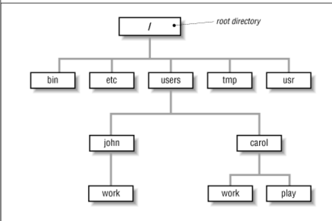
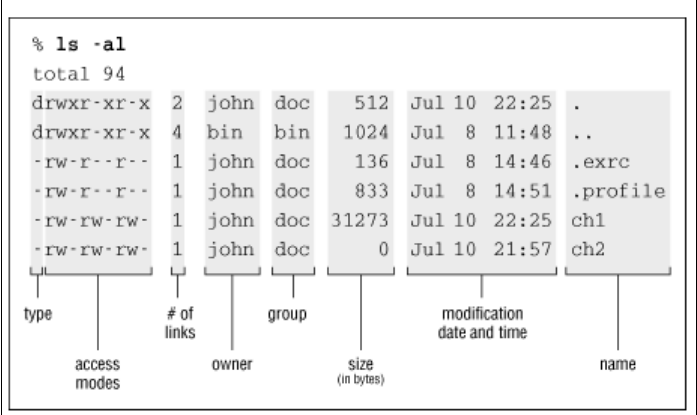

#### Learning  The Unix Operating System

##### Unix的简要发展历程

1964年，美国电话电报公司（AT&T）、通用电器公司（GE）及麻省理工学院（MIT）合作，提出了一个超级分时操作系统的开发计划。这个计划，被命名为Multics OS。Multics是“MULTiplexed Information and Coputing System（多路信息与计算系统）”的意思。借助这套系统，打造一台能够连接1000台终端、满足300人同时在线的计算机，项目持续了5年没有达到预期的目的，率属于AT&T的贝尔实验室宣布退出该计划。

贝尔实验室退出之后，相关的项目组成员就闲了下来。其中就有一个人，名字叫做肯·汤普森（Ken Thompson）肯·汤普森此前在Multics上开发了一款名叫"星际旅行（Space Travel）" 的游戏。退出Multics项目后，肯·汤普森就没办法继续玩这个游戏了。他打算在一台空闲的PDP-7（DEC公司生产的一种小型计算机，性能很低）上，开发一个简单操作系统，运行这个游戏。肯·汤普森趁着妻子回家探亲，用了1个月的时间，使用汇编语言，写出了一个简版的Multics系统（包括一组内核程序，一些内核工具程序，以及一个小的文件系统）。实验室的同事们，将这个系统戏称为Unics。Uni作为前缀，是“单一、一个”的意思。Unics，对应Multics，是“单路信息与计算系统”的意思。后来，大家又取其谐音，直接称其为**“Unix”**。

基于汇编语言编写的Unics，硬件通用性差，无法移植到其它机器上运行。因此，肯·汤普森尝试使用BCPL、PASCAL语言进行重写。但是，效果并不理想。这时，他的同事**丹尼斯.里奇**（Dennis Ritchie）站了出来。丹尼斯.里奇在BCPL语言（也就是B语言）的基础上，开发了一套新的语言，也就是后来如日中天的**C语言**（按字母表顺序，B之后就是C）。不久后，丹尼斯.里奇用C语言重写Unics成功。就这样，Unix操作系统正式诞生了。1973年，丹尼斯·里奇和肯·汤普森正式发表论文，宣布了Unix的存在。消息引起很大反响，很多人都期望学习和研究Unix。贝尔实验室（AT&T）推出了Unix之后，因为受美国政府反垄断制裁的原因，并不能对它进行销售。所以，他们只能将Unix无偿提供给所有人学习。又过了一段时间，AT&T发布了Unix系统第5版，并授权给教育机构使用。1975年，他们第一次以2万美元的价格，授权企业使用Unix第6版。这期间，很多企业和机构开始打Unix的主意。1977年，伯克利大学的研究生比尔·乔伊（Bill Joy），将Unix程序整理到磁带上，推出了BSD版本。BSD，就是Berkeley Software Distribution（伯克利软件发行版）。1978年，SCO（一家服务器系统软件供应商）包装发行了商用版的Unix。目前公认的最完美版本，是1979年发行的System V7。这个版本也被Unix玩家们称为“最后一个真正的UNIX”。1980年，美国国防高级研究计划局（DARPA）准备制定TCP/IP协议，选择了与BSD合作。这大大促进了Unix的发展和普及。

######  Unix的主要两个分支

基于AT&T的System V商用版本Unix和基于BSD的开源版本Unix。商业版本包括SunOS、Solaris、SCO Unix、AIX、HP/UX和 ULTRIX 等，开源版本包括FreeBSD、NetBSD、Linux等。


##### Getting  Start

通过系统管理员分配的账号，连接到本地或者远程的计算机。

* 本地登录。启动计算机，等待终端屏幕显示`login:`信息后，输入正确的用户名[回车]和密码[回车]后可登录，显示shell的提示符，比如`%`或者`$`(shell的提示符可以自定义)。如果输入的用户名或者密码错误，无法通过删除键来修改，只需再次按下回车键，在shell提示符重新出现后，重新输入正确的用户名和密码。在输入密码时屏幕并不会显示你输入的字符。

* 远程登陆。

  在登录本地终端之后，可以运行telnet、rlogin（通过网路登录远程主机）,远程登录程序格式如下：

  > *program-name remote-hostname*

​     登录远程主机后，会在shell的提示符前显示登陆的主机名称，比如：`hostname%`

* 输入的几个简单的shell  comand （这里的shell提示符为%）

  > % date

  > % who 

  > % who am i 

* 更正错误的命令行输入
  * 删除光标左边的内容：Backspace、ctrl+h
  * 删除光标右边的内容:  delete
  * 删除整行的命令行内容: ctrl+u

* 常见的控制符号
  * 中断或者取消命令的执行：**ctrl+c** 或者del键
  * ctrl+z  可以把当前的shell暂停到后台，弹出一个新的shell  （这个需要后期安装好netbsd之后实践一下）
  * 暂停程序输出在屏幕：ctrl+s
  * 继续显示由ctrl+s暂停的屏幕输出：ctrl+q
  * 从程序出退出：**ctrl+d**
    * 在当前的shell提示符下ctrl+d就退出shell
    * 在cat、mail程序中输入ctrl+d退出这些程序，返回到shell
    * exit
  
* logout

  在关闭计算机及电源之前，必须要退出登录的终端。根据不同的shell，可以尝试下边三种logout的命令。

  * exit
  * logout
  * ctrl+d

​      如果是在本地机器登录的终端，logou之后会重新显示login；如果在本地机器使用gnome、kde等窗口系统，关闭窗口系统；如果是登录在远程计算机，logout之后，会显示本地机器的shell，可以继续使用退出终端命令，直到login出现。

* unix命令的基本语法和一般规则

  > command  option(s)  filename(s)

  * 命令大多为小写
  * options一般为单个字母，用`-`作为前缀，多个options之间用空格分开
  * 多个options可以合并在一起，比如`ls -a -l` 可以写为`ls -al`
  * 一些命令可以包含长格式的options，比如`--delete`
  * Options 要写在filename前面
  * 在一个命令行里可以写多条命令，不同的命令之间用分号分隔。
  * 除了shell下输入的command 之外，还有以下command拥有自己专属的命令。比如more、pg、mail，vi、emacs等，在启动这些程序之后，会显示他们自己的命令提示符。比如，如果进入了mail,会看到一个mail的命令提示符，你可以输入这些命令来处理邮件信息。当输入`q`时，退出mail，重新又来到shell的提示符下，可以继续输入其他的shell command 。

* 没有响应的终端

  因为等待连接或者计算机后台正在处理的进程多，需要的资源没有到位等原因，一个unix的session可能会暂时没有响应。可以使用以下几种操作来处理：

  * 也许时在输入了command之后忘记了回车，此时敲个回车试试
  * 输入命令并回车后依然没有反应，输入ctrl+j来reset你的终端。如果还是不起作用，就需要logout你的终端(exit、logout、ctrl+d试试)，然后关闭终端。
  * 如果你的shell支持job  control，试试ctrl+z，这会暂停这个程序，并返回一个新的shell 提示符，利用jobs命令显示正在运行中的进程，然后使用fg命令把那个暂停的程序带到前台运行，或者使用kill命令终止那个暂停的程序。
  * 使用delete键或者ctrl+c键来中断正在运行的程序。如果不起作用，就再按一次。如果还是不起作用，超过两次以上的中断按键不会起作用，只能用别的办法了。
  * 如果是由按下ctrl+s引起的暂停，再试试按下ctrl+q
  * 如果你正在使用类似mail的程序，试试ctrl+d这个手段来终止程序，返回到shell 提示符。

##### 在Unix中使用window

当前的Unix系统支持多种类型的Window系统，比如gnome,kde等。使用Window 系统，可以在一个unix终端一次处理多个session。对于Linux用户来说，可以使用Alt+F1、Alt+F2一直到Alt+F8来开启八个虚拟控制台，每一个虚拟控制台都是一个带有shell提示符的Unix Session。可以在任意一个虚拟控台里独立输入command，在完成任务后，要记得从每个开启的虚拟控制台中logout。Unix中的X window是由Window Manager管理的，常见的管理器有mwm, fvwm, twm。

* 在shell提示符下运行xinit来打开X Window。具体命令要参考自己使用系统的文档，比如有的系统可能是startsx命令。

* 运行Window  Manager。有的系统在使用xinit等命令启动窗口系统时会自动运行window manager 。可以观察以下打开的窗口是否有边框，是否有标题，是否有控制盒子，如果没有这些元素，说明没有启动window manager 。或者鼠标在窗口的空白处单击，如果没有弹出菜单，也说明没有启动window manager ，需要手动运行命令启动window manager 。

  >  mwm &

  > twm  &

  > olwm & 

  > 具体的名称根据自己使用的X window的window  manager名称来决定。

*  **xterm** window

  作为一个最重要的window，**xterm** makes a terminal emulator window with a UNIX login session inside, just like a miniature terminal. 可以在一个打开的xterm窗口使用xterm打开新的客户端，最好在第一个打开的窗口里开启新的客户端，如果shell自带job control的话，就可以很容易控制所有开启的客户端。

```
Here are a few of the X client programs that your system may have:
resize: helps programs in xterm windows recognize new window size
xbiff: tells you when new electronic mail comes in
xclipboard: helps with copying and pasting text
xdpr: prints a window (with the printer)
xedit: simple text editor
xmag: magnifies parts of the screen
xman: browses UNIX manual (reference) pages
xmh: electronic mail program
xset: sets user preferences
```

* 退出X window
  关闭X window的关键是弄清楚谁是那个控制程序，当退出控制程序的时候，其他剩下的X-based程序都会被终止。控制程序通常是那个window manager，或者是第一个启动其他客户端的xterm window。控制程序是xterm,建议把第一个xterm window最小化，在关闭完其他客户端window之后再关闭启动其他客户端的xterm ，这样就不会因为不注意关闭了xterm window，导致过早终止会话。
  
  * 要退出window  manager,选择root menu的Exit菜单项或者Quit菜单项。
  * 如果控制程序是xterm，则先在各个客户程序window中使用可出程序自己的退出命令，结束程序的运行，然后返回到xterm窗口，在xterm的shell提示符下使用exit关闭该xterm window。最后再关闭那个启动其他X  clent  program的xterm  window。
  
##### Unix 用户账户  

作为一个认证账户，登录Unix系统后，就可以享用系统提供三项功能：

* 一个主目录来保存自己的文件

* 一个用户名，用来标识用户自己，可以从其他用户接收信息，并控制其他用户对自己账户下文件的访问。

* 可以自定义喜欢的操作环境

  

###### Unix文件系统

在Unix系统中，一切都是文件，文件系统组织为倒置的树形目录结构。

* 用户的主目录

  用户登录后，主目录就是自己的工作目录。你可以改变到其他目录，那么改变后的目录就是你的工作目录。也即是说，当前目录就是你的工作目录。

* Unix目录组织结构

  

 *root directory* and is written as a forward slash ( / )，*bin*, *etc*, *users*, *tmp*, and *usr* are some of the *subdirectories*。These are fairly standard directories and usually contain specific kinds of system files. For instance, *bin* contains many UNIX commands. Not all systems have a directory named *users*; it may be called *u*,*home*, and/or be located in some other part of the filesystem。

* 绝对路径

* 相对路径

* 目录和文件操作的几个简单命令

  * pwd

  * cd

  * ls 

    > % cd /users/carol
    >
    > % pwd
    >
    > /users/carol
    >
    > % cd work
    >
    > % pwd
    >
    > /users/carol/work
    >
    > %

    > ls  -al

​           

> The long format provides the following information about each file:
>
> *Total n*
>
> *n* amount of storage used by the files in this directory.
>
> *Type*
>
> Tells whether the file is a directory ( d ) or a plain file (-). (There are other less common types 
>
> that we don't explain here.)
>
> *Access modes*
>
> Specifies three types of users (yourself, your group, all others) who are allowed to read ( r ),
>
> write ( w ), or execute ( x ) your files.
>
> *Links*
>
> The number of files and directories linked to this one.
>
> *Owner*
>
> The person who created or owns the file.
>
> % ls -a
>
> . .exrc ch1 ch2 intro
>
> .. .profile ch10 ch3
>
> %*Group*
>
> The group that owns the file. (If your version of UNIX doesn't show this column, add the **-g**
>
> option to see it.)
>
> *Size (in bytes)*
>
> The size of the file.
>
> *Modification date*
>
> The date when the file was last modified.
>
> *Name*
>
> The name of the file or directory.

访问权限列有10位字符，第一个字符代表是目录或者文件，`d`代表目录，`-`短横线代表文件。第2-4位代表owner对文件的访问权限，一般是rwx；第5-7位代表组权限，第8-10代表other  users的访问权限。

对于文件的访问权限来讲，r代表读取，w代表改写，x代表可执行。对于文件的x权限，仅仅限于可执行文件。

对于目录，`r`权限意味着可以列出该目录下的文件和子目录；`w`权限意味着可以向目录新建、删除、修改内容；`x`权限意味着可以访问目录，比如可是用`cd`命令切换到该目录。一般可以把`rx`权限同时开放给目录，方便各种操作。如果仅有`r`权限而没有`x`权限，就无法进入到该目录中。

* chmod

  ```
  # to do list:
  ```

  

* `ls -F`

If you need to know only which files are directories and which are executable files, you can use the **-F** option.If you give the pathname to a directory, **ls** will list the directory but it will *not* change your working directory. The **pwd** command in the following example shows that:

```
% ls -F /users/andy
calendar goals ideas/
ch2 guide/ testpgm*
% pwd
/etc
%
```

```
ls -F puts a / (slash) at the end of each directory name. (The directory name doesn't really have a
slash in it; that's just the shortcut ls -F uses with a directory.) In our example, guide and ideas are
directories. You can verify this by using ls -l and noting the "d" in the first field of the output. Files
with an execute status ( x ), like programs, are marked with an * (asterisk). The file testpgm is an
executable file. Files that aren't marked are not executable.
```

##### 查看文件的内容

  ######  三个查看文件内容的命令：cat、more、pg

* cat (concatnate)  可以把几个小文件连在一起成为一个大文件，也可以把一个文件的内容显示在屏幕上。

  该命令适合一屏可显示的文件，如果一个文件内容过长，一屏显示不下，显示时的滚屏速度超过你阅读的速度，而你又不能往前回看（除非你使用有滚动条的xterm window来显示）。如果你输入了没有提供文件名参数的cat命令，实际上cat会从标准输入(键盘)上读取内容，你可以通过一个回车键，再输入一个ctrl+d告诉cat输入已经结束，离开等待输入的状态。参数filename作为cat命令的输入（standard input），cat把输出显示在屏幕上(standard  output)。
  
* more  文件内容较长的话，使用cat不合适，可以使用more来显示
  
  more后边跟随的filename作为输入，more把输出显示在屏幕上，最屏幕的最下方显示一个光标和提示符，可以在这里输入more自己的命令，用来告诉more进行哪种操作。比如输入`h`,显示more的帮助信息；输入`nf`可以向前移动`n`页；输入`b`可以向后翻一页；具体命令见下面的表格：
  
  | Command  | Description                               |
  | -------- | ----------------------------------------- |
  | [SPACE]  | Display next page.                        |
  | [RETURN] | Display next line.                        |
  | *n*f     | Move forward *n* pages.                   |
  | b        | Move backward one page.                   |
  | *n*b     | Move backward *n* pages.                  |
  | /*word*  | Search forward for *word*.                |
  | ?*word*  | Search backward for *word*.               |
  | v        | Start the **vi** editor at this  point.   |
  | [CTRL-L] | Redisplay current page.                   |
  | h        | Help.                                     |
  | :n       | Go to next file on command line.          |
  | :p       | Go back to previous file on command line. |
  | q        | Quit **more** (before end of  file).      |
  
* pg

  有的unix系统版本没有more命令，而是提供类似功能的pg。pg可以让你移动到指定的行。pg命令在新显示文件内容时，在最后一行显示一个`:`提示符，按下回车浏览下一页，按下`q`键会退出pg，按下`h`会列出pg命令的列表。

  ##### 保护和共享文件

在Unix下共享文件和目录很容易，如何精准控制访问权限很重要。

* **目录的访问权限**

  目录的访问权限将影响到其下面的文件和子目录，获得了目录访问权限后，读取和修改目录下文件的内容是由文件的权限决定的。

* **Unix权限的简单理解**

  * rwx 分别代表read、write 、execute

  * 三位分别代user、group、others

  * rwx三种权限的权重数值:r-4，w-2,x-1

    * rwx：4+2+1=7

    * rw: 4+2=6

    * rx: 4+1=5
    
  * 常见的几个权限数值
    
    755：rwxr-x-r-x (文件的owner拥有rwx三种权限，所以数值为7；group和others 只有rx权限，没有w权限，所以数值为5，表示方法为r-x)
    
  * `chmod` 语法

    * chmod  abc   dirname-filename   这里的abc三位分别代user、group、others。
    * u-g-o三位的表示方法为rwx-rwx-rwx,中间的短横线只是在这里方便显示，在真实的unix系统中使用`ls -al`显示，一般为`drwxr-xr-x`,或者`-rwxr-xr-x` 
    * `chmod  777  dir-name` 、`chmod  755  dir-name`等类似的写法。

* **工作目录权限设置方案**
  
  * 为了防止自己无意中删除目录下的文件和子目录，把工作目录权限设置为555：`chmod 555 your-work-directory/`；为了防止自己无意中删除目录下的文件和子目录，同时拒绝其他人的访问，把工作目录的权限设置为500：`chmod 500 your-work-directory`。
  
  * 为了自己可以在工作目录做任何操作，同时拒绝其他用户访问，把工作目录权限设置为700：`chmod 700 you-work-directory/`
  
  * 为了让自己可以在工作目录做任何操作，让其他用户可以看到该工作目录下文件和子目录，把工作目录权限设置为755：`chmod  755  you-work-directory/`。如果想让其他用户可以编辑工作目录下的文件的话，需要单独把某个文件的写权限分配其他用户，比如`chmod go+w  file-name`。也就是说目录和文件的权限是单独设置共同起效的。
  
  * 为了让同组用户可以完全操作该目录下的文件和子目录，同时让其他用户访问该目录下的文件和子目录，把工作目录权限设置为775：`chmod 755 you-work-directory`。如果其他用户要编辑其下面的文件，需要单独设置文件的写权限。`chmod o+w dir-name/file-name.txt`
  
  * 给Unix系统上的所有用户分配所有权限，设置工作目录权限为777：`chmod 777 work-directory-name/`
  
    > 注意：上面几个`chmod`命令设置目录权限时，在目录名称后边跟了一个`/`，以明确告知shell，这里是操作目录。
  
    > 设置权限时，目录和文件的权限可以单独设置，组合起效。
    
    > 注意：为了访问一个指定的目录，那么从该目录到`root`之间的所有父目录都需要有execution（x）权限

* **文件的访问权限**

  文件的访问权限决定着可以对文件做哪些操作。文件所在的目录的访问权限控制着文件能否被编辑和删除。

  * 为了让一个私有的文件只能被你自己编辑，其他人不能访问，权限设置为600：`chmod 600  filename`;为了防止被自己无意中编辑，设置为400：`chmod 400 filename`。

  * 一个文件只能被自己编辑，其他人只能查看，设置文件权限为644：`chmod 644 filename'。

  * 一个文件只能被自己和用户组的成员编辑，其他用户不能访问，文件权限设置为660：`chmod 660 filename`

  * 为了让非用户组组成员只能查看，用户和组成员可以编辑，设置全系为664：`chmod 664 filename`

  * 让系统中的任何用户都可以编辑该文件，设置文件权限为666：`chmod 666 filename`

    > 上面涉及到文件编辑的权限，用的最多的权限是6(rw)或者4(r)

    > 如果是可执行文件，这要涉及到x权限。

* **Linux的`chattr`**

​    多数Linux系统提供了chattr命令，在设置文件和目录权限上有更多的选择。比如，chattr可以设置文件为append-only，只能追加不能被覆盖；可以被压缩用来节省磁盘空间；设置为immutable，根本不能被修改等等多种选择，具体细节可以查看在线文档。

```bash
# I get the message "chmod: Not owner."
Only the owner of a file or directory can set its permissions. 
Use ls -l to find the owner.
```

##### Unix中的电子邮件

你可以在Unix中撰写信息，通过邮件的形式发送给指定用户。Unix中有很多邮件程序，一些Unix系统有古老而简单的的mail邮件程序。大多数Unix系统有Berkely的`Mail`(大写M)、mailx、mail邮件程序，还有一个受人欢迎的以菜单驱动且简单易学的邮件程序pine。所有这些邮件程序的基本原理都是相同的。

以Berkely的mail邮件程序为例。在邮件接受者登录系统并浏览邮件之前，你发送的邮件信息保存在/usr/mail目录下的文件中。发送邮件的语法如下：

> mail   address1 address2  ...

> 最常见的地址语法格式为：username@hostname，为了保存邮件的副本，可以把自己的地址也添加在邮件地址列表中。

> 在输入完成邮件信息内容后，在单独一行输入一次`ctrl+d`，完成邮件编辑发送，退回到shell  prompt。

>  If you change your mind before you type [CTRL-D] you can 
>
> cancel a message (while you are still entering text) by entering **~q** (a tilde character, then the letter
>
> "q") at the start of a line. The cancelled message is placed in a file called *dead.letter* in your home 
>
> directory. To see other commands you can use while sending mail, enter **~?** (tilde question mark)
>
> at the start of a line of your message, then press [RETURN]. To redisplay your message after
>
> using **~?**, enter **~p** at the start of a line.

```
#邮件撰写及发送的例子

% mail alicia@moxco.chi.il.us
Subject: My trip to Chicago is on!
Alicia, I will be able to attend your meeting.
Please send me the agenda. Thanks.
^D
%
```

* 读取邮件

  在shell 提示符下输入mail，进入mail程序

> ```
> % mail
> Mail version SMI 4.0 Wed Oct 23 10:38:28 PDT 1991  Type ? for help.
> "/usr/spool/mail/alicia": 2 messages 1 new
> >U  1 bigboss         Sat May 22 06:56  19/529  In your spare time
> N  2 jpeek@jpeek.com Tue Nov  4 14:25  14/362  My trip to Chicago
> # 注释：& 是mail程序的命令提示符
> & 2
> Message 2:
> Date: Tue, 4 Nov 1997 14:25:43 EST
> From: jpeek@jpeek.com (Jerry Peek)
> To: alicia@moxco.chi.il.us
> Subject: My trip to Chicago is on!
> Alicia, I will be able to attend your meeting.
> Please send me the agenda.  Thanks.
> # 注释：d删除当前右键
> & d
> # 注释：退出mail回到Unix shell prompte
> & q
> Held 1 message in /usr/spool/mail/alicia
> %
> ```


When you start **mail**, it prints a  "message header" that shows whether each message is "new" (N) or "unread" (U), a  message number, the sender, and when the message was sent. A ">" marks the  current message. You can read any message by entering its number; if you use a  command without a number, the command acts on the current message. If you read a  message and don't delete it, the message is automatically moved to a file called  *mbox* in your home directory.

The output of **mail** says that the  message was sent by Jerry on Tuesday, November 4, at 2:25 p.m. The ampersand  (&) on the last line is the **mail** program prompt.  Just as the UNIX shell prompt is a sign that the shell is waiting for you to  enter a command, the mail prompt is a sign that the **mail** program is waiting for you to enter a mail command.  Your mail prompt may consist of a single character. Learn the mail prompt on  your system and enter one of the commands in [Table 3.2](ch03_04.htm#LUX-CH-3-TAB-1). For instance, Alicia might have chosen to enter **r** to reply to Jerry before using **d** to delete his message.

| Command     | Description                                                  |
| ----------- | ------------------------------------------------------------ |
| ?           | Display menu of mail commands.                               |
| #           | Show message number #.                                       |
| n           | Display the next message.                                    |
| p           | Display current message.                                     |
| d           | Delete the message. Messages you read and don't delete are saved  in *mbox*. |
| m *addrs*   | Mail a message to the addresses *addrs*.                     |
| r           | Reply to sender of current message.                          |
| R           | Reply to sender and other recipients of current  message.    |
| s *file*    | Save a message in the named *file*.                          |
| file *file* | Handle the messages in the named *file*.                     |
| file %      | Handle the messages in your system mailbox.                  |
| h           | Display summary of messages.                                 |
| q           | Quit the **mail** program.                                   |
| x           | Exit the **mail** program, ignoring any  changes you made during this session. |

##### 自定义你的账户

在你的Unix主目录下，可能会有一个隐藏的名称为.profile的文件，如果不是这个文件，那可能会有其他一个或者多个隐藏的文件，比如：` .login, .cshrc, .tshrc, .bashrc, .bash_profile, or .bash_login`。这些文件是设置自定义shell的关键所在。当你login时或者开启新的shell时，设置文件中的命令会自动运行，任何可以在shell prompt下运行的命令都可以放在设置文件中，当登录shell时就会自动运行。

使用cat命令分别查看.profile和.login文件的内容如下：

```
PATH=/bin:/usr/bin:/usr/local/bin:
export PATH
/usr/games/fortune
date
umask 002
stty erase ^H intr ^C
```

```
set path = (/bin /usr/bin /usr/local/bin .)
/usr/games
date
umask 002
stty erase ^H intr ^C
```

文件中的` PATH= `or `set path = `用来告诉 shell搜索路径，在运行命令时不必输入绝对路径。 第一种方法用`:`分隔多个目录，第二种方法用空格分隔多个目录。

> The **umask** command sets the default file permissions assigned to all files you create.
>
> Briefly, a value of 022 sets the permissions rw-r--r-- (read-write by owner, but read-only by
>
> everyone else), and 002 will produce rw-rw-r-- (read-write by owner and group, but read
>
> only by everyone else). If this file is a program or a directory, both **umasks** will also give
>
> execute ( x ) permission to all users.

`stty  erase  ^H  intr ^C`用来设置终端的控制字符，删除使用`ctrl+h`键，中断使用`ctrl+c`键。控制字符也可以在shell prompt下使用命令来设置，比如：

> % stty erase ^?    这里删除控制字符就设置为`ctrl+?`键。


##### Unix文件管理

* 建立文件的几种方法

  * 使用vi、emacs、pico等编辑器来新建文件
  * 使用unix的重定向(`>`、`>>`)功能把命令行输出保存到文件
  
* 文件和目录名称
  
  目录实际上一种特殊的文件，因此目录的名称和文件的名称遵循一个标准。除了`/`这个字符外（作为文件路径中的分隔符），其他字符都可以应用到文件名称。文件名称一般由大小写字母、数字、`.`、下划线`_`和其他字符组成，甚至空格也可以出现在文件名称中，建议使用字母、数字、`.`、`_`四类字符作为文件名称。一些Unix系统限制文件名称不超过14个字符，多数新系统支持更长的文件名长度。

* 文件和目录名称的通配符

  常用的通配符有`*`，`?`，`[]`，这些用在文件名中的通配符作为参数传递给使用的命令

  * `*`表示0个、1个或者任意多个字符。比如`*al* for alphabet.txt`，第一个`*`表示0个字符，也就是字母`a`前边可以没有字符。
  
    ```
    % ls  *a*a*  
    可以匹配到
    aha   首尾的*匹配0个任意字符，也就是说没有任何字符，中间的*匹配了一个h,最后匹配为aha
    aa    a*a中间的*匹配0个字符，也就是没有字符，最后匹配成了aa
    xaaax  收尾的*号匹配了两个x,中间的*匹配了一个字母a,最后匹配成了xaaax
    ```
  * `?`表示单个任意字符
  
  * `[]`在方括号中间的多个不同字符，匹配单个字符。也可以使用连字符`-`来分隔一个范围的连续字符，比如 *chap*[1-3] 将匹配 chap1,chap2, or chap3。
  
    ```
    % ls  [CcHh]apt
    最终匹配为capt、hapt
    ```
  
    通配符不仅仅应用在文件列表方面。很多Unix命令接受多个文件名参数，这样就可以使用通配符放在命令行。比如 :
    
    ```
    % more *.old
    
    This is equivalent to "**more chap1a.old chap3.old**".
    ```
  
* 管理文件
  
  *  建立目录（根据文件功能分类建立不同的目录）
  
    ```
    % mkdir  tools  app
    ```
    
  * 复制文件
    
    > cp oldname newname   
    >
    > cp  /etc/passwd password
    >
    > --这条命令是换名复制,把/etc/passwd文件复制到工作目录下的password
    
    > cp  old     dir
    >
    > --这条命令是同名复制到其他目录
    
    > % cp ../john/ch1  ../john/ch2  ../john/ch3  work
    >
    > --将多个文件复制到work目录下
    
    >% cp -i ../john/ch[1-3] work
    >
    >cp: overwrite work/ch2? n
    >
    >这条命令添加-i参数，在有覆盖文件时提示是否覆盖，并在命令中使用文件名称通配符匹配
    
    > % cp ../john/ch[1-3] .
    >
    > 这条命令复制文件到当前的工作目录下，用`.`表示当前目录，也就是工作目录
    
    在复制文件时常见的几种错误：
    
    ```
    #  "cp: cannot copy file to itself".
    在同一个目录下复制文件时，两个文件名称要不同
    #  "cp: filename: no such file or directory".
    检查文件和目录名称是否拼写正确，如果要复制的文件不在工作目录，要使用正确的路径
    # cp: permission denied".
    你可能没有复制其他用户创建的文件的权限；或者对的目标目录没有权限。
    可以使用 ls -l 查看文件的ower和权限，或者使用ls -ld 查看一下目录的权限
    申请管理员更改文件和目录的访问权限
    ```
    
  * 远程复制rcp  
  
    可以使用rcp在本地计算机和远程计算机之间，或者在远程计算机之间复制文件
    
    ```
    % rcp giraffe:report.may giraffe:report.june .
    这条命令把主机名称为giraffe的两个文件：report.may和report.june复制到工作目录下
    ```
    
    ```
    % rcp "giraffe:food/lunch/*" .
    这条命令把主机名称为giraffe上的food/lunch/目录下的所有文件复制到当前的工作目录`.`
    rcp中使用通配符时，要使用""把主机名称和文件名包括进来。
    ```
    
    rcp命令并没有交互式的参数`i`，因为安全的原因，管理员并不倾向于让用户使用rcp来复制文件，而是推荐使用ftp。
    
   * ftp
  
     使用ftp在两台计算机之间通过网络传输文件，两台计算机不必都运行Unix系统。
  
     运行ftp后，ftp会提示你输入远程计算机的用户名和密码，有点类似远程登录的样子。ftp会显示自己的命令提示符，输入相关的命令来完成文件的传输。下面显示ftp的command。
     
| Command              | Description                                                  |
| -------------------- | ------------------------------------------------------------ |
| **put** *filename*   | Copies the file *filename* from your local  computer to the remote computer. If you give a second argument, the remote copy  will have that name. |
| **mput** *filenames* | Copies the named files (you can use wildcards) from local to  remote. |
| **get** *filename*   | Copies the file *filename* from the remote  computer to your local computer. If you give a second argument, the local copy  will have that name. |
| **mget** *filenames* | Copies the named files (you can use wildcards) from remote to  local. |
| **cd** *pathname*    | Changes the working directory on the remote machine to *pathname* (**ftp** usually starts at  your home directory on the remote machine). |
| **lcd** *pathname*   | Changes **ftp**'s working directory on the  local machine to *pathname* (**ftp** starts at your working directory on the local  computer). Note that the **ftp lcd** command changes only  **ftp**'s working directory. After you quit **ftp**, your shell's working directory will not have  changed. |
| **dir**              | Lists the remote directory (like **ls  -l**).                |
| **binary**           | Tells **ftp** to copy the following file(s)  without translation. This preserves pictures, sound, or other  data. |
| **ascii**            | Transfers plain text files, translating data if  needed.     |
| **quit**             | Ends the **ftp** session and takes you back to a shell  prompt. |

Entering **help** at an `ftp>` prompt gives a list of all commands; entering **help** followed by an **ftp**  command name gives a one-line summary of that command.

 下面的例子是登录ftp,把远程主机rhino上work目录下的todo文件复制到本地机器的工作目录。


> ```
> % ls
> afile   ch2    somefile
> % ftp rhino
> Connected to rhino.zoo.com.
> Name (rhino:carol): csmith
> Password:
> ftp> cd work
> ftp> dir
> total 3
> -rw-r--r--  1 csmith   mgmt    47 Feb  5  1997 for.ed
> -rw-r--r--  1 csmith   mgmt   264 Oct 11 12:18 message
> -rw-r--r--  1 csmith   mgmt   724 Nov 20 14:53 todo
> ftp> get todo
> ftp> quit
> % ls
> afile   ch2    somefile    todo
> ```

* 重命名和移动文件

  使用`mv`命令可以重命名文件名称，也可以把文件移动到其他目录(正如mv命令的名字所示：move)。

  > mv  oldname  newname
  >
  > mv命令可以覆盖存在的同名文件，可以实现文件版本的更新。如果不想覆盖存在的文件，要确认文件名称，也可以带上交互式的`i`参数，在覆盖式给出提示信息。
  >
  > mv 完成名称变更后，使用`ls` 命令查询会发现oldname就不见了。

  > mv  filename   /users/work1/
  >
  > 把文件移动到指定目录

* 搜索文件（find）

  先把目录切换到自己的主目录，让`find`命令从这里开始搜索。
  
  ```
  # 不带任何参数的cd命令切换工作目录到用户主目录
  % cd
  
  # 在.代表的当前目录下查找type为file ,名称为chap*的文件，并打印出来
  % find . -type f -name 'chap*' -print
  ./chap2
  ./old/chap10b
  
  # 在.代表的当前目录下查找type为file,-mtime 修改时间为2天的文件
  % find . -type f -mtime -2 -print
  ./work/to_do
  
  >The first command looked in your working (home) directory and all its subdirectories for files
  >(type f) whose names start with chap. (find understands wildcards in filenames.) The second
  >command looked for all files that have been created or modified in the last two days (-mtime -2).
  >The relative pathnames that find finds start with a dot (./), the name of the working directory,
  >which you can ignore.
  
  ```
  
  在Linux系统中，可以使用locate来查找文件，详细文档可以查询Linux文档
  
  > ```
  > % locate alpha
  > /users/alan/alpha3
  > /usr/local/projects/mega/alphatest
  > 
  > 这条命令查找包含alpha的所有文件，是通过绝对路径显示的
  > ```

* 删除文件和目录

  * rm  filename

    使用rm删除文件时，可以在文件名中使用通配符，但是一定要养成好习惯，在删除之前使用`ls  `附带这些要删除的、使用通配符表示的文件列表，确认一下是否是自己要删除的文件列表。比如:

    > ```
    > % ls c*
    > ...
    > % rm c*
    > 注意这个c*的写法，字符c和*号之间一定不能有空格，c*和c *是完全不一样的表达，前者是删除字母c开头的所有文件，后者是删除名称为c的文件和所有文件。
    > ```

  * rmdir  dirname
  
    使用rmdir可以删除一个目录，但是目录下面有文件和子目录时，无法删除该目录。因此，要删除一个目录，首先要切换到该目录下，删除下面的所有文件，然后再切换回来，使用`rmdir  dirname`来删除目录。
  
    > ```
    > To delete a directory that contains some files:
    > 1. Enter cd dirname to get into the directory you want to delete.
    > 2. Enter rm * to remove all files in that directory.
    > 3. Enter cd .. to go to the parent directory.
    > 4. Enter rmdir dirname to remove the unwanted directory
    > ```

​             当然，对unix的目录和文件操作熟悉了以后，可以使用`rm -r  dirname`来彻底删除一个目录拥有的所有内容。这里的`r`代表recursive。

* 打印文件

  在Unix中打印文件之前，可以使用文本格式化工具把文件重新排版一下，打印出来更美观。大多数Unix自带两个强大而复杂的工具：nroff 、troff，当然，还有一个相对简单的pr。

  * pr *option(s) filename(s)*

  pr只是把格式化的内容显示在屏幕或者打印机，并不是修改源文件。下表显示了部分pr命令的选项 

  | Option        | Description                                             |
  | ------------- | ------------------------------------------------------- |
  | -*k*          | Produces *k* columns of output.                         |
  | -d            | Double-spaces the output (not on all **pr**  versions). |
  | -h "*header*" | Takes the next item as a report *header*.               |
  | -t            | Eliminates printing of header and top/bottom  margins.  |

  还有一下其他选项用来指定列宽，设置页面长度等等。

  下面是一个带有Header的两列的报告

  > ```
  > % pr -2 -h "developtment tools" food
  > 
  > Nov  7  9:58 1997  developtment tools   Page 1
  > 
  > perl                  c
  > php                   c++
  > python               java
  > javascript             go 
  > 	.
  > 	.
  > %
  > ```

  可以在pr后边使用一个`pipe` ,把内容给输出到打印机（ **lp**  or **lpr**）

  * **lp** or  **lpr**

    你的Unix系统会包含两者中的其中之一。可以把文件打印到默认的组内成员共享的打印机上。

    > lp  docname

  * 查看打印队列

    > ```
    > If you want to find out how many files or "requests" for output are ahead of yours in the printer 
    > queue, use the command lpstat (for lp) or lpq (for lpr). The cancel command lets you terminate
    > a printing request made by lp; lprm cancels jobs from lpr.
    > ```

    > -- 注释：下面的命令显示有所的打印任务
    >
    > % lpstat -o
    > laserp-573 john 128865 Nov 7 11:27 on laserp
    > laserp-574 grace 82744 Nov 7 11:28
    > laserp-575 john 23347 Nov 7 11:35
    > %
    
  * 取消打印(cancel and lprm)
  
    > ```
    > cancel terminates a printing request from the lp command. lprm terminates lpr requests. You
    > can specify either the ID of the request (displayed by lp or lpq) or the name of the printer.
    > If you don't have the request ID, get it from lpstat or lpq. Then use cancel or lprm. Specifying 
    > the request ID cancels the request, even if it is currently printing
    > ```

##### 输入输出的重定向

通常情况下，Unix命令从键盘获得输入数据，把运行结果显示在屏幕上，这是标准的输入和输出。很多Unix命令都会带一个文件名作为参数输入，如果不带文件参数，那么这个命令就会从键盘获得输入，这就是标准输入。

> cat  filenmae    
>
> 这种形式属于正常的参数传递机制，不属于输入重定向的范畴

> cat    
>
> 不带参数的形式，就会进入标准输入模式

这里主要说明标准的输入输出和输入输出的重定向，而正常的带参数命令调用不在这个范围。但是如果命令调用时不指定参数，接受输入的命令就会进入到标准输入模式，接受用户从键盘输入数据。

* 输入的重定向

  把一个文件名以非参数传递的形式传递给Unix命令，这样的形式就是输入重定向。比如：

  > % mail bigboss@corp < to_do
  >
  > 输入重定向的操作符为"<"

* 输出重定向

   可以把命令行的结果输出重定向到一个新的文件中，或者其他设备，而不是标准输出在屏幕上。输出重定向操作符为`>`和`>>`。当然管道操作符`|`也属于输出重定向范畴，把一个命令的输出通过`|`变成另外一个命令的输入（或者说|左边的命令行输出作为|右边命令的输入），还可以在一个命令行中使用多个管道操作符。

  * `>`操作符

    可以使用`cat > filename`来新建一个文件。正常情况下，`cat  filename`会在屏幕上显示文件的内容，但是cat命令后边不带文件作为参数的话，就会转换为从标准输入中获得数据，然后再配合`>`的使用，就可以把输入的内容保存在一个文件中。示例如下：

    > ```
    > % cat > to_do
    > learn  the unix  operating system
    > build  note for  my learn of the  unix  operating system
    > learn  linux bible
    > ^D
    > %
    > ```
    >
    > Type [CTRL-D] on a new line by itself to signal the end of the text. You should get a shell prompt.

    > ```
    > cat file1 file2 > newfile
    > ```
    >
    > 使用这种方式可以把两个小文件合并为一个文件

    > ```
    > 使用`>`实现重定向功能，可能会覆盖现存文件。很多shell能够保护现存文件不被重定向覆盖。在C shell中，使用`set noclobber`，在Korn shell和bash中，使用`set -o noclobber`。可以把这些命令写在shell的启动文件中，shell就不允许重定向到一个现存文件中而导致文件内容丢失
    > ```
    >
    
  * `>>`操作符
  
    都是重定向输出操作符，和`>`操作符不同，该操作符是在文件尾部追加的形式添加内容。  

* 管道和过滤器

  除了重定向输入输出到一个文件之外，你可以把两个命令连接起来，一个程序的输出变成另外一个程序的输入。把两个或者更多的命令连接起来形成一个管道（pipe）。在Unix中使用`|`操作符来构建一个管道，`|`左侧的命令行的标准输出变成`|`右侧命令的标准输入。在Unix中，只要一个程序能够把数据写入到标出输出，而另外一个程序可以从标准输入中读取数据，任何这样的两个程序都可以组成一个管道。

  一个程序读取另外一个程序的输出数据，然后对这个读取的数据进行加工或者筛选，再次以管道的形式输出给下一个程序，或者最终输出到屏幕，这个过程叫做过滤。Unix的过滤器作用就是挑选数据后再次重构输出。几乎所有的Unix命令都可以用来形成管道。一部分程序除了自身的强大功能之外，常被用来作为过滤器使用，比如`grep`、`sort`、`pg`、`more`。

  * `grep`
  
    `grep`的名字来源于行编辑器`ed`的`g/re/p`命令，意思是全局搜索正则表达式并打印包含它的所有行。
    
    > ```
    > % ls -l | grep "Aug"
    > -rw-rw-rw- 1 john doc 11008 Aug 6 14:10 ch02
    > -rw-rw-rw- 1 john doc 8515 Aug 6 15:30 ch07
    > -rw-rw-r-- 1 john doc 2488 Aug 15 10:51 intro
    > -rw-rw-r-- 1 carol doc 1605 Aug 23 07:35 macros
    > %
    > ```
    >
    > 把 `ls -l` 的输出通过管道输入给grep，grep搜索包含"Aug"的行，输出到屏幕
    
    > ```
    > % ls -l | grep "carol.*Aug"
    > -rw-rw-r-- 1 carol doc 1605 Aug 23 07:35 macros
    > %
    > ```
    >
    > 在grep后面的正则表达式中，`carol`和后边的`.*Aug`之间是有空格的，是两个分开的模式。其中`.*`组合在一起表示任意数量的单个字符，`.`表示任意单个字符，而`*`是个量词，用来说明前边的`.`重复次数。正则表达式里单独的`*`号没有意义，和文件通配符中的`*`不同。正则表达式很复杂，这里先了解一点，以后再慢慢学习。
    
  * sort
  
    sort根据指定的参数按照字母和数字进行排序，但是并不会修改源文件，只是把排序的结果输出到屏幕。sort默认是按照字母顺序排序的，有选项来设置排序规则
  
    | **Option** | **Description**                                              |
    | ---------- | ------------------------------------------------------------ |
    | -n         | Sort numerically (example: 10 will sort after 2), ignore blanks and tabs. |
    | -r         | Reverse the order of sort.                                   |
    | -f         | Sort upper- and lowercase together.                          |
    | +*x*       | Ignore first *x* fields when sorting                         |
  
    > ```
    > % ls -l | grep "Aug" | sort +4n
    > -rw-rw-r-- 1 carol doc 1605 Aug 23 07:35 macros
    > -rw-rw-r-- 1 john doc 2488 Aug 15 10:51 intro
    > -rw-rw-rw- 1 john doc 8515 Aug 6 15:30 ch07
    > -rw-rw-rw- 1 john doc 11008 Aug 6 14:10 ch02
    > %
    > ```
    >
    > 这个管道把`ls -l`的显示结果通过‘’Aug“进行搜索，只显示目录下8月份修改的文件，然后使用`+4n`作为排序参数，意思是跳过前四个字段，使用第五个字段（文件大小）尽心排序，最终显示在屏幕上。
    
  * more、pg
  
    > ```
    > % ls -l | grep "Aug" | sort +4n | more
    > -rw-rw-r-- 1 carol doc 1605 Aug 23 07:35 macros
    > -rw-rw-r-- 1 john doc 2488 Aug 15 10:51 intro
    > -rw-rw-rw- 1 john doc 8515 Aug 6 15:30 ch07
    > -rw-rw-r-- 1 john doc 14827 Aug 9 12:40 ch03
    > .
    > .
    > .
    > -rw-rw-rw- 1 john doc 16867 Aug 6 15:56 ch05
    > --More--(74%)
    > ```
    >
    > 如果工作目录下的文件很多，一屏显示不下，就可以利用more 或者pg来分屏显示

##### Unix的多任务

* 在后台运行命令行

  只需要在命令行的尾部添加一个`&`就可以让改命令行在后台运行。

  > ```
  > % nroff -ms chap1 > chap1.out &
  > [1] 29890
  > %
  > ```
  >
  > nroff是文档格式化程序，一般大一点的文档在格式化时会花点时间，因此更适合在后台运行，而不需要等待。命令行结尾的`&`前边要有一个空格分开。
  >
  > 在命令行运行后，显示一个数字，就是PID，有了这PID，可以根据需要进行查询、暂停、终止进程的运行。

  > ```
  > 在C shell中，可以把多条命令用分号隔开写在一行上，把整个命令行用括号包括，最后在结尾添加`&`。比如：(command1; command2) & 
  > ```

  > ```
  > 在很多Unix系统中，shell有job控制特性，这样你可以使用ctrl+z键来暂停运行在前台的程序，然后会开启一个新的shell，你可以运行各种命令，包括使用bg命令把刚才暂停的程序带入到后台运行，也可以使用fg命令把后台程序转如前台运行。
  > ```
  >
  > 示例：
  >
  > ```
  > For example, you might start sort running on a big file, and, after a minute, want to send email.
  > You stop sort, then put it in the background. The shell prints a message, then another shell
  > prompt. You send mail while sort runs
  > ```
  >
  > ```
  > % sort hugefile1 hugefile2 > sorted
  > ...time goes by...
  > [CTRL-Z] Stopped
  > % bg
  > [1] sort hugefile1 hugefile2 > sorted &
  > % mail eduardo@nacional.cl
  > ...
  > ```
  >
  > 在这里先使用ctrl+z暂停程序，然后使用bg把程序带入到后台运行，然后可以做别的任务。

* 查看进程

  * ps  （查看进程）

    > ```
    > % ps
    > PID TTY TIME COMMAND
    > 8048 020 0:12 sh
    > 8699 020 0:02 ps
    > %
    > ```
    >
    > ```
    > In its basic form, ps lists the following:
    > Process ID (PID)
    > A unique number assigned by UNIX to the process.
    > Terminal line (TTY)
    > The terminal number from which the process was started.
    > Run time (TIME)
    > The amount of computer time (in minutes and seconds) that the process has used.
    > Command (COMMAND)
    > The name of the process.
    > ```

  * kill(终止进程）

##### Standard UNIX Documentation

almost all UNIX documentation is derived from a manual originally called the **UNIX Programmer's Manual**

> ```
> man command
> ```

##### Unix Programming

