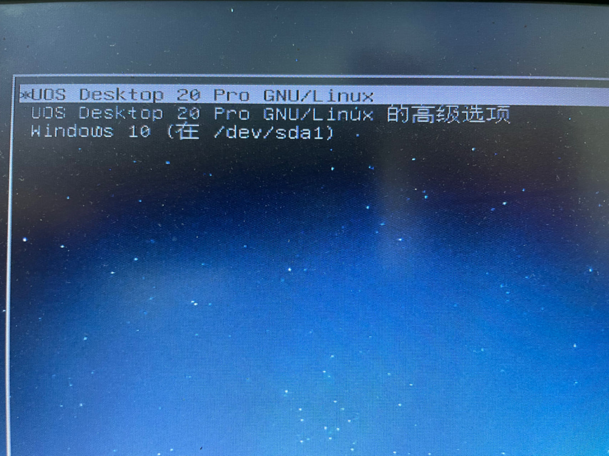
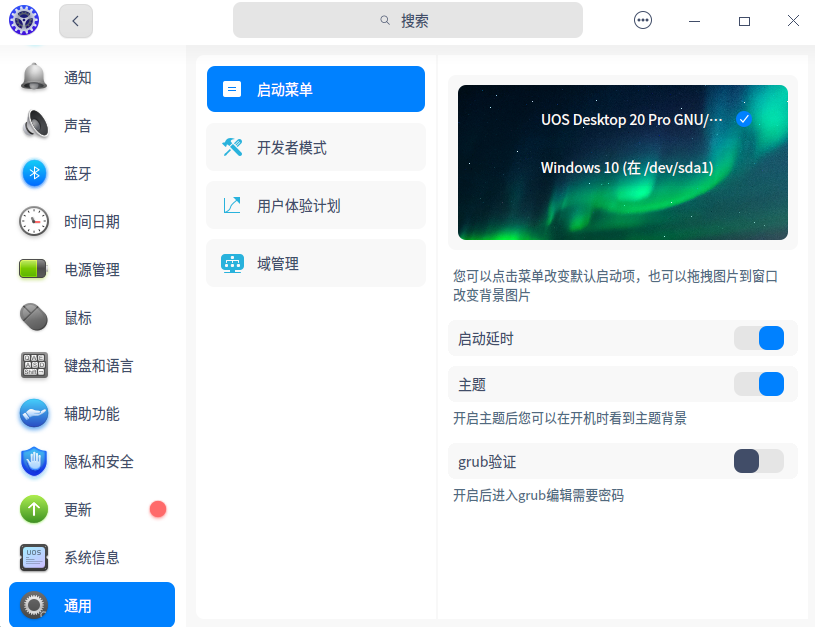

十年前玩过linux,感觉熟悉了基本的玩法，但是并没有做笔记的习惯，发现好多以前了解比较深入和细致的知识点，现在好多都忘记了，甚至要从新再拾起来。工作中也许有机会更换到linux平台。先记录个最基本的入门知识，安装linux的发行版通信UOS，一个国产Linux发行版，是收购了Deepin Linux之后的发行版。毕竟是国产的发行版，使用起来顺手很多。在熟悉unix&linux基本知识之前，最基础的应该是对分区的认识。下面是几种常见的分区方案：

#### 三种分区方案

* 两个分区：linux的根分区/（至少10G以上空间）和一个swap分区

* 三个分区：linux根分区/、swap分区和boot分区

* 多个分区： 

  * linux根分区/,类型是主分区，文件系统ext4,挂载与/，须大于10G

  * swap分区，交换分区，文件类型为linux-swap，相当于windows的虚拟内存。物理内存小于4G的，swap设置为2倍内存大小；内存大于4g且小于16G,设置为内存大小的swap空间。
  * boot分区，存储引导信息，一般设置为2G
  * home分区,用于存放文件，设置为100G
  * /usr/local  存储应用软件安装信息，
  * opt分区  
  * var分区   系统日志信息。一般是服务器用的分区，普通电脑可不用新建此分区, 分区大小根据服务器功能多少决定分区空间大小。
  * recovery   在尾部的一个恢复分区，设置为10G

最好一个分区一个挂载点， 建立交换分区和恢复分区时，自动分配挂载及磁盘文件系统格式， 其他分区要手动挂载并且手动选磁盘文件系统格式，选EXT4就行。不要仅仅只有1个根分区而没有其他分区，如果根分区坏了，整个电脑数据就丢了。分配多个分区，其中一个分区坏了，不影响其他分区的数据。

#### 安装

从上面的分区方案来看，除了Windows之外，至少留两个以上的主分区。如果一台机器上只安装linux在分区要简单点，可以直接选择UOS提供的全部安装，会自动创建以上分区。新入门最好选择手动安装，熟悉一下多分区的创建。

* 下载UOS ISO镜像

* 在Deepin linux的网站上下载deepin-boot-make制作U盘安装工具。也可以使用rufus.exe来制作UOS安装U盘

* U盘启动后，选择手动安装模式，新建根分区(/,20G)、boot分区(3G)、swap分区(8G)、home分区(30G)、/usr/local (30G),把系统装在/分区。

* 安装完毕后，系统重启，如果有Windows系统共存，会显示多启动菜单。如下图：

  

* 登录系统后，显示类似X-windwos的可视化窗口，操作起来和windows很像。如果网络通畅的话，可以在应用商店里应用程序

  

* 可以在控制中里找到通用，然后找到启动菜单(设置启动延迟)、开发者模式（开启root用户权限）

到这里就可以使用UOS来完成基本的办公环境的构建，如果国产替代把办公设备的硬件适配做的再好点，国产替代也是很有市场和希望的，国产加油。

#### Unix&Linux的基础知识学习

##### UNIX发展史

1964年贝尔实验室（Bell Labs）、通用电气（General Electric）和麻省理工学院（MIT）联合启动研发第二代分时操作系统**MULTICS**（Multiplexed Information and Computing Service）(注：MULTICS正式研制始于1965年)

省理工学院合作的MULTICS计划，该计划的目的是让大型机支持300个以上的终端连线使用。因进度不理想、资金不到位，贝尔实验室退出该计划。1969年，贝尔实验室研究人员Ken Thompson在退出MULTICS项目时，准备将原本在MULTICS系统上开发的“star travel”游戏转移到DEC PDP-7上运行。在转移游戏程序运行环境的过程中，Thompson和Dennis M.　Ritchie共同动手设计了一套包含文件系统、命令解释器以及一些实用程序的支持多任务的操作系统。与Multics相对应，这个新操作系统被同事Brian Kernighan戏称为UNICS（UNiplexed　Information and Computing System，非复用信息和计算机服务），之后大家取谐音便叫成了UNIX。

1970年Thompson尝试用Fortran重写UNIX失败后整合BCPL成B语言，1971年他用B语言在PDP-11/24上重写UNIX，当年的11月3日，UNIX第1版（UNIX V1）正式诞生。

1972年，UNIX发布了第2版，最大的改进是添加了后来成为UNIX标志特征之一的管道功能。在开发UNIX V2的时候，Ritchie给B语言加上了数据类型和结构的支持，推出了C语言。

1973年，Thompson和Ritchie使用C语言重写了UNIX，形成第3版UNIX。在当时，为了实现最高效率，系统程序都是由汇编语言编写，所以Thompson和Ritchie此举是极具大胆创新和革命意义的。用C语言编写的Unix代码简洁紧凑、易移植、易读、易修改，为此后UNIX的发展奠定了坚实基础。

1974 年 Thompson 与 Ritchie 共同在 Communications of the ACM 发表 了一篇 UNIX 论文  "UNIX Time-Sharing System" 得到相当大的回响。 1975 年 UNIX  发表第六版（V6）﹐其提供的强大功能更胜过当时昂贵的大型计算机操作系统，其最大特点是以高级语言写成(C语言)，仅需要做少部份程序的修改便可移植到不  同的计算机平台上。 UNIX V6 版本并附有完整的程序原始码在 1976 年正式从 贝尔实验室内部传播到各大学及研究机构，UC  Berkeley 依据这个版本开 始研究并加以发展，并在 1977 年发表 1 BSD（1st Berkeley Software  Distribution）版本的 UNIX OS，其后续的发展更为 UNIX OS 贡献良多且影响深远。

1980年，美国电话电报公司发布了UNIX的可分发二进制版（Distribution Binary）许可证，启动了将UNIX商业化的计划。

1981年，美国电话电报公司基于UNIX V7开发了UNIX System III 的第一个版本（1982年发布）。这是一个商业版本，仅供出售。

1983年，美国电话电报公司成立了UNIX系统实验室（UNIX System Laboratories，USL），并综合其他大学和公司开发的各种UNIX，开发出UNIX System V Release  1（简称SVR1）。这个新的UNIX商业发布版本不再包含源代码。美国电话电报公司开始积极地保护UNIX的源代码。从发布System  III开始，该公司的所有UNIX版本转由一个强调稳定的商业发行版本小组进行维护。

此后，其他一些公司也开始为其自己的小型机或工作站提供商业版本的UNIX系统，有些选择System V作为基础版本，有些则选择了BSD。BSD的一名主要开发者，Bill Joy，在BSD基础上开发了SunOS，并最终创办了SUN公司。

UNIX System V Release  4发布后不久，AT&T就将其所有UNIX权利出售给了Novell。Novell期望以此来对抗微软的Windows  NT，1993年Novell将SVR4的商标权利出售给了X/OPEN公司，后者成为定义UNIX标准的机构。1996年，X/OPEN和OSF/1合并，创建了国际开放标准组织，由它公布的“单一UNIX规范”定义着具有什么特征的操作系统可以冠上UNIX之名，相对地，不符合这些标准但与Unix有类似性的操作系统只能称为“类Unix”(unix-like)。

至此，Unix发展主线就是System V基础版、BSD。而 Minix（Unix操作系统的教学工具）启发了Linux的诞生，自从Linux加盟了GNU(GNU Linux)阵营后，迅速发展壮大，诞生了RedHat、CentOS、Debian、Ubuntu等发行版Linux。

有空看看《UNIX传奇》、《Unix编程艺术》这两本书，对UNIX发展会有更详细的认识。

关于UNIX发展史的链接文档：

[UNIX操作系统发展史简介](https://mp.weixin.qq.com/s/GgXAGj0Kbo1gKPT4D4WYSA)

[UNIX发展史](https://www.cnblogs.com/Dodge/articles/4264833.html)

#####  Linux发展史

##### Linux的常见命令

了解一下Debian、Ubuntu、Redhat、CentOS这几个Linux发行版，我作为新手就先从Ubuntu入手。

