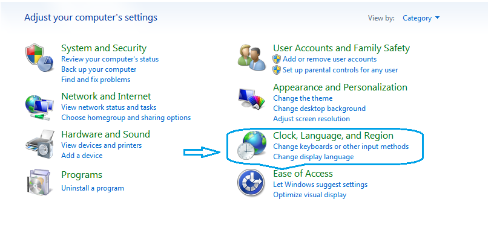
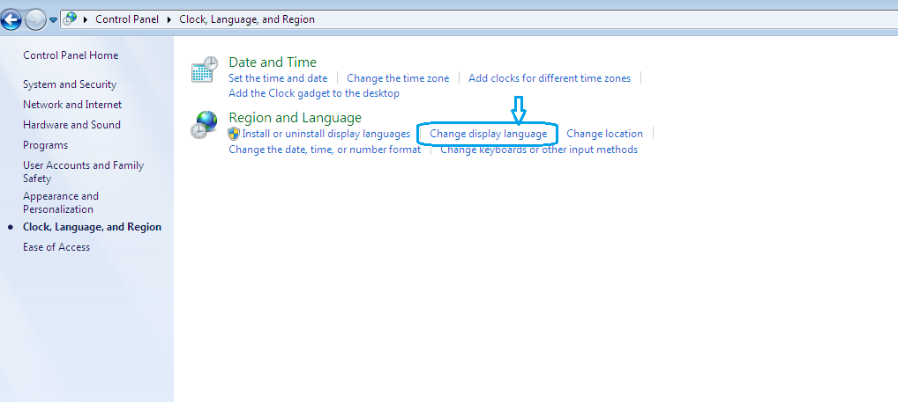
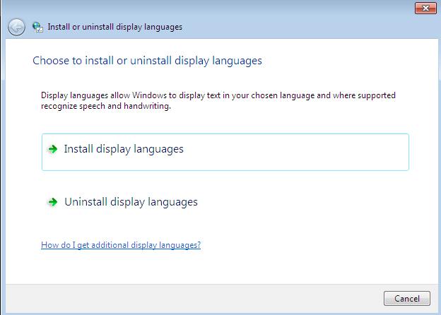
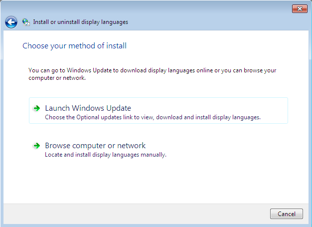
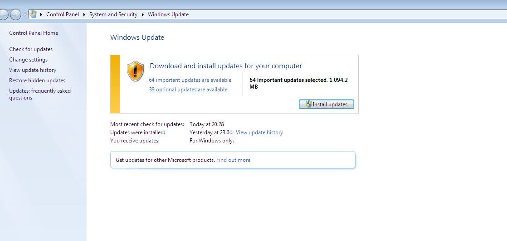
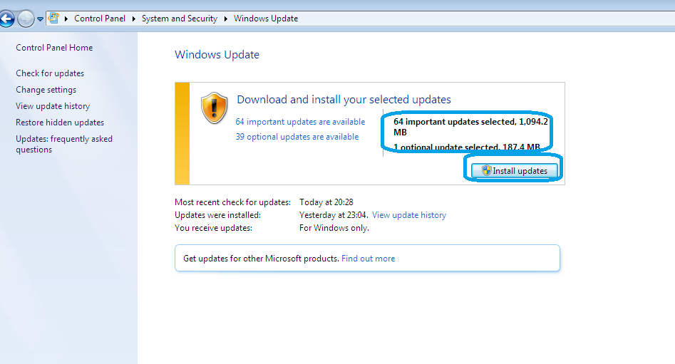
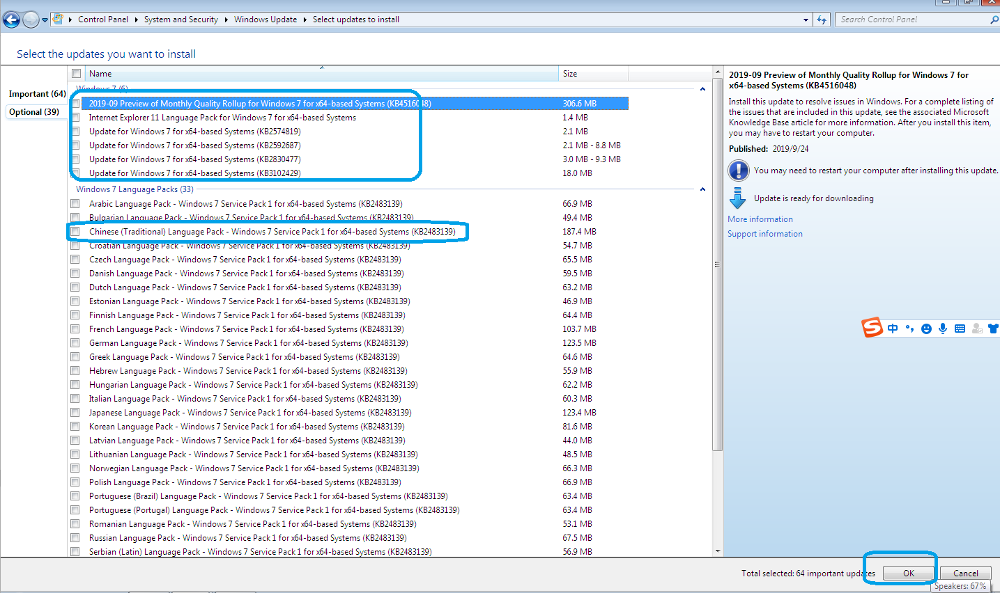
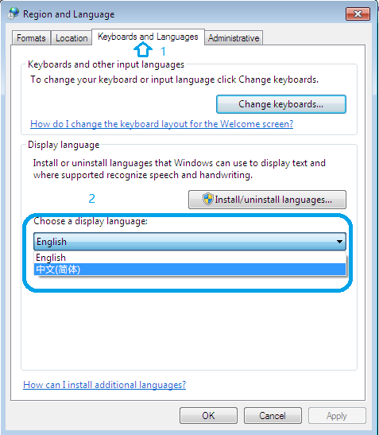
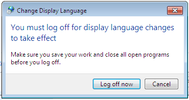

#### win7英文版

发布于2009年的windows7，在2015年微软公司就终止了对主流版本的技术支持，windows10、windows11相继登场。但是现实是有大量成熟的业务系统基于Windows7开发的，对于windows10、windows11的支持并不到位。新电脑的硬件配置甚至无法安装Windows7 sp1了，此时可以试试发布于2019年2月的windows7英文版。

#### 安装语言包

安装了Windows7的英文版之后，把中文语言包安装好，就相当于一个升级版的中文版Windows7。英文版的安装和中文版没什么区别。这里就说一下如何添加中文语言包。

##### 以更新的形式安装中文语言包

##### 下载单独的中文语言包

* 下载本文第一个图片下边显示的中文语言包，该语言包是可执行文件，双击运行可以直接安装，安装完毕后，在控制面板的的地区和语言部分，选择键盘和语言标签，如下图所示选择中文简体，弹出注销对话框，确定注销并登录后，就显示中文版的Windows7。

##### 在Windows ADK生成PE工作目录了寻找语言包

可以尝试在Windows ADK生成的工作目录下寻找中文语言包，一般格式为lp.cab，在安装语言包时选择从本地安装，有空试试。