#### 在Windows局域网中共享打印机

* 把要访问的印机设置为共享打印机

* 鼠标右键点击桌面的网络图标，在弹出的快捷菜单中选择【属性】菜单项，打开网络和共享中心窗口。然后选择窗口左侧的【更改高级共享设置】，选择启用网络发现、启用文件和打印机共享、关闭密码保护共享这三个选项。

* 在控制面板的管理工具中，打开本地策略，点击【安全选项】，在右侧底部列表中选择开启guest。如下图所示：

  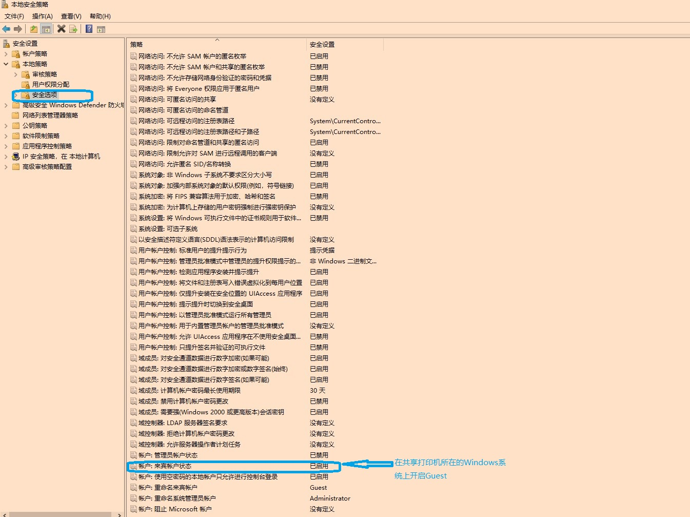

* 选择本地策略下的用户权限分配，在右侧列表中找到【拒绝从网络访问这台计算机】，从中删除guest项目，也就是允许guest通过网络访问这台计算机。如下图所示：

  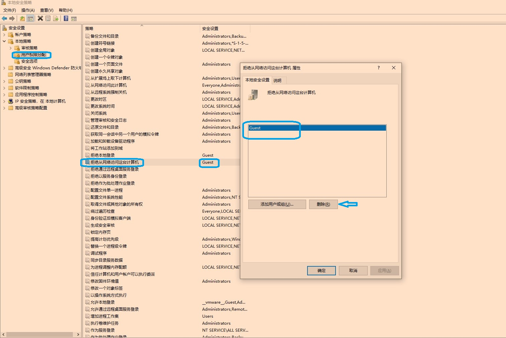

* 选择本地策略下的用户权限分配，在右侧列表中找到【从网络访问这台计算机】,根据需要添加用户（比如everyone、guest，具体可以测试一下）。
  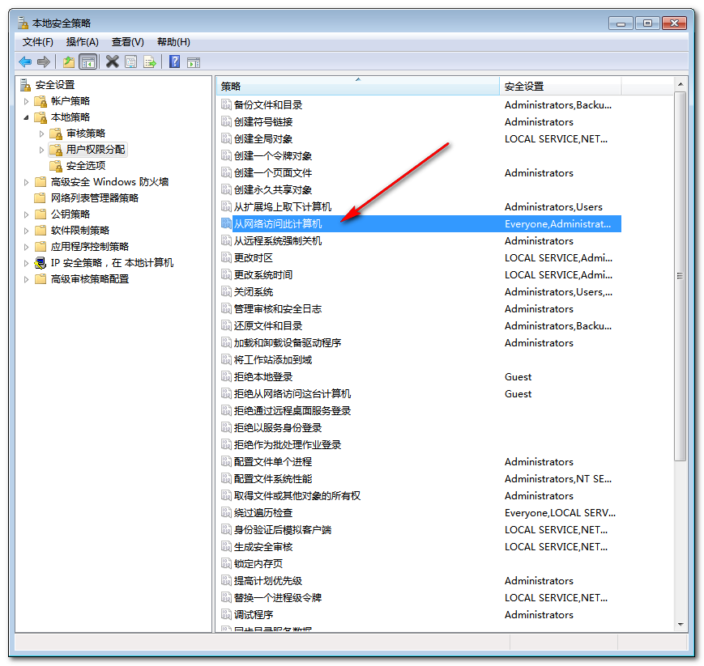

  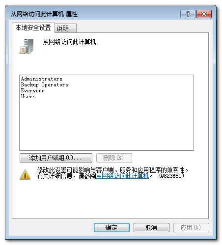

* 在本机Windows左下角打开搜索框，输入如下格式的目标主机IP地址

  ```
  \\10.121.x.x
  ```

  正常情况下应该能看到目标计算机上共享的打印机，双击共享打印机图标安装驱动，驱动安装成功后可以共享打印机。

* 如果上面几个步骤都做好了，还是不能访问目标计算机的共享打印机，在安全前提下，可以先临时关闭目标打印机所在计算机的防火墙，应该就可以访问共享打印机。有时间可以研究一下防火墙的设置项目，只是开启ip的ping功能即可（可以在防火墙的高级设置中设置文件和打印机访问的入站规则）。具体可以多多实践。如果可以把以上几个步骤做成一个批处理就再好不过了，运行批处理实现局域网共享打印机功能。也可以试试联想公司官方提供的局域网共享工具。
  

> 此文档内容是在Windows7下完成设置的，windows10的上的设置原理相同，操作界面有不同之处。
>
> ```
> 总结一下：
> 
> * 设置高级共享（启用网络发现、启用文件和打印机共享、关闭密码保护共享）
> * 设置共享打印机，指定共享打印名称（如果不在第一步骤先启用打印机共享，
>    这一步骤会提示无法共享打印机的错误提示）
> * 控制面板管理工具中本地安全策略的设置
> 
>   ##控制面板->管理工具->本地安全策略->本地策略->安全选项：
>      a.帐户：来宾帐户状态->启用                --启用来宾账号guest
>      b.网络访问：本地帐户的共享和安全模型(仅来宾)  -- 本地帐户的共享和安全模型：
>   ##控制面板->管理工具->本地安全策略->本地策略->用户权限分配：
>      a.从网络中访问此计算机：添加guest用户
>      b.拒绝从网络中访问此计算机：删除guest
> 
> ```
>
> 

> 也可以试试批处理的方法实现，下面的代码先保存，有机会试试再修改一下

```bash
@echo off  
setlocal enabledelayedexpansion  
  
echo ====1.Enable network discovery and file and printer sharing====
reg add "HKEY_LOCAL_MACHINE\Software\Microsoft\Windows\CurrentVersion\Network\LanmanServer" /v "EnableNetBIOS" /t 

REG_DWORD /d 1 /f  
reg add "HKEY_LOCAL_MACHINE\Software\Policies\Microsoft\Windows\NetworkProvider" /v "NPAllowUniversalXPNSearch" /t 

REG_DWORD /d 1 /f  
net share * /GRANT:Everyone,FULL /REMARK:"Password Protected Shares Disabled"  
  
echo 2. 设置本地安全策略...  
REM 这里需要手动打开本地安全策略管理器并进行设置，无法通过批处理脚本自动完成。  
  
echo ====3.Enable the guest account and configure access permissions====  
net user Guest /active:yes  
net user Guest /add  
net localgroup "Guests" Guest /add  
net localgroup "Deny access to this computer from the network" | findstr /i /c:"Guest" > nul  
if %errorlevel%==0 (  
    net localgroup "Deny access to this computer from the network" /delete Guest > nul  
    if %errorlevel%==0 (  
        echo Guest user has been removed from the "Deny access to this computer from the network" list.  
    ) else (  
        echo Failed to remove Guest user from the list.  
    )  
) else (  
    echo Guest user is not in the "Deny access to this computer from the network" list.  
)  
  
echo ====4.Turn off the firewall and prompt the user to restart the computer====

netsh advfirewall set publicprofile state off  
netsh advfirewall set privateprofile state off  
set /p answer="Do you want to restart your computer to apply the new settings? (y/n): "  
if /i "%answer%"=="y" (  
    echo Restarting the computer...  
    shutdown /r /t 0  
) else (  
    echo No restart requested. Please restart manually to apply the changes.  
)

echo.  
echo Operations completed. Do you want to restart the computer? (Y/N):  
set /p choice="Please enter Y or N: "  
  
if /i "!choice!"=="Y" (  
    echo You have chosen to restart the computer.  
    shutdown /r /t 0  
) else if /i "!choice!"=="N" (  
    echo You have chosen not to restart the computer.  
) else (  
    echo Invalid input. Please enter Y or N.  
    pause  
)  


```

#### 卸载打印机驱动程序

>  ====彻底卸载打印驱动=====
>
>  为了确保打印机驱动程序能够被彻底卸载，建议在删除设备之前就断开打印机的`USB`连接。以下是详细的步骤：
>
>  1、断开`USB`连接：首先，从计算机上断开打印机的`USB`连接线。
>
>  > 为何要先断开`usb`连接线呢：
>  >
>  > 1. 当`USB`连接线连接着打印机时，操作系统可能会尝试自动识别并加载与打印机相关的驱动程序。如果在卸载过程中`USB`连接线未断开，系统可能会因为识别到打印机而自动加载或尝试保留某些驱动程序文件，从而导致卸载不彻底。断开`USB`连接线可以避免这种情况的发生，确保驱动程序能够被完全卸载。
>  >
>  >  2. 减少冲突和错误
>  >
>  > ​    在卸载过程中，如果打印机仍然通过`USB`连接线与计算机相连，可能会与卸载程序产生冲突或导致错误。这种冲突或错误可能会阻止卸载程序的正常运行，或者导致卸载后的残留文件无法被正确清理。断开`USB`连接线可以减少这种冲突和错误的可能性，使卸载过程更加顺利。
>  >
>  > 3. 确保卸载干净
>  >
>  > 断开`USB`连接线后，再进行驱动程序的卸载操作，可以确保所有与打印机相关的驱动程序文件、设置和配置都被彻底删除。这有助于避免因为残留文件而导致的打印问题或系统不稳定。
>
>  2、打开控制面板：点击左下角开始按钮，选择“控制面板”。
>  3、进入设备和打印机：在控制面板中，找到并点击“设备和打印机”。
>  4、删除设备：在“设备和打印机”列表中，找到要删除的打印机，右键点击该打印机，并选择“删除设备”。
>  5、确认删除：在弹出的确认框中，点击“是”以确认删除打印机设备。
>  6 、重启电脑：完成删除后，建议重启电脑。这一步可以帮助清除任何与打印机驱动相关的残留进程或服务。
>  7、 检查打印服务器属性（如果需要彻底删除驱动程序）：
>
>  ```
>    >、在计算机管理中打开服务，找到print spooler,选择并停止该服务。（或者win+r打开运行界面，输入services.msc打开服务）
>    >、删除c:\windows\system32\spool\printers目录下所有的文件
>    >、重启启动print  spooler服务
>    >、win+r打开运行界面，输入control打开控制面板。选择查看设备和打印机，选择打印服务器属性，选择打印服务器属性中的驱动程序标签，删除对应的打印机驱动
>    >一句话：停止print spooler服务--删除windows\system32\spool\printer下文件--重启printSpooler服务--打印服务器属性中驱动程序标签删除驱动
>  ```
>  也可以试试驱动卸载工具：[Seagull Drivers Wizard](files/SeagullDriversWizard.rar)
>
>  
#### 一次局域网共享打印机的实践

* 网络状况

  单位内部的几台主机，由于时间长了，系统错误后无法登陆到桌面系统，只能重装操作系统，由于该电脑连接的打印机需要共享使用，可是这台打印机的驱动包里不支持`windows10`。用电脑背后的编号在联想官网查找配置信息，这台电脑当时自带的操作系统是`windows8`，同时这个打印机的驱动包（查看`readme`文件）也是支持`windows8.1`，所以就只能安装`Win8.1`操作系统了。而另外一台计算机是更早的`windows xp`,需要共享这台`windows8.1`上的打印机。

  * `windows8.1`（打印机`AD188E`）

  * `windowsxp`

  * 这两台计算机通过单位内部局域网中的外网进行互联

    

* 安装细节

  * 安装Windows

    * **安装`Windows7`**。首次使用的是封装版的`win7`，结果发现安装打印机时不显示打印机图标（虽然可以打印），估计是驱动的问题，所以只能用安装版的`Windows7`试试，结果安装到一半进度是提示出错信息，估计是`Windows7`里没有更新一点的驱动支持，以前自己做过驱动注入的`windows7`，后来不知道放在哪里，再没有使用过。为了节省时间，决定直接安装`windows8.1`。

    * **安装`Windows8.1`**

      * 在`msdn I tell you`上下载了`windows8.1`和`microsoft office 2013`

      * 使用`Microsoft Toolkit.exe`工具对`windows8.1`和`office2013`进行激活（其他工具也试了，没有这个工具好用）

        在运行该激活软件时，`windows8.1`自带的defender直接拦截，只能在控制面板里打开defender，在设置标签里关闭实时防护，保存设置后可以运行激活软件。

      * `office2013`激活方法（下载VOL版的`office2013`）

        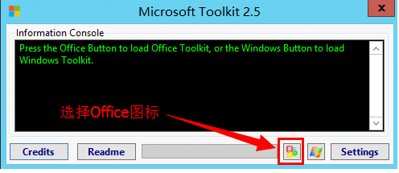

        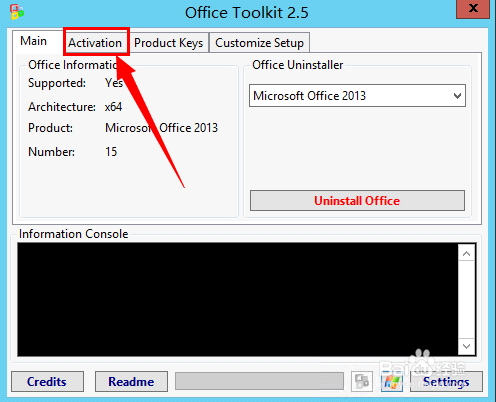

        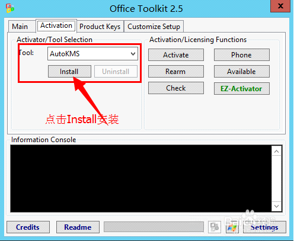

        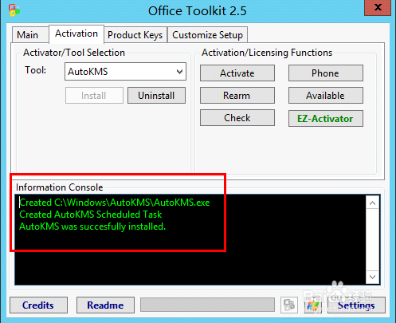

        这里主要说一下第四部，直接点击【`EZ-Activator`】就可以顺利激活。

        至于`windows8.1`的激活方法也是类似，只不过第一个图片处选择`Windows`激活图标
        
        

##### 下载和安装计算机驱动

* 在联想电脑的主机上有主机编号，通过这个主机编号在官网的服务支持页面搜索，系统可以找到匹配的驱动，可以根据要安装的操作系统下载驱动

  * 先安装主机的主板芯片驱动，重启生效后再安装其他设备驱动。

  * 有的计算机会同时带有集成显卡和独立显卡，一般是先安装集成显卡，然后再安装独立显卡。
  * 如果有提供多个设备驱动，需要再结合主机型号选择一个合适的驱动。
  * 设备驱动安装后，可以打开设备管理器，查看一下设备是否有问题（感叹号或者问号的设备），实在装不上的话，可以下载驱动精灵等智能驱动安装工具补全设备驱动。

##### 下载和安装打印机驱动

* 根据设备型号和支持的操作系统下载合适的驱动

* 最好是阅读自带的`readme`文件，有详细的介绍。比如，对于带有Installer的驱动安装程序来说，先要断开打印机和计算机的`USB`连接线，然后运行setup程序进行安装，当显示要连接打印机时再打开打印机电源、连接号`USB`连接线，就会自动检测到打印机并完成安装。

  > 为何先不连接`usb`连接线呢，而要在打印机驱动安装程序运行到一定阶段，提示连接打印机时再连接`usb`线缆呢？
  >
  > 在Windows 7下安装打印机驱动时，之所以要先不连接`USB`连接线，直到安装程序运行到检测阶段时才连接上，这主要是基于即插即用（Plug and Play）技术的设计原理和打印机安装过程中的特定要求。以下是几个关键原因：
  >
  >  1. 即插即用技术的考量
  >
  > Windows 7系统支持即插即用技术，这意味着系统能够自动识别并配置连接到计算机的新硬件设备，而无需用户手动安装驱动程序。然而，在打印机驱动的安装过程中，为了确保驱动程序能够正确识别并配置打印机，通常需要在安装程序的指导下进行`USB`连接。
  >
  >  2. 驱动程序与设备的匹配
  >
  > 安装程序需要确保下载的驱动程序与即将连接的打印机型号完全匹配。如果在安装过程中提前连接了`USB`连接线，系统可能会尝试自动安装一个默认的驱动程序，而这个驱动程序可能并不适合您的打印机型号。这会导致后续需要卸载错误的驱动程序，并重新安装正确的驱动程序，增加了安装的复杂性和出错的可能性。
  >
  >  3. 安装程序的流程控制
  >
  > 安装程序通常被设计为按照一定的步骤执行，包括提取文件、检测硬件设备、安装驱动程序等。在检测硬件设备之前，如果`USB`连接线已经连接，可能会干扰安装程序的正常流程，导致无法正确识别打印机或安装错误的驱动程序。
  >
  >  4. 避免冲突和错误
  >
  > 在安装过程中，如果`USB`连接线提前连接，并且系统已经识别了打印机但尚未安装正确的驱动程序，那么可能会出现设备冲突或错误。这些冲突和错误可能会导致打印机无法正常工作，甚至需要更复杂的故障排除步骤来解决。

##### 共享打印机

* 设置高级共享

* 共享打印机并指定共享名称

* 设置本地策略中的四个参数

  具体步骤如下：

```
   1.设置高级共享（鼠标右键点击桌面的网络图标，选择属性，在窗口的左侧列表选择更改高级共享设置，启用网络发现、启用文件和打印机共享、关闭密码保护共享）
   2.设置共享打印机(在控制面板的打印机模块，鼠标右键共享打印机)
   3.管理工具中本地安全策略的设置
     ##控制面板->管理工具->本地安全策略->本地策略->安全选项：
     a.帐户：来宾帐户状态->启用                --启用来宾账号guest
     b.网络访问：本地帐户的共享和安全模型(仅来宾)  -- 本地帐户的共享和安全模型：
     ##控制面板->管理工具->本地安全策略->本地策略->用户权限分配：
     a.从网络中访问此计算机：添加gues用户
     b.拒绝从网络中访问此计算机：删除guest
  4.重启计算机
      设置好以上几个步骤之后，要重启计算机，否则可能会导致客户端计算机在连接时弹出要连接的打印机名称错误。
 
```
##### 在客户端安装共享打印机

* `win7`下搜索并安装共享打印机
  
  * `\\host-ip`  通过静态的`IP`地址来搜索到共享打印机所在的计算机，然后双击打印机图标即可安装打印机驱动，如果系统没有指定的驱动程序，可以指定具体的驱动路径完成安装
  
* `winxp`下搜索并安装共享打印机

  打开`winxp`桌面的网上邻居，在窗口的地址栏输入`\\ComputName`就可以看到局域网中共享的打印机，双击或者右键连接打印机完成安装，如果系统没有驱动则需要指定驱动所在的目录完成打印机安装。因为这两台机器是通过外网通讯的，`IP`地址是动态分配的，所以只能通过计算机名称来搜素，而不能使用`IP`地址来搜索。这台客户端机器是`winxp`，在安装共享打印机时提示找不到驱动，用官方下载的`windows32`位驱动，指定驱动所在的目录完成安装。

  ```
  #在打印机所在的计算机上使用Installation模式安装好打印机驱动，使用的是windows64位驱动
  
  #在winxp上安装共享打印机时使用的windows32位的驱动（这里的windowsxp是32系统），在系统提示找不到驱动时，指定驱动所在目录
  
  #这两个计算机使用的一个驱动包，一个使用setup式的安装；windowsxp上使用的是指定目录完成安装
  ```

#### 在局域网中安装网络打印机  

在单位的局域网中以共享的方式使用打印机比较普遍，但是必须要求打印机所在的计算机要开机运行，否则的话就无法使用共享打印机。现在的办公用打印机一般带有网络接口，也就是具有固定`IP`地址的打印机,这样就相当于一台独立的打印服务器，使用起来便捷和稳定。下面就简单记录一下如何在局域网中添加网络打印机。

##### 把打印机连接到网络

* 制作网线，把打印机连接到交换机
* 给打印机设置`IP`地址
  * 可以在打印机的控制面板上找到网络图标，通过触屏设置`IP`地址、子网掩码和网关,就像给电脑设置`IP`地址一样。
  * 也可以在局域网中的任意一台计算机上，在浏览器中地址栏输入打印机的`IP`地址并打开，可以看到详细的打印机设置参数。

##### 在局域网中的任意一台计算机添加网络打印机

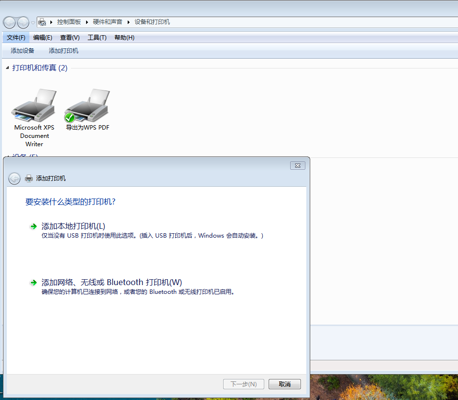

点击【添加网络打印机】

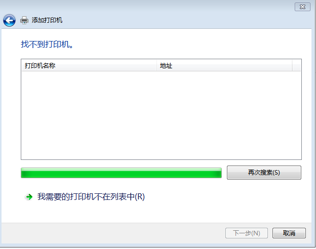

点击【我需要的打印机不在列表中】

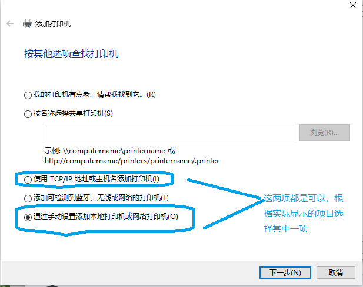

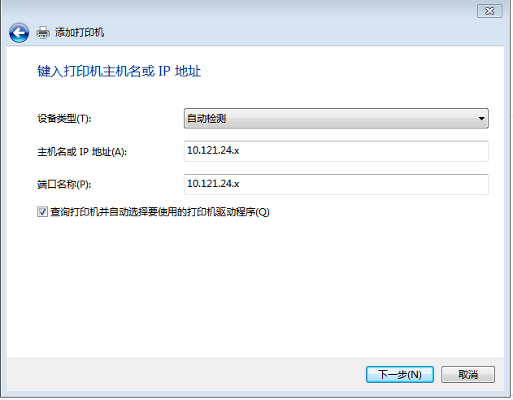

根据实际情况填写打印机的`IP`地址到主机名称，端口名称一般是根据上面填写的`IP`地址自动生成的，可以不用管。一般的HP打印机端口默认为9001。填写完成后点击下一步。

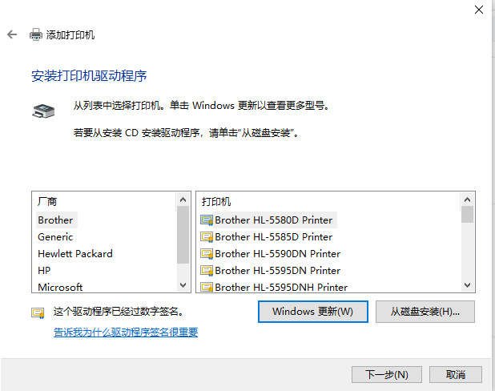

找不打印机驱动时，会弹出这个窗口，点击【从磁盘安装】，选择官方打印机驱动解压包所在的目录，确定后完成打印机驱动的安装。

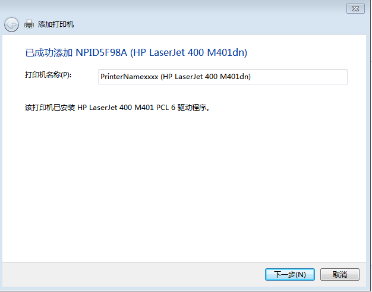

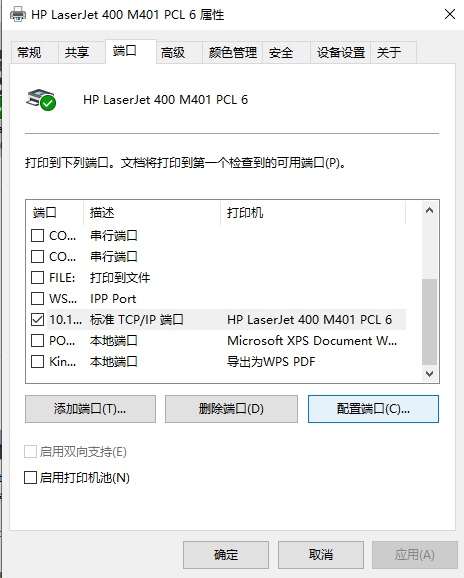

打印机安装成功后，鼠标右键弹出快捷菜单，选择打印机属性，在弹出的窗口中选择端口标签页，选中这台打印机列表项，点击右下角的【配置端口】按钮，就可以查看打印机的配置信息，比如打印机`ip`，端口名称，端口号等基本信息，也可以在浏览器地址栏输入打印`IP`地址，打开打印机更详细的基本信息。想要更全面的了解打印机信息，可以在官网下载并查阅打印机的用户指南`PDF`文档。

##### 一台网络打印机的多种连接方法

带有网络接口的打印机，可以通过网络接口连接业务内网，让内网中计算机通过网络来使用打印服务，也可以把这台打印机通过常规的`USB`电缆连接到使用互联网那个的计算机上。也就是说，一台打印机可以同时在内网和外网共享使用。当然，还可以通过打印机的`USB`接口来直接打印文档和`JPG`格式的图片。
