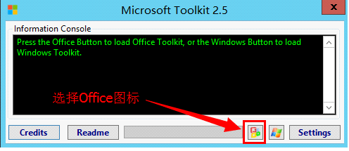
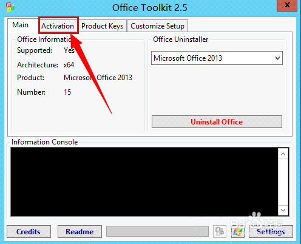
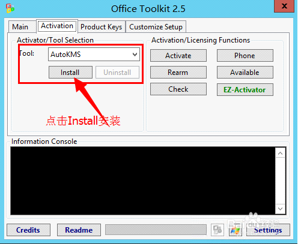
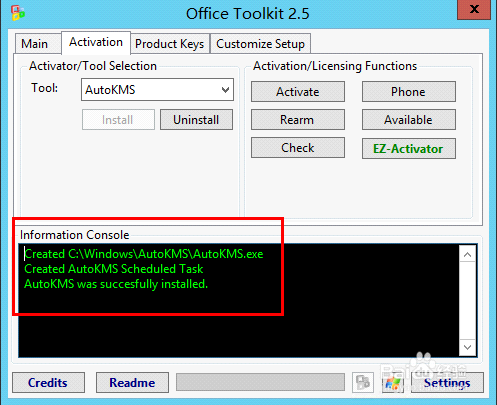

#### 在Windows局域网中共享打印机

* 把要访问的印机设置为共享打印机

* 鼠标右键点击桌面的网络图标，在弹出的快捷菜单中选择【属性】菜单项，打开网络和共享中心窗口。然后选择窗口左侧的【更改高级共享设置】，选择启用网络发现、启用文件和打印机共享、关闭密码保护共享这三个选项。

* 在控制面板的管理工具中，打开本地策略，点击【安全选项】，在右侧底部列表中选择开启guest。如下图所示：

  

* 选择本地策略下的用户权限分配，在右侧列表中找到【拒绝从网络访问这台计算机】，从中删除guest项目，也就是允许guest通过网络访问这台计算机。如下图所示：

  

* 选择本地策略下的用户权限分配，在右侧列表中找到【从网络访问这台计算机】,根据需要添加用户（比如everyone、guest，具体可以测试一下）。
  

  

* 在本机Windows左下角打开搜索框，输入如下格式的目标主机IP地址

  ```
  \\10.121.x.x
  ```

  正常情况下应该能看到目标计算机上共享的打印机，双击共享打印机图标安装驱动，驱动安装成功后可以共享打印机。

* 如果上面几个步骤都做好了，还是不能访问目标计算机的共享打印机，在安全前提下，可以先临时关闭目标打印机所在计算机的防火墙，应该就可以访问共享打印机。有时间可以研究一下防火墙的设置项目，只是开启ip的ping功能即可（可以在防火墙的高级设置中设置文件和打印机访问的入站规则）。具体可以多多实践。如果可以把以上几个步骤做成一个批处理就再好不过了，运行批处理实现局域网共享打印机功能。也可以试试联想公司官方提供的局域网共享工具。
  

> 此文档内容是在Windows7下完成设置的，windows10的上的设置原理相同，操作界面有不同之处。

> 总结一下：
>
> * 设置共享
>
>   * 设置共享打印机
>   * 设置高级共享（启用网络发现、启用文件和打印机共享、关闭密码保护共享）
>
> * 设置账号（在控制面板的管理工具中打开本地安全策略）
>
>   * 启用来宾账号guest（控制面板->管理工具->本地安全策略->本地策略->安全选项->帐户：来宾帐户状态->启用）
>
>   * 本地帐户的共享和安全模型：控制面板->管理工具->本地安全策略->本地策略->安全选项->网络访问：本地帐户的共享和安全模型(仅来宾)
>
>   * 从网络中访问此计算机按中允许访问中添加guest（控制面板->管理工具->本地安全策略->本地策略->用户权限分配->从网络访问此计算机->添加gues用户）
>
>   * 拒绝从网络中访问此计算机中删除guest（控制面板->管理工具->本地安全策略->本地策略->用户权限分配->删除guest用户）
>   
>     ```
>     ====总结一下====
>     1. 右键点击“计算机”图标，选择“管理”，进入“计算机管理”窗口。
>     2. 依次点击“本地用户和组” -> “用户” -> “Guest”，确保“账户已禁用”选项未勾选。
>     3. 打开“本地安全策略”（输入secpol.msc并回车），依次点击“本地策略” -> “用户权限分配” -> “拒绝从网络访问这台计算机”   ，将“Guest”用户从列表中删除。
>     4. 在“本地策略” -> “安全选项”中，找到“网络访问：本地账户的共享和安全模型”，将其设置为“仅来宾 - 对本地用户进行身份验证，其身份为来宾”。
>     5. 最后，在“设备和打印机”中右键点击已安装的打印机，选择“打印机属性”，在“共享”选项卡中勾选“共享这台打印机”，并为其命名。
>     ```
>   
>     
>
> 
>
> 也可以试试批处理的方法实现，下面的代码先保存，有机会试试再修改一下

```bash
@echo off  
setlocal enabledelayedexpansion  
  
echo ====1.Enable network discovery and file and printer sharing====
reg add "HKEY_LOCAL_MACHINE\Software\Microsoft\Windows\CurrentVersion\Network\LanmanServer" /v "EnableNetBIOS" /t 

REG_DWORD /d 1 /f  
reg add "HKEY_LOCAL_MACHINE\Software\Policies\Microsoft\Windows\NetworkProvider" /v "NPAllowUniversalXPNSearch" /t 

REG_DWORD /d 1 /f  
net share * /GRANT:Everyone,FULL /REMARK:"Password Protected Shares Disabled"  
  
echo 2. 设置本地安全策略...  
REM 这里需要手动打开本地安全策略管理器并进行设置，无法通过批处理脚本自动完成。  
  
echo ====3.Enable the guest account and configure access permissions====  
net user Guest /active:yes  
net user Guest /add  
net localgroup "Guests" Guest /add  
net localgroup "Deny access to this computer from the network" | findstr /i /c:"Guest" > nul  
if %errorlevel%==0 (  
    net localgroup "Deny access to this computer from the network" /delete Guest > nul  
    if %errorlevel%==0 (  
        echo Guest user has been removed from the "Deny access to this computer from the network" list.  
    ) else (  
        echo Failed to remove Guest user from the list.  
    )  
) else (  
    echo Guest user is not in the "Deny access to this computer from the network" list.  
)  
  
echo ====4.Turn off the firewall and prompt the user to restart the computer====

netsh advfirewall set publicprofile state off  
netsh advfirewall set privateprofile state off  
set /p answer="Do you want to restart your computer to apply the new settings? (y/n): "  
if /i "%answer%"=="y" (  
    echo Restarting the computer...  
    shutdown /r /t 0  
) else (  
    echo No restart requested. Please restart manually to apply the changes.  
)

echo.  
echo Operations completed. Do you want to restart the computer? (Y/N):  
set /p choice="Please enter Y or N: "  
  
if /i "!choice!"=="Y" (  
    echo You have chosen to restart the computer.  
    shutdown /r /t 0  
) else if /i "!choice!"=="N" (  
    echo You have chosen not to restart the computer.  
) else (  
    echo Invalid input. Please enter Y or N.  
    pause  
)  


```

#### 卸载打印机驱动程序

>  ====彻底卸载打印驱动=====
>
>  为了确保打印机驱动程序能够被彻底卸载，建议在删除设备之前就断开打印机的USB连接。以下是详细的步骤：
>
>  1、断开USB连接：首先，从计算机上断开打印机的USB连接线。
>  2、打开控制面板：点击左下角开始按钮，选择“控制面板”。
>  3、进入设备和打印机：在控制面板中，找到并点击“设备和打印机”。
>  4、删除设备：在“设备和打印机”列表中，找到要删除的打印机，右键点击该打印机，并选择“删除设备”。
>  5、确认删除：在弹出的确认框中，点击“是”以确认删除打印机设备。
>  6 、重启电脑：完成删除后，建议重启电脑。这一步可以帮助清除任何与打印机驱动相关的残留进程或服务。
>  7、 检查打印服务器属性（如果需要彻底删除驱动程序）：
>
>  ```
>    >、在计算机管理中打开服务，找到print spooler,选择并停止该服务。（或者win+r打开运行界面，输入services.msc打开服务）
>    >、删除c:\windows\system32\spool\printers目录下所有的文件
>    >、重启启动print  spooler服务
>    >、win+r打开运行界面，输入control打开控制面板。选择查看设备和打印机，选择打印服务器属性，选择打印服务器属性中的驱动程序标签，删除对应的打印机驱动
>    >一句话：停止print spooler服务--删除windows\system32\spool\printer下文件--重启printSpooler服务--打印服务器属性中驱动程序标签删除驱动
>  ```

#### 一次局域网共享打印机的实践

* 网络状况

  单位内部的几台主机，由于时间长了，系统错误后无法登陆到桌面系统，只能重装操作系统，由于该电脑连接的打印机需要共享使用，可是这台打印机的驱动包里不支持`windows10`。用电脑背后的编号在联想官网查找配置信息，这台电脑当时自带的操作系统是`windows8`，同时这个打印机的驱动包（查看`readme`文件）也是支持`windows8.1`，所以就只能安装`Win8.1`操作系统了。而另外一台计算机是更早的`windows xp`,需要共享这台`windows8.1`上的打印机。

  * `windows8.1`（打印机`AD188E`）

  * `windowsxp`

  * 这两台计算机通过单位内部局域网中的外网进行互联

    

* 安装细节

  * 安装Windows

    * **安装`Windows7`**。首次使用的是封装版的`win7`，结果发现安装打印机时不显示打印机图标（虽然可以打印），估计是驱动的问题，所以只能用安装版的`Windows7`试试，结果安装到一半进度是提示出错信息，估计是`Windows7`里没有更新一点的驱动支持，以前自己做过驱动注入的`windows7`，后来不知道放在哪里，再没有使用过。为了节省时间，决定直接安装`windows8.1`。

    * **安装`Windows8.1`**

      * 在`msdn I tell you`上下载了`windows8.1`和`microsoft office 2013`

      * 使用`Microsoft Toolkit.exe`工具对`windows8.1`和`office2013`进行激活（其他工具也试了，没有这个工具好用）

        在运行该激活软件时，`windows8.1`自带的defender直接拦截，只能在控制面板里打开defender，在设置标签里关闭实时防护，保存设置后可以运行激活软件。

      * `office2013`激活方法（下载VOL版的`office2013`）

        

        

        

        

        这里主要说一下第四部，直接点击【`EZ-Activator`】就可以顺利激活。

        至于`windows8.1`的激活方法也是类似，只不过第一个图片处选择`Windows`激活图标
        
        

##### 下载和安装计算机驱动

* 在联想电脑的主机上有主机编号，通过这个主机编号在官网的服务支持页面搜索，系统可以找到匹配的驱动，可以根据要安装的操作系统下载驱动

  * 先安装主机的主板芯片驱动，重启生效后再安装其他设备驱动。

  * 有的计算机会同时带有集成显卡和独立显卡，一般是先安装集成显卡，然后再安装独立显卡。
  * 如果有提供多个设备驱动，需要再结合主机型号选择一个合适的驱动。
  * 设备驱动安装后，可以打开设备管理器，查看一下设备是否有问题（感叹号或者问号的设备），实在装不上的话，可以下载驱动精灵等智能驱动安装工具补全设备驱动。

##### 下载和安装打印机驱动

* 根据设备型号和支持的操作系统下载合适的驱动
* 最好是阅读自带的`readme`文件，有详细的介绍。比如，对于带有Installer的驱动安装程序来说，先要断开打印机和计算机的`USB`连接线，然后运行setup程序进行安装，当显示要连接打印机时再打开打印机电源、连接号`USB`连接线，就会自动检测到打印机并完成安装。

##### 共享打印机