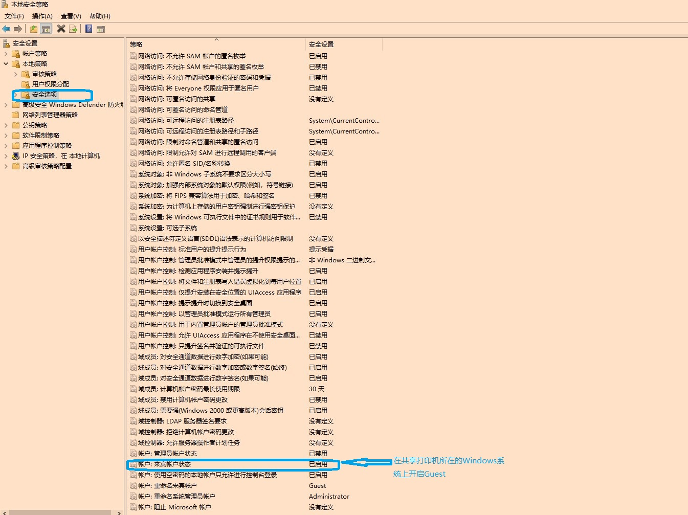
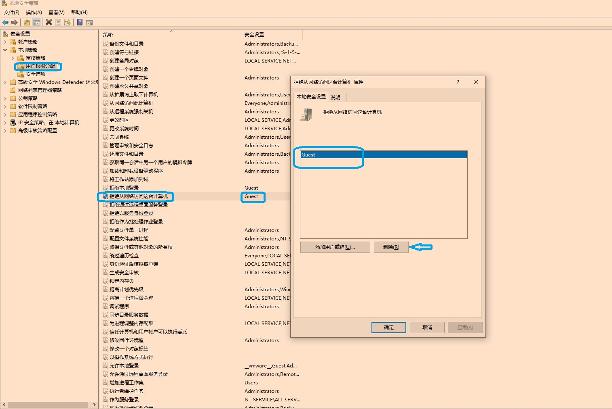
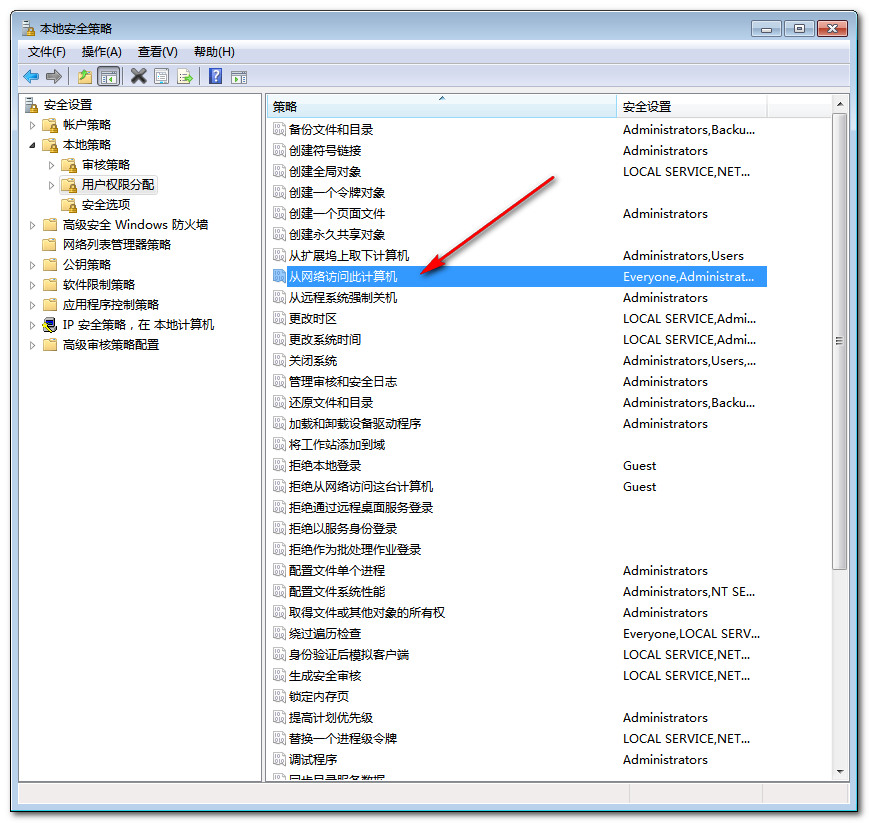
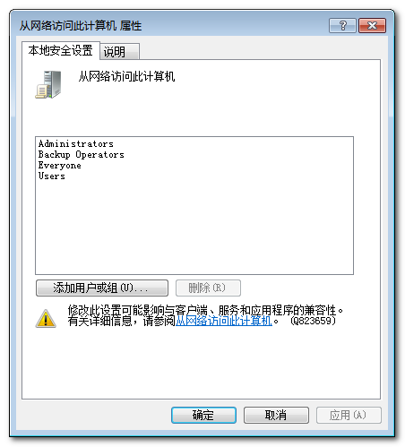

#### 在Windows局域网中共享打印机

* 把要访问的印机设置为共享打印机

* 鼠标右键点击桌面的网络图标，在弹出的快捷菜单中选择【属性】菜单项，打开网络和共享中心窗口。然后选择窗口左侧的【更改高级共享设置】，选择启用网络发现、启用文件和打印机共享、关闭密码保护共享这三个选项。

* 在控制面板的管理工具中，打开本地策略，点击【安全选项】，在右侧底部列表中选择开启guest。如下图所示：

  

* 选择本地策略下的用户权限分配，在右侧列表中找到【拒绝从网络访问这台计算机】，从中删除guest项目，也就是允许guest通过网络访问这台计算机。如下图所示：

  

* 选择本地策略下的用户权限分配，在右侧列表中找到【从网络访问这台计算机】,根据需要添加用户（比如everyone、guest，具体可以测试一下）。
  

  

* 在本机Windows左下角打开搜索框，输入如下格式的目标主机IP地址

  ```
  \\10.121.x.x
  ```

  正常情况下应该能看到目标计算机上共享的打印机，双击共享打印机图标安装驱动，驱动安装成功后可以共享打印机。

* 如果上面几个步骤都做好了，还是不能访问目标计算机的共享打印机，在安全前提下，可以先临时关闭目标打印机所在计算机的防火墙，应该就可以访问共享打印机。有时间可以研究一下防火墙的设置项目，只是开启ip的ping功能即可（可以在防火墙的高级设置中设置文件和打印机访问的入站规则）。具体可以多多实践。如果可以把以上几个步骤做成一个批处理就再好不过了，运行批处理实现局域网共享打印机功能。也可以试试联想公司官方提供的局域网共享工具。
  

> 此文档内容是在Windows7下完成设置的，windows10的上的设置原理相同，操作界面有不同之处。

> 总结一下：
>
> * 设置共享
>
>   * 设置共享打印机
>   * 设置高级共享（启用网络发现、启用文件和打印机共享、关闭密码保护共享）
>
> * 设置账号（在控制面板的管理工具中打开本地安全策略）
>
>   * 启用来宾账号guest
>   * 拒绝从网络中访问此计算机中删除guest
>   * 从网络中访问此计算机按中允许访问中添加guest
>
>   

