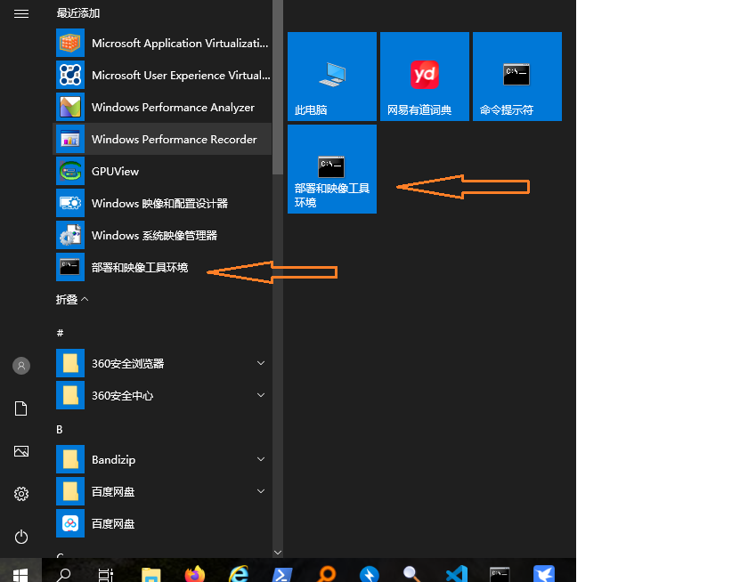
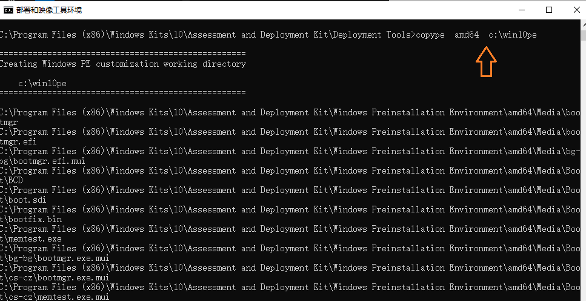
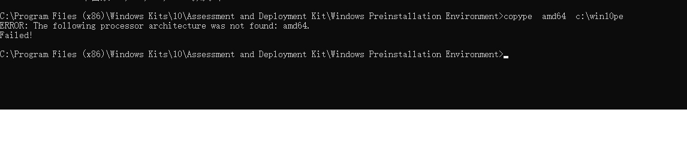

#### [下载并安装 Windows ADK](https://learn.microsoft.com/zh-cn/windows-hardware/get-started/adk-install#other-adk-downloads)

查看windows系统的版本号，下载对应版本的ADK,运行adksetup。

​     


#### [下载并安装WinPe加载项](https://go.microsoft.com/fwlink/?linkid=2022233)

下载对应版本的WINpe加载项并安装


* 安装好ADK和WInpe加载项之后，点击Windows桌面左下角的Windows图标，打开程序菜单，选择【部署和映像工具环境】

  

  

  打开CMD窗口后运行下面的命令：

  copype   amd64    d:\win10pe   

  执行结果如下图：

  

  

  如果没有选择从【部署和映像工具环境】打开CMD窗口，而是自己随意打开CMD窗口并切换到部署和映像工具所在的目录，使用copype命令时会提示找不到amd64架构处理器，如下图所示：

  
  出现这个问题的根本原因是设置环境变量的问题，如果要手动执行的话，就需要自己修改copype.cmd里的脚本，如下：

  ```
  rem
  rem Set environment variables for use in the script
  rem
  set WINPE_ARCH=%1
  **set WinPERoot=C:\Program Files (x86)\Windows Kits\10\Assessment and Deployment Kit\Windows Preinstallation Environment**
  set SOURCE=%WinPERoot%\%WINPE_ARCH%
  **set OSCDImgRoot=C:\Program Files (x86)\Windows Kits\10\Assessment and Deployment Kit\Deployment Tools\amd64\Oscdimg**
  set FWFILESROOT=%OSCDImgRoot%\..\..\%WINPE_ARCH%\Oscdimg
  set DEST=%~2
  set WIMSOURCEPATH=%SOURCE%\en-us\winpe.wim
  
  ```

  这段代码是引用自CSDN上一个博主的文章[win10PE iso镜像制作及问题解决](https://blog.csdn.net/weixin_43863487/article/details/116117714)
* MakeWinpeMedia   /UFD    d:\win10pe   X:

  制作可启动的U盘，此时的U盘盘符为X，会删除U盘上所有的数据，注意核对正确（ MakeWinPEMedia will format your Windows PE drive as FAT32）

* 使用制作好的U盘启动，运行只有CMD窗口的Winpe
  * 运行notepad
  * 选择File /open，打开文件系统浏览器，查看下载好的Windows安装盘所在的驱动器和目录（可以提前把下载好的原版Windows安装盘解压到指定驱动器或者另外一个U盘）
  * 切换到安装文件所在的目录，运行setup,就可以正常完成Windows安装

+++

下面的内容是微软公司官方文档的部分内容：

### Create a bootable Windows PE USB drive

1. Attach a USB drive to your technician PC.

2. Start the **Deployment and Imaging Tools Environment** as an administrator.

3. **Optional** You can format your USB key prior to running MakeWinPEMedia.  MakeWinPEMedia will format your Windows PE drive as FAT32. If you want  to be able to store files larger than 4GB on your Windows PE USB drive,  you can create a multipartition USB drive that has an additional  partition formatted as NTFS. See [Create a multipartition USB drive](https://learn.microsoft.com/en-us/windows-hardware/manufacture/desktop/winpe--use-a-single-usb-key-for-winpe-and-a-wim-file---wim?view=windows-11#option-1-create-a-multiple-partition-usb-drive) for instructions.

4. Use **MakeWinPEMedia** with the `/UFD` option to format and install Windows PE to the USB flash drive, specifying the USB key's drive letter:

   Windows Command Prompt 	

1. ```cmd
   MakeWinPEMedia /UFD C:\WinPE_amd64 X:
   ```

    Warning: This command reformats the partition.

   See [MakeWinPEMedia command line options](https://learn.microsoft.com/en-us/windows-hardware/manufacture/desktop/makewinpemedia-command-line-options?view=windows-11) for all available options.

The bootable Windows PE USB drive is ready. You can use it to [boot a PC into Windows PE](https://learn.microsoft.com/en-us/windows-hardware/manufacture/desktop/boot-to-uefi-mode-or-legacy-bios-mode?view=windows-11).
