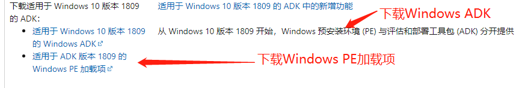
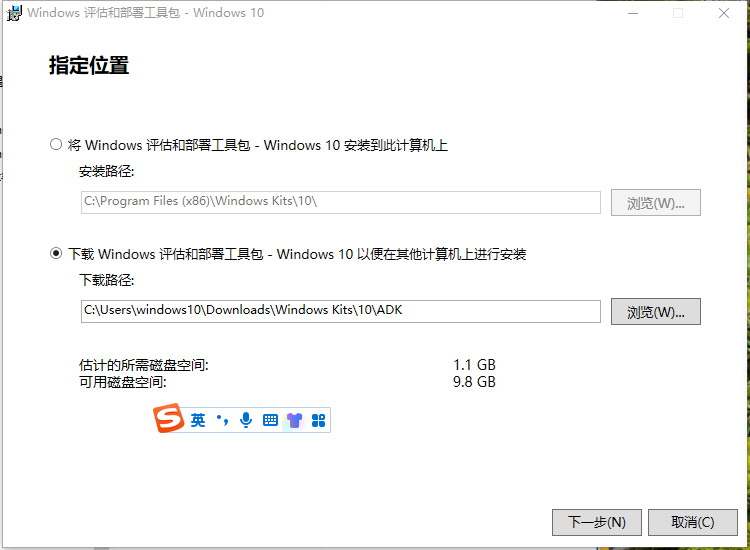
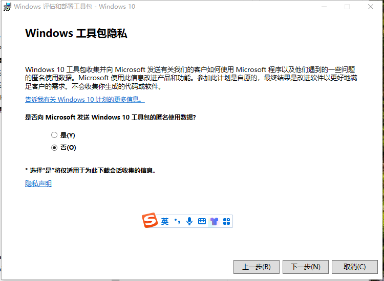
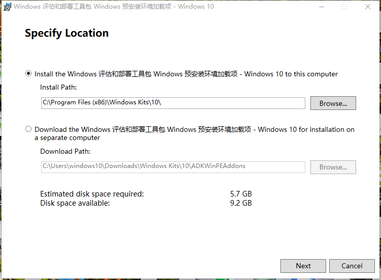
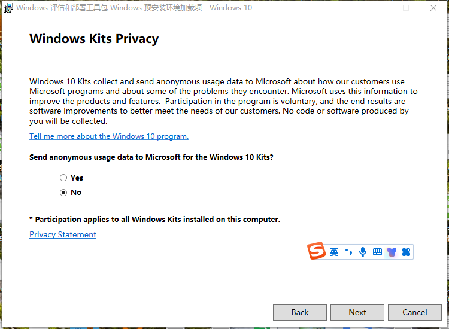

#### [下载并安装 Windows ADK](https://learn.microsoft.com/zh-cn/windows-hardware/get-started/adk-install#other-adk-downloads)

查看windows系统的版本号，下载对应版本的ADK,运行adksetup。

​     

#### [下载并安装WinPe加载项](https://go.microsoft.com/fwlink/?linkid=2022233)

下载对应版本的WINpe加载项并安装

* 安装好ADK和WInpe加载项之后，使用copype复制到指定的目录

  copype   amd64    d:\win10pe   

* MakeWinpeMedia   /UFD    d:\win10pe   X:

  制作可启动的U盘，此时的U盘盘符为X，会删除U盘上所有的数据，注意核对正确 。
