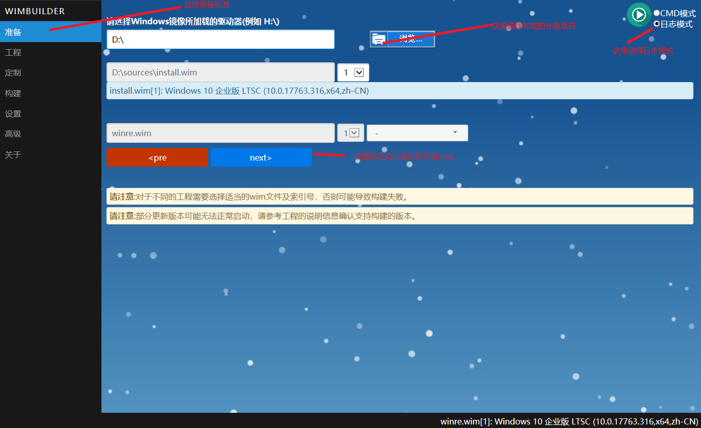
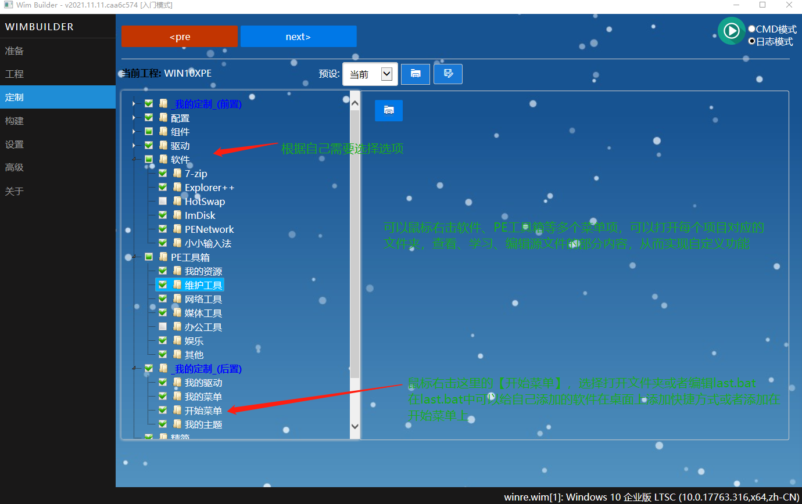
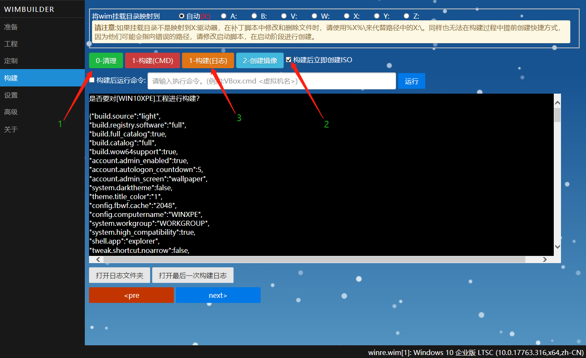
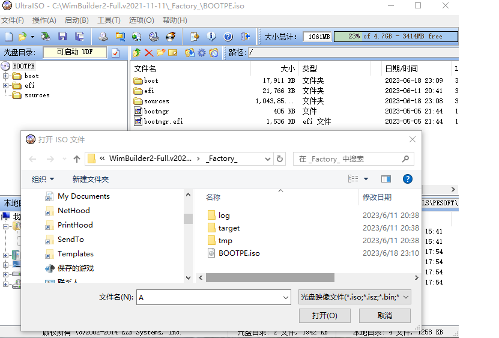
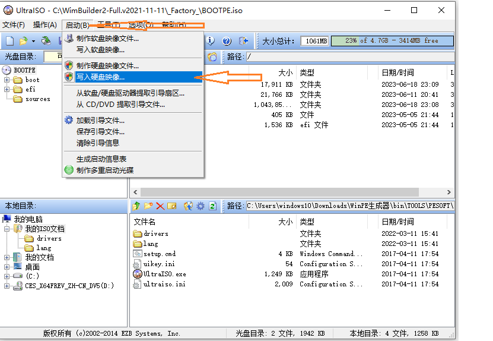
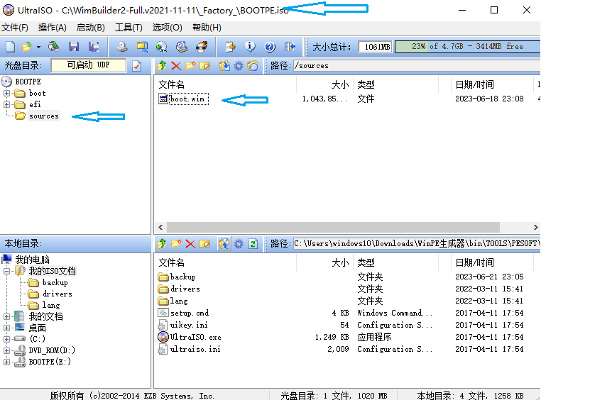

#### 使用WINPE的三种方法

##### 网上下载WINPE

​    经常使用的WINPE有IT天空的WINPE、[微PE工具箱](https://www.wepe.com.cn/)

##### 使用工具制作WINPE

  以前使用过winbuilder制作过，经常遇到因为环境不匹配导致的错误，找问题很费时间和精力，就放弃了。后来遇到了wimbuilder2，目前在github上开源。这里就简单记录一下使用wimbuilder2的使用要点：







制作好winpe之后，发现有自己需要而winpe中不包含的软件，如何添加呢
###### 自定义添加自己需要的软件
自己对wimbuilder2不熟悉，此项目设计到大量批处理、自定义宏，还有javascript、css、html知识，还有作者自定义的用c语言构造的支持文件。在做好winpe之后，一个真实的需求就是添加自定义的软件，在桌面显示软件的快捷方式或者添加到开始菜单。可是在wimbuilder里愣是没有找到详细的说明，自己水平有限吧，还没有通过wimbuilder2自带的范例学明白，无奈，翻阅github上wimbuilder源项目issue,[第79号issue](https://github.com/slorelee/wimbuilder2/issues/79),应该是外国人提问的一个问题，和我的想法一样，看完照着做居然做好了。下面是这个issue的详细内容:

```bash
A:How to install apps ? Could we have a tutorial, we want to put in on the desktop, could it be in English? (Or French, it would be best)
Thank you for your time and help! =)

Q:For Windows PE, I think a portable version of the application is good, you can run them from your USB disk directly.
About the shortcuts on Desktop, the PETools loader should read a U:\PETools\PETools.ini, the pecmd.exe's link command
will create a shortcut for it.

If you want to create a shortcut when building with WimBuilder2.
You can see the sample in:

E:\WimBuilder2\Projects\WIN10XPE\02-Apps
- 7-Zip\main.bat
- Defraggler\main.bat
- PENetwork\main.bat

call LinkToDesktop "7-Zip.lnk" "#pProgramFiles#p\7-Zip\7zFM.exe"
call LinkToStartMenu "7-Zip\7-Zip File Manager.lnk" "#pProgramFiles#p\7-Zip\7zFM.exe"

call LinkToStartMenu "Defraggler\%APP_NAME%.lnk" "#pProgramFiles#p\Defraggler\Defraggler.exe"

call LinkToDesktop PENetwork.lnk "#pProgramFiles#p\PENetwork\PENetwork.exe"

#p is instead of the % mark to avoid to use the hostOS's enviroment variables.

You can right click on next item node. and select [open the folder], or [edit the last.bat].

_Personal-Tailor_(Post)
        MyStartMenu

WimBuilder2\AppData\Projects\WIN10XPE\10-MyCustom\MyStartMenu\last.bat

call LinkToDesktop "7-Zip.lnk" "#pProgramFiles#p\7-Zip\7zFM.exe"
call PinToTaskbar "#pProgramFiles#p\Everything\Everything.exe"
call PinToStartmenu "#pProgramFiles#p\WinXShell\WinXShell.exe"
call PinToStartmenu regedit.exe

```

按照上面的问答，在wimbuilder2定制界面，鼠标右击开始菜单，选择编辑last.bat文件，桌面显示diskgenius.exe快捷方式。修改后的last.bat文件内容如下：

```bash
rem rd /s /q "%X%\ProgramData\Microsoft\Windows\Start Menu\Programs\Accessories"

if exist SIB_RegDefault.reg (
    reg import SIB_RegDefault.reg
)

rem   在桌面添加diskgenius.link这个快捷方式。
rem   把diskgenius\diskgenius.exe保存在WimBuilder2-Full.v2021-11-11\vendor\_PEMaterial_\Program Files\
rem   最终的路径为C:\WimBuilder2-Full.v2021-11-11\vendor\_PEMaterial_\Program Files\diskgenius\diskgenius.exe
rem   可以用同样的方法添加其他自定义软件，如果是单文件可执行文件，也是可以放在 ..\vendor\_PEMaterial_\PortableApps目录下面试试

call LinkToDesktop "DiskGenius.lnk" "#pProgramFiles#p\diskgenius\diskgenius.exe"

rem 下面这两句是把diskgenius显示在开始菜单
call PinToStartmenu "X:\Program Files\diskgenius\diskgenius.exe"
call PinToStartmenu regedit.exe


```

总结一下添加自定义软件及快捷方式的方法：
* 自定义软件的保存路径

  * 单文件可执行程序放在项目的..\vendor\_PEMaterial_\PortableApps目录下面

  * 其他程序放在..\vendor\_PEMaterial_\Program Files\目录下

* 添加快捷方式或者添加到开始菜单

  * 鼠标右击【我的定制(后置)】下面的开始菜单(MyStartMenu),选择编辑last.bat,在文件中添加快捷方式。具体可以参照项目中的关于软件配置的例子写法。
###### 使用UltraISO制作可启动U盘

使用UltraISO把制作好的ISO文件写入到U盘，就可以使用U盘启动进入winpe。写入方法如下：

* 以管理员的方式运行UltraISO
* 选择File\open菜单打开winpe的ISO文件
* 选择启动\写入硬盘映像
* 确认好U盘的盘符，使用HDD++的方式写入U盘（U盘会被格式，制作前要确认U盘上没有重要数据）




###### 自定义制作完成的Winpe桌面背景

在WimBuilder2的设置界面里设置好winpe桌面背景之后，启动时可以正常显示，启动完毕后，就换成另外一个wimbuilder2自带的一个背景。以换桌面为例，顺带复习一下UltraISO修改启动镜像的简单步骤，好久不用了，差点忘记了，这里记录备忘。

* 使用UltraISO打开WimBuilder2生成的bootpe.iso文件，把sources\boot.wim释放到自定义的目录下，然后使用`dism   /mount-image  /imagefile:dirname/boot.wim   /index:1   /mountdir:c:\mnt  `把boot.wim装载到c:\mnt下。在根目录下有个PEMaterial文件夹，下面保存着wallpaper.jpg，这个图片文件就是wimbuilder2制作的winpe启动后显示的桌面背景，更换成自己喜欢的背景图片，然后再使用`dism  /unmount-image  /mountdir:c:\mnt   /commit`打包，更新后的boot.wim直接拖放到UltraISO中原boot.wim所在的路径。

* 不要直接解压这个WimBuilder2制作好的BOOTPE.ISO，解压后再修改boot.wim文件，在打包成ISO时发现启动信息错误，又要按照制作启动盘的方法重新导入启动信息再打包，有点麻烦了。所以就是用UltraISO直接打开BOOTPE.ISO，然后把boot.wim释放出来修改，修改后再放回到原来的位置保存即可。一句话，在保持BOOTPE.ISO的启动框架下修改boot.wim会简单点，要不然就需要重新制作启动盘的操作了。

