### 安装Windows ADK 及Winpe加载项
#### [下载并安装 Windows ADK](https://learn.microsoft.com/zh-cn/windows-hardware/get-started/adk-install#other-adk-downloads)

查看windows系统的版本号，下载对应版本的ADK,运行adksetup。

​     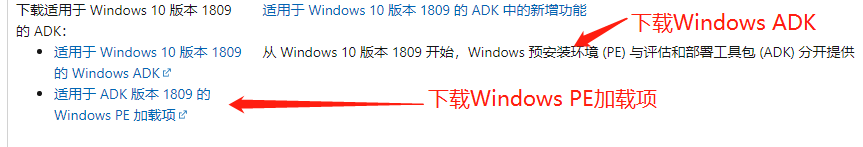

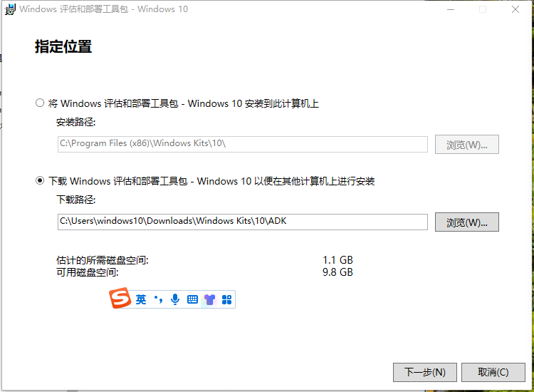

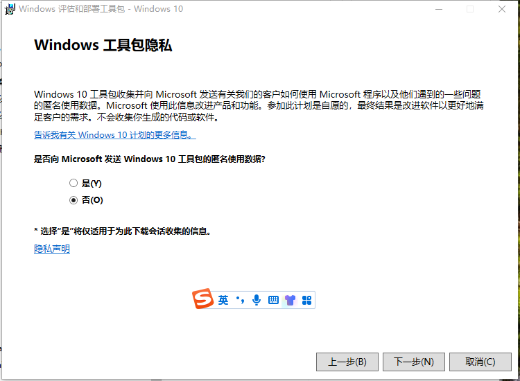

#### [下载并安装WinPe加载项](https://go.microsoft.com/fwlink/?linkid=2022233)

下载对应版本的WINpe加载项并安装

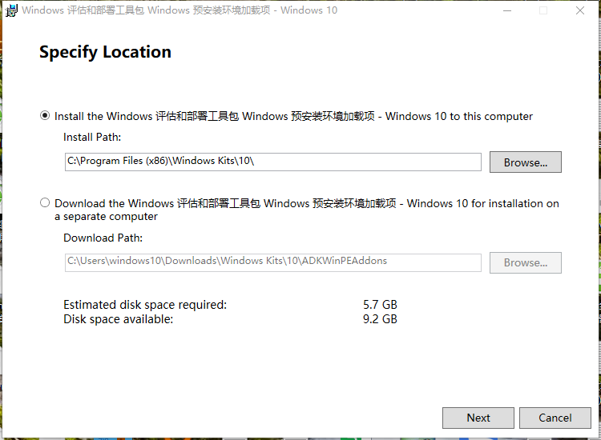

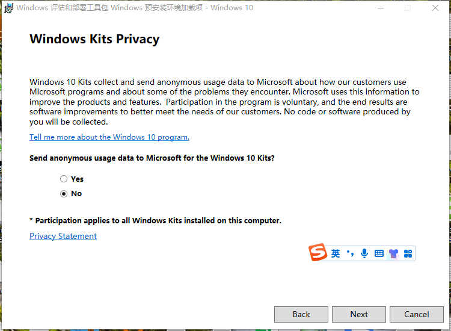
### 创建基础的Winpe

* 安装好ADK和WInpe加载项之后，点击Windows桌面左下角的Windows图标，打开程序菜单，选择【部署和映像工具环境】

  

  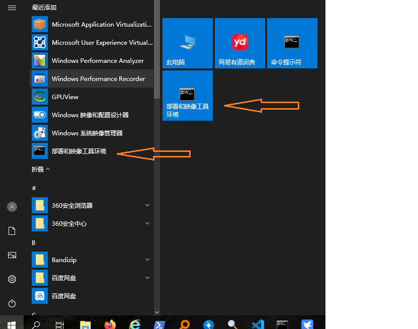
#### 一行命令创建基础Winpe
  打开CMD窗口后运行下面的命令：

  copype   amd64    d:\win10pe   

  执行结果如下图：

  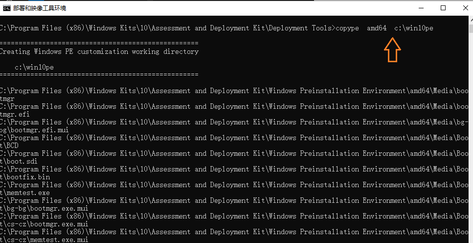

  

  如果没有选择从【部署和映像工具环境】打开CMD窗口，而是在CMD窗口中手动切换目录到部署和映像工具所在的目录，使用copype命令时会提示找不到amd64架构处理器，如下图所示：

  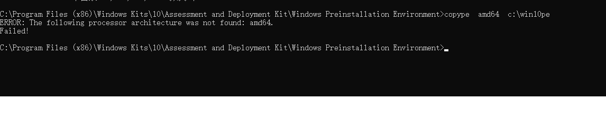
  出现这个问题的根本原因是设置环境变量的问题，如果要手动执行的话，就需要自己修改copype.cmd里的脚本，如下：

  ```bash
  rem
  rem Set environment variables for use in the script
  rem
  set WINPE_ARCH=%1
  **set WinPERoot=C:\Program Files (x86)\Windows Kits\10\Assessment and Deployment Kit\Windows Preinstallation Environment**
  set SOURCE=%WinPERoot%\%WINPE_ARCH%
  **set OSCDImgRoot=C:\Program Files (x86)\Windows Kits\10\Assessment and Deployment Kit\Deployment Tools\amd64\Oscdimg**
  set FWFILESROOT=%OSCDImgRoot%\..\..\%WINPE_ARCH%\Oscdimg
  set DEST=%~2
  set WIMSOURCEPATH=%SOURCE%\en-us\winpe.wim
  
  ```

  这段代码是引用自CSDN上一个博主的文章[win10PE iso镜像制作及问题解决](https://blog.csdn.net/weixin_43863487/article/details/116117714)
#### 制作可启动的U盘或者可启动的ISO镜像文件
`MakeWinpeMedia   /UFD    d:\win10pe   X:`

`MakeWinPEMedia /ISO d:\win10pe d:\win10pe\WinPE_amd64.iso`

总结一下：

~~~bash
1、下载并安装Windows ADK及WinPE加载项
2、以管理员权限运行开始菜单的【部署和映像工具环境】
3、运行copye    amd64   d:\win10pe
4、制作可启动的U盘或者ISO映像
   MakeWinpeMedia   /UFD    d:\win10pe   X:
   MakeWinpeMedia   /ISO    d:\win10pe   d:\win10pe\win10pe.iso   
5、使用制作好的U盘启动，运行只有CMD窗口的Winpe
  * 运行notepad
  * 选择File /open，打开文件系统浏览器，查看下载好的Windows安装盘所在的驱动器和目录（可以提前把下载好的原版Windows安装盘解压到指定驱动器或者另外一个U盘）
  * 切换到安装文件所在的目录，运行setup,就可以在CMD窗口下完成Windows安装
  如果不满足于基础的命令窗口的WinPE，继续往下进行。
~~~

#### 微软公司关于WinPE的文档
##### [Download Windows PE (WinPE)](https://learn.microsoft.com/en-us/windows-hardware/manufacture/desktop/download-winpe--windows-pe?view=windows-11)

##### [Create bootable Windows PE media](https://learn.microsoft.com/en-us/windows-hardware/manufacture/desktop/winpe-create-usb-bootable-drive?view=windows-11)

##### [WinPE: Mount and Customize](https://learn.microsoft.com/en-us/windows-hardware/manufacture/desktop/winpe-mount-and-customize?view=windows-11)
### 扩展基础Winpe功能
#### Winpe工作目录及注册表权限的设置

* 鼠标右击目录winpe-amd64(Winpe所在的工作目录)，选择属性，在弹出的对话框中选择安全标签，点击高级。如下图所示：

  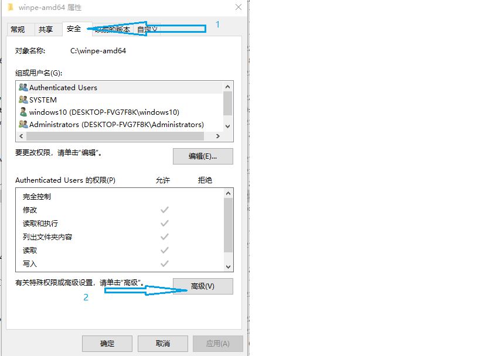
  
* 更改目录的所有者为当前用户(如果不清楚当前用户名，可在cmd命令窗口下用whoami命令显示当前用户名)。

  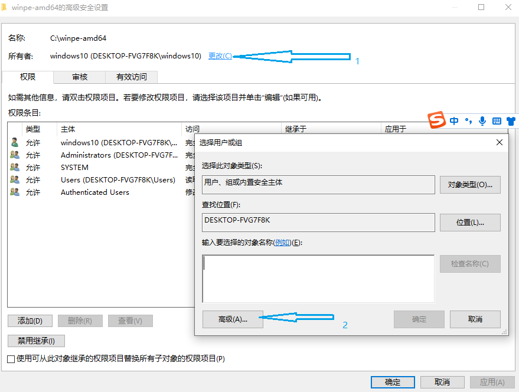

  ​                            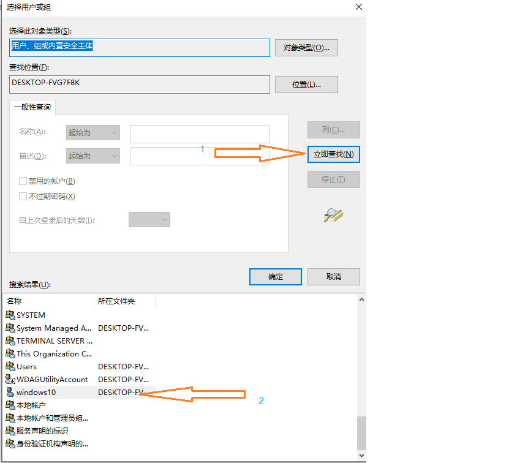
  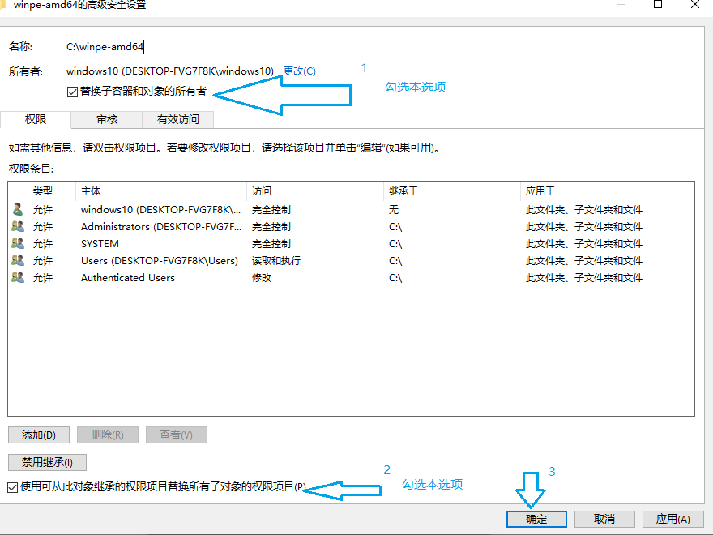
* 为当前用户添加权限
  
  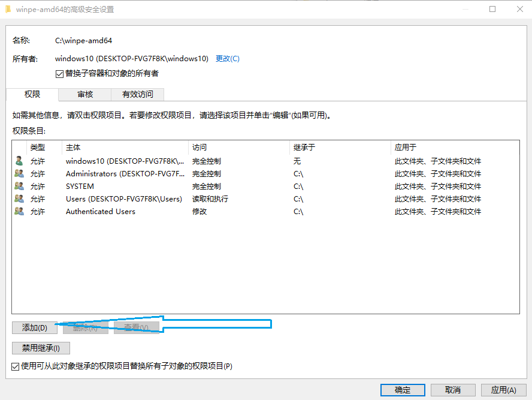
  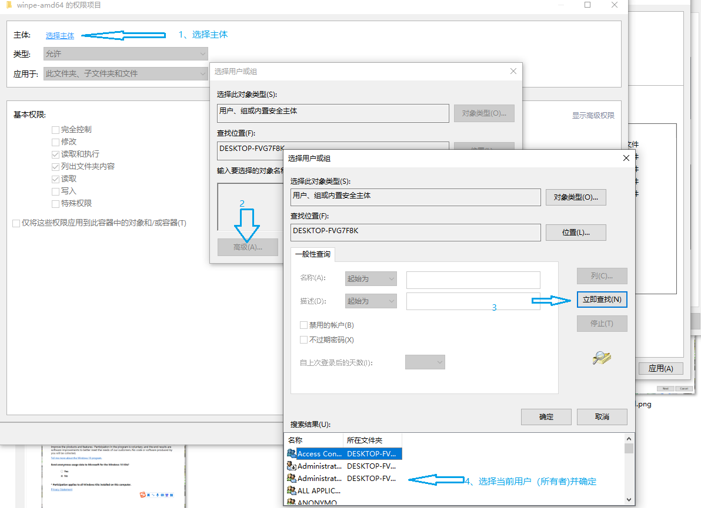
  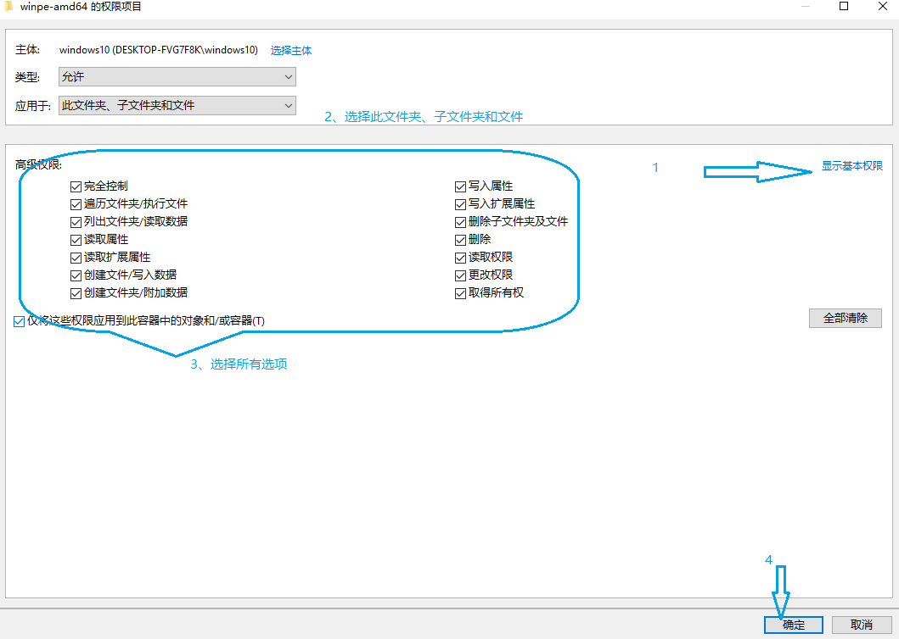
  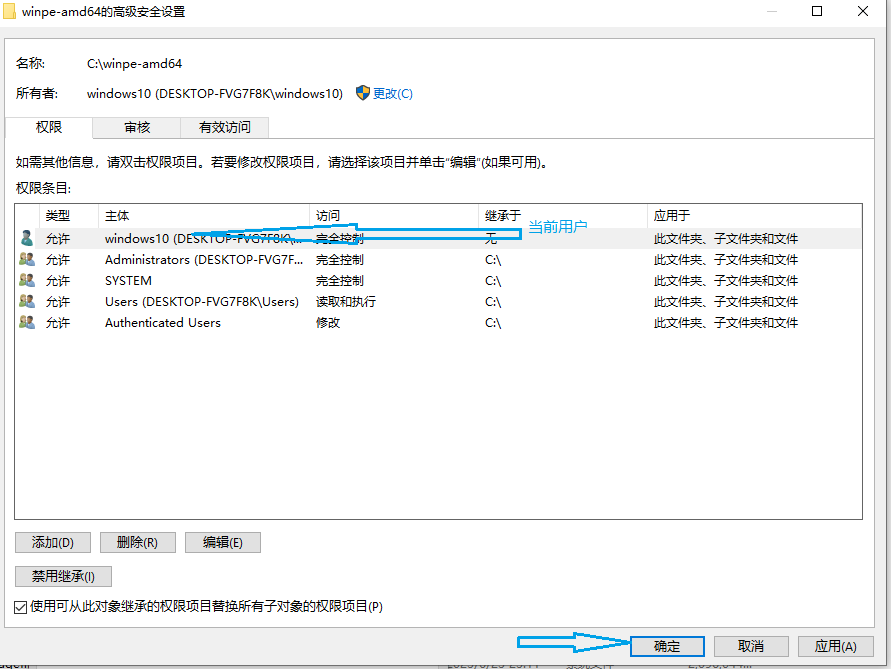
  
  总结一下添加权限的基本步骤
  
  ~~~bash
  1、把工作目录的所有者更改为当前用户。如果不知道当前登录Windows的用户名，在CMD窗口下使用whoami命令查询
  2、为当前用户添加权限
  3、注意事项：继承和替换子容器和对象的所有者两个选项都要选，添加权限时选择全部权限。在下一节中修改注册表也用同样方法设置权限。
  ~~~
  
  #### 修改注册表

~~~bash
1、把前边制作好的基础Winpe的boot.wim加载到指定的目录，这里加载位置为hyper-v虚拟机的c盘（c:\winpe-amd64\mount）
   dism /mount-image /imagefile:c:\winpe-amd64\media\sources\boot.wim /index:1 /mounddir:c:\winpe-amd64\mount
2、把制作Winpe的Windows10安装盘的install.wim也加载到指定的目录，这里加载的位置为c:\winpe-amd64\install
3、在winpe-amd64下新建两个目录，目录名称为[原pe]、[原win10]。上边两个wim包加载成功后，分别复制各自的windows\system32\config目录下四个注册表配置单元（SOFTWARE,SYSTEM、DEFAULT,DRIVERS），保存在[原pe]、[原win10]目录下。
4、备份好原pe和win10的注册表配置单元后，直接把原win10的software配置单元复制到boot.wim加载的对应目录下（也就是直接替换win10的注册表），后边的修改是以win10的注册表为基础，然后导出pe的注册表，确保pe注册表的正常运行，又具有win10的功能。
5、运行regedit,加载、修改、保存原pe的software配置单元。
  （1）加载。以管理员权限运行regedit（ctrl+shift+esc打开任务管理器，选择文件\运行新任务，勾选[系统管理原权限创建此任务]，运行regedit）,选择HKEY-LOCAL-MACHINE,选择文件|加载配置单元，选择前边第三步保存的[原pe]software配置单元，[项名称]指定为pe-soft。鼠标右击pe-soft,选择权限，设置方法前边已详细说明，先修改所有者、继承，再添加所有权限。
  （2）修改。关闭regedit,打开Registry Workshop.(在卸载配置单元的时候不能 regedit和workshop 两个一起打开，不然会提示拒绝访问，只能关掉一个去另一个卸载配置单元。有时workshop操作完之后直接卸载也是拒绝访问，这个是它自身的问题，只能关了重开再去卸载，或者关了打开regedit卸载）),选择pe-soft,ctrl+F查找C:\和D:\,全部替换为X:\（这里是大写的X）。查到后，在Registry Workshop的窗口的下面列出所有的搜索到的结果，ctrl+A全部选择这些搜索的结果，然后鼠标右击并选择替换，把C:\替换为X:\；同样的操作再搜索D:\,也替换为X:\。再搜索Interactive User，全部替换成空（不是删除)
  (3)保存导出。修改完成后，右击pe-soft,选择导出，保存为pe-modified（名称随意），最后选择文件|卸载配置单元，卸载掉pe-soft。这样就完成了对原pe的software的修改，并另存为pe-modified。
  （4）再加载前边第四步用win10的software替换的、加载到winpe-amd64\mount的windows\system32\config\softwoare,同样命名为pe-soft,用同样的步骤和方法查询、替换C:\和D:\为X:\，把Interactive User替换为空。修改完成后，直接双击运行pe-modified，把修改后的[原pe]导入到现在的pe，最后卸载pe-soft。

总结一下：
1、（导出software注册表）修改Windows安装镜像的software注册表。使用7-zip打开win10安装镜像中的install.wim文件，提取windows\system32\software注册表文件到software目录(自己新建自定义目录)，然后按照上述方法修改(修改工具为RegistyWorkShop)，完成后卸载（卸载工具为windows自带的regedit）。
2、（修改）修改生成的基础winpe的boot.wim文件包的software注册表，并导出为xxx.reg文件，以备导入。使用7-zip打开生成的基础winpe下的boot.wim文件，提取windows\system32\software主表表文件到pe-software目录(自己新建自定义目录)，用同样的方法完成修改。
3、（合并）合并两个software注册表单元。把xxx.reg文件合并到修改后的win10安装镜像software注册表单元。
4、（替换）替换software注册表单元文件。 用合并后的software注册表单元文件替换基础wnipe的boot.wim对应文件
~~~

#### 添加Exlorer支持文件

[这里参照csdn网友文章的方法](https://blog.csdn.net/qq_39819990/article/details/128518037)

~~~bash
一、使用tasklsit显示Explorer进程依赖的文件
1、Ctrl+Shift+Esc打开任务管理器，先点击左上角文件-运行新任务，输入cmd，勾选以系统管理权限创建此任务，粘贴但不运行以下命令
  explorer.exe | tasklist /M /FI "ImageName eq explorer.exe" /FO LIST
2、鼠标右击任务管理中的Explorer.exe进程，选择结束进程。
3、在第一步打开的CMD窗口中粘贴并运行这条命令： explorer.exe | tasklist /M /FI "ImageName eq explorer.exe" /FO LIST 
   开启explorer的同时使用tasklist显示explorer依赖文件
4、复制【模块】后边显示的所有文件，把文件列表保存在文本文件中，并去掉文件前边的空格（ctrl+h打开记事本的替换功能，把空格替换为空）
5、关掉刚才运行CMD命令窗口，新开一个CMD命令窗口，去掉前面explorer |，运行 tasklist /M /FI "ImageName eq explorer.exe" /FO LIST 
  这里显示运行中的Explorer依赖的文件。启动时和运行中的Explorer依赖有可能不同，尽量找全依赖文件。这两个列表会有重复，接下来就是把两次导出的文件列表复制到Wps的表格中，把重复的文件去掉就可以得到完整的Explorer依赖文件。
6、有了详细的文件列表，就可以使用beyond compare4（循环搜索），找到文件后复制到PE文件列表中，也可以自己写脚本文件，使用Xcopy复制。要记得复制DLL目录(System32等）\zh-CN\xx.mui文件（虽然有些DLL没有）和\Windows\SystemResources\xx.mun文件  

二、使用Wimbuilder2的批处理收集Explorer依赖的文件
目录：WimBuilder2-Full.v2022-02-02\Projects\WIN10XPE\01-Components\00-Shell\Explorer，文件为submain.bat
1.@+目录代表在xx目录的意思，@下面的文件就都是在那个目录才有的，此处先不考虑WOW64(32位),先整完64位版本再说，
2.这里贴出来的都是要复制并替换进去的，包括第一行\Windows\SystemResources\Windows.UI.ShellCommon整个目录，
3.分号代表注释，解释说明下面的文件干啥用，也是全部复制并替换
4.*号通配符代表符合要求的所有文件，
5.+if代表判断是否符合要求，-if结束判断，这个也不用管，除了61-65行win11所有if都满足，但是不满足的那个if的文件也要。脚本列出的全部文件都要！
6.开始的desktop.ini是系统文件，需显示受保护的系统文件才看得见
7.记得复制.mui和ExplorerFrame.dll.mun（列表没有）、shell32.dll.mun!!!
8.前面2.1说的缺文件就是这个\Windows\SystemResources\Windows.UI.ShellCommon和ExplorerFrame.dll.mun、shell32.dll.mun等mun，复制进去差不多就到注册表修改了，要是注册表改完explorer还开启不了就再对比一下文件列表，添加功能，这里的文件列表把控制面板差不多都包含进去了
9.Win11壁纸\Windows\Web\Wallpaper\Windows\img0.jpg也复制进去
10.可以自己改造脚本复制文件，建议直接bcompare
11.win11中找不到文件的我都标出来了
12.一定要复制\Windows\System32\actxprxy.dll及其.mui，少了这个东西explorer启动不了，还有shellstyle.dll，少了它explorer只能卡在全白的界面（列表中无）
13.想要win10/11那种窗口效果的替换uxtheme.dll，themeservice.dll,themeui.dll等与主题有关的dll及其mui，加入DWM那里有
14.壁纸的设置在下一章，修改pe-def的时候会提到，本文先让窗口版本的explorer启动起来先，要提前设置的可以跑到[HKEY_LOCAL_MACHINE\pe-def\Control Panel\Desktop]设置"Wallpaper"=“X:\Windows\Web\Wallpaper\Windows\img0.jpg”
————————————————
原文链接：https://blog.csdn.net/qq_39819990/article/details/128518037
~~~

#### 手动添加常用软件

##### 以添加oscdimg为例说明向winpe中添加软件的方法

oscdimg是Windows ADK中带的一个工具，但是却并没有集成到winpe中，一般是在`C:\Program Files (x86)\Windows Kits\10\Assessment and Deployment Kit\Deployment Tools\`下的amd64|arm|x86|arm64目录下。添加过程分为两步,添加软件和修改注册表。

* winpe的boot.wim挂载目录下新建一个目录(c:\winpe-amd64\mount\windows)，复制Oscdimg.exe和相关文件

  * md   c:\winpe-amd64\mout\Windows\Oscdimg

  * copy  amd64\oscdimg   c:\winpe-amd64\mout\Windows\Oscdimg
  
* 设置注册表项
  
  运行regedit ,选择HEKY-LOCAL-MACHE下的【SYSTEM\ControlSet001\Control\Session Manager\Environment】，在右侧的数据项中找到path ,在最后加上%SystemRoot%\Oscdimg ，中间用分号隔开。这里的%SystemRoot%是环境变量的写法，一般指Windows目录。

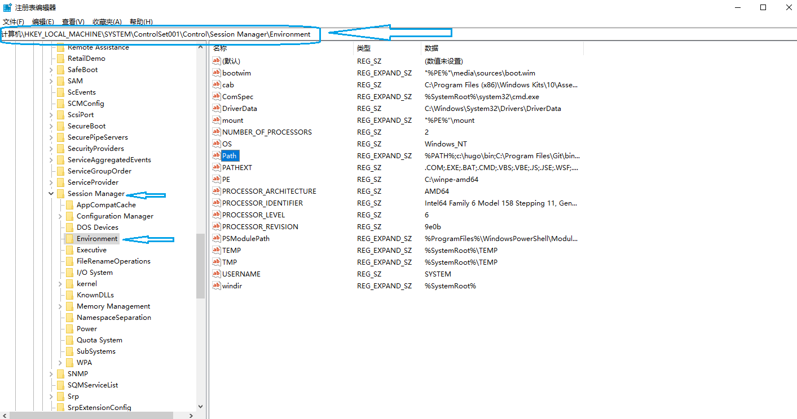

#### 简单总结

* 使用Windows ADK制作基础的winpe
* 再结合手动制作Winpe那篇文档，对Windows  ADK制作好的基础winpe进行扩展
  * 导出 install.wim中的software注册表配置单元
  * 导出基础winpe的software注册表配置单元
  * 修改注册表（参照修改的细节）
* 合并注册表
  * 用修改后的install.wim的software注册表配置单元覆盖基础winpe的software注册表配置单元
  
* 添加Explorer支持文件