####   安装  xampp、下载 wordpress

* 把解压后的wordperss目录复制在xampp的htdocs目录下，这里为c:\xampp\htdocs\wordpress

* 启动xampp面板，选择 start  Apache、start mysql。如果有别的web服务器启动，需要先停止服务。比如本机自动启动caddy的话，终止caddy服务，解决端口冲突，因为这里有Apache启动。

#### 使用phpMyAdmin创建mysql数据库

* 打开浏览器，在地址栏输入localhost，此时会显示`Welcome to XAMPP for Windows `，点击屏幕顶部的`phpMyAdmin`，进入数据库设置面板。或者直接在地址栏输入`localhost/wordperss/phpMyAdmin`
* 选择左侧目录树顶部的`新建`，输入数据库名称，序规则选择 utf8mb4_general_ci。之后，点击“创建”按钮就可以完成数据库创建。选择左侧的数据库，再选权限标签，可以根据实际情况修改密码。

  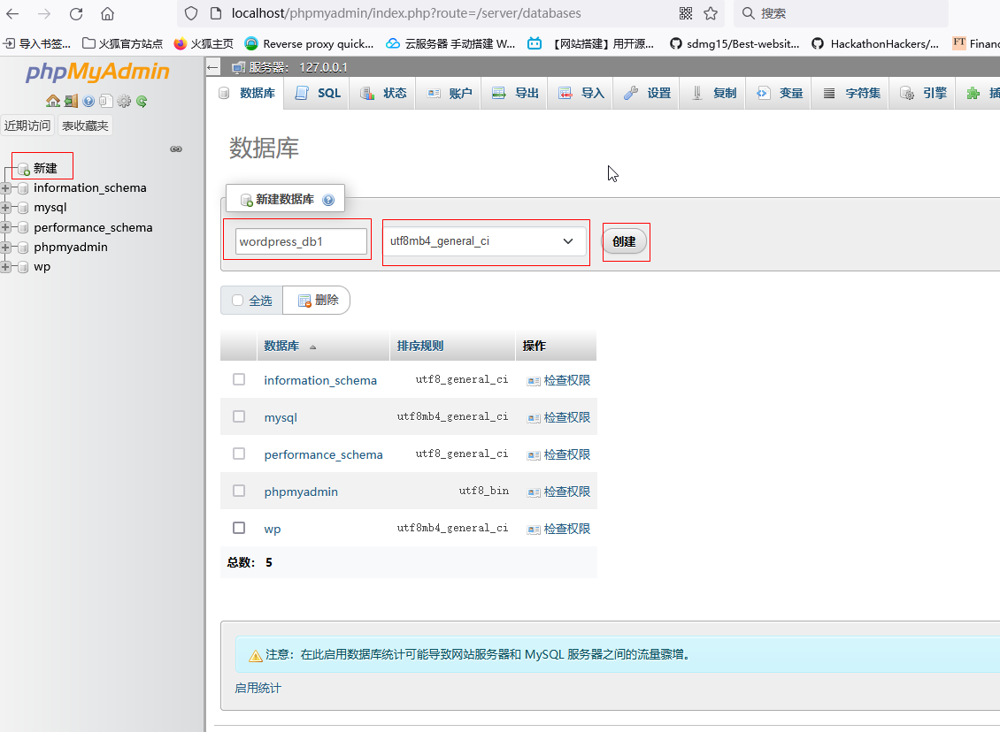
  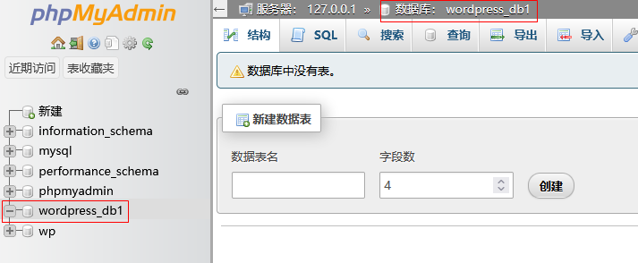
  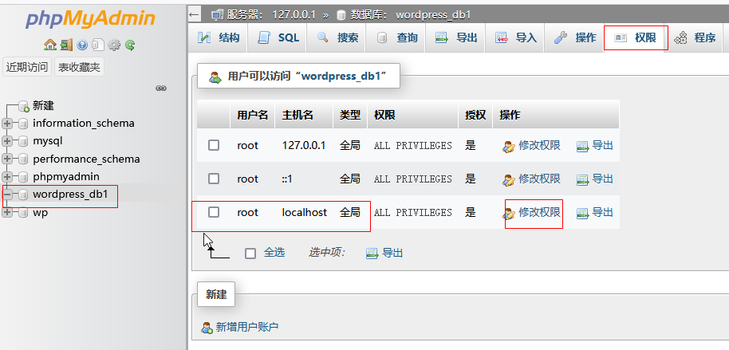

 #### 连接数据库

   在浏览器地址栏输入`localhost/wordpress` ，配置连接数据库的参数。需要输入前边创建的数据库名称、用户名(root)、密码。输入`localhost/wordperss`之后，地址栏地址变化为`localhost/wordperss/wp-admin/setup-config.php`,进入数据库参数设置页面。自己估计应该是在Apache的代理设置里做了路由匹配，把`/wordpress`直接映射为/wordpress/wp-admin/setup-config.php。
 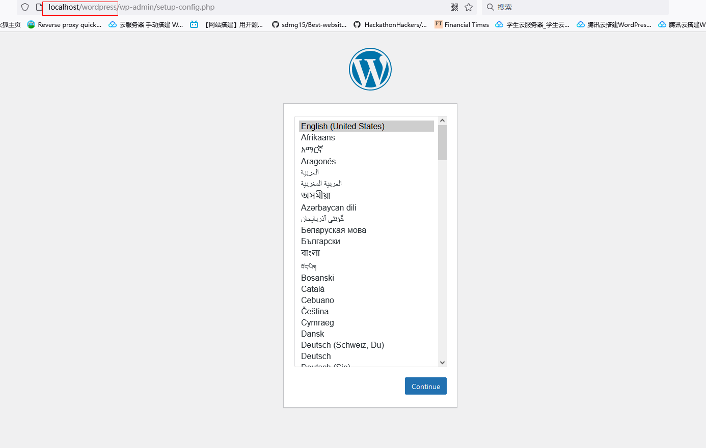
 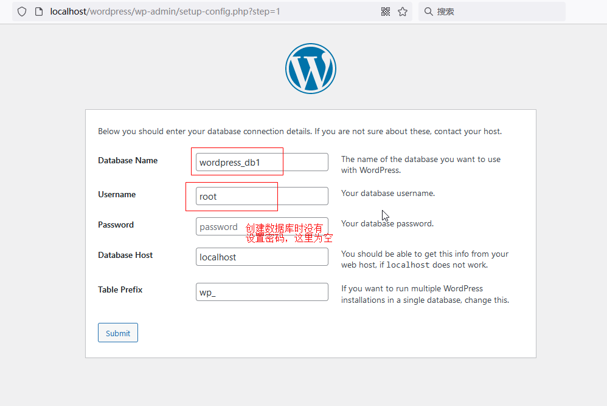  
 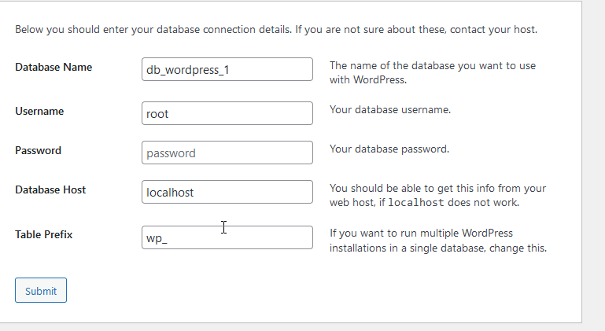
 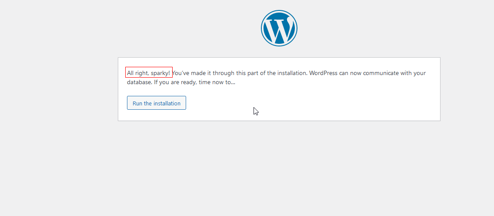
  成功连接创建的数据库wordpress_db1后，wordpress已经可以和新建的数据库通讯了，点击左下角的[run the install]开始安装wordpress.

 #### 安装wordpress
  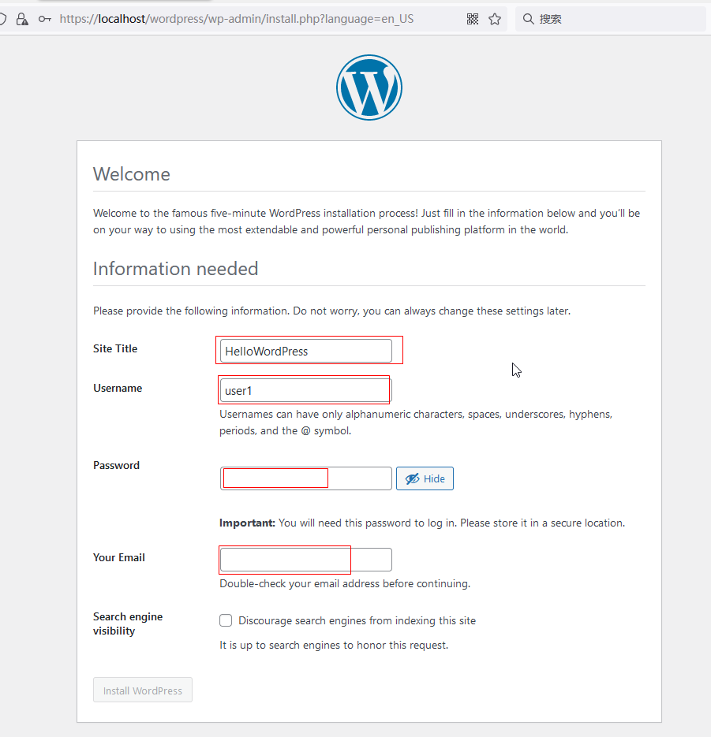
  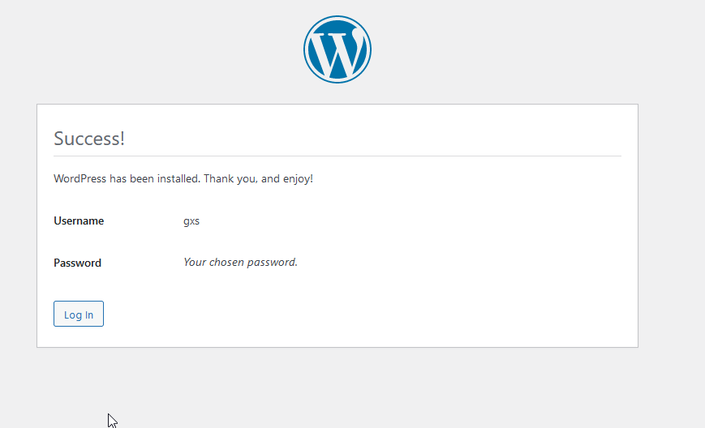

经过这一系列列的操作，最终把各项参数保存在新建的wp-config.php文件中。如果想重新学习安装流程，可以把wp-config.php删除，再把旧的数据库表删除，如下图提示：

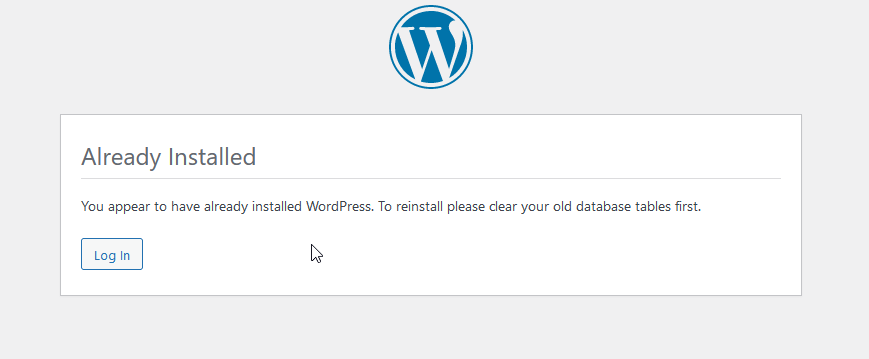

#### wordpress管理界面

登录wordpress的管理界面dashboard（在没有学会重置密码前，最好记录好数据库用户名、密码和站点登录的用户名和密码，时间长了可能会忘记）

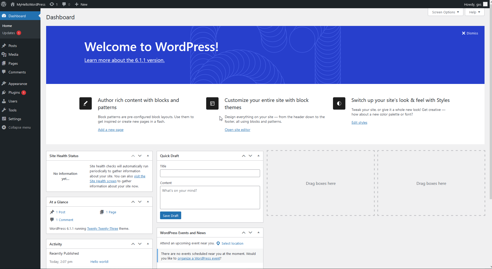

下面就可以在dashborad里熟悉各种功能，比如下载和应用themes,让你自己的网站符合自己的审美需求。

#### 总结

* wordpress是用php开发的基于Web(Apache)和数据库(mysql等)的内容管理系统(CMS)。而xampp是方便用户使用wordpress的本地集成环境。
* 利用xampp再本地安装wordpress总共有四步
  * 安装xampp、解压wordpress到htdocs
  * 利用phpMyAdmin创建数据库
  * 连接数据库，把所有连接参数保存在新建的wp-config.php文件里
  * 安装wordpress并登录管理面板，开始使用wordpress建立自己的站点

#### 手动安装Apache、php、mysql、wordpress  

通过Xampp安装wordpress及其所需要的各种软件非常方便，帮助你快速上手wordpress，构建出自己喜欢的个人站点。如果想知道背后的细节，有有必要自己手动安装所有的组件，实现同样的功能。从xampp提供的环境及整个安装流程，大概知道首先要配置Apache的相关配置文件，让Apache可以支持wordpress,或者说支持php，毕竟wordpress是由php制作的软件，然后由wordress去完成数据库的创建和连接，所有这些基础设施准备好之后，主角登场，开始安装wordpress。

* 首先安装设置Apache

  为什么要先安装Apache呢，因为wordpress是由php开发的基于浏览器的web应用，所有的功能都通过http请求完成，所有必须有web服务器。配置Apache的配置文件，设置站点目录等。web服务器设置后之后，就可以运行php程序，让流程走起来。

* 安装mysql、创建数据库、连接数据库

* 安装wordress

  这些步骤是基于xampp的配置环境判断，自己还没有手动安装，这里大概写记录一下自己的猜测，等真正完成后再来重新做笔记。

  wordpress自带的readme.html文件其中一部分，看了这个就知道如何完成wordpress安装

~~~
Installation: Famous 5-minute install

    Unzip the package in an empty directory and upload everything.
    Open wp-admin/install.php in your browser. It will take you through the process to set up a wp-config.php file with your database connection details.
        If for some reason this does not work, do not worry. It may not work on all web hosts. Open up wp-config-sample.php with a text editor like WordPad or similar and fill in your database connection details.
        Save the file as wp-config.php and upload it.
        Open wp-admin/install.php in your browser.
    Once the configuration file is set up, the installer will set up the tables needed for your site. If there is an error, double check your wp-config.php file, and try again. If it fails again, please go to the WordPress support forums with as much data as you can gather.
    If you did not enter a password, note the password given to you. If you did not provide a username, it will be admin.
    The installer should then send you to the login page. Sign in with the username and password you chose during the installation. If a password was generated for you, you can then click on “Profile” to change the password.

~~~

