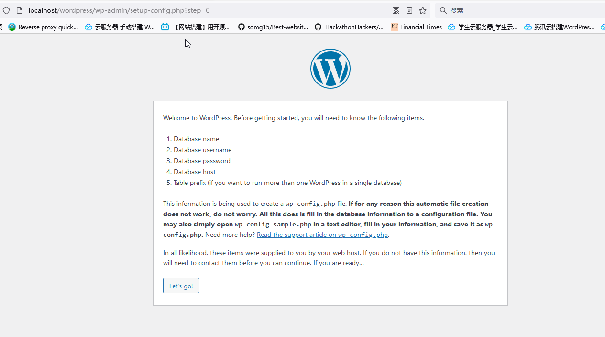

* 安装  xampp,下载 wordpress
  * 把解压后的wordperss目录复制在htdocs目录下
  * 启动xampp面板，选择 start  apache、start mysq。如果有别的web服务器启动，需要先停止服务。比如本机自动启动caddy的话，终止caddy服务，解决端口冲突，因为这里有apache启动。

* 使用phpMyAdmin创建mysql数据库。

  * 打开浏览器，在地址栏输入localhost，此时会显示`Welcome to XAMPP for Windows `，点击屏幕顶部的`phpMyAdmin`，进入数据库设置面板。或者直接在地址栏输入`localhost/wordperss/phpMyAdmin`

  * 选择左侧目录树顶部的`新建`，输入数据库名称，序规则选择 utf8mb4_general_ci。之后，点击“创建”按钮继续

    
    
    
    这里设置root用户的密码暂时为空密码
  
* 在浏览器地址栏输入`localhost/wordpress` ，配置连接数据库的参数。

  
  提示信息显示wordpress已经可以和新建的数据库通讯了，开始安装wordpress.

* 安装wordpress
  
  
  
* 登录wordpress的管理界面dashboard

  

  
