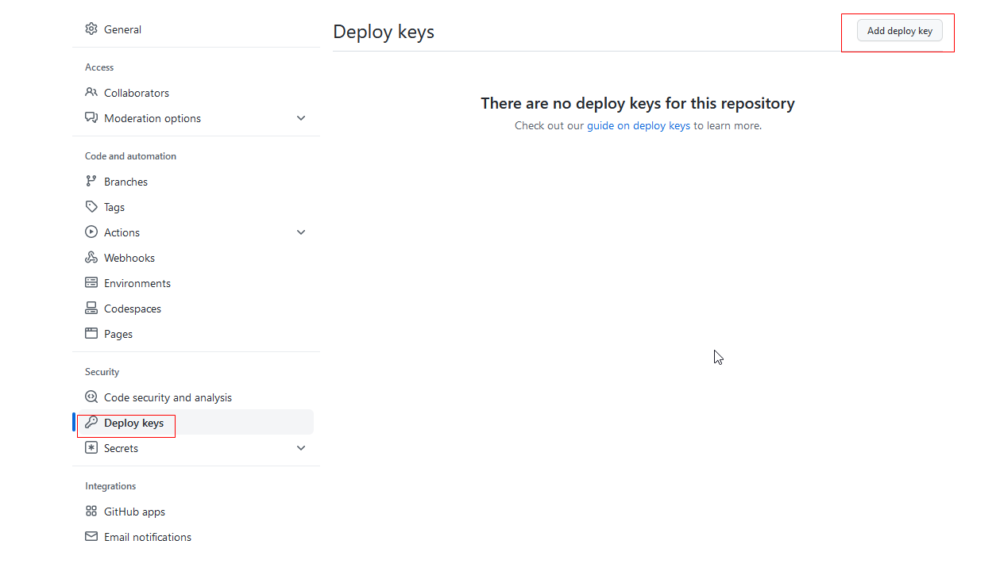
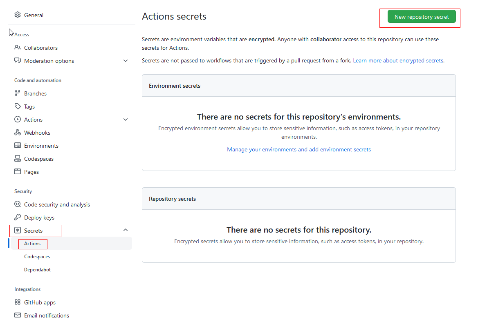

#### 使用自定义的actons workflow,在仓库的两个分支之间实现hugo博客站点自动化部署

用仓库的main分支保存博客项目源文件，用仓库的另外一个手动建立的独立分支gh-pages保存编译后的静态文件。这里依然以username.github.io形式的仓库为例。自己手动建立独立的gh-pages分支。

* 在github上新建username.github.io形式的空仓

* 在本地根据hugo官网推荐的QuickStart入门教程，建立Hugo博客项目

  ~~~·
  hugo  new   site  hugo
  cd hugo 
  git  init
  git  submodule add https://github.com/theNewDynamic/gohugo-theme-ananke.git  themes/ananke
  编辑config.toml文件，在最后新增  theme  =  "ananke"
  修改baseURL = "https://username.github.io"
  hugo  new  posts/文档名称作为目录名/index.md    --编辑自己的文档
  git  add .
  git  commit -m   "新增文档"
  git  push  -u origin  main --第一次推送到空仓username.github.io时要带上-u参数，以后不需要带-u参数
  ~~~
  
* 在本地新建一个独立分支gh-pages

  ~~~
  git  checkout  --orphan gh-pages
  echo  "hello github gh-pages" > readme.md 
  git  add .
  git commit -m "add gh-pages branch"
  git push origin gh-pages   --在新建分支后推送到远程仓库分支，要指定源分支，系统会自动建立同名分支，并建立关联。以后再推送分支可以不必再指定源分支。
  git  branch -a   --此时就可以看到新建的独立分支gh-pages。如果不在新建的分支下增加变化并git-add-commit-push ，就不会真正建立分支。
  ~~~

  经过上面两个步骤，username.githbu.io仓库有两个分支：main 、gh-pages。建立并切换到gh-pages分支时，会自动复制main分支的目录和文件，除了.git目录之外，把所有其他目录和文件都删除，然后git-add-commit-push，远程仓库的gh-pages没有别的文件，只用来保存静态的博客站点网页文件。

* 设置仓库的Action secrets和Deploy Key

  这里使用action secrets和deploy_key 的方式部署 hugo 到 github pages 上。使用 deploy_key之前，需要先生成一对 ssh key 密钥，在源文件仓库（执行 Github Actions 的仓库）设置私钥，发布仓库（Github Pages 所在仓库）配置公钥。这里使用的是一个仓库的不同分支，公私和私钥都在这一个仓库设置。

  * 选择仓库，选择Settings->Deploy Keys->Add deploy key，贴上 ssh 公钥，勾选 Allow write access 选项。

    

  * 选择Settings->Secrets->New repository secret，Name 填 HUGO_DEPLOY_KEY，Value 贴上 ssh 私钥。

    

* 在博客项目根目录下建立一个actions  workflow文件(如果新建.github目录时提示不能建立，就从别处复制一个)，路径为：.github/workflows/hugo.yml  ,文件内容如下：

  ~~~
  name: github pages
  
  on:
    push:
      branches:
        - main  
  
  jobs:
    deploy:
      runs-on: ubuntu-18.04
      steps:
        - uses: actions/checkout@v2
          with:
            submodules: true  # Fetch Hugo themes (true OR recursive)
            fetch-depth: 0    # Fetch all history for .GitInfo and .Lastmod
  
        - name: Setup Hugo
          uses: peaceiris/actions-hugo@v2
          with:
            hugo-version: '0.79.1'
            # extended: true
  
        - name: Build
          run: hugo --minify
  
        - name: Deploy
          uses: peaceiris/actions-gh-pages@v3
          with:
          # github_token: ${{ secrets.GITHUB_TOKEN }}
          deploy_key: ${{ secrets.HUGO_DEPLOY_KEY }}
          publish_dir: ./public
         
  ~~~

* 最后推送整个博客项目到username.github.io仓库的main分支，github后台会自动运行上面的actions workflows文件，完成博客项目静态站点网页部署。由于已经使用了github推荐的hugo action，可以正确的自动化发布博客项目，所有这个workflows就没有再实际测试，记录在这里备忘，以后有兴趣的可以再尝试。

