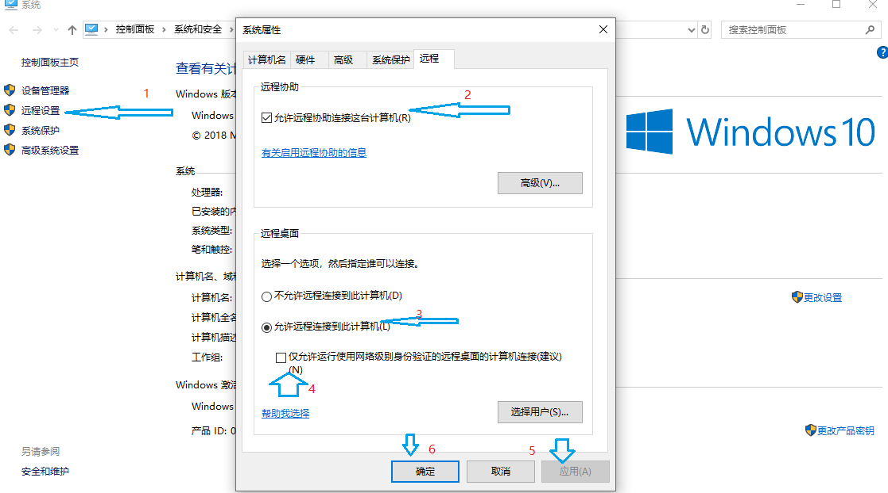
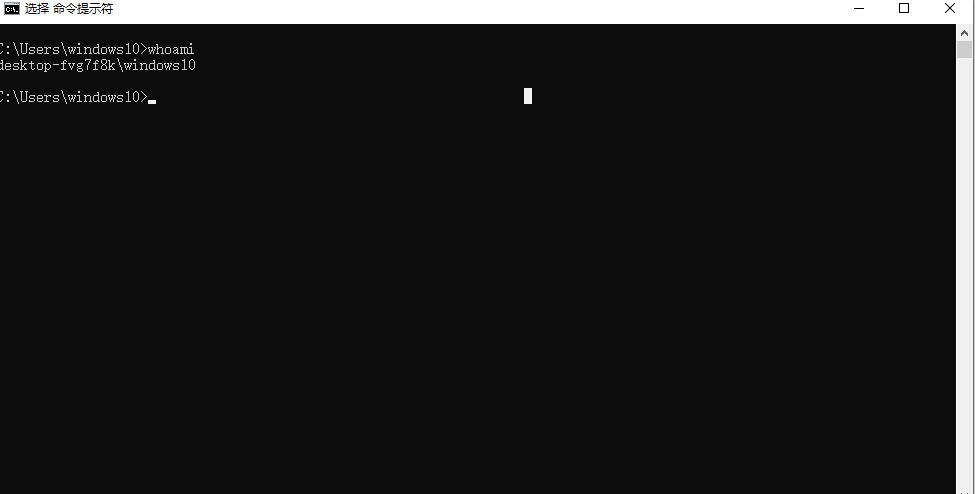
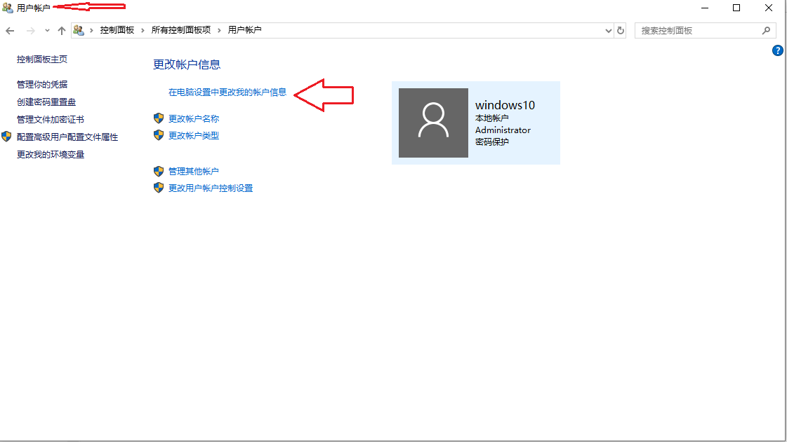
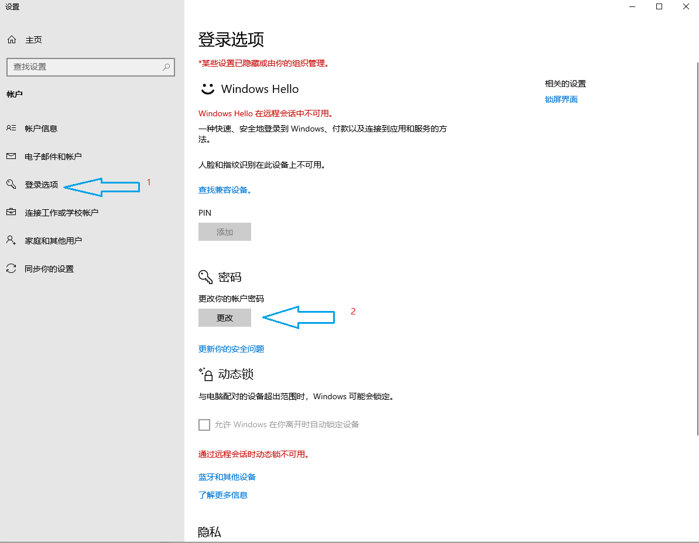
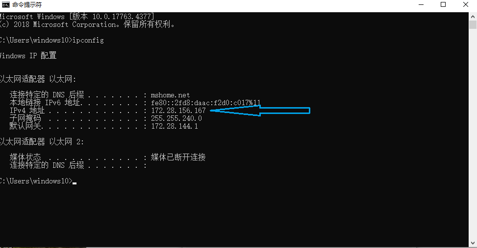
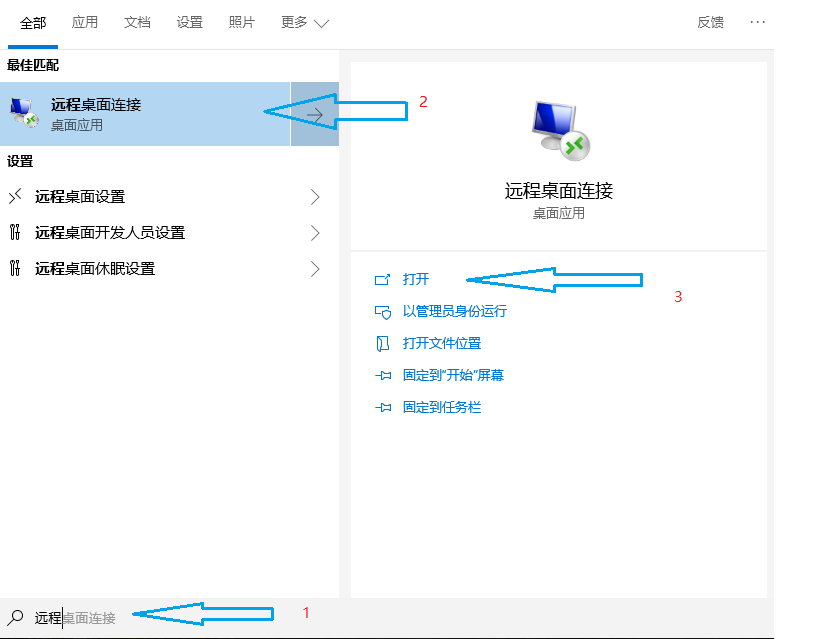
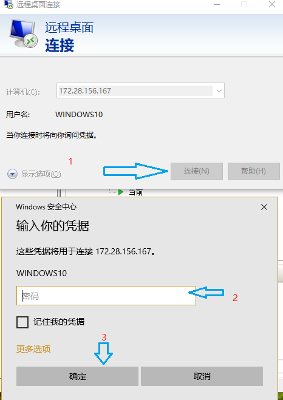
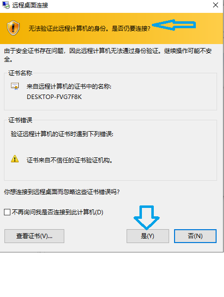

#### 使用远程桌面连接在Window10和Hyper-V虚拟机之间传送文件

启用了Win10自带的Hyper-V虚拟机之后，最直观的表现就是Hyper-V的性能很优异，以前使用Vmware Player或者Oracle的VM VirtualBox，渐渐的发现虚拟机有卡顿现象，更换为Hyper-V之后，使用很流畅。但是在宿主机和虚拟机之间共享传送文件不方便。经过查找文档和实践，可以轻松实现在两者之间复制粘贴文件，记录下来。

##### 设置虚拟机的远程设置选项

选中Windows桌面上我的电脑，右键弹出属性，选择【远程设置】，勾选允许远程连接到此计算机，如下图：

图中【仅允许运行使用网络级别身份验证的远程桌面的计算机连接】这里没有勾选，自己使用，省事简单。

##### 为当前用户设置登录密码

* 首先通过CMD窗口查看一下当前用户名

  

* 在控制面板的用户账户中设置登录密码

  

* 使用ipconfig在CMD窗口中查看虚拟机的IP地址,在使用远程桌面连接登录时需要输入虚拟机的IP地址

  

    ##### 在宿主机打开远程桌面连接

点击桌面左下角的Windows图标，然后输入远程桌面，就可以自动弹出远程桌面连接的程序，选择打开或者以管理员身份打开，如下图：

###### 输入虚拟机IP地址和登录信息

输入虚拟机的IP地址和用户名及密码就可以完成的登录，在提示风险时，可以选择继续登录，如下图：

##### 在物理机和虚拟机之间复制文件

连接到虚拟机之后，可以使用复制和粘贴的方法实现文件的传送

连接后，默认情况下虚拟机是全屏的，可以通过设置虚拟机的缩放比例，在物理机和虚拟机之间轻松的传送

